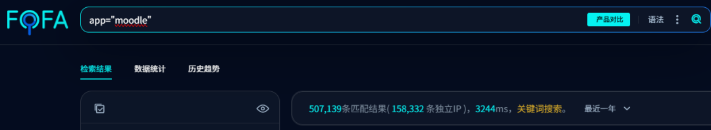
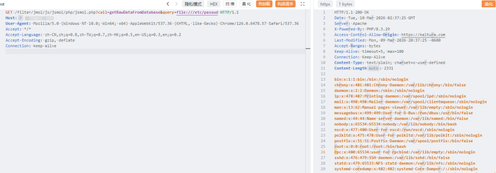
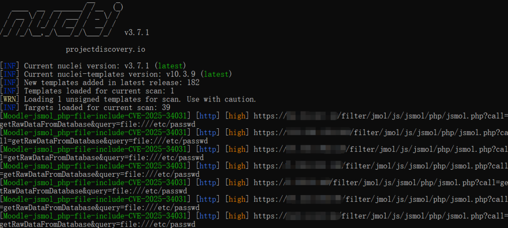
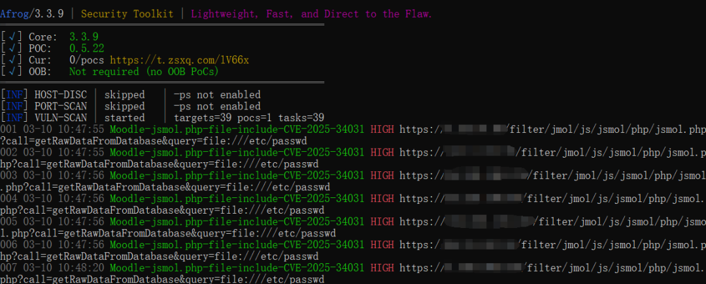

## 核对与使用边界

本文已按保存的全文审阅记录进行文字校订；本轮仅静态核对，未运行 PoC、请求目标或逐图验证。

适用条件与版本记录（来源主张，未列为明确更正的部分仍待权威资料核对）：所需JSmol组件/版本未说明，文章声称未认证

- **结论使用边界（1）**：仅接口名与任意文件包含概述，实际影响说敏感信息获取，需区分读与include执行。此项限制直接适用于下文对应结论；现有正文不足以作更宽泛推论，所列方法和原始证据均保留。

- **事实待核（2）**：没有完整请求/参数/源代码/版本，核验CVE是否特定插件而非全部Moodle。该项尚不能从转载本身确定外部事实；下文相应编号、版本或修复说法只作为来源记录，不能据此判定部署受影响或已修复。明确更正另列于本节。

- **来源与引用处置（3）**：自查脚本全图，付费圈条款广告占多；修复建议无具体版。保留这部分来源材料并与技术结论分开；其引用或宣传内容不能补足本文漏洞的证据。

历史原文标识：下文原技术材料按来源保留；仅本节明确确认的更正替代相应旧说法，标为待核的观察仍不是事实确认。

#  Moodle jsmol.php 任意文件包含漏洞(CVE-2025-34031)  
Superhero
                    Superhero  Nday Poc   2026-03-10 02:56  
  
  
  
  
  
  
  
内容仅用于学习交流自查使用，由于传播、利用本公众号所提供的  
POC  
信息及  
POC对应脚本  
而造成的任何直接或者间接的后果及损失，均由使用者本人负责，公众号Nday Poc及作者不为此承担任何责任，一旦造成后果请自行承担！  
  
  
**01**  
  
**漏洞概述**  
  
  
Moodle jsmol.php 接囗处存在任意文件包含漏洞,未经身份验证的远程攻击者通过漏洞可以获取到服务器敏感信息，导致系统处于极不安全的状态。  
**02******  
  
**搜索引擎**  
  
  
fofa:  
```
app="moodle"
```  
  
  
  
  
**03******  
  
**漏洞复现**  
  
  
  
  
**04**  
  
**自查工具**  
  
  
nuclei  
  
  
  
afrog  
  
  
  
  
**05******  
  
**修复建议**  
  
  
1、关闭互联网暴露面或接口设置访问权限  
  
2、升级至安全版本  
  
  
**06******  
  
**内部圈子介绍**  
  
### 【Nday漏洞实战圈】🛠️  
  
专注公开1day/Nday漏洞复现 · 工具链适配支持  
  
✧━━━━━━━━━━━━━━━━✧  
  
🔍 **资源内容**  
  
▫️ 整合全网公开1day/Nday漏洞POC详情  
  
▫️ 适配Afrog/Nuclei检测脚本  
  
▫️ 支持内置与自定义POC目录混合扫描  
  
🔄 **更新计划**  
  
▫️ 每周新增7-10个实用POC（来源公开平台）  
  
▫️ 所有脚本经过基础测试，降低调试成本  
  
🎯 **适用场景**  
  
▫️ 企业漏洞自查 ▫️ 渗透测试 ▫️ 红蓝对抗 ▫️ 安全运维  
  
✧━━━━━━━━━━━━━━━━✧  
  
⚠️ **重要声明**  
  
▫️  
仅限合法授权测试，严禁违规使用  
  
**▫️虚拟资源服务，购买后不接受任何形式退款**  
  
▫️  
付款  
前请评估需求，慎重考虑  
  
  
  
  


---

> 来源：gelusus/wxvl（微信公众号漏洞文章自动归档，原文见文首链接）
