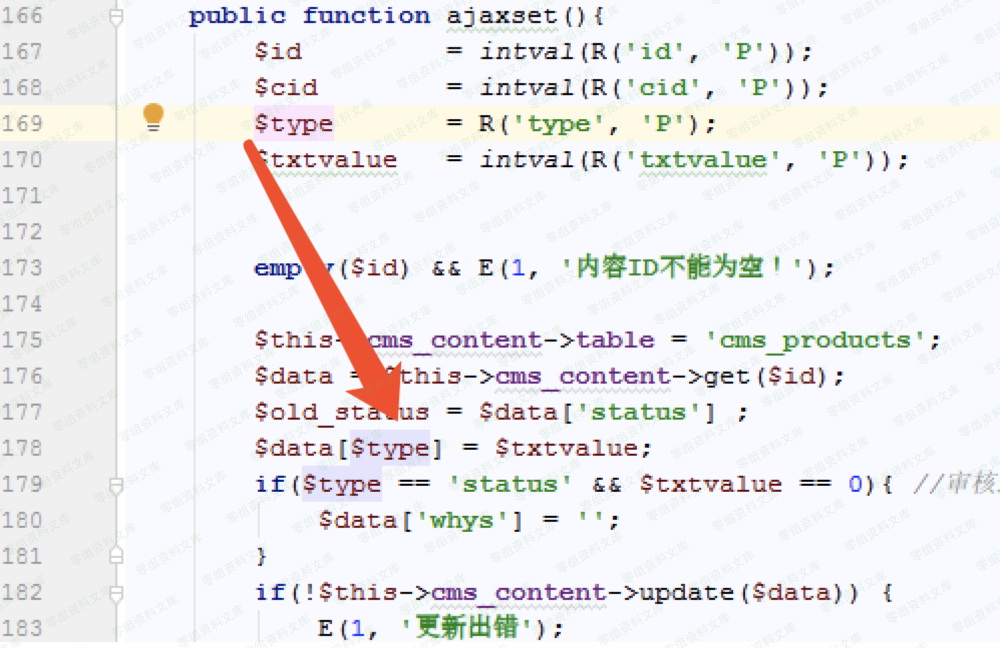
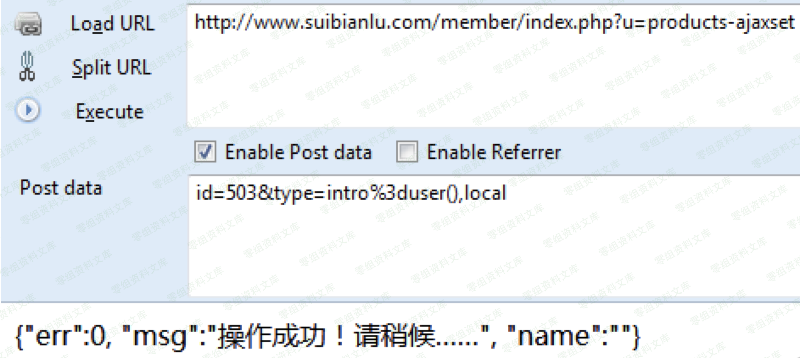
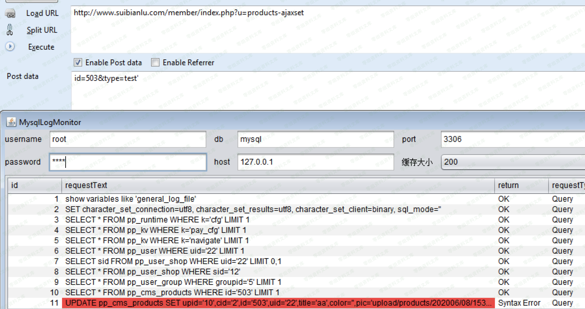
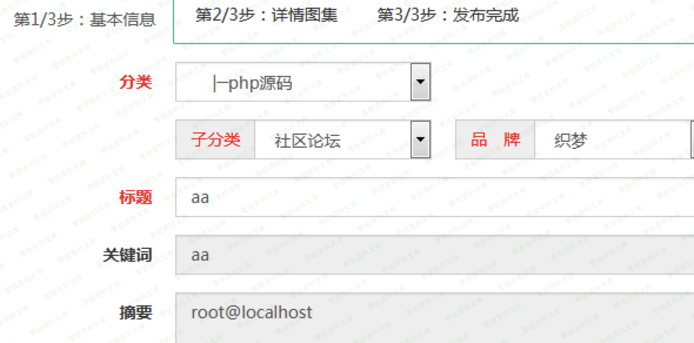

## 核对与使用边界

本文已按保存的全文审阅记录进行文字校订；本轮仅静态核对，未运行 PoC、请求目标或逐图验证。

适用条件与版本记录（来源主张，未列为明确更正的部分仍待权威资料核对）：前台商品管理账号/权限未述，POST数组key可控

- **结论使用边界（1）**：关键arr2sql($data)实现未展示，展示key2arr针对另参数，需补受控字段到sink真实链。此项限制直接适用于下文对应结论；现有正文不足以作更宽泛推论，所列方法和原始证据均保留。

- **证据待核（2）**：正文update($data)与函数签名update($key,$data)不一致；所有payload/响应仅图。保留原引用、截图位置和实验叙述；本项所缺材料未被补造，截图存在或作者宣称成功都不等于已核验其内容。

- **事实待核（3）**：无原始出处/修复范围，商业与个人版本应独立记录。该项尚不能从转载本身确定外部事实；下文相应编号、版本或修复说法只作为来源记录，不能据此判定部署受影响或已修复。明确更正另列于本节。

历史原文标识：下文原技术材料按来源保留；仅本节明确确认的更正替代相应旧说法，标为待核的观察仍不是事实确认。

# NewZhan CMS sql注入漏洞

一、漏洞简介
------------

二、漏洞影响
------------

NewZhan CMS 商业版 2.4.1

NewZhan CMS 个人版 2.6.3

三、复现过程
------------

### 漏洞分析

数据库操作函数对传入的数组仅仅对value进行了转义处理，并没有把key考虑在内，前台控制器可以通过提交POST
控制key进行注入。 db\_mysql.class.php

    public function update($key, $data) {

    list($table, $keyarr, $keystr) = $this->key2arr($key);

    $s = $this->arr2sql($data);

    return $this->query("UPDATE {$this->tablepre}$table SET $s WHERE $keystr LIMIT 1", $this->wlink);

    }

    private function key2arr($key) {

    $arr = explode('-', $key);

    if(empty($arr[0])) {

    throw new Exception('table name is empty.');

    }

    $table = $arr[0];

    $keyarr = array();

    $keystr = '';

    $len = count($arr);

    for($i = 1; $i < $len; $i = $i + 2) {

    if(isset($arr[$i + 1])) {

    $v = $arr[$i + 1];

    $keyarr[$arr[$i]] = is_numeric($v) ? intval($v) : $v;
    // 因为 mongodb 区分数字和字符串

    $keystr .= ($keystr ? ' AND ' : '').$arr[$i]."='".addslashes($v)."'";

    } else {

    $keyarr[$arr[$i]] = NULL;

    }

    }

    if(empty($keystr)) {

    throw new Exception('keystr name is empty.');

    }

    return array($table, $keyarr, $keystr);

    }

审计发现前台商品管理控制器有\$POST 数据传入update(\$data)可以触发SQL
注入

### 漏洞复现

