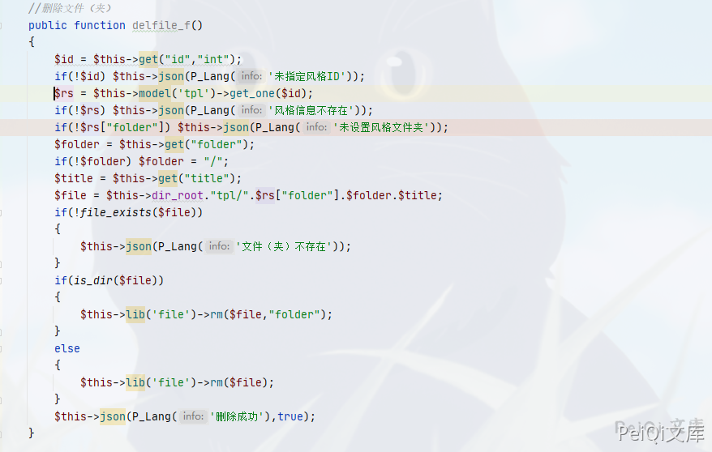
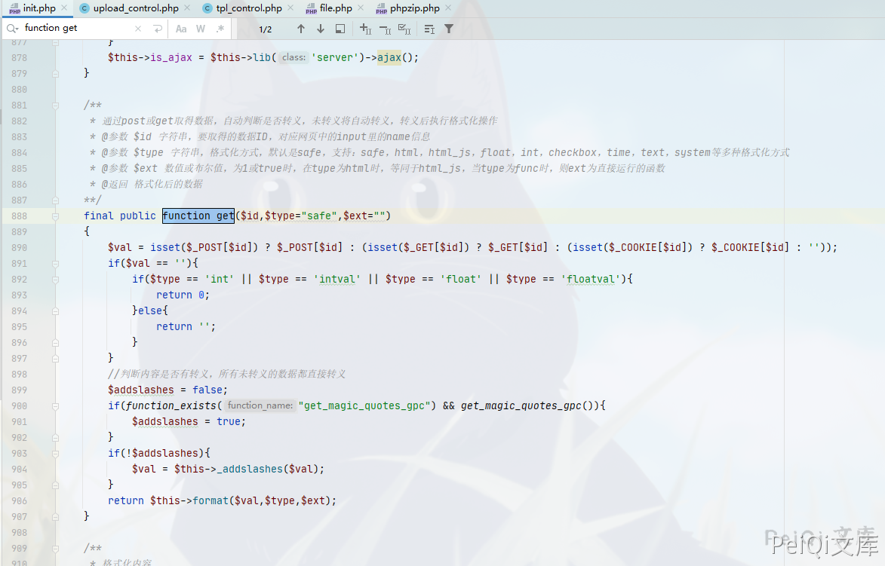

## 核对与使用边界

本文已按保存的全文审阅记录进行文字校订；本轮仅静态核对，未运行 PoC、请求目标或逐图验证。

适用条件与版本记录（来源主张，未列为明确更正的部分仍待权威资料核对）：后台风格文件权限、服务账户可删除，传入目录type策略

- **操作与副作用边界（1）**：rm默认type=file会删除目录下内容但不删目录本体，文本任意目录删除需调用参数证据。保留原步骤及请求方法。执行条件包括隔离且获授权的可恢复环境、预先记录相关文件/账号/配置/业务记录状态；响应完成不能等同无副作用，恢复时须核对该操作涉及的实际对象。

- **证据待核（2）**：没有实际payload/完整请求或响应，抓包修改成功只是结论。保留原引用、截图位置和实验叙述；本项所缺材料未被补造，截图存在或作者宣称成功都不等于已核验其内容。

- **事实待核（3）**：关键get和delfile函数只图，CVE原始来源/修复缺。该项尚不能从转载本身确定外部事实；下文相应编号、版本或修复说法只作为来源记录，不能据此判定部署受影响或已修复。明确更正另列于本节。

历史原文标识：下文原技术材料按来源保留；仅本节明确确认的更正替代相应旧说法，标为待核的观察仍不是事实确认。

# OKLite 1.2.25 后台风格模块 任意文件删除 CVE-2019-16132

## 漏洞描述

OKLite 1.2.25 后台风格模块存在 对危险字符未过滤，导致可以删除任意目录和文件

## 漏洞影响

```
OKLite 1.2.25
```

## 漏洞复现

出现漏洞的函数在文件 **framework/admin/tpl_control.php** 中的 **delfile_f()** 函数



这里删除文件主要调用了 **rm函数**, 位置在 **framework/libs/file.php**

```php
/**
	 * 删除操作，请一定要小心，在程序中最好严格一些，不然有可能将整个目录删掉
	 * @参数 $del 要删除的文件或文件夹
	 * @参数 $type 仅支持file和folder，为file时仅删除$del文件，如果$del为文件夹，表示删除其下面的文件。为folder时，表示删除$del这个文件，如果为文件夹，表示删除此文件夹及子项
	 * @返回 true/false
	**/
	public function rm($del,$type="file")
	{
		if(!file_exists($del)){
			return false;
		}
		if(is_file($del)){
			unlink($del);
			return true;
		}
		$array = $this->_dir_list($del);
		if(!$array){
			if($type == 'folder'){
				rmdir($del);
			}
			return true;
		}
		foreach($array as $key=>$value){
			if(file_exists($value)){
				if(is_dir($value)){
					$this->rm($value,$type);
				}else{
					unlink($value);
				}
			}
		}
		if($type == "folder"){
			rmdir($del);
		}
		return true;
	}
```

这里对传入的参数遍历，获得的文件名或文件夹进行删除

回过头看 调用get函数传入参数时是否有对 **../** 的过滤



可以看到参数我们是可控的，使用这里的漏洞进行任意文件删除

抓包修改成功删除文件


---

> 来源：Threekiii/Awesome-POC
