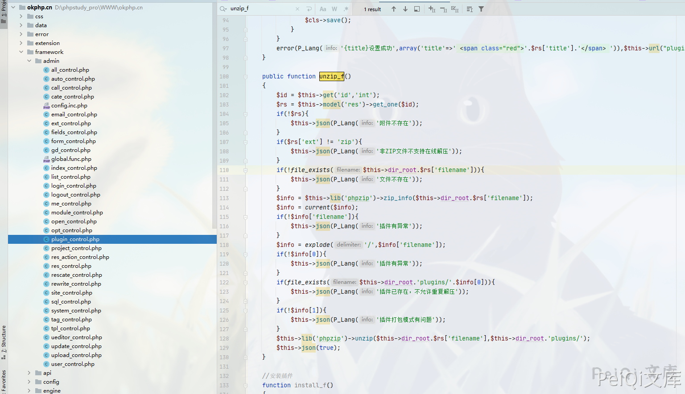
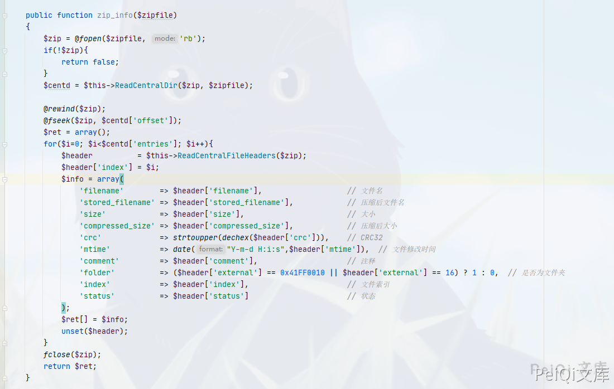
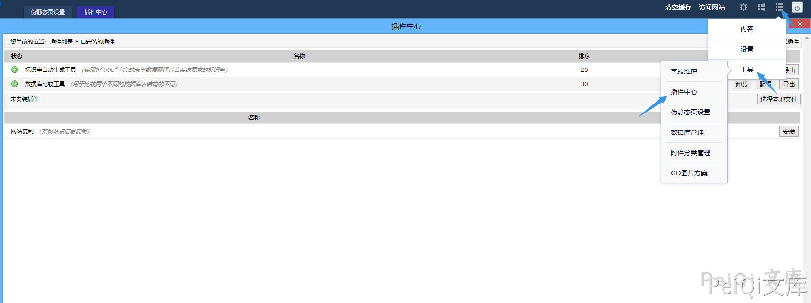

## 核对与使用边界

本文已按保存的全文审阅记录进行文字校订；本轮仅静态核对，未运行 PoC、请求目标或逐图验证。

适用条件与版本记录（来源主张，未列为明确更正的部分仍待权威资料核对）：后台插件安装、已上传ZIP资源ID；包首条目具有目录/文件结构；PHP执行

- **事实待核（1）**：CVE仅frontmatter及参照模块上一篇，作为本篇主CVE存在抽取污染风险。该项尚不能从转载本身确定外部事实；下文相应编号、版本或修复说法只作为来源记录，不能据此判定部署受影响或已修复。明确更正另列于本节。

- **结论使用边界（2）**：explode不是仅返回两个值，实际检查前两部分非空；ZIP第一个条目可为目录导致行为依结构。此项限制直接适用于下文对应结论；现有正文不足以作更宽泛推论，所列方法和原始证据均保留。

- **结论使用边界（3）**：插件安装允许PHP是否超出预期能力未论证；独立plugin_control与module_control应保留，不按16131去重。此项限制直接适用于下文对应结论；现有正文不足以作更宽泛推论，所列方法和原始证据均保留。

历史原文标识：下文原技术材料按来源保留；仅本节明确确认的更正替代相应旧说法，标为待核的观察仍不是事实确认。

# OKLite 1.2.25 后台插件安装 任意文件上传

## 漏洞描述

OKLite v1.2.25 后台插件过滤不完善导致可以上传恶意木马文件

## 漏洞影响

```
OKLite 1.2.25
```

## 漏洞复现

关于执行逻辑参照上一篇 **OKLite 1.2.25 后台模块导入 任意文件上传 CVE-2019-16131**

出现漏洞的位置在于**framework/admin/plugin_control.php**



```php
public function unzip_f()
	{
		$id = $this->get('id','int');
		$rs = $this->model('res')->get_one($id);
		if(!$rs){
			$this->json(P_Lang('附件不存在'));
		}
		if($rs['ext'] != 'zip'){
			$this->json(P_Lang('非ZIP文件不支持在线解压'));
		}
		if(!file_exists($this->dir_root.$rs['filename'])){
			$this->json(P_Lang('文件不存在'));
		}
		$info = $this->lib('phpzip')->zip_info($this->dir_root.$rs['filename']);
		$info = current($info);
		if(!$info['filename']){
			$this->json(P_Lang('插件有异常'));
		}
		$info = explode('/',$info['filename']);
		if(!$info[0]){
			$this->json(P_Lang('插件有异常'));
		}
		if(file_exists($this->dir_root.'plugins/'.$info[0])){
			$this->json(P_Lang('插件已存在，不允许重复解压'));
		}
		if(!$info[1]){
			$this->json(P_Lang('插件打包模式有问题'));
		}
		$this->lib('phpzip')->unzip($this->dir_root.$rs['filename'],$this->dir_root.'plugins/');
		$this->json(true);
	}
```

这里可以看到需要上传ZIP压缩包格式的插件，跟进**zip_info**函数

函数位置 **framework/libs/phpzip.php**



这里会返回关于ZIP压缩包的一些信息

往下看关键位置

```php
$info = explode('/',$info['filename']);
		if(!$info[0]){
			$this->json(P_Lang('插件有异常'));
		}
		if(file_exists($this->dir_root.'plugins/'.$info[0])){
			$this->json(P_Lang('插件已存在，不允许重复解压'));
		}
		if(!$info[1]){
			$this->json(P_Lang('插件打包模式有问题'));
		}
		$this->lib('phpzip')->unzip($this->dir_root.$rs['filename'],$this->dir_root.'plugins/');
		$this->json(true);
```

这里用 explode函数以 **/** 分隔返回两个值，也就是说格式应为 **AAA/BBB**这样的目录格式，直接上传ZIP文件则会报错 **插件打包模式有问题**



在这里上传一个ZIP文件，格式要是解压出来为目录，目录中含PHP文件就行了

```php
$this->lib('phpzip')->unzip($this->dir_root.$rs['filename'],$this->dir_root.'plugins/');
		$this->json(true);
```

最后两行告诉了文件解压的位置，上传的文件在 **plugins目录下**

---

> 来源：Threekiii/Vulnerability-Wiki（https://github.com/Threekiii/Vulnerability-Wiki）
