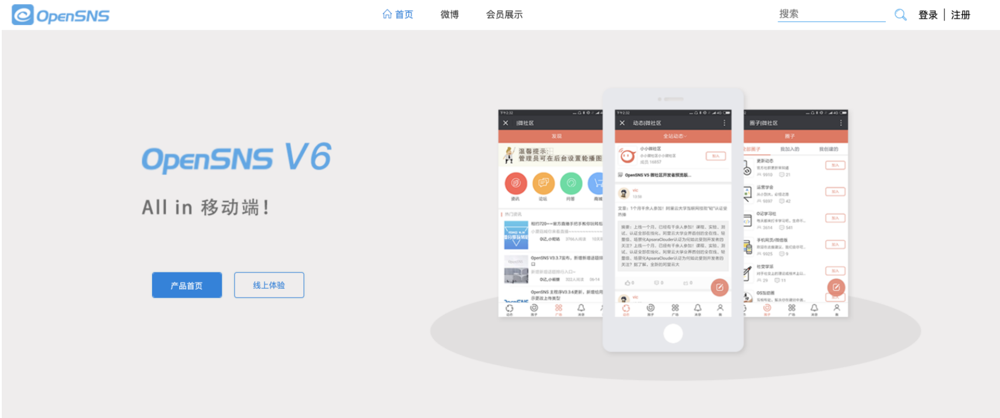
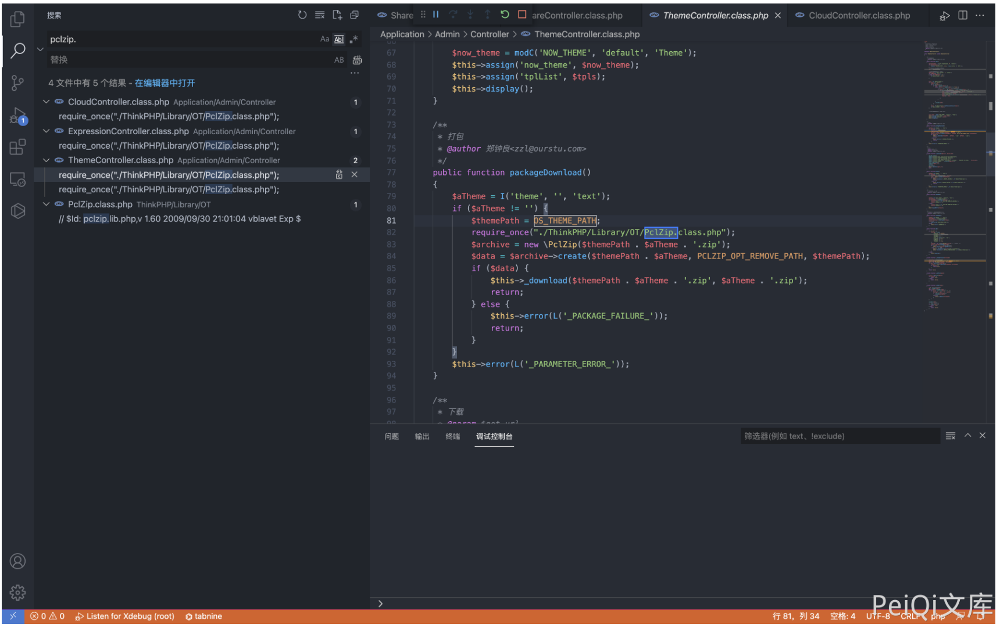
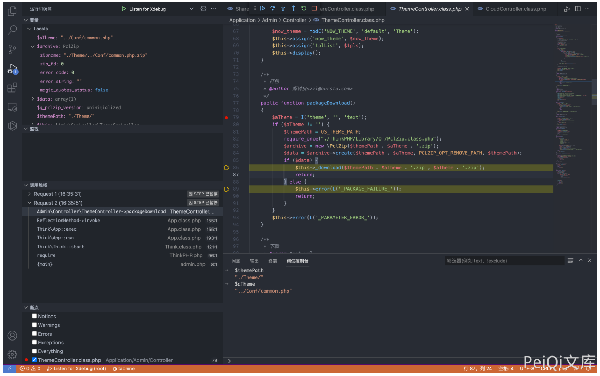
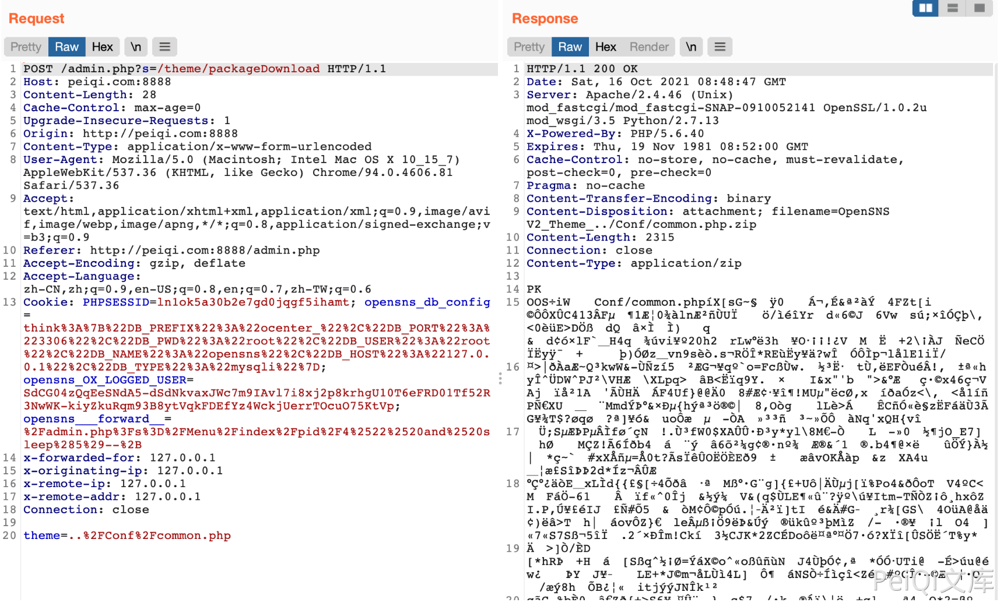

## 核对与使用边界

本文已按保存的全文审阅记录进行文字校订；本轮仅静态核对，未运行 PoC、请求目标或逐图验证。

适用条件与版本记录（来源主张，未列为明确更正的部分仍待权威资料核对）：后台主题打包权限、目标文件服务账号可读

- **适用与权限边界（1）**：文件路径写Admin/Model/ThemeController.class.php与Controller命名/职责矛盾，须核对目录。按此限制解释本文结论，版本相同不足以证明所需角色、入口、配置、依赖或可控参数均已满足；原操作和失败记录一并保留。

- **事实待核（2）**：版本未给；theme=../Conf/common.php有用但缺完整鉴权请求/ZIP响应。该项尚不能从转载本身确定外部事实；下文相应编号、版本或修复说法只作为来源记录，不能据此判定部署受影响或已修复。明确更正另列于本节。

- **适用与权限边界（3）**：示例读取配置不等于无限制全服务器任意文件，需限定路径规范化与权限。按此限制解释本文结论，版本相同不足以证明所需角色、入口、配置、依赖或可控参数均已满足；原操作和失败记录一并保留。

历史原文标识：下文原技术材料按来源保留；仅本节明确确认的更正替代相应旧说法，标为待核的观察仍不是事实确认。

# OpenSNS ThemeController.class.php 后台任意文件下载漏洞

## 漏洞描述

OpenSNS ThemeController.class.php文件中存在文件下载，其中过滤不足导致可以下载服务器任意文件

## 漏洞影响

```
OpenSNS
```

## 网络测绘

```
icon_hash="1167011145"
```

## 漏洞复现

登录页面如下



存在漏洞的文件为 `Application/Admin/Model/ThemeController.class.php`



其中 theme参数为用户可控参数，根据函数流程可以发现存在的文件将会打包为 zip文件提供下载



构造请求

```
POST /admin.php?s=/theme/packageDownload

theme=../Conf/common.php
```



---

> 来源：Threekiii/Vulnerability-Wiki（https://github.com/Threekiii/Vulnerability-Wiki）
