## 核对与使用边界

本文已按保存的全文审阅记录进行文字校订；本轮仅静态核对，未运行 PoC、请求目标或逐图验证。

适用条件与版本记录（来源主张，未列为明确更正的部分仍待权威资料核对）：搜索标签使用索引where数组；作者将默认SQLite改为MySQL

- **结论使用边界（1）**：源码定位段错误给static/backup/*.sql作为方法所在文件，明显复制错置。此项限制直接适用于下文对应结论；现有正文不足以作更宽泛推论，所列方法和原始证据均保留。

- **适用与权限边界（2）**：默认SQLite被换MySQL必须保留，MySQL REGEXP/hex载荷不能代表默认数据库复现。按此限制解释本文结论，版本相同不足以证明所需角色、入口、配置、依赖或可控参数均已满足；原操作和失败记录一并保留。

- **适用与权限边界（3）**：regepx拼错regexp，0x5E612E2A应^a.*却解释^a；账号密码实际哈希边界未说明。按此限制解释本文结论，版本相同不足以证明所需角色、入口、配置、依赖或可控参数均已满足；原操作和失败记录一并保留。

- **来源与引用处置（4）**：PoC/请求/源码几乎全图，重复两场景同图片URL；大段文库授权推广应剥离。保留这部分来源材料并与技术结论分开；其引用或宣传内容不能补足本文漏洞的证据。

历史原文标识：下文原技术材料按来源保留；仅本节明确确认的更正替代相应旧说法，标为待核的观察仍不是事实确认。

# PbootCMS 3-0-4 SQL 注入漏洞复现

<meta name="referrer" content="no-referrer"/>

> 本文由 [简悦 SimpRead](http://ksria.com/simpread/) 转码， 原文地址 [mp.weixin.qq.com](https://mp.weixin.qq.com/s/EHn4ScNOEr9lyda2bnGWPQ)

**描述**

  

PbootCMS 是全新内核且永久开源免费的 PHP 企业网站开发建设统，是一套高效、简洁、 强悍的可免费商用的 PHP CMS 源码，但存在 SQL 注入漏洞，攻击者可构造恶意语句进行获取敏感数据。

  

  

  

  

  

**影响范围**

  

PbootCMS 3.0.4  

  

  

  

  

  

**FOFA**

  

app="PBOOTCMS"

  

  

  

  

  

源码分析
----

漏洞代码位置：

```
apps\home\controller\ParserController.php
```

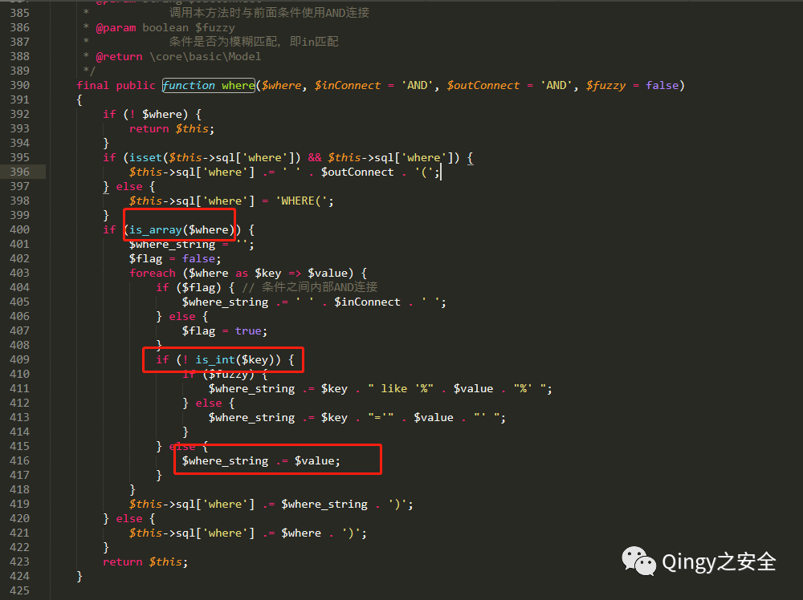

当传递的参数 $where 是一个数组时就遍历数组，当 $where 是一个索引数组时则：$where_string.=$value。  

接下来找到 “$where” 函数中要传递的代码为索引数组时的代码：

```
pbootcms\static\backup\sql\0cb2353f8ea80b398754308f15d1121e_20200705235534_pbootcms.sql
```

在 “parserSearchLabel()” 方法中，传入的数据被分配到变量 “$receive” 进行遍历，“$key”被带入 “request()” 进行过滤。

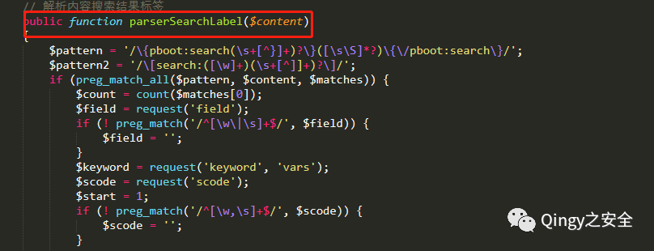

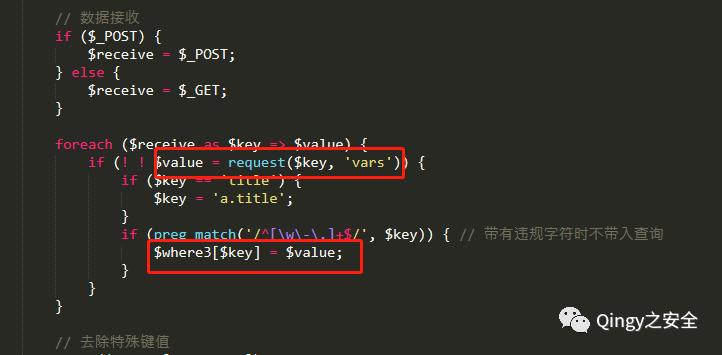

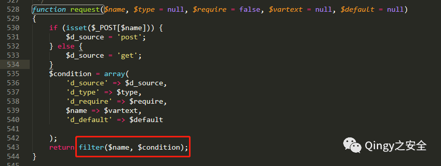

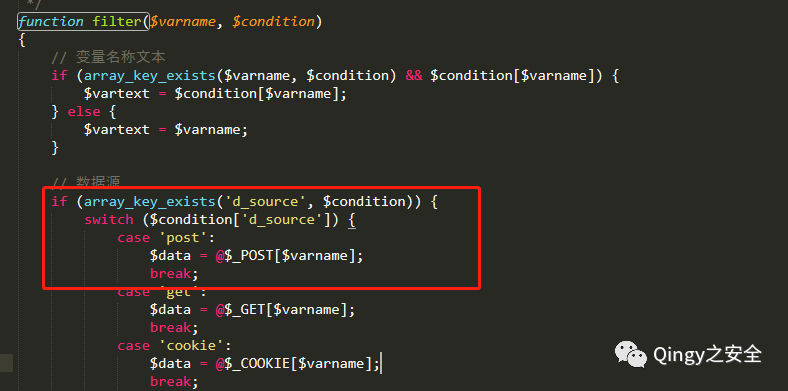

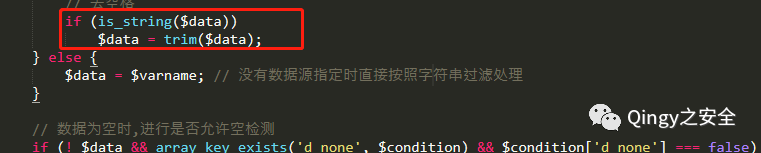

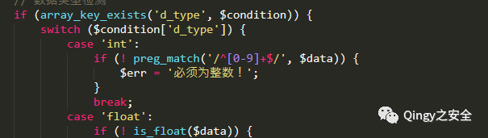

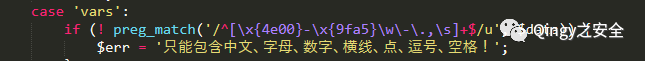

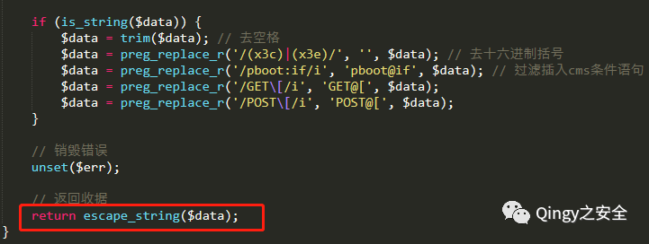

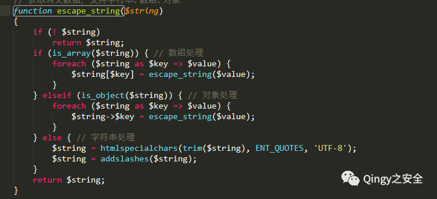

通过上述方法传入索引数组的值只能包含中文、字母、数字、水平线、点、逗号和空格！它由 “htmlspecialchars()” 和“addslashes()”编码。最后，它被传递到 “$where3”。  

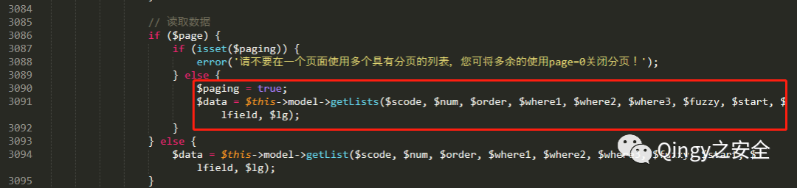

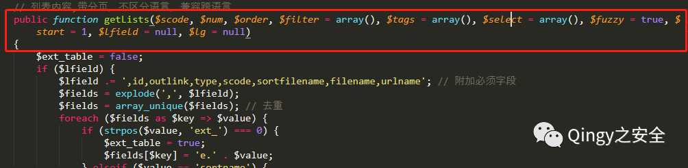

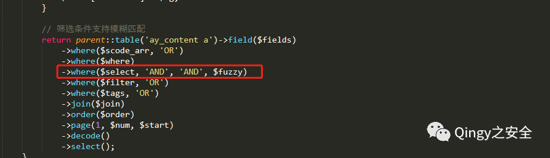

“getlists()”中的 “$where3” 是可控的，它将以 “and” 的形式进入语句，所以最终造成了 SQL 注入。  

本地复现
----

默认数据库是 sqlite。为了测试方便，我们需要用 mysql 数据库替换默认数据库。mysql 数据库目录：

```
pbootcms\static\backup\sql\0cb2353f8ea80b398754308f15d1121e_20200705235534_pbootcms.sql
```

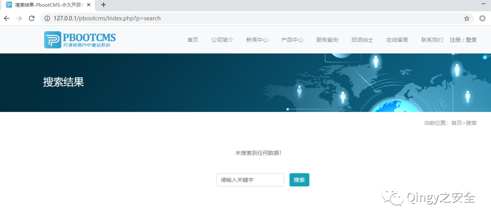

接下来，我们以 POST 的形式发送索引数组，还记得源码里数组中的值要以 “and” 的形式进入 “where” 条件：


当条件为真时：  


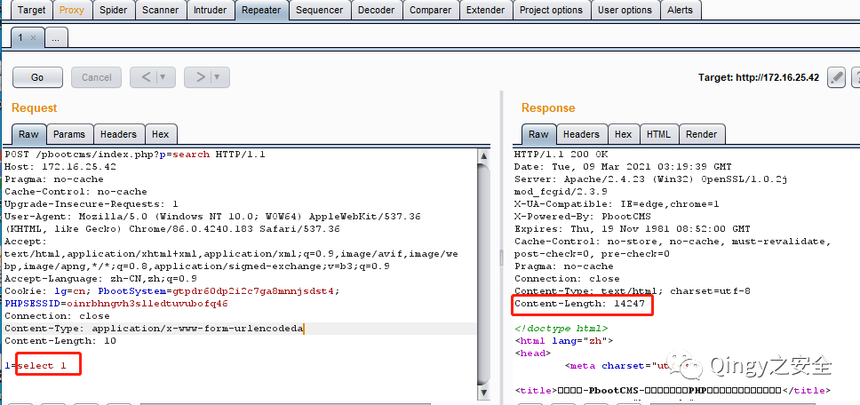

当条件为假时：

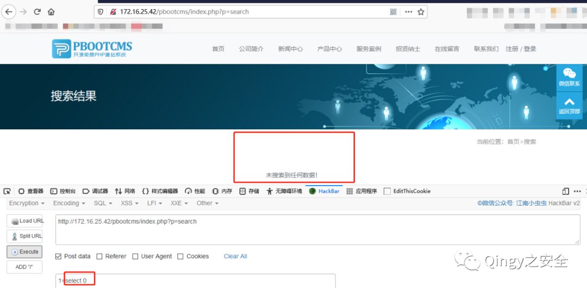

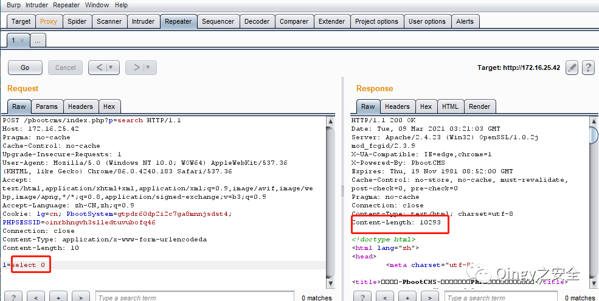

有效载荷：由于数据经过过滤，因此只能使用 “正则表达式” 进行常规匹配。例如：“用户名 = 管理员”可以表示为 “用户名 regepx 0x5E612E2A”，其中“5E612E2A” 是“^ a”的十六进制代码。  

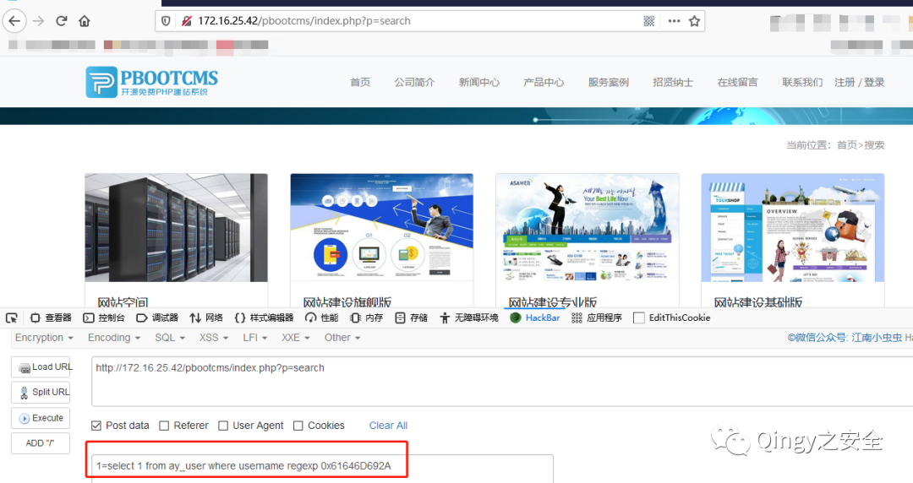

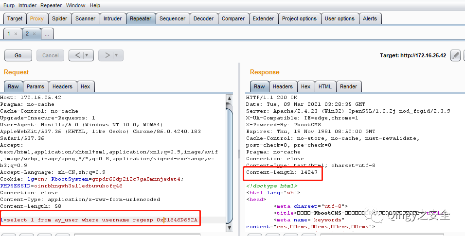

就可以获得管理员的账号密码了。

公众号  

wiki.xypbk.com 已经添加授权访问

获取授权方式为后台回复：文库授权  

    本站开设的起因是因为某一次 HW，查漏洞真的太麻烦了，就想起来做了一个站点，本意就是自己用来快速检索漏洞详情的，为了方便大家就公开了，但是这样就又会被不法份子利用，和影响一些大佬的权益。

    为防止黑产份子的非法利用漏洞，不给国家安全添麻烦，本站从此开启授权访问，形式以每人单独授权发放，限量 1000 人，小圈子查阅，请勿分享您获取的账号密码，账号密码具都采用随机生成的 32 位 MD5，还请牢记。

    如若因漏洞利用产生重大影响，会根据登录 IP、请求内容、申请授权等信息进行查证，查证后将对号主进行追责，故不要分享账号，终害己身。  

    虽然比较麻烦了些，但会稍微对黑产份子有一些限制，保证了本站安全，也保证国家安全。同时有些敏感东西也能第一时间放出来了，还请大家谅解。

    同时本站承诺永远不会出现买卖账号等利益相关的事情，本站永不割韭菜，永久免费检索，坚决抵制安全圈的歪风邪气。

    最后，若大家对此有意见请后台留言，本站将及时改正，若内容有侵犯您的权益，请及时提出，进行删除处理。  

    本站能坚持多久全看大家是否滥用，内容若更新较慢也请谅解，本人有工作有生活，会尽量坚持更新的。

  


扫取二维码获取

更多精彩


Qingy 之安全  


点个在看你最好看

---

> 来源：MrWQ/vulnerability-paper（https://github.com/MrWQ/vulnerability-paper）
