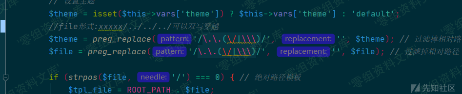
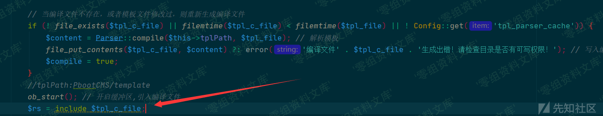
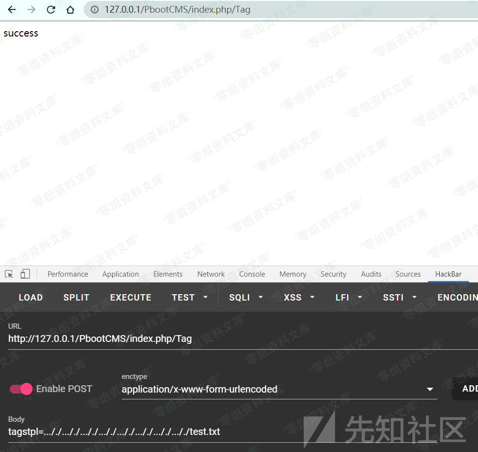

## 核对与使用边界

本文已按保存的全文审阅记录进行文字校订；本轮仅静态核对，未运行 PoC、请求目标或逐图验证。

适用条件与版本记录（来源主张，未列为明确更正的部分仍待权威资料核对）：tag非空、tagstpl路径受字符正则后可双写穿越；模板编译缓存可写，已有可读含PHP文件

- **证据待核（1）**：关键双写payload/URL只图，无法文本复现；Parser::compile是否保留PHP需补。保留原引用、截图位置和实验叙述；本项所缺材料未被补造，截图存在或作者宣称成功都不等于已核验其内容。

- **结论使用边界（2）**：前面的路径不管怎么拼都无所谓过强，目录存在和平台规范化会影响，作者只Windows测。此项限制直接适用于下文对应结论；现有正文不足以作更宽泛推论，所列方法和原始证据均保留。

- **事实待核（3）**：最新版已修无具体版本/commit；读取与包含执行应分别记录。该项尚不能从转载本身确定外部事实；下文相应编号、版本或修复说法只作为来源记录，不能据此判定部署受影响或已修复。明确更正另列于本节。

历史原文标识：下文原技术材料按来源保留；仅本节明确确认的更正替代相应旧说法，标为待核的观察仍不是事实确认。

# PbootCMS v2.0.7 前台任意文件包含漏洞

一、漏洞简介
------------

二、漏洞影响
------------

PbootCMS v2.0.7

三、复现过程
------------

### 漏洞分析

漏洞发生在PbootCMS内核的模板解析函数中为了方便看直接上一个完整的Parser代码吧

    public function parser($file)
        {
            // 设置主题
            $theme = isset($this->vars['theme']) ? $this->vars['theme'] : 'default';
            //file形式:xxxxx/../../../可以双写穿越
            $theme = preg_replace('/\.\.(\/|\\\)/', '', $theme); // 过滤掉相对路径
            $file = preg_replace('/\.\.(\/|\\\)/', '', $file); // 过滤掉相对路径

            if (strpos($file, '/') === 0) { // 绝对路径模板
                $tpl_file = ROOT_PATH . $file;
            } elseif (! ! $pos = strpos($file, '@')) { // 跨模块调用
                $path = APP_PATH . '/' . substr($file, 0, $pos) . '/view/' . $theme;
                define('APP_THEME_DIR', str_replace(DOC_PATH, '', $path));
                if (! is_dir($path)) { // 检查主题是否存在
                    error('模板主题目录不存在！主题路径：' . $path);
                } else {
                    $this->tplPath = $path;
                }
                $tpl_file = $path . '/' . substr($file, $pos + 1);
            } else {
                // 定义当前应用主题目录
                define('APP_THEME_DIR', str_replace(DOC_PATH, '', APP_VIEW_PATH) . '/' . $theme);
                if (! is_dir($this->tplPath .= '/' . $theme)) { // 检查主题是否存在
                    error('模板主题目录不存在！主题路径：' . APP_THEME_DIR);
                }
                $tpl_file = $this->tplPath . '/' . $file; // 模板文件
            }
            $note = Config::get('tpl_html_dir') ? ' 同时检测到您系统中启用了模板子目录' . Config::get('tpl_html_dir') . '，请核对是否是此原因导致！' : '';
            file_exists($tpl_file) ?: error('模板文件' . APP_THEME_DIR . '/' . $file . '不存在！' . $note);
            $tpl_c_file = $this->tplcPath . '/' . md5($tpl_file) . '.php'; // 编译文件

            // 当编译文件不存在，或者模板文件修改过，则重新生成编译文件
            if (! file_exists($tpl_c_file) || filemtime($tpl_c_file) < filemtime($tpl_file) || ! Config::get('tpl_parser_cache')) {
                $content = Parser::compile($this->tplPath, $tpl_file); // 解析模板
                file_put_contents($tpl_c_file, $content) ?: error('编译文件' . $tpl_c_file . '生成出错！请检查目录是否有可写权限！'); // 写入编译文件
                $compile = true;
            }
            //tplPath:PbootCMS/template
            ob_start(); // 开启缓冲区,引入编译文件
            $rs = include $tpl_c_file;
            if (! isset($compile)) {
                foreach ($rs as $value) { // 检查包含文件是否更新,其中一个包含文件不存在或修改则重新解析模板
                    if (! file_exists($value) || filemtime($tpl_c_file) < filemtime($value) || ! Config::get('tpl_parser_cache')) {
                        $content = Parser::compile($this->tplPath, $tpl_file); // 解析模板
                        file_put_contents($tpl_c_file, $content) ?: error('编译文件' . $tpl_c_file . '生成出错！请检查目录是否有可写权限！'); // 写入编译文件
                        ob_clean();
                        include $tpl_c_file;
                        break;
                    }
                }
            }
            $content = ob_get_contents();
            ob_end_clean();
            return $content;
        }

简单讲一下重点这里对传入路径的过滤并不严格，可以双写绕过再往下跟一下当模板文件不在缓存中的时候，会读取\$tpl\_file中的内容，然后写入缓存文件中并且包含。也就是说，当parser函数的参数可以被控制的时候，就会造成一个任意文件包含。所以，要找一个可控参数的parser调用经过简单寻找，就可以发现前台控制器TagController中的index方法，完美符合我们的要求上代码：

    public function index()
        {
            // 在非兼容模式接受地址第二参数值
            if (defined('RVAR')) {
                $_GET['tag'] = RVAR;
            }

            if (! get('tag')) {
                _404('您访问的页面不存在，请核对后重试！');
            }
            $a=get('tag');
            $tagstpl = request('tagstpl');
            if (! preg_match('/^[\w\-\.\/]+$/', $tagstpl)) {
                $tagstpl = 'tags.html';
            }
            $content = parent::parser($this->htmldir . $tagstpl); // 框架标签解析
            $content = $this->parser->parserBefore($content); // CMS公共标签前置解析
            $content = $this->parser->parserPositionLabel($content, 0, '相关内容', homeurl('tag/' . get('tag'))); // CMS当前位置标签解析
            $content = $this->parser->parserSpecialPageSortLabel($content, - 2, '相关内容', homeurl('tag/' . get('tag'))); // 解析分类标签
            $content = $this->parser->parserAfter($content); // CMS公共标签后置解析
            $this->cache($content, true);
        }

传入parser的参数，是通过request接收的参数\$tagstpl和\$this-\>htmldir拼接的，因为已经知道在函数内部可以出现目录穿越，所以前面的路径不管怎么拼接都无所谓啦。这样就完成了整个攻击链，TagController-\>parser-\>双写绕过-\>文件读取-\>文件写入-\>文件包含

### 漏洞复现

因为是windows搭的环境，就不读/etc/passwd了，读一下D盘根目录的文件吧

成功再包含个phpinfo试试也是可以的漏洞验证完成本来是想再看看有没有什么组合利用的姿势，毕竟文件包含这种洞本身利用的灵活度还是蛮高的不过既然最新版已经修了 就不多看了

参考链接
--------

> https://xz.aliyun.com/t/7744
