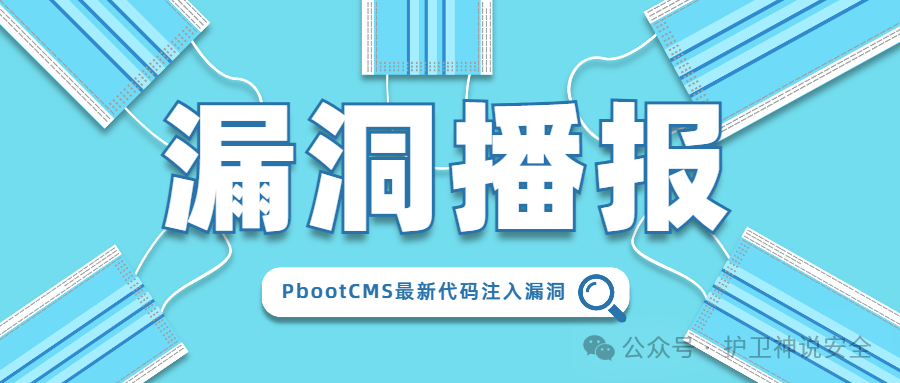
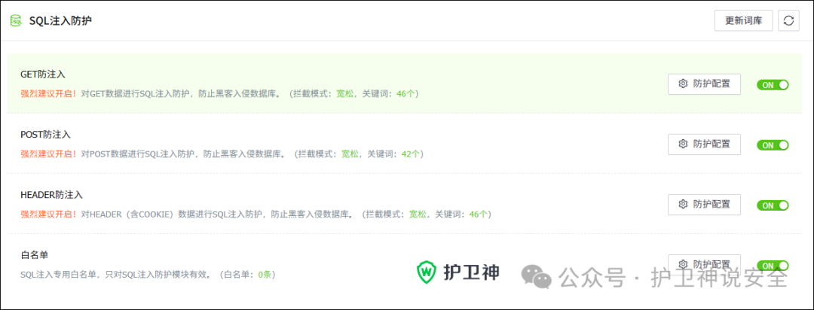
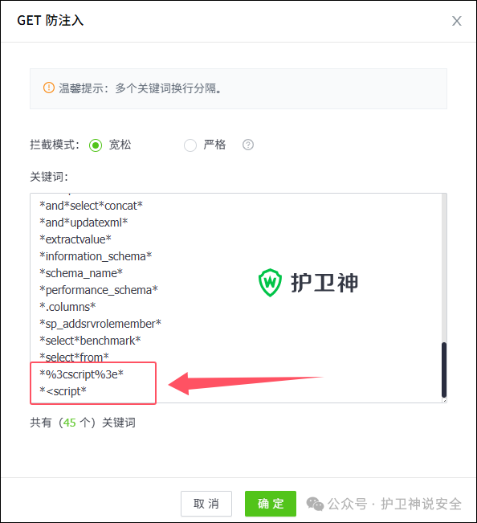
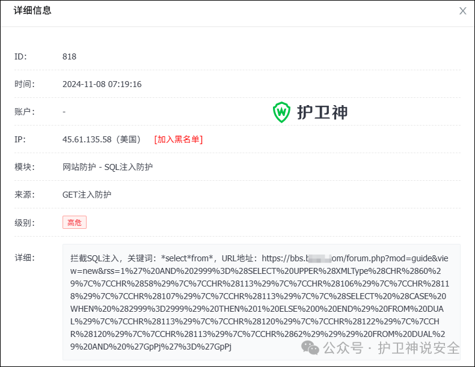
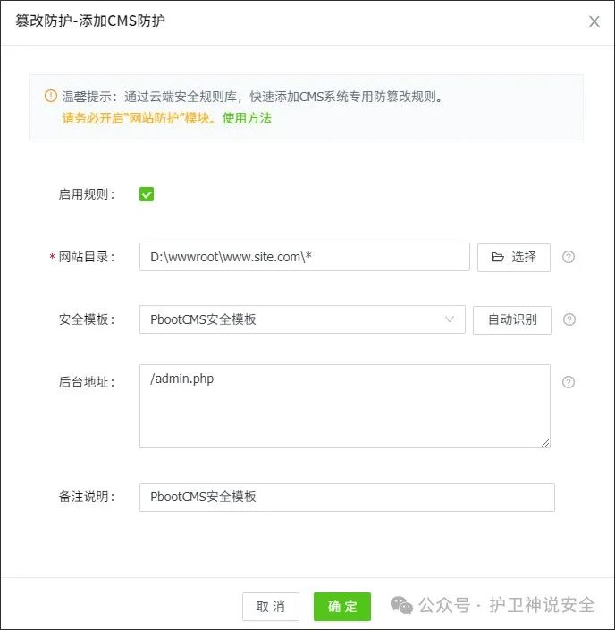
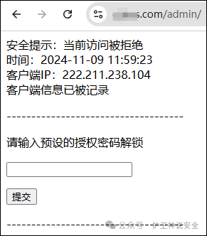

## 核对与使用边界

本文已按保存的全文审阅记录进行文字校订；本轮仅静态核对，未运行 PoC、请求目标或逐图验证。

适用条件与版本记录（来源主张，未列为明确更正的部分仍待权威资料核对）：具体认证/路由/模板配置未说明

- **来源与引用处置（1）**：主要是产品防护广告，无PoC/源码；SQLi/XSS过滤产品被直接宣称解决代码注入，缺针对性证据。保留这部分来源材料并与技术结论分开；其引用或宣传内容不能补足本文漏洞的证据。

- **来源与引用处置（2）**：所有SQLi/XSS可防是绝对营销；未发布补丁与最新标题需标2025-02-28时点不可当现状。保留这部分来源材料并与技术结论分开；其引用或宣传内容不能补足本文漏洞的证据。

- **事实待核（3）**：影响&lt;3.2.4不等于已确认3.2.4修复；无官方CVE/CNVD公告链接。该项尚不能从转载本身确定外部事实；下文相应编号、版本或修复说法只作为来源记录，不能据此判定部署受影响或已修复。明确更正另列于本节。

历史原文标识：下文原技术材料按来源保留；仅本节明确确认的更正替代相应旧说法，标为待核的观察仍不是事实确认。

#  PbootCMS最新代码注入漏洞（CNVD-2025-01710、CVE-2024-12789）   
原创 护卫神  护卫神说安全   2025-02-28 03:39  
  
  
  
PbootCMS是一套高效、简洁、 强悍的可免费商用的CMS源码，使用PHP+MySQL开发，能够满足各类企业网站开发建设的需要。  
  
  
国家信息安全漏洞共享平台于2025-01-14公布该程序存在代码注入漏洞。  
  
漏洞编号：CNVD-2025-01710、CVE-2024-12789  
  
影响产品：PbootCMS <3.2.4  
  
漏洞级别：  
中  
  
公布时间  
：2025-01-14  
  
漏洞描述：PbootCMS 3.2.3及之前版本存在该代码注入漏洞，该漏洞源于 apps/home/controller/IndexController.php 页面的tag参数未能正确过滤构造代码段的特殊元素。攻击者可利用该漏洞执行任意代码。  
  
  
**解决办法：**  
  
目前厂商尚未发布修复补丁。可以使用『**护卫神·防入侵系统**』的“  
SQL注入防护”模块来解决该注入漏洞，不止对该漏洞有效，对网站所有的SQL注入漏洞和跨脚本漏洞都可以防护。  
  
  
  
**1、SQL注入防护和XSS跨站攻击防护**  
  
『护卫神·防入侵系统』自带的SQL注入防护模块（如图一）除了拦截SQL注入，还可以拦截XSS跨站脚本（如图二），一并解决PbootCMS的其他安全漏洞，拦截效果如图三。  
  
  
  
  
（图一：SQL注入防护模块）  
  
  
  
  
  
（图二：XSS跨站脚本攻击防护）  
  
  
  
  
  
（图三：SQL注入拦截效果）  
  
  
  
**2、防篡改保护和后台保护**  
  
如果对安全要求较高，还可以使用『护卫神·防入侵系统』系统的“篡改防护”模块，对PbootCMS做防篡改保护。  
  
在“篡改防护-添加CMS防护”（如图四）。选择网站目录，安全模板选择“PbootCMS安全模板”，并填写正确的后台地址，点击“确定”按钮，就添加好了。  
  
  
  
（图四：添加PbootCMS防篡改规则）  
  
  
  
设置好以后，防入侵系统就会对后台进行保护，后期访问时需要先验证授权密码（如图五），只有输入了正确的密码才能访问。  
  
  
  
（图五：访问后台需要输入授权密码）  
  
  

---

> 来源：gelusus/wxvl（微信公众号漏洞文章自动归档，原文见文首链接）
