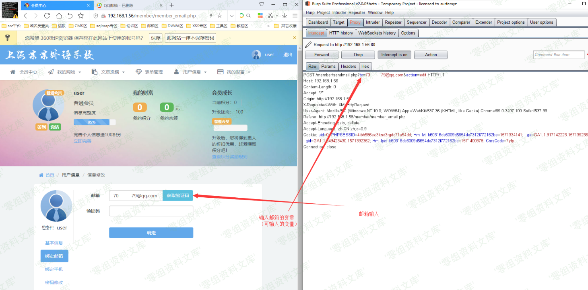
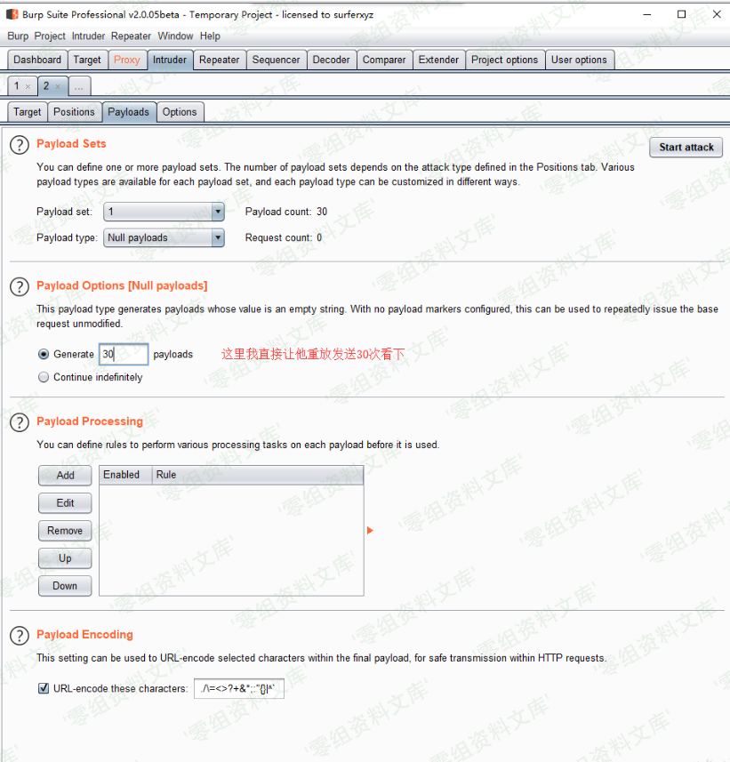
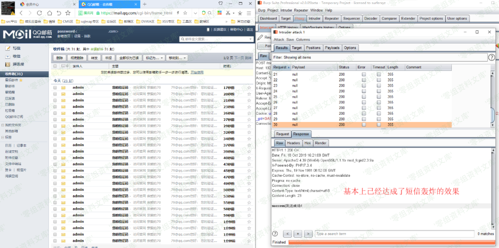

## 核对与使用边界

本文已按保存的全文审阅记录进行文字校订；本轮仅静态核对，未运行 PoC、请求目标或逐图验证。

适用条件与版本记录（来源主张，未列为明确更正的部分仍待权威资料核对）：短信/邮箱服务已配置；注册、绑定登录及后台测试三种角色不同

- **事实待核（1）**：各入口仅图，没有请求/时间间隔/成功发送次数或服务商限额证据。该项尚不能从转载本身确定外部事实；下文相应编号、版本或修复说法只作为来源记录，不能据此判定部署受影响或已修复。明确更正另列于本节。

- **事实待核（2）**：无限量断言应按账户/IP/号码/时间及服务商限制分别测试，后台测试不等于前台匿名。该项尚不能从转载本身确定外部事实；下文相应编号、版本或修复说法只作为来源记录，不能据此判定部署受影响或已修复。明确更正另列于本节。

- **事实待核（3）**：无修复/原始来源。该项尚不能从转载本身确定外部事实；下文相应编号、版本或修复说法只作为来源记录，不能据此判定部署受影响或已修复。明确更正另列于本节。

历史原文标识：下文原技术材料按来源保留；仅本节明确确认的更正替代相应旧说法，标为待核的观察仍不是事实确认。

# S-CMS 学校建站系统 v5.0 邮箱短信轰炸逻辑漏洞

一、漏洞简介
------------

应用程序的短信注册和邮箱注册模块，以及短信和邮箱绑定模块，没有添加时间限制发送数量的机制，导致存在逻辑缺陷，没有限定一段时间内可发送的短信数量。

二、漏洞影响
------------

S-CMS 学校建站系统 v5.0

三、复现过程
------------

该漏洞存在的位置有：前台注册，后台短信模块测试，以及前台用户绑定邮箱以及手机号的位置，均存在该逻辑漏洞。

