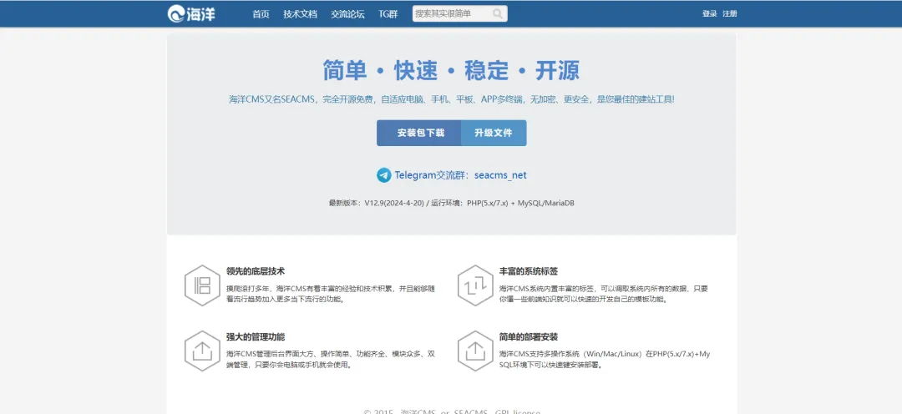

## 核对与使用边界

本文已按保存的全文审阅记录进行文字校订；本轮仅静态核对，未运行 PoC、请求目标或逐图验证。

适用条件与版本记录（来源主张，未列为明确更正的部分仍待权威资料核对）：获授权后台角色，可访问admin_manager删除与admin_topic编辑

- **事实待核（1）**：frontmatter只44072漏第二主漏洞；影响版本只有产品名。该项尚不能从转载本身确定外部事实；下文相应编号、版本或修复说法只作为来源记录，不能据此判定部署受影响或已修复。明确更正另列于本节。

- **来源与引用处置（2）**：admin_topic?actin拼错/需核对真实action；没有参数载荷/响应/披露链接。保留这部分来源材料并与技术结论分开；其引用或宣传内容不能补足本文漏洞的证据。

- **来源与引用处置（3）**：官方修复仅主页无具体安全版；无加密代码安全有保障是营销断言。保留这部分来源材料并与技术结论分开；其引用或宣传内容不能补足本文漏洞的证据。

历史原文标识：下文原技术材料按来源保留；仅本节明确确认的更正替代相应旧说法，标为待核的观察仍不是事实确认。

#  漏洞预警 | SeaCMS海洋影视管理系统SQL注入漏洞   
浅安  浅安安全   2025-05-10 00:02  
  
**0x00 漏洞编号**  
- # CVE-2025-44072  
  
- # CVE-2025-44074  
  
**0x01 危险等级**  
- 高危  
  
**0x02 漏洞概述**  
  
海洋CMS是为解决站长核心需求而设计的内容管理系统，一套程序自适应电脑、手机、平板、APP多个终端入口，无任何加密代码、安全有保障，是您最佳的建站工具。  
  
  
  
**0x03 漏洞详情**  
###   
  
**CVE-2025-44072**  
  
**漏洞类型：**  
SQL注入  
  
**影响：**  
获取敏感信息  
  
****  
  
**简述：**  
海洋CMS的  
/admin_manager.php?action=delall接口存在SQL注入漏洞，获取授权的攻击者可以通过该漏洞执行任意SQL语句，从而获取数据库敏感信息。  
  
CVE-2025-44074  
  
**漏洞类型：**  
SQL注入  
  
**影响：**  
获取敏感信息  
  
****  
  
**简述：**  
海洋CMS的  
admin_topic.php?actin=edit接口存在SQL注入漏洞，  
获取授权的攻击者可以通过该漏洞执行任意SQL语句，从而获取数据库敏感信息。  
  
**0x04 影响版本**  
- 海洋CMS  
  
**0x05****POC状态**  
- 已公开  
  
**0x06****修复建议**  
  
**目前官方已发布漏洞修复版本，建议用户升级到安全版本****：**  
  
https://www.seacms.net/  
  
  
  

---

> 来源：gelusus/wxvl（微信公众号漏洞文章自动归档，原文见文首链接）
