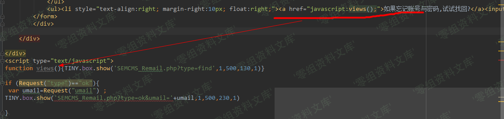

## 核对与使用边界

- 凭据处理：本文抓包中的可识别会话/防伪或认证值已仅将中段替换为星号，保留首尾及原长度便于对照；遮罩后的历史值不能作为可用登录凭据。原操作、请求方法和攻击表达式保留。

本文已按保存的全文审阅记录进行文字校订；本轮仅静态核对，未运行 PoC、请求目标或逐图验证。

适用条件与版本记录（来源主张，未列为明确更正的部分仍待权威资料核对）：后台Inquiry删除权限/管理员Cookie；数组参数过滤遗漏

- **结论使用边界（1）**：说明VID\[\]未处理但实际POST是AID\[\]=3，参数名矛盾且无注入载荷。此项限制直接适用于下文对应结论；现有正文不足以作更宽泛推论，所列方法和原始证据均保留。

- **证据待核（2）**：截图引用2.7密码恢复和3.5注入，带Word宽高属性/末image占位。保留原引用、截图位置和实验叙述；本项所缺材料未被补造，截图存在或作者宣称成功都不等于已核验其内容。

- **凭据与会话边界（3）**：删除接口测试会删数据，Content-Length/会话为固定环境；无源码/结果/出处。抓包中的会话不能视为未认证访问证明；可识别的真实会话值按中段星号遮罩处理，默认演示值和攻击语法保留。需重新取得授权测试会话，不能复用文中值。

历史原文标识：下文原技术材料按来源保留；仅本节明确确认的更正替代相应旧说法，标为待核的观察仍不是事实确认。

# Semcms v3.8 sql注入漏洞

一、漏洞简介
------------

二、漏洞影响
------------

Semcms v3.8

三、复现过程
------------

> URL: <http://0-sec.org/123/sOWj5B_Admin/SEMCMS_Inquiry.php>
>
> {width="5.833333333333333in"
> height="2.9166666666666665in"}Debug：Defense module is
> class.phpmailer.php and function
> inject\_check\_sql{width="5.833333333333333in"
> height="0.4946084864391951in"}But VID\[\] didn\'t handle it

-   POST

```{=html}
<!-- -->
```
    POST /123/sOWj5B_Admin/SEMCMS_Inquiry.php?Class=Deleted&CF=Inquriy&page= HTTP/1.1
    Host: 0-sec.org
    Content-Length: 24
    Cache-Control: max-age=0
    Origin: http://127.0.0.1
    Upgrade-Insecure-Requests: 1
    Content-Type: application/x-www-form-urlencoded
    User-Agent: Mozilla/5.0 (Windows NT 10.0; WOW64) AppleWebKit/537.36 (KHTML, like Gecko) Chrome/69.0.3497.100 Safari/537.36
    Accept: text/html,application/xhtml+xml,application/xml;q=0.9,image/webp,image/apng,*/*;q=0.8
    Referer: http://127.0.0.1/123/sOWj5B_Admin/SEMCMS_Inquiry.php
    Accept-Encoding: gzip, deflate
    Accept-Language: zh-CN,zh;q=0.9
    Cookie: MEIQIA_EXTRA_TRACK_ID=1F7WZdk3rwHIzKqUfkrNaZ9t1EE; _ga=GA1.1.1842664860.1547715044; UM_distinctid=169c55686280-0636c606d502d3-36664c08-1fa400-169c556862b2e4; CNZZDATA1256162028=1606185978-1553793969-%7C1553793969; CNZZDATA1707573=cnzz_eid%3D987595238-1554794879-http%253A%252F%252F127.0.0.1%252F%26ntime%3D1554913098; PHPSESSID=n75********************td4; __51cke__=; __tins__4329483=%7B%22sid%22%3A%201556088941568%2C%20%22vd%22%3A%203%2C%20%22expires%22%3A%201556090843766%7D; __51laig__=3; scusername=%E6%80%BB%E8%B4%A6%E5%8F%B7; scuseradmin=Admin; scuserpass=c4c**************************49b
    Connection: close

    languageID=&AID%5B%5D=3

image
