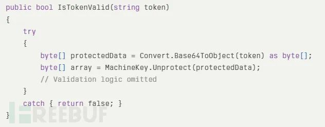
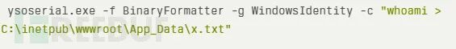

## 核对与使用边界

本文已按保存的全文审阅记录进行文字校订；本轮仅静态核对，未运行 PoC、请求目标或逐图验证。

适用条件与版本记录（来源主张，未列为明确更正的部分仍待权威资料核对）：ThumbnailsAccessToken处理器可达、BinaryFormatter gadget组件适用；补丁KB1002844状态

- **结论使用边界（1）**：前称10.4未打补丁受影响，后建议升级10.4或补丁存在误导，必须明确10.4补丁层级。此项限制直接适用于下文对应结论；现有正文不足以作更宽泛推论，所列方法和原始证据均保留。

- **适用与权限边界（2）**：把IIS应用池权限称完全服务器控制/可横移过强，受进程权限网络约束。按此限制解释本文结论，版本相同不足以证明所需角色、入口、配置、依赖或可控参数均已满足；原操作和失败记录一并保留。

- **结论使用边界（3）**：声称微软建议Binder限制作为缓解需官方核实，不能保证BinaryFormatter安全。此项限制直接适用于下文对应结论；现有正文不足以作更宽泛推论，所列方法和原始证据均保留。

- **来源与引用处置（4）**：零日标签与截至3月6日无在野确认时点应区分；无Assetnote/KB精确链接，征文广告可剥离。保留这部分来源材料并与技术结论分开；其引用或宣传内容不能补足本文漏洞的证据。

历史原文标识：下文原技术材料按来源保留；仅本节明确确认的更正替代相应旧说法，标为待核的观察仍不是事实确认。

#  Sitecore 曝零日漏洞，可执行任意代码攻击   
FreeBuf  商密君   2025-03-09 23:55  
  
近日披露的 Sitecore 体验平台关键漏洞（CVE-2025-27218）允许未经身份验证的攻击者在未打补丁的系统上执行任意代码。  
该漏洞源于不安全的数据反序列化操作，影响Sitecore 体验管理器（XM）和体验平台（XP）8.2至10.4版本，这些版本在安装补丁KB1002844之前均存在风险。  
  
  
安全公司Assetnote发现了这一漏洞，该漏洞利用了Sitecore对已弃用的BinaryFormatter类的错误使用，从而绕过身份验证检查并部署恶意负载。  
  
  
**Sitecore 零日漏洞的技术细节**  
  
  
该漏洞位于MachineKeyTokenService.IsTokenValid方法中，该方法使用Convert.Base64ToObject对ThumbnailsAccessToken HTTP头中的不受信任数据进行反序列化。  
关键问题在于，反序列化操作发生在解密之前，这使得攻击者能够直接将精心构造的负载注入到处理流程中。  
  
  
  
  
  
攻击者通过使用ysoserial.net等工具生成恶意的序列化对象，并利用WindowsIdentity gadget链来执行操作系统命令。例如，以下负载可以创建一个文件以确认代码执行：  
  
  
  
  
  
生成的Base64编码负载被插入到ThumbnailsAccessToken头中。Sitecore的AuthenticateThumbnailsRequest HTTP处理器（属于httpRequestBegin管道）会在没有身份验证检查的情况下解析该头，导致立即进行反序列化并激活负载。  
  
  
**漏洞的广泛影响与风险**  
  
  
  
Sitecore为全球超过12,000个企业数字平台提供支持，因此该漏洞具有系统性风险：  
  
- 无需身份验证的远程代码执行（RCE）：利用此漏洞无需任何凭证，使得大规模扫描和攻击自动化成为可能。  
  
- 完全服务器控制：成功攻击将授予IIS APPPOOL\Sitecore权限，允许横向移动和数据泄露。  
  
- 业务中断：恶意攻击者可能篡改网站、注入恶意软件或破坏CMS操作。  
  
Assetnote的分析指出，Sitecore对BinaryFormatter的错误实现（微软已明确警告不应使用此类）创造了一个本可避免的攻击面。Sitecore通过此机制序列化字节数组的行为引入了不必要的风险，而解密步骤的顺序错误则进一步加剧了问题。  
  
  
**缓解措施与建议**  
  
  
  
Sitecore已发布补丁来修复CVE-2025-27218，并敦促客户采取以下措施：  
  
- 立即升级到Sitecore 10.4或应用安全补丁。  
  
- 检查HTTP管道中是否存在未经授权的BinaryFormatter使用。  
  
- 监控ThumbnailsAccessToken头的异常活动。  
  
- 对于无法立即打补丁的组织，微软建议强制执行Serialization Binder限制，或通过运行时配置完全禁用BinaryFormatter。  
  
这一事件凸显了安全反序列化实践中的持续挑战。尽管自2017年以来，人们对BinaryFormatter的风险已有广泛认知，但其在企业软件中的持续使用表明漏洞研究与开发人员教育之间仍存在差距。截至2025年3月6日，尚未确认有野外利用案例，但未打补丁的系统仍面临严重威胁。使用Sitecore的组织必须优先修复此漏洞，以防大规模数据泄露。  
  
  
编辑：陈十九  
  
审核：商密君  
  
**征文启事**  
  
大家好，为了更好地促进同业间学术交流，商密君现开启征文活动，只要你对商用密码、网络安全、数据加密等有自己的独到见解和想法，都可以积极向商密君投稿，商密君一定将您的声音传递给更多的人。  
  
  
  
  
来源：FreeBuf  
  
注：内容均来源于互联网，版权归作者所有，如有侵权，请联系告知，我们将尽快处理。  
  
  
  
  
  
  
  
  
点分享  
  
  
  
点点赞  
  
  
  
点在看  
  

---

> 来源：gelusus/wxvl（微信公众号漏洞文章自动归档，原文见文首链接）
