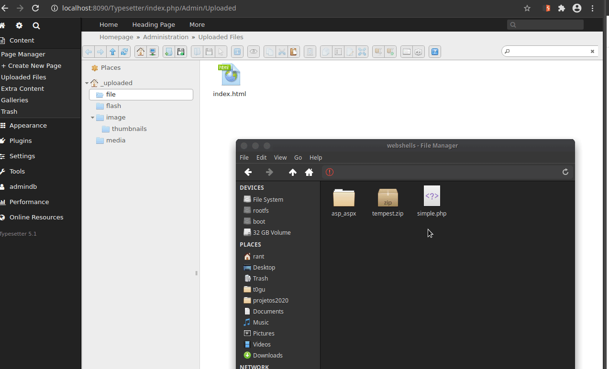
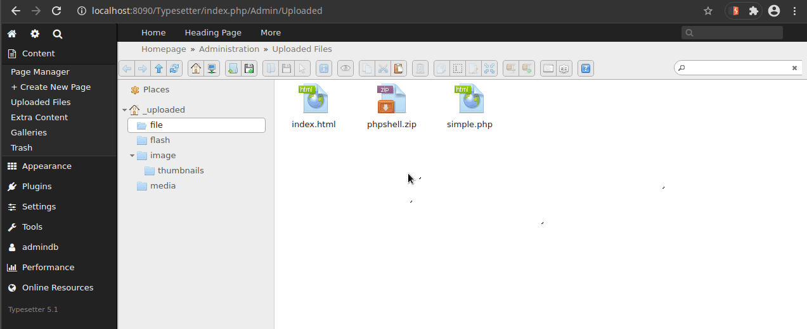

# Typesetter CMS任意文件上传

- Steps to reproduce
    1- As admin go to Content menu and click on Uploaded files
    2- Inside the try to upload a .php file, and
    3- try to upload a .php file directly, check that it is not possible.
    4- Take the same .php file and place it in a .zip and upload it.
    5- Extract through functionality and open the .php file
    **Obs**: A strange behavior was that, after extracting the PHP file in functionality, it is seen as HTML.

- PoC
    ==> Executing Commands

    

    

