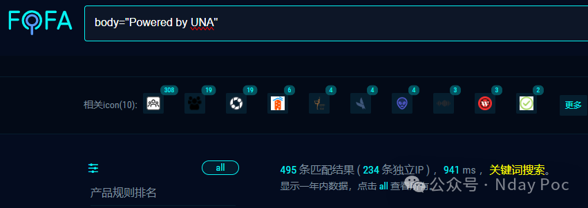
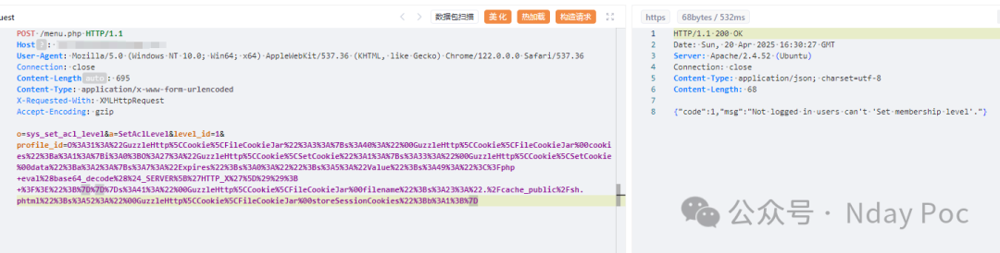
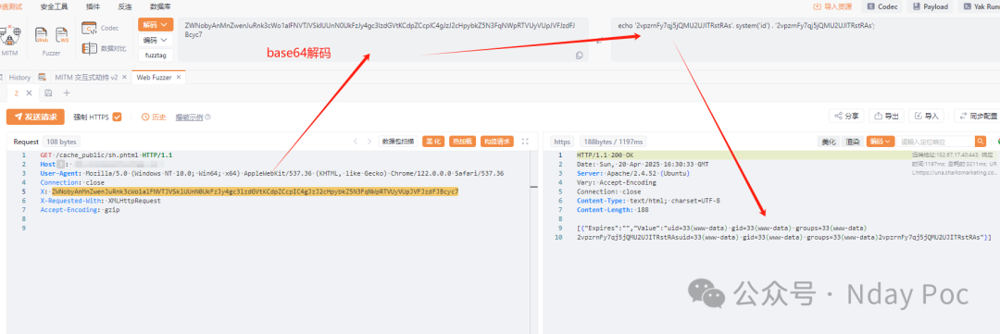
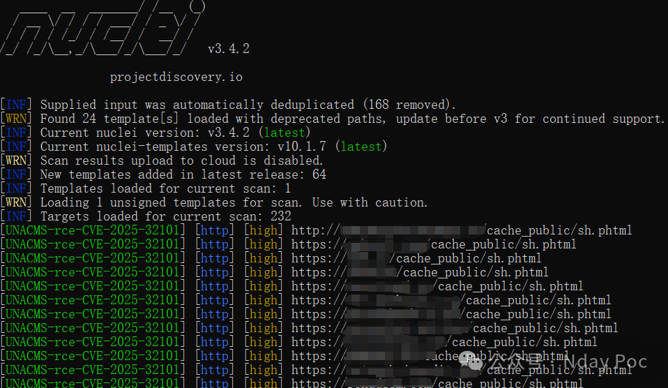
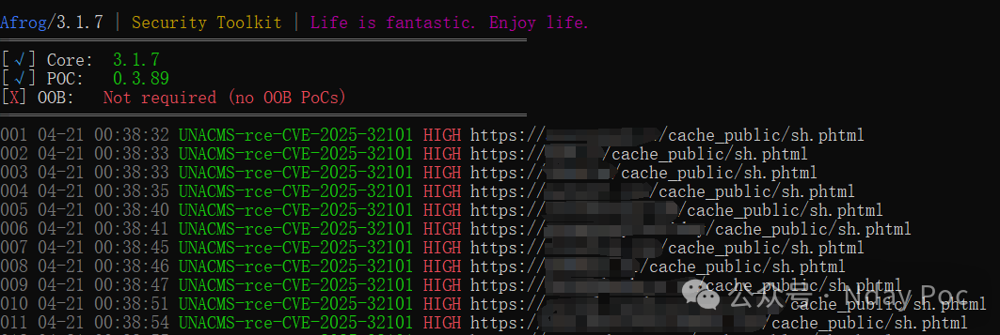
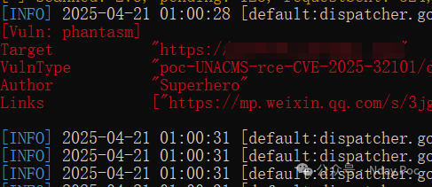

## 核对与使用边界

本文已按保存的全文审阅记录进行文字校订；本轮仅静态核对，未运行 PoC、请求目标或逐图验证。

适用条件与版本记录（来源主张，未列为明确更正的部分仍待权威资料核对）：profile_id可达unserialize、适用POP链，文章称未认证

- **事实待核（1）**：没有受影响/修复版本，方法源码/请求/对象gadget仅图或缺失。该项尚不能从转载本身确定外部事实；下文相应编号、版本或修复说法只作为来源记录，不能据此判定部署受影响或已修复。明确更正另列于本节。

- **结论使用边界（2）**：任意PHP对象注入到代码写入执行需要gadget与可写执行路径，正文直接跳结论。此项限制直接适用于下文对应结论；现有正文不足以作更宽泛推论，所列方法和原始证据均保留。

- **来源与引用处置（3）**：厂商首页不是补丁公告；目录UNACMS PHP将漏洞语言混入产品名，推广大量可剥离。保留这部分来源材料并与技术结论分开；其引用或宣传内容不能补足本文漏洞的证据。

历史原文标识：下文原技术材料按来源保留；仅本节明确确认的更正替代相应旧说法，标为待核的观察仍不是事实确认。

#  UNACMS PHP对象注入漏洞(CVE-2025-32101)   
Superhero  Nday Poc   2025-04-20 17:34  
  
  
  
  
  
  
  
内容仅用于学习交流自查使用，由于传播、利用本公众号所提供的  
POC  
信息及  
POC对应脚本  
而造成的任何直接或者间接的后果及损失，均由使用者本人负责，公众号Nday Poc及作者不为此承担任何责任，一旦造成后果请自行承担！  
  
  
**01**  
  
**漏洞概述**  
  
  
该漏洞位于 /template/scripts/BxBaseMenuSetAclLevel.php 脚本中。具体来说，在 BxBaseMenuSetAclLevel：：getCode（） 方法中。调用此方法时，通过 “profile_id” POST 参数传递的用户输入在用于调用 unserialize（） PHP 函数之前没有得到正确清理。未经身份验证的远程攻击者可利用此漏洞将任意 PHP 对象注入应用程序范围，从而允许他们执行各种攻击，例如编写和执行任意 PHP 代码。  
**02******  
  
**搜索引擎**  
  
  
FOFA:  
```
body="Powered by UNA"
```  
  
  
  
  
  
**03******  
  
**漏洞复现**  
  
  
  
  
  
  
**04**  
  
**自查工具**  
  
  
nuclei  
  
  
  
afrog  
  
  
  
xray  
  
  
  
  
**05******  
  
**修复建议**  
  
  
1、关闭互联网暴露面或接口设置访问权限  
  
2、  
目前官方已发布漏洞修复版本，建议用户升级到安全版本：  
  
https://una.sh/  
  
  
**06******  
  
**内部圈子介绍**  
  
  
【Nday漏洞实战圈】🛠️   
  
专注公开1day/Nday漏洞复现  
 · 工具链适配支持  
  
 ✧━━━━━━━━━━━━━━━━✧   
  
🔍 资源内容  
  
 ▫️ 整合全网公开  
1day/Nday  
漏洞POC详情  
  
 ▫️ 适配Xray/Afrog/Nuclei检测脚本  
  
 ▫️ 支持内置与自定义POC目录混合扫描   
  
🔄 更新计划   
  
▫️ 每周新增7-10个实用POC（来源公开平台）   
  
▫️ 所有脚本经过基础测试，降低调试成本   
  
🎯 适用场景   
  
▫️ 企业漏洞自查 ▫️ 渗透测试 ▫️ 红蓝对抗   
▫️ 安全运维  
  
✧━━━━━━━━━━━━━━━━✧   
  
⚠️ 声明：仅限合法授权测试，严禁违规使用！  
  
  
  
  


---

> 来源：gelusus/wxvl（微信公众号漏洞文章自动归档，原文见文首链接）
