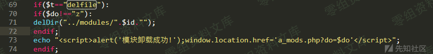
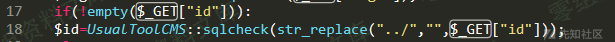
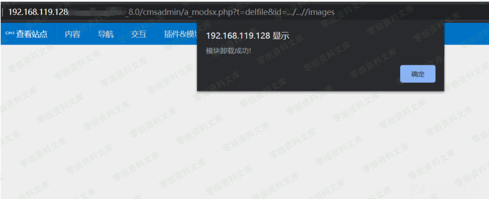

## 核对与使用边界

本文已按保存的全文审阅记录进行文字校订；本轮仅静态核对，未运行 PoC、请求目标或逐图验证。

适用条件与版本记录（来源主张，未列为明确更正的部分仍待权威资料核对）：后台模块删除权限、id路径可控、服务账户可删

- **证据待核（1）**：str_replace只替换一次应指单轮非递归，通常替换所有匹配而非只一次出现；替为空格与绕过推导未给原码。保留原引用、截图位置和实验叙述；本项所缺材料未被补造，截图存在或作者宣称成功都不等于已核验其内容。

- **操作与副作用边界（2）**：仅.../...//片段无完整请求/参数值/响应；标题文件与正文目录删除范围需分清。保留原步骤及请求方法。执行条件包括隔离且获授权的可恢复环境、预先记录相关文件/账号/配置/业务记录状态；响应完成不能等同无副作用，恢复时须核对该操作涉及的实际对象。

- **适用与权限边界（3）**：源码只图，版本/修复边界缺。按此限制解释本文结论，版本相同不足以证明所需角色、入口、配置、依赖或可控参数均已满足；原操作和失败记录一并保留。

历史原文标识：下文原技术材料按来源保留；仅本节明确确认的更正替代相应旧说法，标为待核的观察仍不是事实确认。

# UsualToolcms 8.0 a\_modsx.php 任意文件删除

一、漏洞简介
------------

二、漏洞影响
------------

UsualToolcms 8.0

三、复现过程
------------

漏洞位置在a\_modsx.php

id由用户传入，且有一层过滤

过滤逻辑存在问题，str\_replace只替换一次，将../替换为空格绕过：

    .../...//  --> ../

意味着可以实现跨目录删除指定目录

参考链接
--------

> https://xz.aliyun.com/t/8100
