## 核对与使用边界

本文已按保存的全文审阅记录进行文字校订；本轮仅静态核对，未运行 PoC、请求目标或逐图验证。

适用条件与版本记录（来源主张，未列为明确更正的部分仍待权威资料核对）：注册会员、可添加地址并触发地址列表模板ii_creplace/ii_eval

- **操作与副作用边界（1）**：全文一长段图文连写，关键RCE写文件payload只图，正文仅phpinfo模式。保留原步骤及请求方法。执行条件包括隔离且获授权的可恢复环境、预先记录相关文件/账号/配置/业务记录状态；响应完成不能等同无副作用，恢复时须核对该操作涉及的实际对象。

- **适用与权限边界（2）**：用户地址到函数链有路径，但manage命名是后台还是会员列表触发需说明实际角色。按此限制解释本文结论，版本相同不足以证明所需角色、入口、配置、依赖或可控参数均已满足；原操作和失败记录一并保留。

- **证据待核（3）**：官方已修未给安全版/commit，唯一来源论坛奖励mod链接非原披露精确链接；可去奖金尾注。保留原引用、截图位置和实验叙述；本项所缺材料未被补造，截图存在或作者宣称成功都不等于已核验其内容。

- **结论使用边界（4）**：不要将按eval函数检索等同漏洞证明，需保留受控地址流。此项限制直接适用于下文对应结论；现有正文不足以作更宽泛推论，所列方法和原始证据均保留。

历史原文标识：下文原技术材料按来源保留；仅本节明确确认的更正替代相应旧说法，标为待核的观察仍不是事实确认。

# WDJACMS1.5.2模板注入漏洞

WDJA CMS 1.5.2模板注入漏洞 漏洞发掘分析 前言 这是年初无聊在家审的一个小众的CMS，漏洞官方已经修复，现在分享出来给大家，希望一起共同学习和进步。 代码审计 `漏洞文件：\common\incfiles\function.inc.php` 全局搜索中发现这个cms的模板引擎是使用eval来实现的。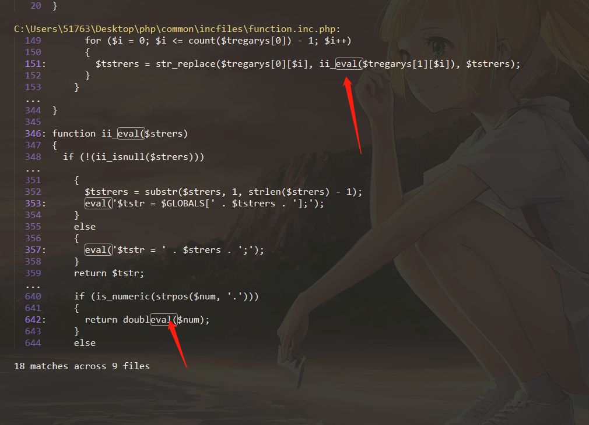我们 跟进`ii_eval()`函数。非常这里`$strers`可控疑似存在代码执行。我们在继续跟进`ii_eval()`看谁调用了他。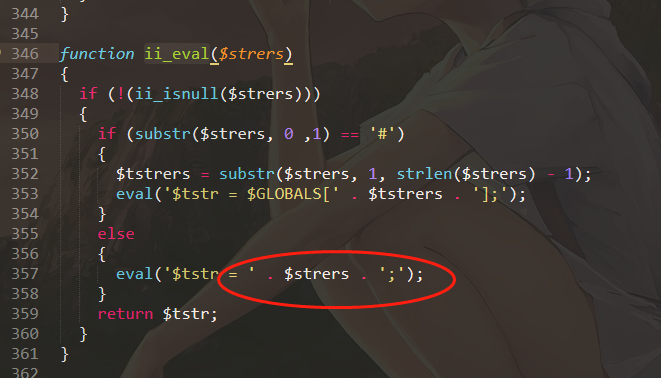`漏洞文件：\common\incfiles\function.inc.php` 只有一个地方对他进行了调用，他是`ii_creplace()`函数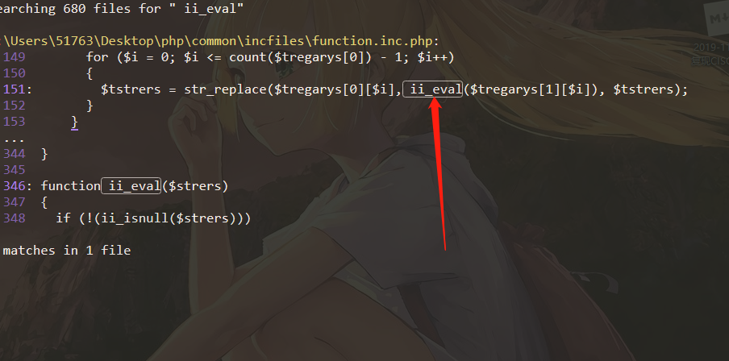我们看`ii_creplace()`代码，`$strers`可控，但是它必须匹配`({\$=(.[^\}]*)})`这个正则类似于下面： `{$=phpinfo()}`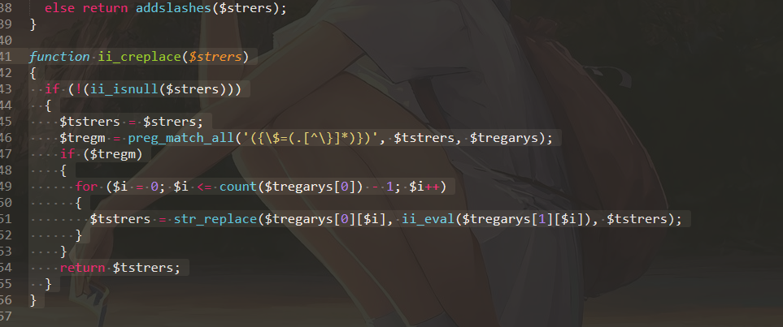`漏洞文件passport\address\common\incfiles\manage_config.inc.php` 那么我们继续跟进`ii_creplace()`函数看谁对他进行了调用，找了很多但是都对函数中的`$`进行了转义，但是在`passport\address\common\incfiles\manage_config.inc.php`中的`wdja_cms_admin_manage_list()`并未做任何过滤。我们继续跟进。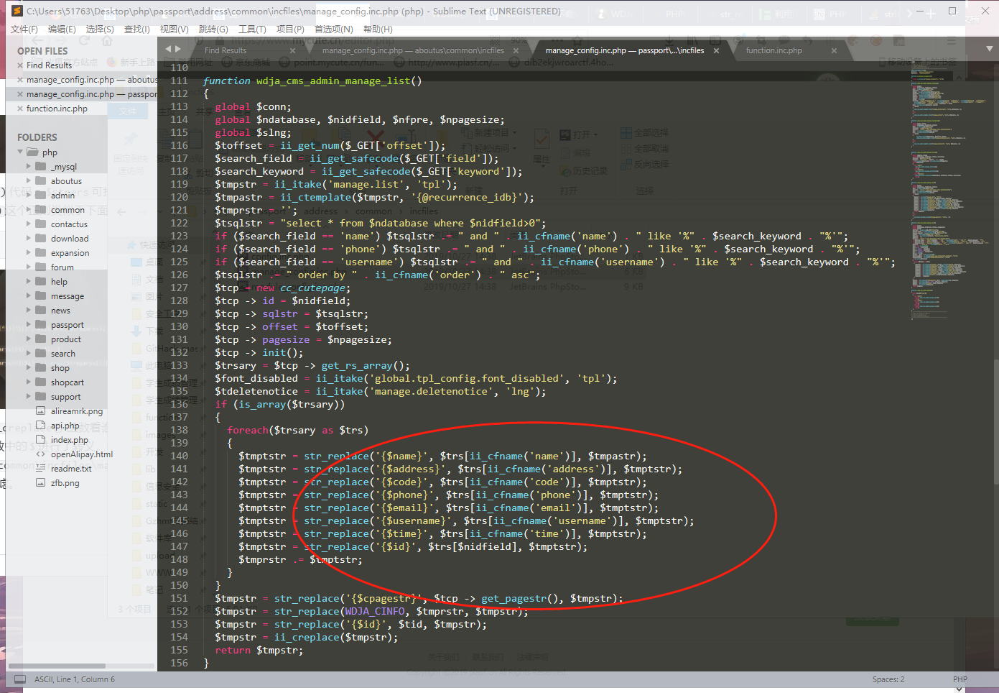我们发现`\passport\address\manage.php`对`passport\address\common\incfiles\manage_config.inc.php`进行了包含并调用了`wdja_cms_admin_manage_action()`,而它调用了`wdja_cms_admin_manage_list()`,那么很明显我们只需将符合`{\$=(.[^\}]*)}`正则的payload传入即可导致getshell.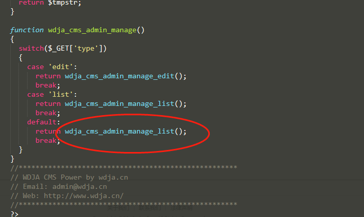那么从哪传入呢，我们直接把`wdja_cms_admin_manage_list()`中的sql语句打印出来即可知道。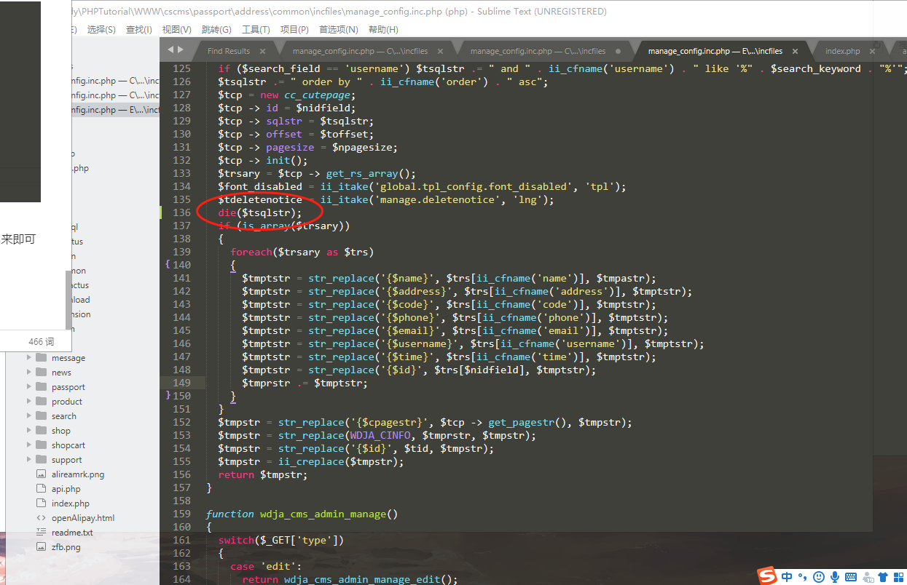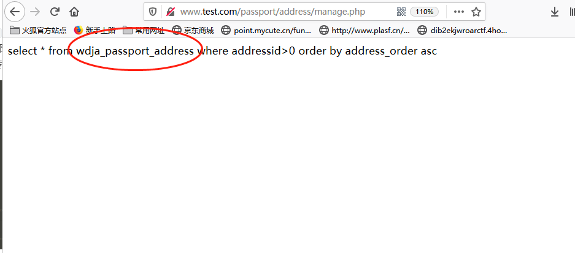很明显是从用户地址中获取。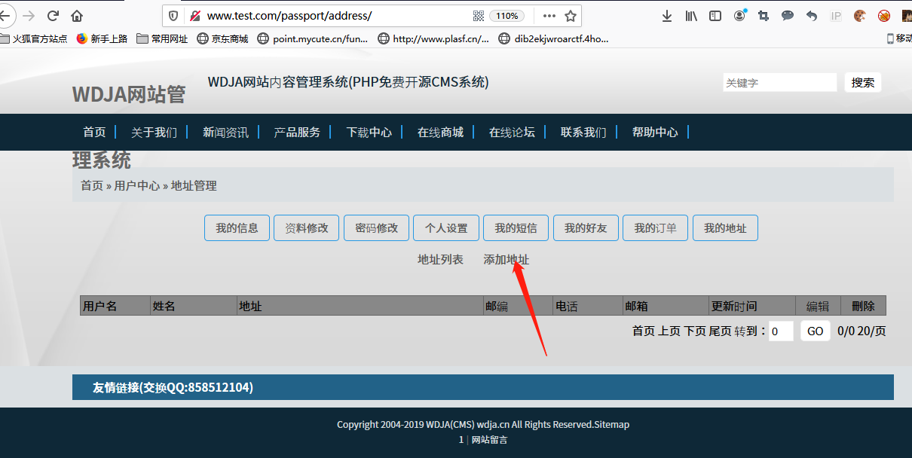Getshell 先注册一个会员 `http://www.域名.com/passport/?type=register` 在添加地址出写入要注入的命令,确认添加地址即可。 `http://www.域名.com/passport/address/index.php?type=list`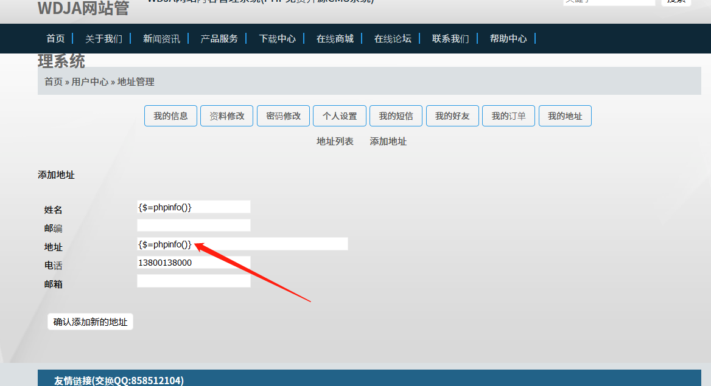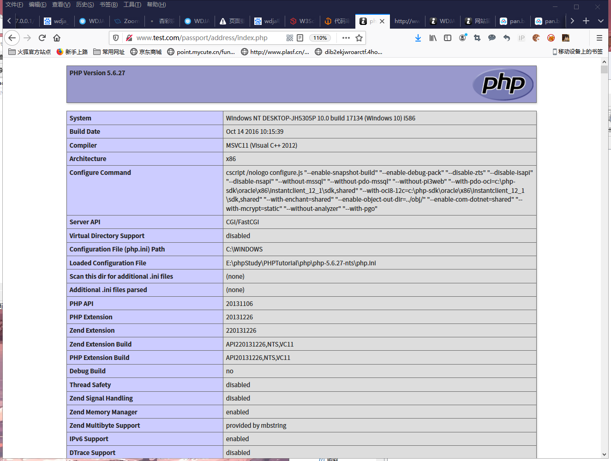getshell exp,同样方法在地址出写入下面代码即可在`passport\address`路径下生成一个shell.php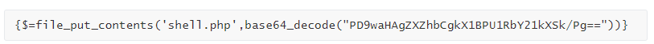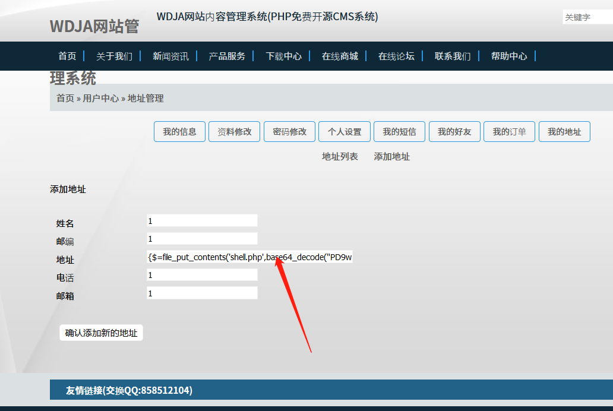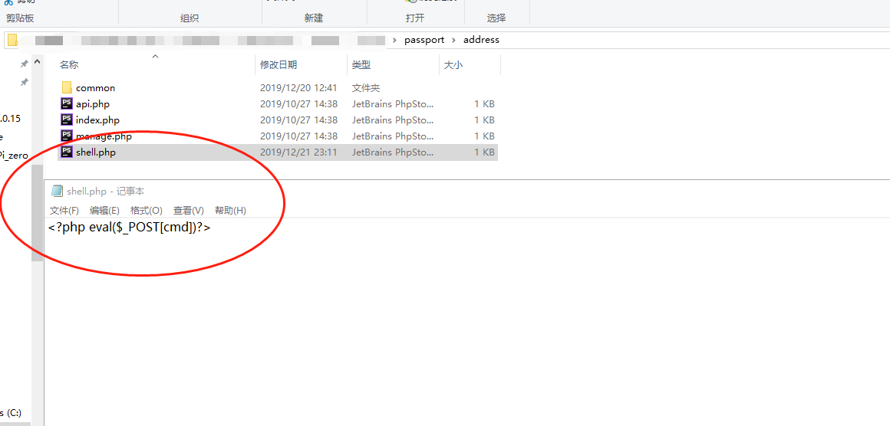

[本主题由 村长CZ 于 2020-11-17 18:53 添加图章 100元奖金](https://bbs.ichunqiu.com/forum.php?mod=misc&action=viewthreadmod&tid=59066)

---

> 来源：白阁文库 BaizeSec/bylibrary
