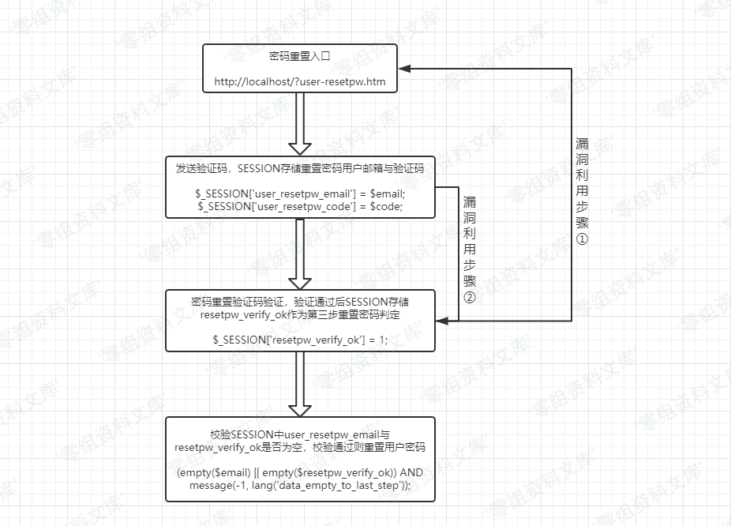
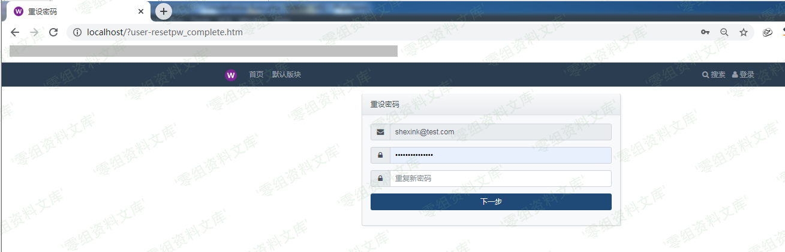
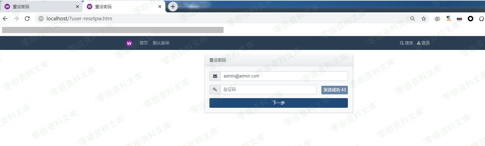
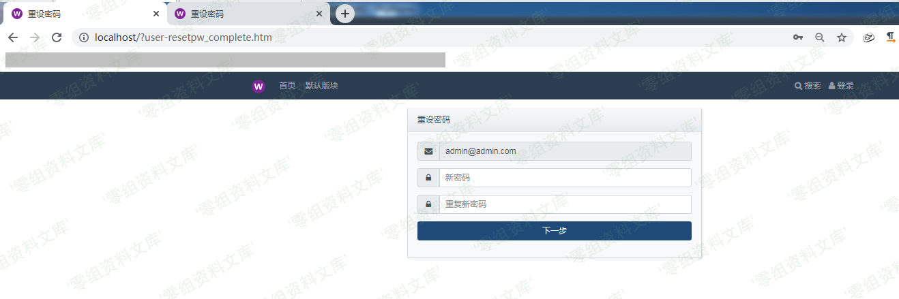

## 核对与使用边界

本文已按保存的全文审阅记录进行文字校订；本轮仅静态核对，未运行 PoC、请求目标或逐图验证。

适用条件与版本记录（来源主张，未列为明确更正的部分仍待权威资料核对）：密码恢复开启；能验证自己邮箱/账号；知道受害邮箱；同session换邮箱但verify_ok未清除

- **适用与权限边界（1）**：作者为测试修改源码直接显示验证码/删路由缓存，必须与原版利用条件分离；真实利用需控制自己的邮箱完成首轮。按此限制解释本文结论，版本相同不足以证明所需角色、入口、配置、依赖或可控参数均已满足；原操作和失败记录一并保留。

- **结论使用边界（2）**：状态未绑定邮箱且send_code不清verify_ok逻辑清晰，保留同session双标签必要性。此项限制直接适用于下文对应结论；现有正文不足以作更宽泛推论，所列方法和原始证据均保留。

- **实验改动边界（3）**：缺完整请求和未修改环境复现，修复版本/官方来源未给；第三步非邮箱验证而验证状态绑定问题。以下步骤按原实验条件保留；人工改动后的行为只支持该修改环境，不用于证明未修改发行版默认可利用。

历史原文标识：下文原技术材料按来源保留；仅本节明确确认的更正替代相应旧说法，标为待核的观察仍不是事实确认。

# WellCMS 1.1.02 任意用户密码重置漏洞

一、漏洞简介
------------

二、漏洞影响
------------

WellCMS 1.1.02

三、复现过程
------------

### 漏洞分析

CMS中密码重置逻辑代码存放于 /route/user.php
中，在没有配置邮件服务情况加，我们可以在生成验证码后增加
`message(0, '重置密码验证码为：'.$code);`代码弹出验证码，修改后需删除
/route/route\_user.php
原缓存文件，重新执行弹出验证码代码便会生效，详细代码如下：

    // 重设密码第 1 步 | reset password first step
     if ($action == 'resetpw') {

        // hook user_resetpw_get_post.php

        !$conf['user_resetpw_on'] AND message(-1, '未开启密码找回功能！');

        if ($method == 'GET') {

            // hook user_resetpw_get_start.php

            $header['title'] = lang('resetpw');

            // hook user_resetpw_get_end.php

            include _include(APP_PATH . 'view/htm/user_resetpw.htm');

        } else if ($method == 'POST') {

            // hook user_resetpw_post_start.php

            $email = param('email');
            empty($email) AND message('email', lang('please_input_email'));
            !is_email($email, $err) AND message('email', $err);

            $_user = user_read_by_email($email);
            !$_user AND message('email', lang('email_is_not_in_use'));

            $code = param('code');
            empty($code) AND message('code', lang('please_input_verify_code'));

            $sess_email = _SESSION('user_resetpw_email');
            $sess_code = _SESSION('user_resetpw_code');
            empty($sess_code) AND message('code', lang('click_to_get_verify_code'));
            empty($sess_email) AND message('code', lang('click_to_get_verify_code'));
            $email != $sess_email AND message('code', lang('verify_code_incorrect'));
            $code != $sess_code AND message('code', lang('verify_code_incorrect'));

            $_SESSION['resetpw_verify_ok'] = 1;

            // hook user_resetpw_post_end.php

            message(0, lang('check_ok_to_next_step'));
        }

    // 重设密码第 3 步 | reset password step 3
    } elseif ($action == 'resetpw_complete') {

        // hook user_resetpw_get_post.php

        // 校验数据
        $email = _SESSION('user_resetpw_email');
        $resetpw_verify_ok = _SESSION('resetpw_verify_ok');
        (empty($email) || empty($resetpw_verify_ok)) AND message(-1, lang('data_empty_to_last_step'));

        $_user = user_read_by_email($email);
        empty($_user) AND message(-1, lang('email_not_exists'));
        $_uid = $_user['uid'];

        if ($method == 'GET') {

            // hook user_resetpw_get_start.php

            $header['title'] = lang('resetpw');

            // hook user_resetpw_get_end.php

            include _include(APP_PATH . 'view/htm/user_resetpw_complete.htm');

        } else if ($method == 'POST') {

            // hook user_resetpw_post_start.php

            $password = param('password');
            empty($password) AND message('password', lang('please_input_password'));

            $salt = $_user['salt'];
            $password = md5($password . $salt);

            !is_password($password, $err) AND message('password', $err);

            user_update($_uid, array('password' => $password));

            unset($_SESSION['user_resetpw_email']);
            unset($_SESSION['user_resetpw_code']);
            unset($_SESSION['resetpw_verify_ok']);

            // hook user_resetpw_post_end.php

            message(0, lang('modify_successfully'));

        }

    // 发送验证码
    } elseif ($action == 'send_code') {

        $method != 'POST' AND message(-1, lang('method_error'));

        // hook user_sendcode_start.php

        $action2 = param(2);

            // 重置密码，往老地址发送
        if ($action2 == 'user_resetpw') {

            $email = param('email');

            empty($email) AND message('email', lang('please_input_email'));
            !is_email($email, $err) AND message('email', $err);
            $_user = user_read_by_email($email);
            empty($_user) AND message('email', lang('email_is_not_in_use'));

            empty($conf['user_resetpw_on']) AND message(-1, lang('resetpw_not_on'));

            $code = rand(100000, 999999);
            $_SESSION['user_resetpw_email'] = $email;
            $_SESSION['user_resetpw_code'] = $code;
            message(0, '重置密码验证码为：'.$code);
        }
     }

  梳理密码重置逻辑流程图如下（黑色实现箭头为漏洞利用的简单思路步骤）：

从逻辑中可以看出，在第三部中，重置密码仅进行了简单的SESSION中存储数据是否为空的验证，而并未对密码重置用户邮箱进行严格验证；若重置密码时，SESSION中存储的邮箱非当前验证用户邮箱，便会造成任意密码重置漏洞；

### 漏洞复现

在此程序中，在获取验证码时刷新当前SESSION中存储的密码重置用户邮箱，而未对SESSION中resetpw\_verify\_ok数据进行清除，也因此造成了任意用户密码重置逻辑漏洞。

  我们先使用自己的账户通过验证进入第三步的用户重设密码界面；在此时，SESSION中user\_resetpw\_email是当前通过验证的攻击账户邮箱，SESSION中resetpw\_verify\_ok值为1，浏览器界面如下图所示：

在第三步时，我们可以在浏览器中打开一个新的标签页，使用管理员的邮箱发送重置密码验证码请求，在同一浏览器中SESSION会话不会改变，此时
`$_SESSION['user_resetpw_email'] = $email;`代码会将SESSION中存储的密码重置邮箱更新为管理员邮箱，如下图所示：

 回到第一个标签页，刷新页面可以发现当前SESSION中存储的密码重置用户邮箱已经变为管理员用户邮箱（非必须刷新，密码重置第三部中邮箱取自SESSION，并非提交参数），我们提交重设密码请求后，即可更改管理员用户密码，如下图所示：

参考链接
--------

> [http://www.shexink.top/2020/03/wellcms%e4%bb%bb%e6%84%8f%e7%94%a8%e6%88%b7%e5%af%86%e7%a0%81%e9%80%bb%e8%be%91%e6%bc%8f%e6%b4%9e/](http://www.shexink.top/2020/03/wellcms任意用户密码逻辑漏洞/)
